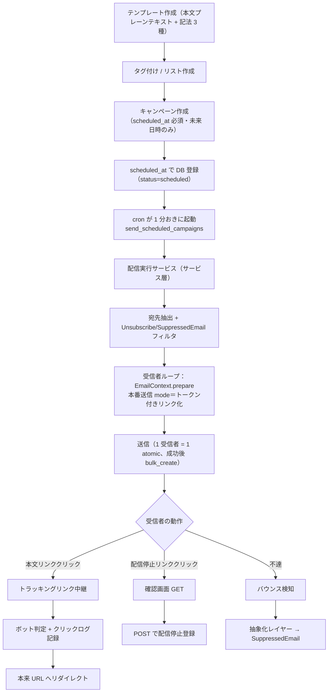
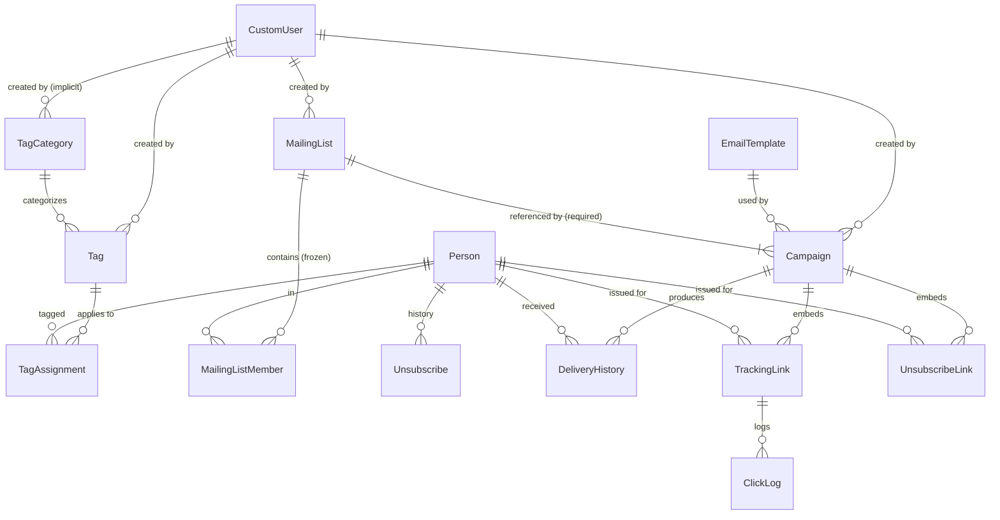
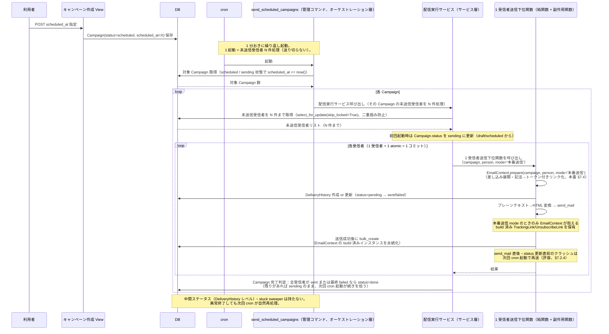
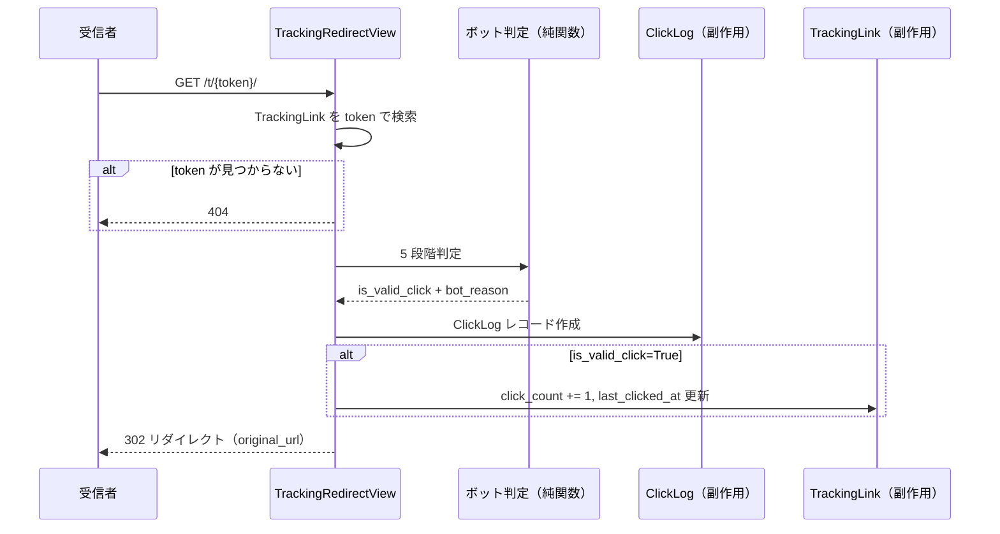
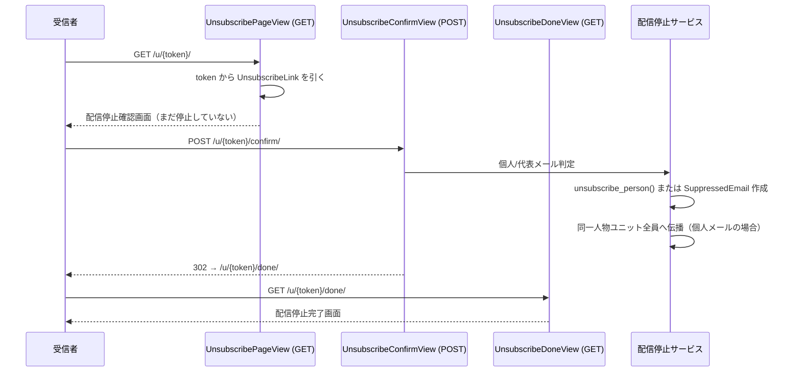

# FreeGroup2 v1.6 メール配信・クリックトラッキング機能 仕様書

**バージョン**：v1.6 ドラフト rev19
**最終更新**：2026-06-02
**位置付け**：v1.4.2（名刺OCR・コンタクト管理・人物統合）および v1.5.0（認証・認可・LDAP）の上に乗る、メールマーケティング機能の設計仕様書。本書はコード君 A への発注に進める品質の確定版ドラフトであり、実装着手前のたんたん最終確認・レビュー担当オーパス君レビューを経て v1.6 正式版とする。

**参照記法（本仕様書ルール）**：
- 本書（v1.6 ドラフト）内の参照：`本書 §X`
- v1.4.2 仕様書への参照：`v1.4.2 §X`
- v1.5.0 仕様書への参照：`v1.5.0 §X`

---

## 改訂履歴

| 日付 | バージョン | 内容 |
|---|---|---|
| 2026-05-15 | v1.6 ドラフト rev1 | サポート担当クロード君が「仕様書作成依頼：FreeGroup2 v1.6 メール配信・クリックトラッキング機能」（2026-05-15）に基づき、たんたんとの全議論で確定済みの17方針を統合した初版ドラフトを作成。 |
| 2026-05-15 | v1.6 ドラフト rev2 | レビュー担当オーパス君（または たんたん）の rev1 レビュー結果を反映：(1) 本書 §18.4 に v1.5.0 §13.2 形式の Execute_Merge_Only 手順表を追加（v1.6 で挿入する FK 付け替えステップを位置指定、`recompute_unsubscribed_state()` の挿入位置は mark_as_merged の前に確定）。(2) 本書 §7.3 宛先抽出ロジックを「リスト評価先・タグ条件評価後・両方空は CheckConstraint」に書き換え。(3) 差し込み変数の `position` → `title` に修正（v1.4.2 §4.4 Contact の実フィールド名と整合）。(4) 本書 §4.14.2 / §9.3 に v1.4.2 §4.5.2 形式の「Unsubscribe = 正本、is_unsubscribed = 派生」設計趣旨を追加。(5) 本書 §9.6 を §7.3 再掲に統一、SuppressedEmail フィルタの Subquery 実装方針追加。(6) salutation_name の自動再計算を Contact.save() 内に集約。(7) status 系フィールドの default を TextChoices クラス経由に統一。(8) 別表 X.1〜X.5 を C.21〜C.25 に連番化。(9) ER 図から SuppressedEmail-Person の点線関係削除、キャプション補足追加。(10) 参照記法を統一。(11) キャンペーン作成者退職の論点を本書 §14.4.1 補足 + §19 追加。(12) tracked_link フィッシング懸念を本書 §19.2 質問追加。 |
| 2026-05-15 | v1.6 ドラフト rev3 | レビュー担当からの rev2 レビュー結果を反映：(1) 本書 §18.4.1 手順 8「User 紐付け引き継ぎ」の説明を v1.5.0 §13.2 の意図通り `CustomUser.person`（OneToOne）の張り替えに訂正（rev2 では誤って `managed_by` のマージと記述）。`managed_by` は v1.5.0 §12.6 の退職処理時の引き継ぎ機構であり、マージ時の操作ではないことを明示。(2) 本書 §18.4.3 に DeliveryHistory の UniqueConstraint(campaign, person) 衝突処理を追記（rev2 では TrackingLink の衝突処理のみ言及していた）。本書 §19 論点 13 として「DeliveryHistory 衝突時の処理方針（merged 側物理削除 vs 合算 vs 事後対応）」を追加。(3) 本書 §7.4.3 と §19.1 論点 3 の矛盾解消：論点 3 を「rev2 で選択肢 C を暫定採用」と明示、§7.4.3.2 のマイグレーション論点参照を §19.2 質問 8 に変更。(4) 本書 §9.4 表の FK 付け替え行末尾に「衝突処理の詳細は本書 §18.4.3 参照」を追記（確認事項-rev2-1 対応）。 |
| 2026-05-15 | v1.6 ドラフト rev4 | レビュー担当からの rev3 レビュー結果（コード君視点での再点検）を反映：(1) **Django アプリ構成を 2 アプリ案に確定**（emails / tags の 2 業務アプリ、クリック中継 URL・配信停止リンク・システム設定はすべて emails 内に配置）【rev4 当時の確定名「emails」。rev10 で `mailings` に改訂】。本書 §5 / §20.1 を全面書き換え。(2) v1.4.2 マージサービスの配置を **`duplicates/services/merge_executor.py`** に訂正（rev1〜rev3 で「apps/merge/services.py」と記述していたのは私の事実誤認）。本書 §18.4.6 修正。(3) SuppressedEmail の email フィールドを **partial unique constraint** 方式に変更（`UniqueConstraint(fields=['email'], condition=Q(cancelled_at__isnull=True))`）。v1.4.2 §4.5 の primary_contact パターンと同じ思想。(4) MERGE_TAG_MAP の実装方式を **「事前置換 + 空値スキップ」** で確定。Django テンプレートエンジンは差し込み変数では使わず、Python の str.replace のみで完結。空値時は記法を残す。(5) カスタムテンプレートタグの実装方式を **「2 パス処理（パース → DB 書き込み → 置換）」** で確定。Django のカスタムテンプレートタグ機構は使わず、正規表現パース + 副作用関数の組合せ。テンプレートタグから DB 書き込みするアンチパターン回避。(6) ソフトバウンス管理を **`SoftBounceCounter` モデル新設**に変更。SuppressedEmail から `consecutive_soft_count` フィールド削除。SuppressedEmail は「配信拒否確定リスト」として責務を純化。(7) DeliveryHistory に **3 つのスナップショットフィールド**（`company_at_send` / `full_name_at_send` / `salutation_name_at_send`）を追加。配信レポート CSV が Person マージ・Contact 削除の影響を受けないように。(8) **v1.5.0 既存 Group 名を訂正**（`account_admin` / `merge_admin` 等の架空名 → `person_admin` / `person_editor` / `person_viewer` / `user_admin` / `card_admin` / `card_editor` / `card_viewer` の実在名）。(9) 論点番号の本文参照ミス 4 箇所を修正。(10) §18.4.1 手順表の手順 9〜13 行末尾に「衝突処理の詳細は §18.4.3 / §18.4.4 / §18.4.5 を必ず参照」を強調追記、手順 10 から「または例外を投げて手動対応」を削除（物理削除に確定済み）。(11) 本書 §19.1 論点 9（配信停止リンクのトークン管理方式）を rev4 で選択肢 A（UnsubscribeLink モデル新設）に確定、本書 §4.5A を新設。(12) ER 図に SoftBounceCounter / UnsubscribeLink を追加。(13) §20 対照表に rev4 追加項目（SoftBounceCounter / UnsubscribeLink / スナップショット 3 フィールド / 各種サービス関数）を反映。 |
| 2026-05-17 | v1.6 ドラフト rev5 | レビュー担当からの rev4 レビュー結果（コード君視点での再点検）+ たんたんとの議論結果を反映：(1) **マージ追従設計を根本的に変更**：rev1〜rev4 で採用していた「Person マージ時の FK 付け替え + 衝突処理」方式を廃止し、「マージ時の処理ゼロ + 配信停止意思のみ同一人物ユニット単位で伝播」方式に変更。マージ復元（v1.4.2 §10）との相性問題が解消され、設計が大幅に簡略化された。(2) 本書 §9.4 マージ時の追従を全面書き換え、本書 §18.4.1 手順表の手順 9〜14（v1.6 追加ステップ）を削除、本書 §18.4.2〜§18.4.5 衝突処理詳細セクションを削除。v1.5.0 §13.2 で確定済みの 14 ステップ構成をそのまま維持し、v1.6 で追加するステップは 0 個になる。(3) 本書 §9.5 を新設：「同一人物ユニット」（root + 配下の全 merged を含む Person 集合の業務用語、本書 §1.3 用語定義に追加）の定義、`get_same_person_unit()` / `unsubscribe_person()` / `cancel_unsubscribe()` サービス関数の説明、配信時フィルタは Person 単体の is_unsubscribed のみ参照と明示。サービス関数は bulk_create / bulk update 方式で実装し、ユニットサイズに関係なく定数クエリ数で完結する設計。循環検知（visited / seen セット）を必須として明記。(4) `Unsubscribe.source` から `bounce` 値を削除（残り 3 値：`unsubscribe_link` / `manual` / `api`）。バウンスは SuppressedEmail へのメアド登録のみで、Person 単位の Unsubscribe を作らないことを明確化（本書 §10）。別表 C.24 から `bounce` 削除。(5) Unsubscribe.source と SuppressedEmail.source の責務対比表を本書 §9.0 に追加（混乱防止）。(6) 本書 §9.1 個人メール/代表メール判定の処理表を `unsubscribe_person()` 呼び出しベースに書き換え（同一人物ユニット全員伝播）。(7) 本書 §9.6 配信時のチェック順序から「merged_into を辿る」記述を削除（Person 単体の is_unsubscribed のみ参照、同一人物ユニット伝播で同期済みのため）。(8) 本書 §7.5.2 unsubscribe_link タグから「TrackingLink に is_unsubscribe_link フラグを設けて流用」の代替案記述を削除（論点 9 確定により本書 §4.5A 参照に統一）。(9) 本書 §19.1 論点 9（配信停止リンクのトークン管理方式）を「rev4 で確定、rev5 で追認」表記に変更、論点 10（DKIM 秘密鍵の暗号化保存）も同様に「rev4 で確定、rev5 で追認」表記に変更、論点 12 / 論点 13 を削除（A-1 確定により衝突自体が発生しないため不要）。(10) 本書 §4.4 DeliveryHistory 制約欄から「衝突処理は §18.4.4 参照」を削除。本書 §4.4.1 設計趣旨末尾に「rev5 における継続採用」の説明を追記（A-1 確定後も Contact 削除・Contact.fix() による値修正・primary_contact 切り替えに対応するためスナップショットは継続必須）。(11) 本書 §4.14.2.1 設計趣旨に同一人物ユニットとの関係を追記。 |
| 2026-05-18 | v1.6 ドラフト rev6 | たんたんとの議論で §19.1 残論点・§19.2 質問を確定（rev6 改訂依頼書に基づく）+ One to One 機能を v1.6 に格上げ：(1) **§19.1 論点 1〜8 / 11 と §19.2 質問 1〜8 をすべて確定表記に変更**：論点 1（韓国語 `{姓} 님` を v1.6 確定／中国語 zh は v1.7+ 先送り）、論点 2（`Dear {フルネーム},` 汎用形で確定）、論点 4（昇格閾値 5 回・連続方式で確定）、論点 5 / 質問 2（テスト配信時は TrackingLink / UnsubscribeLink を発行せず素のリンクに変換、選択肢 A 確定）、論点 6（Sansan 型ステップ画面制御を参考にする方針のみ明記、UI 詳細はコード君判断）、論点 7（特電法対応のデフォルトフッター確定版、コード君は文言改変不可）、論点 11（A 確定：引き継ぎ機構を設けない）、質問 1（CSV は配信時点スナップショット出力、rev5 既決の明記）、質問 3（draft 存続制限なし・明示削除のみ）、質問 4（sending 中断機能なし／scheduled の予約取り消しで draft 復帰、status enum 5 値据え置き）、質問 5（§7.4.1 エスケープ方針を明記）、質問 6（CSV 出力項目をユーザー選択式に）、質問 7（A 確定：フィッシング自動検査は実装しない、第一防御は認可と監査）、質問 8（全件 is_manual=False で初期化に確定、論点 3 のサブ論点消滅）。(2) §7.4.3.1 言語別ルール表を ko 確定・zh 先送りに更新。(3) §7.7 テスト配信とキャンペーン UI に Sansan 型ステップ画面制御の方向性ブロックを追記、テスト送信先・プレビュー対象 Person の扱いを明記。(4) §7.5.3 デフォルトフッターを特電法対応の確定版と明記。(5) §13.2 CSV 出力項目をユーザー選択式 + 配信時点スナップショット出力に修正。(6) §7.4.3.2 / §18.2 マイグレーション記述を「全件 is_manual=False で初期化、salutation_name は全件 compute_salutation_name() で生成」に統一。(7) §14.4.1 補足の「v1.7+ で managed_by 追加の余地」を「v1.6 で A 確定」に置換。(8) 本文中の `SOFT_BOUNCE_PROMOTION_THRESHOLD` の「暫定」表記を「論点 4 で確定（5 回・連続方式）」に変更（値・ロジック・定義場所は変更なし）。(9) **One to One 機能を v1.6 に格上げ**（§17 行の将来検討記述を削除）：差出元 2 方式（送信元（メール作成者）＝ created_by 個人名義／送信元（メルマガ）＝会社の差出アドレス）を Campaign に追加。Person.managed_by を差出人にする方式は「managed_by はシステム上の情報管理者であり業務上の顧客担当者ではない、マージで入れ替わり差出人が確定しない」ため不採用と設計判断を明記。メルマガ方式の差出アドレスはキャンペーンごと入力（自社 DKIM 許可ドメイン配下に限定、許可外は配信前エラー、Settings にデフォルト 1 件）。(10) **配信フィルタの ON/OFF を導入**（A-1 適用部の拡張）：Unsubscribe フィルタは配信ごと ON/OFF 選択可（デフォルト ON＝rev5 と同じ安全側、配信方式とは独立フラグ）、SuppressedEmail フィルタは選択不可・常時 ON 固定（OFF 手段を一切設けない、ハードバウンス済みメアドへの送信継続によるドメインレピュテーション毀損を防ぐため強調明記）。§7.3 宛先抽出・§9.6 配信時チェック順序を条件分岐対応に書き換え。A-1 の核心（マージ時処理ゼロ＋同一人物ユニット伝播、unsubscribe_person() / cancel_unsubscribe() / get_same_person_unit()）は変更なし。 |
| 2026-05-16 | v1.6 ドラフト rev7 | たんたんからの「rev6 追補改訂依頼書」（配信フィルタ ON/OFF の構造的制約 + 監査記録）に基づき rev6 の §7.8.4 周辺を改訂：(1) **メルマガ方式での Unsubscribe フィルタ OFF を構造的に禁止**：`Campaign.apply_unsubscribe_filter=False` は `Campaign.sender_mode='creator'`（送信元（メール作成者）方式）のときのみ許可し、`sender_mode='newsletter'`（送信元（メルマガ）方式）では常時 True 固定とする。業務上の理由：メルマガ方式は事務局・マーケが会社として行う一斉広告配信であり、配信停止意思を示した受信者へ広告を送ることは特電法（オプトアウト後の送信禁止）に抵触する典型事故であるため。メール作成者方式は営業の 1 対 1 業務連絡であり、営業の個別判断として OFF を許容する。(2) **二段バリデーション方針を明記**：`Campaign.clean()`（またはフォームバリデーション層）で `sender_mode='newsletter'` × `apply_unsubscribe_filter=False` の組み合わせを `ValidationError` で弾く。配信実行直前（`Campaign.execute_send()` 冒頭、予約配信は cron 起動時）で同じ組み合わせを再検証する（draft 保存後に `sender_mode` だけ後から `newsletter` に変更されるケースに対応、本書 §7.8.3 `validate_sender_domain()` の二段構えと同思想）。DB レベルの CheckConstraint 併設はコード君の実装時判断（任意）とし、アプリ層バリデーションを正とする方針を仕様書に記載。(3) **UI 方針を明記**：メルマガ方式選択時は `apply_unsubscribe_filter` の ON/OFF コントロールを UI 上でも操作させない（チェックボックス非活性化・ON 固定表示等、OFF を選べる状態にしない）。具体的な UI 表現はコード君の実装時判断とする。(4) **§4.2 Campaign フィールド表**の `apply_unsubscribe_filter` 説明欄、**§4.2.1 メソッド表**の `execute_send()` 説明欄、**§7.8.4** Unsubscribe フィルタブロック（独立フラグ前提の記述を撤回し新方針に書き換え）、**§7.3 手順 4** ／ **§9.6 ステップ 2** ／ **§2.1 第 3 段階** ／ **§6.2.1 ステップ画面 ①** の各所に新制約を反映。(5) **`apply_unsubscribe_filter=False` 配信の ActionLog 監査記録**：`Campaign.execute_send()` が `apply_unsubscribe_filter=False` で配信を実行した時点で ActionLog に 1 件記録する（操作種別「配信停止フィルタ OFF での配信実行」、実行ユーザー、対象 Campaign、実行日時を含む）。記録は v1.4.2 §4.11.3 の `record_*_action` パターン準拠（アクション名定数・記録関数名はコード君の実装時判断）。`apply_unsubscribe_filter=True`（通常配信）のときは本記録を行わない。特電法対応の事後説明責任を果たすための監査証跡であり、構造で止めない creator 方式側の最終防御線。§7.8.4 末尾にブロックを新設、§4.2.1 メソッド表に補足。**A-1 核心は不変**：サービス関数 3 本（`get_same_person_unit()` / `unsubscribe_person()` / `cancel_unsubscribe()`）の本体、§9.4 マージ時処理ゼロ、§9.5 同一人物ユニット伝播、§9.6 のフィルタ分離構造、§10.0 バウンス分離、§7.3 手順 5 SuppressedEmail 常時適用と重大警告は rev6 から 1 文字も変更していない。`` のシステム強制挿入も追加していない（2026-05-15 確定どおり編集者判断のまま）。 |
| 2026-05-16 | v1.6 ドラフト rev8 | たんたんからの「rev8 追補改訂依頼書」（スケジュール配信 cron 内部処理 + 命名規約整合）に基づき rev7 を改訂：**【B 群：スケジュール配信 cron 内部処理】** (1) **§7.2 内に B 群サブセクションを新設**（§7.2.1〜§7.2.4）し、既存「予約取り消し」を §7.2.5 にリナンバー。cron 内部処理は v1.4.2 OCR 仕様書で確立した「重複チェック（`check_duplicates`）系パターン」を踏襲し、中間ステータスなし・stuck sweeper なしの自然再処理方式とする。1 起動で未送信受信者を上限 N 件まで処理し、残りは次回 cron 起動が拾う。未送信取得は `select_for_update(skip_locked=True)` をメソッド内に込めたクラスメソッド設計（v1.4.2 §10.7.3 `OriginalImage.get_pending(limit)` と同型）。1 受信者 = 1 atomic = 1 コミット、N 件全体を 1 トランザクションで囲んではならない。1 受信者の送信処理は純関数（判定）+ 副作用関数（DB 書き込み・送信）に分離した独立関数として切り出し、将来キュー化に備える（v1.6 ではキュー化未実装、キューライブラリは決め打ちしない）。N は `config/constants.py` の定数。(2) **受信者単位の送信失敗上限 M を導入**（§7.2.2）：1 受信者が cron 起動をまたいで M 回失敗したら「最終 failed」確定。キャンペーン完了判定は全受信者が sent または最終 failed になった時点で done。M は `config/constants.py` 定数（推奨初期値 3）。**この上限導入は v1.4.2 重複チェック系パターンからの意図的逸脱**であり、配信には「SMTP 一時不調（再実行で成功）」と「メアド構造的送信不能（永久失敗）」が混在するため回数を数えないとキャンペーンが永久に done にならない、という逸脱理由を明示。具体的フィールド設計（失敗回数カウントフィールド追加か status 使い分けか）はコード君判断、仕様書には方針のみ。Campaign.status enum 5 値固定（rev6 §19.2 質問 4 確定）は変更しない（DeliveryHistory 側で持つので質問 4 確定に抵触しない）。(3) **送信失敗とソフトバウンスの厳格分離を §7.2.3 と §10.0 / §10.3.2 に明記**：送信失敗（DeliveryHistory.status=failed）は SoftBounceCounter に一切触れない。ソフトバウンス（§4.8A）は送信成功後の跳ね返り通知のみを数える。混同実装の重大事故シナリオ（自社 SMTP 一時不調 → 生存顧客メアド大量 SoftBounceCounter 上昇 → 閾値 5 で次々 SuppressedEmail 登録 → 生きている顧客に二度と配信不能）も記載。(4) **許容する弱点を §7.2.4 に明記**：send_mail 成功直後・DeliveryHistory.status=sent 更新直前のプロセスクラッシュで、同一受信者にメールが二通届く可能性。中間ステータス + stuck sweeper の重い仕組みを払うコスト動機がないため、シンプルな重複チェック系パターンを採用し弱点を受容する設計判断の経緯を 1〜2 文で記録。(5) **§7.2 配信フロー（予約配信）Mermaid シーケンス図を全面書き換え**：rev6 から残っていた「MC→DB: status を sending → done に更新」記述（B1 と矛盾）を削除し、複数 cron 起動にまたがって少しずつ進む構造、中間ステータスなし、done は全員 sent または最終 failed になった時点、を読み取れる図に再構成。登場要素名は役割名表現（「配信実行サービス」等）で具体的関数名を確定しない。(6) **§4.4 DeliveryHistory フィールド表の「6 値」誤記を「5 値」に修正**（B5）：別表 C.22 本体の TextChoices 定義が pending / sent / failed / bounced / unsubscribed の 5 値であるのに対し本文が「6 値」と誤記されていた。本文を 5 値に修正、別表 C.22 本体は変更なし。B1 で中間ステータス導入を構造的に否定したため、6 番目（sending 等）を補完してはならない。**【C 群：配信実行関数の命名規約整合】** (7) **配信実行をサービス層関数として位置づけ直し**：rev7 §4.2.1 メソッド表の `campaign.execute_send()`（Django インスタンスメソッド・小文字）は、v1.4.2 §13.2.2（`Pascal_Snake_Case`、起動契機別カテゴリ）および §13.2.8（真のモデル横断はサービス層）の命名規約に違反していたため、配信実行はサービス層関数として位置づけ直す。具体的関数名・関数分割の細部はコード君の実装時判断とし、仕様書には「サービス層関数」「v1.4.2 §13.2.2 / §13.2.8 規約準拠」「即時配信（View 起点）と予約配信（cron 起点）の両起点」「B1 で確定した処理構造に沿って配置」の方針のみ記載。**rev7 で追加した追補 1・追補 2 の意味内容（メルマガ × OFF 組み合わせの再検証 + ActionLog 監査記録）は 1 文字も意味を変えず、サービス層関数表現に整える形で維持**。(8) **§4.2.1 メソッド表・§7.1 シーケンス図・§7.7 / §20.4 等の `campaign.execute_send()` 参照箇所を役割名表現に整える**（§7.1 即時配信図は処理構造は変更せず、登場要素名のみ役割名に置換）。**A-1 核心は不変**：サービス関数 3 本（`get_same_person_unit()` / `unsubscribe_person()` / `cancel_unsubscribe()`）の本体、§9.4 マージ時処理ゼロ、§9.5 同一人物ユニット伝播、§9.6 のフィルタ分離構造、§10.0 既存記述、§7.3 手順 5 SuppressedEmail 常時適用と重大警告、§7.8.4 末尾 SuppressedEmail 重大警告ブロックは rev7 から 1 文字も変更していない。**rev7 で反映済みの追補 1・追補 2 の意味内容も不変**（§7.8.4 全体・§7.3 手順 4・§9.6 ステップ 2・§6.2.1①・§4.2 フィールド表 `apply_unsubscribe_filter`・§2.1 第 3 段階・§4.2.1 メソッド表の追補 1・追補 2 部分）。`` のシステム強制挿入も追加していない。 |
| 2026-05-17 | v1.6 ドラフト rev9 | サポート担当（たんたん設計壁打ち担当）からの「rev8 → rev9 改訂指示書 v2」（即時配信完全廃止 + EmailContext 統合 + 本文プレーンテキスト化 + render_custom_tags 解体 + 宛名スコープ線引き）に基づき rev8 を改訂。**【項目 1：EmailContext 統合・即時配信完全廃止】** (1) **即時配信を完全廃止**（rev7／rev8 で前提だった即時配信を撤回。「今すぐ送りたい」も予約配信＝scheduled_at に未来日時を指定で対応、過去・現在はバリデーションエラー）。テスト送信のみ即時（cron を通らない）。§2.1 第 2-3 段階・§2.2 配信実装方式・§2.3 処理フロー Mermaid 図・§3.1 UC-04・§3.2 機能一覧・§4.2 scheduled_at 説明・§6.2.1④・URL 一覧の `/mailings/campaigns/<uuid:pk>/execute/` を即時配信廃止に合わせて全面書き換え。**§7.1 即時配信フロー節は節ごと削除**（確定①）、配信フローは §7.2（予約配信、cron 経由）の 1 本に統合。(2) **EmailContext を新設**（`mailings/services/email_context.py`、`@dataclass(frozen=True)`、DB 保存しない DTO）：サービス・関数・タスク間で受信者 1 人分のメール構成データをまとめて受け渡す運搬器。直接持つ参照は `campaign` と `person` の 2 つだけ（B 案＝最小参照確定、email_template は `campaign.email_template`、送信者は `campaign.created_by` で辿る）。frozen=True は「共有単一素材の不変性」（prepare で組んだ最終形を後段が書き換えない、プレビュー≡送信のズレ防止）。単一クラス（基底＋プレビュー用／送信用サブクラスにしない、理由：純粋データ運搬器であり役割の違いは後段サービスが別物であることで既に分かれている）。(3) **`EmailContext.prepare(campaign, person, mode)` classmethod を新設**（案ア確定）：mode は必須・3 値（本番送信／テスト配信／プレビュー）。**トークンを発行するのは本番送信 mode のときだけ**、テスト配信・プレビューは prepare 内で `TrackingLink.build()`／`UnsubscribeLink.build()` を呼ばず記法を素リンクに変換（トークンを作らない）。「トークンは常に生成、mode は保存可否のみ制御」は議論途中の案イ（誤り）で rev9 には書かない。(4) **配信実行を 3 処理単位で構成**：(I) cron 入口の管理コマンド（snake_case、予約キャンペーンを最古優先で拾い N 件枠を各キャンペーンに配分、EmailContext に触れない）／(II) 1 キャンペーン分のオーケストレーション（宛先抽出・差出ドメイン検証はキャンペーン単位 1 回・受信者ループ、受信者ループ内で `EmailContext.prepare` 呼び出し）／(III) 1 受信者 1 通・1 atomic（引数に campaign / person / email_context / is_test、送信成功後に bulk_create、DeliveryHistory 記録）。具体的関数名はコード君の実装時判断（rev8 C 群方針踏襲）。**rev7 追補 1・追補 2 の意味内容（メルマガ × OFF 再検証、ActionLog 監査記録）は 1 文字も変えず維持**。(5) **prepare/bulk_create 配置確定**：prepare 呼び出しは本番・テスト配信は (II) 内、プレビューはプレビュー View が直接呼ぶ。bulk_create は (III) 内・送信成功後（保存元データは EmailContext が抱える build 済みインスタンス）。テスト配信は DeliveryHistory を作らない（rev8 §7.7 維持）。差出ドメイン検証は prepare に含めず宛先ループ外でキャンペーン単位 1 回（§7.8.3 維持）。**【項目 2：本文プレーンテキスト化】** (6) **rev7 由来の「HTML 直接編集」設計の柱を全面撤回**：ユーザーが本文に書くのはプレーンテキストのみ（Sansan 方式、ユーザーは HTML を知らない前提）。§1.1 設計の柱・§4.3 EmailTemplate `body_html`・§2.3／§3.1 UC-01／§3.2 の「HTML 本文」表現を全箇所修正。本文に置ける記法は 3 つだけ（差し込み変数 `{{会社名}}` 等／``／``）、それ以外の HTML タグは書かない。(7) **プレーンテキスト→HTML 変換（改行→`<br>` 含む）は prepare の責務**として明記。(8) **`{{差出人の署名}}` の非エスケープ例外（escape=False）を廃止**：差し込み値は全部プレーンテキストとして生値置換、ユーザーが HTML 注入する経路自体が消滅（§7.4.1 修正）。(9) **件名 HTML エスケープ問題は前提消滅で解決**：「A&B 商事」→「A&amp;B 商事」化問題は、ユーザーが書くもの全部プレーンテキスト化で前提消滅。件名も本文も差し込み値は生値置換。(10) WYSIWYG/リッチテキストエディタは導入しない（テキストエリアのまま、rev7 スコープを広げない）を明記。**【項目 3：render_custom_tags 解体・選択肢 C 廃止・カスタムタグ書式】** (11) **`render_custom_tags()` を解体**（改名ではなく解体、`render_custom_tags` という関数名は rev9 に残らない）：三層に再配置：(a) 司令塔＝`EmailContext.prepare`、(b) mode 分岐＝prepare 専用モジュール非公開関数（本番送信＝トークン付きリンク化／テスト・プレビュー＝素リンク化）、(c) レコード組み立て＝`TrackingLink.build()`／`UnsubscribeLink.build()`（モデル責務、トークン生成・URL 生成はモデルに完全に閉じる）。**(12) **`render_merge_tags()` を `_render_merge_field()` に改名**（email_context.py 内モジュール非公開、差し込み変数展開担当、Person マージとの merge 二義語衝突を解消）。(13) **prepare／build の語分け設計判断を明記**：`build`＝保存先はあるが保存はまだ（Django 慣用、FactoryBoy の build/create 対比）／`prepare`＝そもそも保存先テーブルが存在しない DTO 生成。(14) **選択肢 C（素リンク＋目印属性 data-track で後段が再パースして差し替える二段の仕掛け）を廃止**：本文プレーンテキスト化（項目 2）により、トラッキング対象は `` 記法でしか書けなくなり、prepare 専用関数が記法をパースした時点でトラッキング対象が確定するため目印属性も後段差し替えも不要。mode を見て本番送信＝直接トークン付きリンク化／テスト・プレビュー＝素リンク化、で 1 回で完結。(15) **カスタムタグ 2 形態書式を確定**（閉じタグ形）：tracked_link は形態 1 `https://...`／形態 2 `表示テキスト`。unsubscribe_link は形態 1 ``（タグ単独、システム既定文言「配信停止」）／形態 2 `配信停止はこちら`（テキスト指定）。正規表現の具体形・パース実装の細部はコード君の実装時判断。(16) **素の URL の扱い**：記法で囲まれていない URL はトラッキング対象外、prepare は変換せずただのテキストとして残す（受信者メーラーが自動リンク化する可能性はあるが FreeGroup2 は関知せずトラッキングもしない）。(17) **特電法対応フッターをプレーンテキスト形式に書き換え**：HTML べた書き（`<hr>`／`<p style>`／`<br>`）をプレーンテキストに、**項目構成（会社名・配信元住所・配信停止連絡先・配信停止リンク）と文言は維持、器だけ変更**。**【項目 4：宛名スコープ線引き・中国語改訂】** (18) **§7.4.3 salutation_name** は salutation_name 出力期待値の宣言（要求仕様）に留め、メルマガは `person.primary_contact.salutation_name` を信頼してそのまま差し込む。信頼性向上（OCR 時 confidence 付与、中国語の先生／女士のユーザー手動入力等）は Contact/OCR（v1.4.2 基盤）側・正規化側の責務で rev9 スコープ外と明記。(19) **§19.1 論点 1 を改訂**：「中国語は汎用形・先生/女士は v1.7+ 先送り」を「Contact/OCR 側・正規化側の追加実装で対応（rev9 スコープ外）」に変更。rev9 では中国語敬称をどう実装するかは一切書かない。(20) **§17／§19 末尾に v1.9 ワークフロー留保 1 行追加**：「v1.9 ワークフロー導入時、キャンペーン編集権限の第三者付与を検討」（送信者は `campaign.created_by` で確定、§7.8.2 と整合）。**【構成変更】** §7.4（差し込み変数展開）と §7.5（カスタムタグ）を**「メール本文の生成（EmailContext.prepare）」の 1 節に統合**（確定②）、その冒頭で EmailContext 総論（位置づけ・prepare/build 語分け・三層責務）を述べた上で差し込み変数・カスタムタグ・フッターを配下に配置。URL 表は「即時配信実行エンドポイントは廃止」とだけ記す（具体名はコード君判断、確定③）。**【触らない事項】** A-1 核心（サービス関数 3 本本体、§9.4／§9.5／§9.6／§10.0／§7.3 手順 5／§7.8.4 末尾 SuppressedEmail 重大警告）は rev8 から 1 文字も変更していない。**rev7 追補 1・追補 2 の意味内容も不変**（§7.8.4 全体、§7.3 手順 4、§9.6 ステップ 2、§6.2.1①、§4.2 フィールド表 `apply_unsubscribe_filter`、§4.2.1 メソッド表の追補 1・追補 2 部分。§2.1 第 3 段階・§6.2.1 は即時配信廃止文脈で触るが追補 1・追補 2 の意味部分には手を入れない）。**rev8 B 群／C 群の設計判断も不変**（cron 内部処理パターン、中間ステータスなし、skip_locked、1 受信者=1 atomic、N 件配分、M 回失敗上限、送信失敗とソフトバウンス厳格分離、許容弱点、配信実行のサービス層関数化）。`validate_sender_domain`（§7.8.3、文字列照合のみ・二段起動）変更なし。`` のシステム強制挿入も追加していない。 |
| 2026-05-17 | v1.6 ドラフト rev10 | サポート担当（たんたん設計壁打ち担当）からの「rev9 → rev10 改訂依頼書」（コード君実装着手前の確定群＋アプリ名確定＋unsubscribe 周りの確定）に基づき rev9 を改訂。**【論点 A：mode 型表現】** (1) **EmailContext.prepare の mode 引数の型を `EmailMode` enum で確定**（§7.4.2）：列挙型クラス名 `EmailMode`、メンバ `PRODUCTION='本番送信'` / `TEST='テスト配信'` / `PREVIEW='プレビュー'`、配置 `mailings/services/email_context.py`（prepare と同ファイル）。各所（prepare・3 処理単位・mode 分岐の非公開関数・テスト配信サービス・プレビュー View）はその列挙型を import して参照し、文字列リテラル直書き比較をしてはならない。列挙型の実装方式（Python 標準 `enum` か Django `models.TextChoices` か）はコード君の実装時判断。確定理由：mode は複数ファイル横断値で、表記揺れすると「テスト配信なのにトークン発行」等、案ア確定の振る舞いが壊れるため。**【論点 B：プレーンテキスト→HTML 変換の処理順是正、改訂理由必須】** (2) rev9 の順「①差し込み生値置換 → ②カスタムタグ処理 → ③プレーンテキスト→HTML 変換（特殊文字エスケープ）」を、**「①差し込み生値置換 → ②プレーンテキスト全体を HTML エスケープ＋改行→`<br>` → ③カスタムタグを `<a>` タグに変換（本番送信＝トークン付き／テスト・プレビュー＝素リンク）」に順序を是正**（§7.4.4.5）。**是正理由**：rev9 の順だと②で生成した `<a>` タグが③の全体エスケープで `&lt;a&gt;` 化し、メール内の全リンク（トラッキング・配信停止）が機能しなくなる重大事故になる。リンク生成（カスタムタグの `<a>` 化）をエスケープより後に行うことで生成済みリンクが壊れない。**【論点 C：差し込み 16 変数を確定仕様の表に格上げ】** (3) §7.4.4.3 の rev9 「実装イメージ」コードブロックを**確定仕様の表に格上げ**：16 変数（`{{会社名}}`〜`{{差出人の署名}}`）をユーザーがテンプレート本文に書ける確定仕様とし、コード君は増減しない。各変数が対応する Contact/User フィールドの正確な属性名は v1.4.2／v1.5.0 の実モデルに従い、対応が自明でないもの（`sender.signature`・`contact.branch` 等）は実装時に確認する。空値時は記法を残す（Sansan 互換）。**【signature の扱い確定、改訂理由必須】** (4) §4.14.1 CustomUser への追加で signature の「**HTML 可**」を**削除し「プレーンテキスト。HTML タグは書かない」に修正**。**修正理由**：rev9 の「HTML 可」は項目 2（本文プレーンテキスト化）の確定と矛盾していたため（escape=False 廃止と整合）。フィールド定義（TextField blank=True default=''）自体は変更しない。(5) signature の設定方法を明記：ユーザー本人が自分の設定画面で自分の署名を編集する（Sansan 同様、個人が 1 つ持ち使い回す）。`{{差出人の署名}}` は `campaign.created_by.signature` で引く（送信者＝campaign.created_by 業務確定と整合）。signature 内に差し込み変数を書いても展開しない（プレーン固定文字列、再帰展開しない）。空のときは記法をそのまま残す（一般ルール）。署名未設定の穴はプレビュー／バリデーションで警告を出して塞ぐ（具体実装はコード君判断）。**【unsubscribe 周り確定】** (6) **unsubscribe トークンに有効期限を付けない**ことを §4.5A に明文化。理由：古いメールからの配信停止は正常利用であり、期限切れで弾くと特電法のオプトアウト確実提供に反する。漏洩の最悪ケースは受信者に実害がほぼ無く期限で守る必要性が低い。期限を付けるデメリット（正常な配信停止を塞ぐ）がメリットを上回る。(7) **トークン無し独立ルート `/u/` を §4.5A.2 に追加**：本番メールの配信停止リンク＝`/u/<token>/`（トークン付き）、トークン無し（テスト・プレビュー由来）＝`/u/`（Django urlpatterns で別エントリ）。`/u/`（トークン無し画面）は**案内表示のみ**とし、メールアドレス手入力による配信停止機能は設けない（理由：第三者が他人のメアドを入力して勝手に配信停止できる悪用を構造的に断つ。リンク不調時の救済は Settings の `unsubscribe_contact` への誘導で確保）。無効トークン時の遷移はコード君判断。**【論点 E 最終整理：テスト配信 unsubscribe の変換先是正】** (8) §7.4.6.4 mode による変換結果の表で、テスト配信時の `` を rev9 の `https://freegroup2.example.com/u/test/`（`/u/test/` 専用パス）から **トークン無し独立ルート `/u/`** に是正。`/u/` は案内画面で統一（受信者特定不能のため本番同様の確認画面は原理的に作れない、過去議論の「テスト配信トークン無しアクセス時は本番同様の確認画面」方向性は撤回）。`` のテスト配信時＝素リンクの記述は変更しない。§7.7／§19.1 論点 5 等の関連記述も `/u/` へ整える。**【アプリ名 `emails` → `mailings` 全置換、改訂理由必須】** (9) **アプリ名を `emails` から `mailings` に全置換**（§5.0 アプリ構成・§5.0.1 構成表・§5.0.2 設計判断・§5.0.3 ファイル配置・§5.0.4 既存アプリへの影響・§5.1 URL 名前空間・本文中の全ファイルパス（`emails/...` → `mailings/...`）・URL name（`emails:*` → `mailings:*`））。アプリ構成は 2 アプリ（mailings / tags）で変更なし、分割の設計判断（クリック中継・配信停止・設定を mailings 内に置く、循環依存回避）も内容は変更せずアプリ名のみ置換。**改訂理由**：rev4 で `emails` と記載していたのはサポート担当（クロード）が仕様書に書いた案であり、2026-05-17 にたんたんの判断で `mailings` に確定（メルマガ＋個別営業メールのメール配信業務一式という射程に合致、既存アプリ cards/persons/contacts/duplicates の複数形と語感が揃う）。モデル名 `EmailTemplate`・`EmailContext`・`EmailField`・`EmailMessage`・メールアドレスの意味の「email」・「メール」は置換対象外（アプリ名・名前空間・ファイルパスのみ）。**【§5.1 URL 一覧表改訂】** (10) URL 一覧は別ドキュメントにせず §5.1 の表を改訂して仕様書本文に一本化（正本を 1 箇所に保つ）：全 URL name の `emails:*` を `mailings:*` に置換／トークン無し独立ルート `/u/` を新規行として追加（GET、案内表示、メアド入力なし）／No.10 即時配信実行は rev9 で廃止済み（変更しない、コード君判断のまま）／`/u/<token>/` 系の備考に「無効トークン時の遷移はコード君判断」「`/u/` は案内画面」を補足／`/t/<token>/` 備考に「本番送信 mode のメールにのみトークン付きで埋まる」を補足／**プレビュー画面のルートは rev10 時点で未確定**である旨を 1 行注記（コード君が勝手に確定しないように）。**【触らない事項】** A-1 核心（サービス関数 3 本本体、§9.4／§9.5／§9.6／§10.0／§7.3 手順 5／§7.8.4 末尾 SuppressedEmail 重大警告）は rev9 から 1 文字も変更していない。rev7 追補 1・追補 2 の意味内容も不変（アプリ名置換で表記が変わる箇所はあるが、意味内容は 1 文字も変えない）。rev8 B 群／C 群の設計判断、rev9 で確定した項目 1〜4（即時配信完全廃止、EmailContext 統合、3 処理単位、本文プレーンテキスト化、render_custom_tags 解体、選択肢 C 廃止、カスタムタグ 2 形態書式、宛名スコープ線引き、案ア確定）も変更なし。`validate_sender_domain`（§7.8.3、文字列照合のみ・二段起動）、`` のシステム強制挿入なし、も維持。 |
| 2026-05-17 | v1.6 ドラフト rev11 | サポート担当（たんたん設計壁打ち担当）からの「rev10 → rev11 改訂依頼書」（プレビュー機能・バウンス受信方式・付録 C Phase 対応列の 3 点確定）に基づき rev10 を改訂。**【改訂 1：プレビュー機能の確定、§5.1 未確定注記の解消＋確定仕様の記載】** (1) rev10 §5.1 でプレビュー画面 URL が「rev10 時点で未確定」として注記されていたが、2026-05-17 たんたん確定により rev11 で確定：**URL=`/mailings/campaigns/<uuid:pk>/preview/<person_id>/`（GET、キャンペーン配下サブルート）**。`<uuid:pk>` でキャンペーン、`<person_id>` でプレビュー対象 Person を特定。2 つを受け取れる形である理由は `EmailContext.prepare(campaign, person, mode)` が campaign と person を引数に取る（rev9 B 案＝最小参照確定）ため。**画面挙動＝キャンペーン作成・編集のステップ画面（§6.2.1）にプレビューボタン、Ajax でこのエンドポイントを呼び返ってきた HTML を Ajax モーダルで表示**（独立プレビュー専用ページにブラウザ遷移しない、ステップ画面に居たままモーダルで重ねる、送信も配信処理も行わない読み取り専用表示）。**プレビュー View が `EmailContext.prepare(campaign, person, mode=EmailMode.PREVIEW)` を直接呼ぶ**（3 処理単位を通らない、rev9 §7.4.2 確定どおり）。**プレビュー対象 Person の決め方は §7.7 テスト配信と同一思想**（当該キャンペーンの宛先条件で抽出された対象集合の代表 Person、別途手入力／検索 UI は設けない、どの Person を代表にするかはコード君判断、URL の `<person_id>` にはステップ画面が抽出済み集合から決めた代表 Person の ID をステップ画面側が埋める）。**色付け＝差し込みが失敗して記法 `{{...}}` が残った箇所だけを警告色で目立たせる**（送信用 prepare の出力をそのまま使い、表示層が記法残存を拾って警告色を付ける、prepare の責務・出力には一切手を入れない＝rev9 §7.4.1.3 と整合）。**改訂理由**：プレビュー≡送信のズレ防止（rev9 §7.4.1.2 の核心）を保つため色付けは送信用 prepare 出力をそのまま使う設計とした。成功箇所も色付けする方式は送信用とは別系統のプレビュー専用レンダリングが必要になり、差し込みロジックが 2 系統化してズレ事故の温床になるため不採用。記法残存（`{{会社名}}` のまま送る等）を警告色で出すことは配信前事故防止に直接効き、署名未設定警告（§4.14.1.1）と思想が揃う。**反映箇所**：§5.1 URL 一覧表末尾の未確定注記を**削除**し確定 URL を表に正規の行（No.42）として追加（URL name は `mailings:campaign_preview` 等が自然だが最終的な name 文字列はコード君判断）、§7.4.2「呼ぶ場所・呼ばない場所」表のプレビュー行に URL 補足、§7.7 にプレビュー機能の確定内容（URL／Ajax モーダル／対象 Person 決定／色付け／設計趣旨）を記載。**【改訂 2：バウンス受信方式の確定、§10】** (2) **論点α＝自社 SMTP 方式のバウンス取り込みは cron（IMAP/POP3 ポーリング）方式**に確定。バウンス用メールボックスを cron 管理コマンドで定期ポーリングして取りに行く。MTA の alias/pipe でバウンス着信時に処理プログラムへ直接パイプする方式は採らない。**改訂理由（論点α）**：rev6 §2.2.2「顧客は Django だけで動かせる／追加インフラ不要」の設計思想に沿うため（MTA パイプは顧客のメールサーバー設定に踏み込み、追加インフラ不要の思想と緊張する）。cron 内部処理は rev8 で確立した cron 内部処理パターン（重複チェック系・中間ステータスなし・skip_locked・1 件 1 atomic・自然再処理）を踏襲。具体的な管理コマンド名・IMAP/POP3 のどちらか・接続設定の持ち方はコード君の実装時判断。外部 MTA 方式（SES 等）の Webhook 受信は §10.1 どおり変更なし。両方式とも §10.2 `BounceProcessor` 抽象化レイヤーに集約する設計は変更なし。(3) **論点β＝バウンスはメアド単位で割り切る**。バウンス検知の主目的は SuppressedEmail へのメアド登録（不達・恒久拒否の確定）と SoftBounceCounter のカウントであり、これらはすべてメアド単位で動く。**SuppressedEmail 登録こそが正の処理**であり、特定の 1 通（どの送信に対する跳ね返りか）には紐づけない。Message-ID 等で特定の 1 通を引く仕組みは v1.6 では作らない。**§10.4 の記述確定**：DeliveryHistory の `status='bounced'` 反映は**ベストエフォート**とする（`to_email` で引けた行があれば status を bounced に更新するが、厳密な一意性は問わない、同一メアド宛に複数行ヒットした場合の厳密な選別ロジックをコード君に判断させない、配信を実際に止めるのは SuppressedEmail フィルタ＝§7.3 手順 5／§9.6／§10.5 で正の処理、DeliveryHistory bounced 表示はレポート上の参考情報）。**改訂理由（論点β）**：たんたんの設計意図「メアドがバウンスするかどうかだけ知りたい」に従う。配信を止める責務は SuppressedEmail（メアド単位）が担い、DeliveryHistory のどの行が bounced 表示かはレポート精度の問題に留まる。厳密一意性を求めて Message-ID 照合等を作ると追加インフラ不要・シンプル設計の思想に反する。SuppressedEmail＝正、DeliveryHistory bounced＝参考、と責務を言い切ることでコード君が「最新 1 件か全件か」を自己判断する余地を構造的に消す。**反映箇所**：§10.1 自社 SMTP 方式の取り込み口に cron ポーリング方式を確定として明記、§10.2 `bounce_smtp_handler.py` 説明に cron 管理コマンドによるポーリングと rev8 §7.2.1 パターン踏襲を補足、§10.4 に論点β＋設計趣旨を追記。**【改訂 3：付録 C Phase ↔ 参照章の対応列追加】** (4) 付録 C 実装ロードマップの Phase 番号は内容ベースで本文の章番号と一致しないため（Phase 4 クリック中継 → 第 8 章クリックトラッキング、Phase 8 ドメイン認証 → 第 15 章ドメイン認証 等）、**コード君が実装着手時に「Phase N はどの章を見るか」を取り違えるリスク**があった。rev11 で Phase 表に「主たる参照章」列を 1 列追加：Phase 0 → §4.14、Phase 1 → §4.3／§4.9〜§4.13、Phase 2 → §4.2／§4.4／§4.5／§4.5A／§4.6／§4.7／§4.8／§4.8A、Phase 3 → 第 7 章（特に §7.4）、Phase 4 → 第 8 章、Phase 5 → 第 9 章＋第 10 章、Phase 6 → 第 13 章、Phase 7 → 第 14 章、Phase 8 → 第 15 章、Phase 9 → §9.5、Phase 10 → 全章。Phase の内容・ブランチ案・順序は変更しない（列の追加のみ）。**改訂理由**：rev10 では Phase 番号と本文章番号が不一致でコード君が参照章を取り違えるリスクがあったため、rev11 で Phase ↔ 主たる参照章の対応列を追加。**【触ってはいけない事項】** 本依頼書 §0.2 の触ってはいけない事項は rev10 から 1 文字も変更していない：A-1 核心（サービス関数 3 本本体・§9.4／§9.5／§9.6／§10.0／§7.3 手順 5／§7.8.4 末尾 SuppressedEmail 重大警告）、rev7 追補 1・追補 2 の意味内容、rev8 B 群・C 群の設計判断、rev9 項目 1〜4、rev10 で確定した論点 A/B/C・signature・unsubscribe 確定群・論点 E・アプリ名 mailings 全置換・§5.1 URL 一覧改訂。§10 バウンス処理の §10.0（バウンスは受信者意思でない／SuppressedEmail のみ作成・Unsubscribe 作らない・is_unsubscribed 触らない・同一人物ユニット伝播しない）、§10.2 `BounceProcessor` 抽象化レイヤーの集約設計、§10.3 ハード/ソフト判定基準と SoftBounceCounter 閾値昇格フロー、§10.5 配信時バウンスフィルタ、送信失敗とソフトバウンスの厳格分離の重大警告は不変。 |
| 2026-05-17 | v1.6 ドラフト rev12 | サポート担当（たんたん設計壁打ち担当）からの「rev11 → rev12 改訂依頼書」（**宛先抽出設計の根幹を作り直す大改訂** + タグ・リスト・キャンペーン新設計・タグカテゴリ化・タグ評価の凍結・タグのマージ時 survive 側同期・§601 行矛盾是正）に基づき rev11 を改訂。設計の骨格は別添「タグ・リスト・キャンペーン 新設計 設計方針メモ」（2026-05-17）を一次情報とする。**【改訂 1：Campaign の宛先参照を「リスト 1 つのみ」に作り直す、§4.2】** (1) **§4.2 Campaign フィールド表から `tag_condition`（M2M Tag）行を削除**、`mailing_list` を**必須 FK に変更**（`FK(MailingList, null=False, blank=False, PROTECT)`、rev11 の `null=True, blank=True, SET_NULL` から変更、リスト削除でキャンペーン履歴が壊れないよう `on_delete=PROTECT`、リストは論理削除運用）。§4.2 制約「`tag_condition` または `mailing_list` のいずれか一方は必須（両方空は不可、CheckConstraint）」を**削除**し「`mailing_list` 必須（NOT NULL）」に置き換え。§4.2.1 メソッド表 `campaign.extract_recipients()` の説明欄を新ロジック「mailing_list の凍結メンバーを母集合とし、§7.3 手順 3 以降の安全フィルタを適用」に書き換え（SuppressedEmail 常時適用・Unsubscribe 条件適用の記述は維持）。**改訂理由（改訂 1）**：rev11 までは Campaign が `tag_condition`（M2M）を持ち配信のたびに動的にタグ AND 評価していたが、宛先の決め方が「動的抽出」と「リスト参照」の二系統あり曖昧だった。2026-05-17 たんたん確定により「キャンペーンはリストを 1 つ参照するだけ、タグ条件・検索条件は持たない、宛先を変えたければリストを変える」に一本化。タグ評価はリスト作成時に 1 回だけ走り凍結する（改訂 2）。**【改訂 2：タグのカテゴリ化・リスト凍結・宛先抽出ロジックの作り直し、§4.9 周辺・§7.3・§11 章・§6.2.1】** (2) **TagCategory モデルを新設**（rev11 の `Tag.group_id`＝UUIDField・null 固定の余白を、名前・並び順・抽出時の扱いを持つ正式モデルに昇格）。フィールド：ID（UUID PK）／カテゴリ名（CharField・unique）／説明（TextField・任意）／並び順（IntegerField）／論理削除フラグ（BooleanField default=False）／作成日時・更新日時。設計趣旨：「同一カテゴリ内 OR・カテゴリ間 AND」の抽出を機械が確実に判別でき、画面でもカテゴリごとにタグをグルーピング表示できる。(3) **Tag 改訂**：`group_id`（UUID, null 固定）を削除し、`category`（FK(TagCategory, PROTECT)、必須）を追加。タグは必ずいずれかのカテゴリに属する。(4) **MailingList 改訂**：`extraction_snapshot`（JSONField, 任意。再抽出用メタ情報、配信時は一切参照しない）と `members_frozen_at`（DateTimeField、メンバー確定日時）を追加。**メンバーの正本はあくまで中間テーブル MailingListMember（凍結値）であり、抽出条件スナップショットは再抽出を補助するためのメタ情報。配信時には一切参照しない**（参照すると動的評価に逆戻りするため）。(5) **§7.3 宛先抽出ロジックの改訂**：手順 1〜2 の「リストで初期化 → タグで AND 評価」という rev11 の二段構えを廃止。**手順 1 を「mailing_list の MailingListMember（凍結メンバー）を母集合とする」だけにする**（リストは必須なので「リスト未指定」分岐は存在しない、タグ評価はここに存在しない＝リスト作成時に済んでいる）。**手順 3 以降（Person ステータス active／Unsubscribe／SuppressedEmail／primary_contact フィルタ）は §0.2 絶対防衛線のとおり rev11 の字句をそのまま流用、byte-identical で 1 文字も変えない**。これは特電法事故防止の構造的制約（メルマガ × OFF 構造的禁止、二段バリデーション、ActionLog 監査記録、SuppressedEmail 常時適用と重大警告）が文言に織り込まれているため。(6) **§11 章（タグ・リスト機能設計）全面改訂**：カテゴリ化・カテゴリ内 OR・カテゴリ間 AND・検索条件 AND 合成・凍結方式・キャンペーンはリスト参照のみを反映。rev11 の「複数タグの単純 AND」記述を「カテゴリ内 OR・カテゴリ間 AND」に書き換え。「配信時の宛先指定（3 パターン）」を「キャンペーンはリストのみ参照」に一本化（3 パターンは消滅）。(7) **§6.2.1 ステップ画面①書き換え**：「タグ条件＋リスト選択」から「リスト選択のみ」に変更。タグ抽出はリスト作成画面へ移動。**§6 画面設計に新画面追加**：リスト作成画面（カテゴリ別タグ選択＋検索条件＋凍結）・タグカテゴリ管理画面・検索結果一括タグ付け画面。**改訂理由（改訂 2）**：タグ評価のタイミングを「配信時（動的）」から「リスト作成時（凍結）」に移す思想転換。リスト＝ある時点の確定名簿（凍結スナップショット）、キャンペーン＝リストを見るだけ、タグ＝リストを作る材料、と責務を分離。配信時に動的タグ評価しないことで、配信のたびに条件が揺れる不確定性を排除し、特電法対応の安全フィルタ（手順 3 以降）の不変性も保てる。**【改訂 3：付録 C・ER 図・別表への波及】** (8) **付録 C 実装ロードマップ「主たる参照章」列に新設モデル（TagCategory 等）の参照章追記**（Phase の順序・ブランチ案・内容は変更なし）。**ER 図**：TagCategory 新設、Campaign の tag_condition 削除・mailing_list 必須化、Tag/TagAssignment/MailingList/MailingListMember の改訂を反映。**別表 §20（アルファベット対照表）**：新設・改訂モデル／フィールドを反映、削除された `tag_condition` を「rev12 で削除」と明記。**【改訂 4：タグのマージ時 survive 側同期、§9.4 文言修正＋§9.5 パターン踏襲の新サービス関数】** (9) リスト作成のためのタグ抽出時、過去にマージが起きていると、merged 側 Person に貼られたタグ（TagAssignment）が §9.4「マージ時 FK 付け替えゼロ」によって merged 側に残ったままになる。素朴に抽出すると merged 側は Person ステータスフィルタで落ち、survive 側にはタグが無いため、その人物がリストに入らない（「実は同一人物なのに製造業リストから漏れる」取りこぼし）。**rev12 で確定（案 D）**：**マージ操作時に、merged 側 Person の TagAssignment を survive 側へ同期する**サービス関数を §9.5 と同じ bulk パターンで設ける。これにより、タグ抽出は Person 単体の TagAssignment を見るだけでよい（抽出時に同一人物ユニットを再帰で辿らない）。rev11 が配信停止意思で確立した「状態変化の瞬間に同期、読み取り側は単体を見るだけ」の構造（§9.5）を、タグにも一貫適用する。**§9.4 の文言修正**：「マージ時の処理は完全ゼロ」を「配信停止意思の同一人物ユニット伝播（§9.5）に加えて、タグの survive 側同期も走る」に修正する（§9.4 の設計思想＝マージ時に再帰追従を持ち込まない／必要な追従はサービス関数が状態変化時に一度だけ行う、の破壊ではなく §9.5 が既に開けている例外枠と同じパターンにタグを乗せるもの）。**§9.4 の「FK 付け替えはしない（merged 配下のレコードはそのまま残す）」という TagAssignment 以外の記述（DeliveryHistory／TrackingLink／UnsubscribeLink／Unsubscribe／MailingListMember の付け替えゼロ）は不変**。新サービス関数は A-1 核心 3 本（`get_same_person_unit()`／`unsubscribe_person()`／`cancel_unsubscribe()`）の本体には一切手を入れない（`get_same_person_unit()` を利用してよいが本体は変えない）。具体名・分割・bulk 実装の細部はコード君の実装時判断。survive 側に同じタグが既にある場合の重複扱い（重複作成しない）を方針として記載。マージ復元との関係：仕様書には「タグ同期はマージ復元と整合する設計とし、復元で survive 側に寄せたタグの扱いはレビュー担当オーパス君の設計レビュー対象とする」と注記するに留める（v1.6 で複雑な復元ロジックを作り込まない）。**改訂理由（改訂 4）**：タグ抽出は読み取り側であり、リスト作成のたびに大量 Person を評価する。抽出時に同一人物ユニットを再帰で辿る方式は、rev11 が配信停止意思を is_unsubscribed 単体参照に単純化して再帰を避けた判断と一貫しない。マージ操作時に survive 側へ同期しておけば抽出は単体参照で済み、rev11 の設計思想を一貫延長できる。タグ取りこぼしは人間が気付けないビジネス損失でありシステムが追従すべきと判断（配信停止意思を §9.5 で自動同期した製品でタグだけ手動運用は挙動が一貫しない）。**【改訂 5：§601 行 MailingListMember 制約記述の矛盾是正】** (10) rev11 §4 系（601 行付近）の MailingListMember 制約「UniqueConstraint(mailing_list, person)。**Person マージ時は付け替え（重複時は破棄）**」は rev11 §9.4「マージ時に MailingListMember の FK 付け替えを一切行わない」と正面から矛盾していた（rev2 以前の古い設計が残置されたもの）。**rev12 で是正**：「Person マージ時は付け替え（重複時は破棄）」を**削除**し「Person マージ時も付け替えない（リスト＝凍結スナップショット、本書 §9.4／§11 章／改訂 2 参照）」に是正。`UniqueConstraint(mailing_list, person)` 自体は維持（同一リストへの同一 Person 重複登録防止）。**改訂理由（改訂 5）**：rev2 以前の古い「マージ時付け替え」設計が §9.4 確定（FK 付け替えゼロ）と矛盾したまま残置されていた。リスト凍結方式確定（rev12 改訂 2）に伴い §9.4 と整合する記述に是正。**【触ってはいけない事項】** §0.2 絶対防衛線：A-1 核心（サービス関数 3 本本体・§9.4 設計思想・§9.5・§9.6・§10.0・§7.3 手順 5／§7.8.4 末尾 SuppressedEmail 重大警告）、**§7.3 手順 3 以降の字句**（手順 4＝Unsubscribe フィルタの rev7 追補・手順 5＝SuppressedEmail フィルタの ON/OFF 不可・常時 ON・レピュテーション毀損の重大警告・手順 6 以降）は rev11 から byte-identical で不変。rev7 追補 1・追補 2 の意味内容、rev8 B 群・C 群、rev9 項目 1〜4、rev10/rev11 確定群（論点 A/B/C・signature・unsubscribe・論点 E・アプリ名 mailings・§5.1 URL 一覧・プレビュー機能・バウンス受信方式・付録 C Phase 対応列）はすべて rev11 から意味内容を 1 文字も変更していない。**§9.4 はタグ同期追加の文言修正のみ**で、FK 付け替えゼロの設計思想と TagAssignment 以外の付け替えゼロ記述（DeliveryHistory／TrackingLink／UnsubscribeLink／Unsubscribe／MailingListMember）は不変。 |
| 2026-05-17 | v1.6 ドラフト rev12.1 | サポート担当からの「rev12 → rev12.1 修正依頼書（差し戻し 2 件）」に基づき rev12 を改訂。**設計判断は一切変更しない、表現と参照の是正のみ**。**【差し戻し 1：§9.4.1 小見出しの依頼片側未達是正】** (1) rev12 改訂依頼書 §0.2 は「§9.4 の文言修正：『マージ時の処理は完全ゼロ』を『配信停止意思の同一人物ユニット伝播（§9.5）に加えて、タグの survive 側同期も走る』に修正」と指示していたが、rev12 では本文（§9.4.1 本文）は正しく修正されたものの**小見出しが「マージ時の処理は完全ゼロ」のまま**残っていた。コード君が §9.4 を見出しレベルでスキャンしたとき「完全ゼロ＝マージサービスに手を入れる必要なし」と誤読し、§9.4.5 で新設したタグ同期サービス関数のマージサービスへの組み込みを落とすリスク（タグ取りこぼし＝ビジネス損失への逆戻り）を防ぐため、rev12.1 で小見出しを「**マージ時は FK 付け替えゼロ ―― 例外は配信停止意思の伝播とタグ同期のみ（rev5 で根本的変更、rev12 でタグ同期を追加）**」に修正。「FK 付け替えゼロ」という設計思想の核心は維持しつつ、「最小限の処理（配信停止意思の同一人物ユニット伝播＋タグの survive 側同期）が走る」ことが見出しレベルで分かる表現にした。本文（行 2014〜2023 付近）は rev12 で既に正しいので変更なし。**【差し戻し 2：rev9『本文プレーンテキスト化』の取りこぼし是正（第 12 章・§7.6）】** (2) **§12.1（rev12 行 2608）の `body_html` 説明欄**「HTML 本文（差し込み変数・カスタムタグ含む）」を rev9 §4.3 確定と揃え、「本文。ユーザーが入力するのはプレーンテキスト（差し込み変数・カスタムタグの記法 3 種のみ、HTML タグは書かない）。配信時に `EmailContext.prepare`（§7.4）がプレーンテキスト→HTML 変換を行う」に是正。「HTML 本文」という表現を使わない。(3) **§12.2 編集 UI（rev12 行 2614）**「シンプルな HTML 直接編集。WYSIWYG エディタは v1.6 では導入しない」を rev9 確定（§1.1 設計の柱・§4.3）と揃え、「本文はプレーンテキスト入力（テキストエリア）。ユーザーは HTML を書かない。WYSIWYG／リッチテキストエディタは v1.6 では導入しない」に是正。配下の各テキストエリア記述（件名・本文・代替テキスト）の構造は維持し、「HTML 直接編集」という表現だけを「プレーンテキスト入力」に正す。フッター挿入ボタンの参照先 `§7.5.3` は rev9 で §7.5 が §7.4 に統合された結果 §7.4.8 に移動済みのため、参照を §7.4.8 に整える（rev9 章構成変更の参照不整合是正、§12.2 修正範囲内の自然な追従）。(4) **§7.6 HTML メールと代替テキスト（rev12 行 1647・1651）**「すべての配信は HTML 形式で実装する。テキスト形式テンプレートは持たない」と「Template の `body_html` を差し込み変数展開してレンダリング」を rev9 確定と整合する表現に是正。**最終送信は HTML 形式・multipart/alternative**（§7.6 主旨は維持）、**ただしユーザー入力はプレーンテキスト、HTML 化は `EmailContext.prepare` の責務**（rev9 §1.1 / §4.3 / §7.4 と整合）という流れを明確化。1 番目の処理ステップを「prepare がプレーンテキスト→HTML 変換を行う」起点に書き換え、§7.4 の prepare 責務と整合させる。**【触ってはいけない事項（守ったことの確認）】** body_text／body_text_is_manual（代替テキスト・手動編集モード）の設計には一切手を入れていない（rev9 が撤回対象外として温存した正規仕様、§4.3 本体・§7.4・本節 §7.6 の手順 2 で温存記述）。§7.6 の主旨（最終送信は HTML 形式・multipart/alternative・全配信でクリックトラッキングが効く）は維持。§4.3 本体（rev11 まで／rev9 修正済み）・§1.1（rev9 修正済み）・§7.3 手順 3 以降の字句・§0.2 絶対防衛線該当箇所（A-1 核心・§9.5.3・§9.5・§9.6・§10.0・§10.3・§10.5・§7.3 手順 5・§7.8.4 末尾 SuppressedEmail 重大警告）は **rev12 から 1 文字も変更していない**。改訂 1〜5（rev12 で確定）も意味内容は不変。 |
| 2026-05-17 | v1.6 ドラフト rev12.2 | サポート担当からの「rev12.1 → rev12.2 修正依頼書（2 部構成）」に基づき rev12.1 を改訂。**設計判断は一切変更しない、確定事項の明文化と実装波及反映のみ**。**【第 1 部：選択肢 4 確定の反映（マージ復元時のタグ同期＝先送りから受容確定へ）】** (1) **§19 論点 19（マージ復元時のタグ同期の扱い）を残論点リストから削除**：rev12 では本扱いを「整合する設計とする／レビュー対象／§19 残論点」として先送りしていたが、2026-05-17 たんたん確定により**選択肢 4（誤タグ残留を既知の許容リスクとして明示受容、復元時の自動戻し処理は実装しない、リスト作り直しで吸収）**に確定。本残論点項目は確定済みであることを明示するために見出しを取り消し線で残し、本文を「確定済み・§9.4.5 参照」に置き換え。論点番号の連番は維持（後続の論点 20 は番号変更しない）。(2) **§9.4.5 末尾に §9.4.5.1「マージ復元時の扱い（rev12.2 で確定、選択肢 4＝誤タグ残留の許容受容）」を新設**：マージ操作時に survive 側へ同期した TagAssignment のコピーは復元時に自動で戻さない（受容できる根拠＝誤マージ＋復元の二重条件発生・配信実体は凍結リスト経由・リスト作り直しで吸収）。マージ復元時に TagAssignment を戻す処理は v1.6 で実装しない（rev5 が A-1 の根幹で意図的に回避した「6 モデル × `previous_person` 方式に類する追従ロジック」を v1.6 に持ち込まないため、A-1 の簡潔さという最大の資産を損なわない）。タグ妥当性の確認・リスト作り直しは運用に委ね、具体的な運用手順は本仕様書の対象外。**§9.5 配信停止意思伝播の例外枠（片方向に安全）とタグ（双方向に意味、片方向安全でない）の質的相違も明示**。(3) **§9.4.4 注記と §11.7.3 を確定文言に書き換え**：両箇所とも「整合する設計とする／レビュー対象／§19 残論点」という先送り表現を削除し、「マージ復元時は自動で戻さない、誤タグ残留は許容リスクとして受容、リスト作り直しで吸収、戻し処理は実装しない（詳細は §9.4.5 / §9.4.5.1 参照）」に統一。**先送り表現が 3 箇所（§9.4.5・§9.4.4 注記・§11.7.3）とも残っていないこと**を確認済み。**改訂理由（第 1 部）**：rev5 が A-1 を選んだ根本理由＝マージ復元との相性問題回避と、§9.5 の例外枠（片方向安全）とタグ（双方向意味）の質的相違から、復元時の戻し処理は v1.6 で実装しない方が A-1 の簡潔さ（最大の資産）を維持できる。配信実体は凍結リストであり、誤タグ残留は新リスト作り直しで吸収できるため受容可能。**【第 2 部：rev12 大改訂の実装波及漏れの是正（地雷 1〜5）】** (4) **地雷 1（タグ同期サービス関数の実装位置を付録 C・§18.4 に明記）**：(a) 付録 C Phase 9 の内容欄に「タグ同期サービス関数（マージ操作時に merged 側 TagAssignment を survive 側へコピー、§9.5 と同じ bulk パターンの別関数、A-1 核心 3 本の本体は不変、本書 §9.4.5）の実装と、`duplicates/services/merge_executor.py` の `Execute_Merge_Only`（マージ確定処理の中）からの呼び出し配線」を明示追加。Phase の順序・ブランチ案は変更なし。(b) §18.4 の Execute_Merge_Only 手順表に「タグ同期サービス関数の呼び出しステップ」を追加（手順表の +α 行として、挿入位置はコード君の実装時判断＝手順 8 以降〜手順 9 mark_as_merged の前後あたりが論理的に自然）。本文中で §18.4 関連が「v1.6 で追加するステップは 0 個」と述べている箇所（§5.0.4 既存アプリへの影響の duplicates 行・§18.4 冒頭）を「rev12 改訂 4 でタグ同期呼び出し 1 ステップを追加（**FK 付け替えステップは 0 個のまま**）」に整合。**rev5 確定の「FK 付け替えステップ 0 個」という設計思想は崩していない**（タグ同期は FK 付け替えではなくサービス関数経由のコピー）。(5) **地雷 4（Tag.category 必須化に伴う既存データ移行は不要と本文確定）**：§4.9A 末尾に「Tag.category 必須化に伴う既存 Tag レコードの移行は不要。v1.6 は本番初回リリースであり、かつ開発段階のため移行対象となる既存 Tag は存在しない。マイグレーション時に開発 DB は削除してよい（CLAUDE.md §4 と整合、データ保護不要、移行コードは書かない）」を確定として追加。§19 残論点には追加しない（残論点として開いておく性質ではなく確定事項）。**tag_condition 移行論点（§19 論点 20）はスコープ外として触らない**。(6) **地雷 5（TagCategory 初期データの方針を明記）**：§4.9 TagCategory 末尾に「初期データは data migration で投入しない（空スタート）。カテゴリは §6.2.5 タグカテゴリ管理画面から運用者が手動作成。設計趣旨で例示している『業種・役職・決裁権限・展示会名』は例示でありシードデータではない（コード君は例示をシードとして投入しない）。初期セットアップ手順として『まずタグカテゴリを作成する』ことを運用前提とする」を追加。Tag.category が必須 FK のため TagCategory が 0 件の初期状態では Tag を作成できず、タグ付け→リスト作成→キャンペーン作成が連鎖的に不可能になる依存関係を明示。(7) **地雷 2（§7.3 末尾の N+1 ヒントを rev12 と整合）**：§7.3 末尾の実装方針段落から `prefetch_related('tagassignment_set__tag')` を削除（rev11 まで §7.3 でタグ評価をしていた時代の記述であり、rev12 で §7.3 からタグ評価が消え母集合が MailingListMember 凍結値になったため不要）。`select_related('primary_contact')` 等、手順 3 以降のフィルタで実際に使う prefetch/select は残す。**修正対象は §7.3 末尾の実装方針ヒント段落のみに厳密限定**（手順 3〜7 本文・rev6 重大警告ブロック・rev6 整合確認 A-1 ブロックは §0.2 絶対防衛線で byte-identical 維持対象、1 文字も変えていない）。(8) **地雷 3（§11.4.2 と Phase 1 で検索条件の作り込み範囲の段階線引き）**：§11.4.2 末尾に §11.4.2.1「実装段階の線引き（rev12.2 で追加、Phase 1 向け）」を新設。「v1.6 実装対象＝リスト作成のうちタグ抽出（カテゴリ内 OR・カテゴリ間 AND）と検索条件との AND 合成の骨格、§19 残論点（具体項目は未確定）＝検索条件の具体項目、Phase 1 の作り込み範囲＝検索条件は『AND 合成の受け口（骨格）』までを作り具体検索項目の実装は §19 確定を待つ」と明示。**未確定が未確定であることは維持し、段階線引きだけを足した（新たな確定はしていない）**。付録 C Phase 1 の参照章欄にも §11.4.2.1 を追記。**【触ってはいけない事項（守ったことの確認）】** §0.2 絶対防衛線：A-1 核心（サービス関数 3 本本体・§9.5・§9.6・§10.0・§7.3 手順 5／§7.8.4 末尾 SuppressedEmail 重大警告）、§7.3 手順 3 以降の字句（rev6 重大警告・rev6 整合確認）、rev7 追補 1・追補 2 の意味内容、rev8 B 群・C 群、rev9 項目 1〜4、rev10/rev11 確定群、rev12 改訂 1〜5 の設計判断、rev12.1 差し戻し 2 件の修正内容（§9.4.1 小見出し・§12.1/§12.2/§7.6）はすべて **rev12.1 から意味内容を 1 文字も変更していない**。改訂 4 のタグ同期の設計（マージ時に survive 側へサービス関数経由でコピー、A-1 核心 3 本本体不変、bulk パターン）は変更なし。本依頼書はこれを実装計画に届ける記述追加であり、設計自体は触っていない。 |
| 2026-05-18 | v1.6 ドラフト rev12.3 | サポート担当からの「rev12.2 → rev12.3 修正依頼書」（発注前に B 群 3 項目の実装地雷を仕様書側で構造的に潰す、3 部構成）に基づき rev12.2 を改訂。**設計判断は一切変更しない**：本依頼書は (第 1 部) 実装地雷の根を断つ単純化、(第 2 部) 既決の段階線引きの横展開、(第 3 部) 注意喚起の明示化、の 3 つのみ。**【第 1 部：B-1 タグ同期をユニット再帰なしの単純コピーに確定＝最重要・データ整合性】** (1) rev12.2 までの §9.4.5 サービス関数欄「`get_same_person_unit()` を利用してよい（本体は変えない）」と §18.4.1「タグ同期の挿入位置はコード君判断、手順 8 以降〜手順 9 mark_as_merged の前後あたりが論理的に自然」を素直に組み合わせると、手順 9 より前に挿入＋ユニット関数利用で merged_person が `status='merged'` 条件から漏れタグがコピーされない**実装地雷**だった（改訂 4 が解決したはずのタグ取りこぼしがコード上で再発）。(2) **§9.4.5 から「`get_same_person_unit()` を利用してよい」を削除**し、**「タグ同期は merged_person → surviving_person の単純コピー（ユニット再帰は使わない、`get_same_person_unit()` を呼び出さない）」と確定**。これは設計判断の変更ではない（§9.4.5 表「同期する内容」は元々 1 対 1 の単純コピーで、`get_same_person_unit()` は配信停止意思伝播のためのオーバースペック、地雷の発生源を削るだけ）。(3) **多段マージでも破綻しない論理を §9.4.5.0.1 として明記**：タグ同期はマージ操作のたびに走る（§18.4.1 +α）、A→B 時に A のタグが B へ単純コピー、B→C 時に B（A 由来含む）のタグが C へ単純コピー、マージ毎の積み重ねで最終 survive へ伝播。v1.4.2 §9.3「マージは 1 ペア単位・1 トランザクション」と整合。挿入位置に関わらず単純コピーは正しく動き、地雷の根が断たれる。A-1 の最大資産＝簡潔さを守る方向と一貫。(4) **§18.4.1 +α 行の挿入位置記述は維持し**（B 案では挿入位置がどこでも正しく動くため判断の幅が広がる成果物）、**「単純コピーゆえ挿入位置による挙動差はない＝status を考慮する必要がない」という安心材料を 1 行追加**（地雷封じは「位置を縛る」のではなく「位置を縛らなくてよい理由を明示する」で完成）。(5) **波及箇所の整合**：§9.4.5 確定表（サービス関数欄・同期のパターン欄・改訂理由ブロック）／§18.4.1 +α 行／§11.7.1（書き込み側もユニット再帰を回避する単純コピーであることを明示）／付録 C Phase 9 内容欄（「§9.5 と同じ bulk パターン」を「単純コピー（bulk_create）」に整える、A-1 核心 3 本本体不変は維持）／§20.4 サービス関数名対照表（タグ同期サービス関数の項目を新規追加、「単純コピー・ユニット再帰なし・`get_same_person_unit()` を呼び出さない」と明示）／§4.10 TagAssignment 制約欄（「§9.5 と同じ bulk パターン」を「サービス関数経由の単純コピー」に整える）／§11.7 表 TagAssignment 行（同様）。**bulk_create 自体は維持**（複数 TagAssignment を一括コピーする bulk は必要、ユニット再帰の bulk とは別物）。過去の改訂履歴行（rev12 / rev12.2）は**歴史的事実として改変しない**。**【第 2 部：B-2 `extraction_snapshot`・再抽出機能の Phase 1 段階線引き追加＝既決線引きの横展開】** (6) §11.4.3 末尾に §11.4.3.1「`extraction_snapshot`・再抽出機能の実装段階の線引き（rev12.3 で追加、Phase 1 向け、§11.4.2.1 と同型）」を新設。「Phase 1 で実装する範囲＝`extraction_snapshot` はフィールド定義のみ、Phase 1 のリスト作成は『タグ選択＋凍結保存』までを作る」「§19 残論点（具体スキーマは未確定）＝`extraction_snapshot` に書き込む JSON 構造の確定」「§19 残論点（再抽出機能は未確定）＝再抽出 → メンバー上書き機能の作り込み」を明示。**未確定が未確定であることは維持し、Phase 1 と §19 確定待ちの境界だけを明示**（新たな確定はしていない、§19 論点 15 の中身には踏み込まない、§11.4.2.1 と同型の横展開のみ）。付録 C Phase 1 内容欄に「`extraction_snapshot` は Phase 1 ではフィールド定義のみ」を追記、Phase 1 参照章にも §11.4.3.1 を追加。**【第 3 部：B-3 凍結メンバーの merged Person を survive へ自動振り替えしない注意喚起＝明示化のみ】** (7) §11.7.2 末尾に §11.7.2.1「凍結メンバーの merged Person を survive へ自動振り替えしない（rev12.3 で明示化、B-3 踏み外し防止）」を新設。**仕様の整合は既達**（§9.4.1・§11.7 で「MailingListMember は FK 付け替えゼロ、タグだけが例外」と明示済み）であり、設計変更ではなく**踏み外し防止の注意喚起を明示化するのみ**。コード君が「タグは自動コピーするのに MailingListMember は寄せないのは実装漏れでは？」と誤読し、MailingListMember も survive へ自動振り替える実装を足してしまう経路を構造的に塞ぐ。TagAssignment（survive 側へ自動コピー＝rev12 改訂 4・rev12.3 単純コピー確定）と MailingListMember（付け替えしない＝rev11 §9.4 FK 付け替えゼロ、配信時の active フィルタで自動的に正しく除外）の対比表を追加。**§7.3 手順 3 字句には触れない**（§0.2 絶対防衛線で byte-identical 維持対象、手順 3 本文の書き換えではなく別途明示化）。**【触ってはいけない事項（守ったことの確認）】** §0.2 絶対防衛線 10 項目は **rev12.2 から意味内容を 1 文字も変更していない**：A-1 核心 3 本のサービス関数本体（`get_same_person_unit()` / `unsubscribe_person()` / `cancel_unsubscribe()`）、§9.4.1 のマージ時 FK 付け替えゼロ設計思想および TagAssignment 以外の付け替えゼロ記述、§9.4.5.1 選択肢 4 確定、タグはコピーであって付け替えでない（案 D）の機構、§9.5・§9.5.3 本体、§7.3 手順 3 以降の字句 byte-identical（手順 4 rev7 追補・手順 5 SuppressedEmail フィルタの ON/OFF 不可・常時 ON・レピュテーション毀損の重大警告・手順 6 以降）、rev6 重大警告・rev6 整合確認 A-1 ブロック、rev7 追補 1・追補 2、rev8 B 群・C 群、rev9 項目 1〜4、rev10/rev11 確定群、rev12 改訂 1〜5 の設計判断、rev12.1 差し戻し 2 件、rev12.2 選択肢 4 確定と地雷 1〜5 是正。**§19 残論点の確定は本依頼書に含めない**（B 群とは別軸、たんたんが Phase 1 着手前後で別途詰める）。 |
| 2026-05-23 | v1.6 ドラフト rev13 | サポート担当（たんたん設計壁打ち担当）からの「rev12.3 → rev13 改訂依頼書」（本編仕様書 v1.6.1 確定に伴う Contact フィールド参照整合性回復）に基づき rev12.3 を改訂。**【改訂 1：差し込み変数 16 種 → 18 種への拡張】** 電話・FAX を個人／会社に 2 分割。`{{個人電話}}`/`{{会社電話}}`/`{{個人FAX}}`/`{{会社FAX}}` の 4 変数を確定、`{{電話}}`/`{{FAX}}` の単独形は廃止。`{{携帯}}` は維持しつつ対応フィールドを `contact.mobile` → `contact.mobile_phone` に追従。§7.4.4.3.1 表・§7.4.4.3.2 サンプルコード・節タイトル・冒頭文を反映。**【改訂 2：company → organization リネーム反映】** 本編 v1.6.0 で Contact.company が Contact.organization にリネームされたことを反映。§7.4.4.3.1 差し込み変数表の `{{会社名}}` 対応フィールド、§7.4.4.3.2 サンプルコード、§4.4.1 DeliveryHistory 保存タイミング記述、§20.3 対照表を更新。ユーザー記法の `{{会社名}}` は維持（日本語表記は不変）。**【改訂 3：mobile / phone / fax リネーム反映＆対照表拡張】** §20.3 対照表「Contact」セクションの電話・携帯・FAX 行を本編 v1.6.0 の新フィールド名（personal_phone / mobile_phone / personal_fax）に追従し、新規追加された org_phone / org_fax の 2 行を追加。**【改訂 4：company_at_send → organization_at_send 改名】** DeliveryHistory のスナップショットフィールド名を本編 v1.6.0 リネームに合わせて改名。§4.4 フィールド表、§4.4.1 設計趣旨、§13.2 CSV 出力項目、§19.2 確定状態、§20.3 対照表を更新。v1.6 未実装のためマイグレーション既存データ移行は不要。**【改訂理由】** 本編仕様書 v1.6.1（2026-05 確定）で Contact フィールドのリネーム（company → organization、phone → personal_phone、mobile → mobile_phone、fax → personal_fax）および新規追加（org_phone、org_fax）が確定したが、メール配信仕様書 rev12.3 までは v1.4.4 時点の旧フィールド名で記述されていた。v1.6 はまだ未実装（付録 C Phase 1 着手前）であり後方互換考慮は不要なため、rev13 で本編との整合性を完全回復させる。**【触ってはいけない事項】** A-1 核心、rev7 追補 1・2、rev8 B 群／C 群、rev9 項目 1〜4、rev10〜rev12.3 のすべての確定事項。差し込み変数の置換ロジック（生値置換、空値時は記法を残す）、カスタムタグの挙動・書式、フッターの項目構成と文言は 1 文字も変えない。 |
| 2026-05-28 | v1.6 ドラフト rev12.4 | たんたん確定により第19章 §19.1 の残論点 14・15・16・17・18・20 をすべて確定表記化し残論点から削除。論点14（検索条件は AND 合成の受け口のみ・v1.4.2 検索基盤流用、Phase 1 確定踏襲）、論点15（extraction_snapshot はフィールドのみ・具体スキーマと再抽出は v1.7+）、論点16（PROTECT と凍結方式で履歴は構造的に壊れない・アーカイブ済みリストは新規選択肢に出さない）、論点17（排他選択カテゴリ属性は過剰設計のため v1.6 で導入しない・両方選択＝全員はユーザー意図どおり）、論点18（空リストは無害・全員誤配信防止はモデル制約でなく配信直前の件数確認 UI で担保）、論点20（rev12.2 で確定済みの再掲のため閉じる）。**触らない事項**：A-1 核心（サービス関数 3 本本体・§9.4／§9.5／§9.6／§10.0／§7.3 手順5／§7.8.4 末尾 SuppressedEmail 重大警告）、rev7 追補1・追補2、rev8 B群・C群、rev9 項目1〜4、rev10〜rev12.3 の確定群はいずれも 1 文字も変更しない。本文の論点本文の確定表記化のみ。 |
| 2026-05-28 | v1.6 ドラフト rev12.5 | §8.4「トラッキングリンクの作成タイミング」が rev3 以前の古い記述（Django テンプレートエンジンでレンダリング中に `` タグが起動して TrackingLink を作成＝Django カスタムテンプレートタグからの DB 書き込みアンチパターン）のまま rev9 の波及が漏れていたため、rev9 確定の三層責務（本書 §7.4.3：prepare 司令塔／mode 分岐の非公開関数／`TrackingLink.build()`）・mode による変換（§7.4.6.4）・cron 内部処理（§7.2.1）に整合させた。Django テンプレートエンジン／カスタムテンプレートタグ機構は使わない（rev4 で否定・rev9 で render_custom_tags 解体済み）こと、build したインスタンスは送信成功後に bulk_create で永続化すること、トークン発行は本番送信 mode のみであることを明記。**§8.4 はクリックトラッキング観点の再掲・要約であり、正本は §7.4.3 / §7.4.6.4 / §7.2.1**。**触らない事項**：A-1 核心、rev7 追補1・2、rev8 B群・C群、rev9 項目1〜4（特に §7.4.3 三層責務・§7.4.6.4 本体）、rev10〜rev12.4 の確定群はいずれも 1 文字も変更しない。§8.4 本文の整合是正のみ。 |
| 2026-05-28 | v1.6 ドラフト rev14 | rev13（organization リネーム反映）と rev12_5（§19残論点14〜18・20確定＋§8.4三層責務整合）が 2 ファイルに分岐していた事故状態を解消し、両方の修正を統合。rev13 ベースに rev12.4 の §19 確定・rev12.5 の §8.4 整合を移植。旧ファイル（rev12_3.md / rev12_5.md / rev13.md）を削除し本ファイルに一本化。**触らない事項**：organization リネーム（rev13 由来）・A-1 核心・各 rev 確定群はいずれも内容変更なし、分岐していた修正の機械的統合のみ。 |
| 2026-05-28 | v1.6 ドラフト rev15 | 配信停止リンクの個人/代表メアド判定基準を、従来の「person の現在の primary_contact.email を引いて判定」から「UnsubscribeLink が発行時に焼き込んだ送信先メアド（新フィールド `target_email`）で判定」に変更。リンク自身が送信時の事実を持つことで、配信後に primary_contact が差し替わっても判定がブレない（これにより検討中だった推定方式・上乗せ補正方式は不要になる）。**改訂内容**：(1) §4.5A UnsubscribeLink フィールド表に `target_email`（EmailField、発行時に送信先メアドを焼き込み）を `token` の直後に追加し、本文に「target_email は発行時の事実保持・経路判定および代表経路の SuppressedEmail 登録に使用・個人経路の Person 特定は従来どおり person フィールド」の責務段落を追記。(2) §9.5.4 手順 2 を「UnsubscribeLink.target_email のローカル部を `DUPLICATE_GENERIC_EMAIL_LOCALPARTS` と照合」に書き換え、代表メアド経路で SuppressedEmail に登録するメアドも target_email を使う旨を明示。(3) §9.1 の「配信停止リンクが押されたメアド」に「（＝UnsubscribeLink.target_email、§4.5A / §9.5.4）」の参照を 1 か所添える（判定ロジック自体は変更なし）。(4) §20.3 UnsubscribeLink セクションに `target_email`（送信先メアドのスナップショット）行を追加。**触らない事項**：§9.5 のサービス関数 3 本（get_same_person_unit / unsubscribe_person / cancel_unsubscribe）の本体・シグネチャ・bulk 方式・循環検知、§9.0 source 値の責務対比、§9.7 代表メアドの会社単位停止の割り切り、§10.0 バウンス重大警告、SuppressedEmail フィルタ OFF 不可、A-1 核心、rev7 追補・rev8 B 群/C 群・rev9 項目 1〜4・rev10〜rev14 の確定群はいずれも 1 文字も変更しない。個人経路で停止する主語が Person（`person` フィールド）である点も不変、target_email は経路判定と代表経路の登録メアドにのみ使用。 |
| 2026-05-29 | v1.6 ドラフト rev16 | rev14.1（2026-05-27 確定）のリストメンバー凍結タイミング改訂を反映。**凍結発動を「リスト作成時」から「配信実行サービスによる `scheduled` → `sending` 遷移時」に変更**（即時・予約の区別なし、テスト配信では発動しない、配信失敗時も解除しない）。リストは「送信開始までは流動的な名簿」となり、配信前はメンバーの追加・削除が自由（未凍結）、凍結後はメンバー編集不可・本体（name/description）は編集可。**改訂内容**：(1) §4.2.1 に「凍結発動（`members_frozen_at` セット）」行を新設（配信実行サービスの責務）。(2) §4.11 `members_frozen_at` のセット主体・タイミングを「配信実行サービスが `scheduled`→`sending` 遷移時」に是正。(3) §4.12 メンバー物理保存と凍結を分離（`created_at`＝保存時点であり凍結時点ではない）。(4) §11.0.1 に「タグ評価のタイミング」と「メンバー凍結のタイミング」は別概念である補足を追加。(5) §11.2 / §11.3 のリスト責務表現を「送信時に凍結される名簿」に整合。(6) §11.3.6「リストの編集権限と凍結」を新設（状態表＋『対象外』機能の撤回明示＝2026-05-26 判断の撤回）。(7) §11.4.1 全体フローを [4]〜[7] に拡張（保存と送信時凍結を分離）。(8) §11.4.3「凍結のタイミング」を全面書き換え。(9) §11.4.3.1 の波及表現是正。(10) §11.7.2 / §11.7.2.1 のマージ説明を送信時凍結前提に整合。(11) §5.1 No.32/No.33（メンバー追加・削除 AJAX）を Phase 1 スコープに復活。(12) §6.1 画面一覧・§6.2.4 リスト作成画面を凍結バッジの意味に整合。(13) 付録 C Phase 1（メンバー編集 UI は Phase 1、凍結発動は行わない）／Phase 2（凍結発動は配信実行サービス）を整合。(14) §19 に論点 21（凍結発動時の競合制御）・論点 22（配信失敗からの draft 復帰時の凍結扱い）を追加。(15) 凍結＝作成時の誤読火種を §0/概要・§4.2（改訂理由＋extract_recipients 補注）・§4.11 rev12 改訂理由・§4.12 改訂理由 5・§11.0.1・§11.5 対照表・§11.7.2.1 で是正（作成時の物理保存を指す箇所は「メンバー保存」に、送信時の不変化を指す箇所は「凍結」を残す方針）。**触らない事項**：A-1 核心・§7.3 手順 3 以降の字句（byte-identical 不変）・rev7〜rev13 確定群・rev15 の target_email 改訂・過去の改訂履歴行はいずれも変更しない。本改訂は rev15 で取りこぼされた rev14.1 改訂の反映漏れ是正であり、新たな設計変更はしない。 |
| 2026-05-29 | v1.6 ドラフト rev17 | **EmailTemplate を Campaign と 1:1 運用に確定（全社共有＝Sansan 方式のテンプレートライブラリ機能を撤回）**。2026-05-29 たんたん確定により、EmailTemplate は Campaign 作成時に空テンプレートを同時生成して FK で 1:1 紐付け、編集は Campaign 詳細画面から呼ばれる編集画面で完結、流用は過去 Campaign 本文の手動コピペに倒す。モデル統合（案A）は不採用、モデル残し・1:1 運用（選択肢B）を採用し責務分離（モデル・フィールド）は維持。**改訂内容**：(1) §4.3 補足を 1:1 運用に書き換え（フィールド定義表は不変）。(2) §6.1 画面一覧からテンプレート一覧 No.1・テンプレート詳細 No.3 を削除、テンプレート編集 No.2/4 を「Campaign 詳細から呼ばれる編集画面＋プレビューボタン」に書き換え、キャンペーン作成 No.7 から「テンプレート選択」削除、キャンペーン詳細 No.8 に件名・本文読み取り表示＋編集ボタンを追記。(3) §6.2.1 ステップ画面②から「テンプレート選択」削除。(4) §6.2.1.1 キャンペーン詳細画面の件名・本文表示を新設。(5) §7.7.1.1 画面挙動をテンプレート編集画面からの Ajax プレビュー呼び出しに拡張。(6) §12.3 を全社共有方式の撤回＋1:1 運用方式に全面書き換え。(7) §12.4 論理削除を Campaign 連動に整合（EmailTemplate 単独削除導線＝No.5 を撤回）。(8) §19 に論点 23（ライブラリ機能の v1.7+ 復活余地）を追加。(9) §5.1 URL 一覧のテンプレート系 No.1/2/3/5 を撤回し No.4 編集のみ残置、No.42 プレビュー View の備考にテンプレート編集画面からの呼び出しを追記（別ファイル URL一覧表_v1_6.md も同様に改訂）。**触らない事項**：A-1 核心・§7.3 手順 1〜2 と手順 3 以降の字句（byte-identical 不変）・rev16 確定の送信時凍結（§4.2.1/§4.11/§11.3.6/§11.4.3/§11.7.2/付録 C）・§13/§4.4 DeliveryHistory の送信時点値凍結保存・§4.3 フィールド定義表・§7.4 EmailContext.prepare の節構成と本文・過去の改訂履歴行はいずれも変更しない。 |
| 2026-05-29 | v1.6 ドラフト rev17.1 | **rev17 改訂漏れの是正：§14.4.2 メールテンプレートの権限記述を 1:1 運用に整合**。rev17 で全社共有方式を撤回し EmailTemplate を Campaign と 1:1 運用に確定したが、§14.4.2 だけが旧記述（「全社共有方式（Sansan 方式）：誰でも閲覧・使用可」）のまま残っていた整合性漏れを是正。閲覧権限を「紐付く Campaign の閲覧権限を持つ者」に統一、削除は EmailTemplate 単独導線を持たないことを明記（§12.4 と整合）。**触らない事項**：rev17 で改訂した §4.3 補足・§6.1 画面一覧・§6.2.1 ステップ画面・§6.2.1.1・§7.7.1.1・§12.3・§12.4・§19 論点 23・§5.1 URL 一覧テンプレート系の改訂はいずれも 1 文字も変更しない。A-1 核心・rev16 確定の送信時凍結・§7.3 手順 1〜2 と手順 3 以降の字句・rev7〜rev16 確定群もすべて不変。本改訂は rev17 で取りこぼされた §14.4.2 の反映漏れ是正であり、新たな設計変更はしない。 |
| 2026-05-29 | v1.6 ドラフト rev18 | **Campaign.template を ForeignKey から OneToOneField に変更（DB 制約レベルでの 1:1 担保）**。rev17 で「Campaign : EmailTemplate = 1:1 運用」を確定したが、DB 制約レベルは ForeignKey のままで運用上の担保のみだった。複数 Campaign が同じ EmailTemplate を参照する事故を構造的に防ぐため、OneToOneField で DB レベルでも 1:1 を保証する。`related_name='campaign'` により `emailtemplate.campaign` 逆引きが可能になり、EmailTemplate 編集画面からの戻り先決定（Campaign 詳細画面への遷移）が安全に実装できる。**改訂内容**：(1) §4.2 Campaign フィールド表の `template` 行を `OneToOne(EmailTemplate, PROTECT, related_name='campaign')` に変更。(2) §4.3 EmailTemplate の rev17 補足に rev18 段落を追加（DB レベル 1:1 担保の明示）。(3) §19 論点23 末尾に補足追記（v1.7+ でライブラリ復活時の migration 方針）。**触らない事項**：rev17 で改訂した §4.3 補足本体・§6.1 画面一覧・§6.2.1 ステップ画面・§6.2.1.1・§7.7.1.1・§12.3・§12.4・§5.1 URL 一覧テンプレート系、rev17.1 で改訂した §14.4.2、A-1 核心・§7.3 手順 1〜2 と手順 3 以降の字句・rev16 確定の送信時凍結（§4.2.1/§4.11/§11.3.6/§11.4.3/§11.7.2/付録 C）・§13/§4.4 DeliveryHistory の送信時点値凍結保存・§4.3 フィールド定義表本体・§7.4 EmailContext.prepare の節構成と本文・過去の改訂履歴行はいずれも 1 文字も変更しない。本改訂は DB 制約レベルの整合性是正であり、設計判断の変更ではない。 |
| 2026-06-02 | v1.6 ドラフト rev19 | **第14章を CRUD ベース Permission ＋起点モデル基準グループ名に全面改訂**。§14.1（Permission 定義）を「原則 CRUD ベース（Django 標準 add/change/delete/view を活用し Meta.permissions には書かない）＋CRUD で表せない高リスク・固有操作のみ例外 Permission として手動定義」に再構成し、Campaign を CRUD＋例外（`send_campaign` / `view_all_campaigns` / `export_report`）、SuppressedEmail を `view_suppressedemail`（標準）＋`manage_suppressed_email`（例外）、MailingList を CRUD のみ、MailingConfig を `change_mailingconfig`（例外）に整理。Tag は旧 `create_tag` / `edit_tag` / `delete_tag` を廃止し Django 標準 `add_tag` / `change_tag` / `delete_tag` に置換、`assign_tag` は例外として維持。§14.2（PermissionGroup）のグループ名を起点モデル基準に統一（`email_*`→`campaign_*`）。§14.3〜§14.6 は設計内容を変えず `email_*`→`campaign_*` の表記追従のみ。Role は admin / sales / viewer の 3 つから増減せず、apply_role の仕組み・Role 体系は v1.5.0 のまま不変。**触らない事項**：第14章以外（§1〜§13・§15 以降・付録・ER 図参照箇所）は 1 文字も変更しない。実装サンプルコードの新規追加もしない。（レビュー反映）campaign_viewer に view_mailinglist を追加。閲覧専用ロールも配信リスト一覧・詳細を閲覧できるよう是正。 |

---

# 第1章 はじめに

## 1.1 目的

FreeGroup2 で蓄積されたコンタクト情報を活用し、宛先抽出・差し込み変数による個別化・クリックトラッキング・配信停止・バウンス処理までを完結させるメールマーケティング機能を実装する。

設計の柱は次の3つ。

第一に、**v1.4.2 で確立した四層データモデル（OriginalImage → BusinessCard → Contact → Person）の上に素直に乗せる**こと。タグ・リスト・配信停止・クリックトラッキングはすべて Person 単位で扱い、Contact のスナップショット性は本機能では消費しない。

第二に、**実装方式の選択肢を将来に残す**こと。メール送信は Django 標準 SMTP バックエンドをデフォルトに、外部 MTA サービスへの切替を `settings.py` 変更で可能にする。クリック記録は同期処理から始め、Celery 等への切替時にタスク関数本体を変更不要にする。

第三に、**Sansan 等の競合 SaaS と並べた際に「実営業に効く」**機能セットに絞ること。開封トラッキング・WYSIWYG エディタ・配信承認フロー等は本バージョンスコープ外とし、**プレーンテキストによる本文入力とカスタムテンプレートタグによる明示的トラッキング指定**という、シンプルで動作の予測可能な設計を採る。

**【rev9 で設計の柱を改訂】** rev7／rev8 までは「HTML 直接編集」を設計の柱の一つとしていたが、rev9 で全面撤回した。ユーザー（営業）に HTML タグ知識を前提とする設計は実営業フローに合わないため、**ユーザーが本文に書くのはプレーンテキストのみ**（Sansan のメール作成仕様と同方針）とする。HTML 化（改行→`<br>` 変換等）はシステム側（`EmailContext.prepare`、本書 §7.4）が行う。本文に置ける記法は次の 3 つだけ：差し込み変数（`{{会社名}}` 等）、``、``。これら以外の HTML タグはユーザーは書かない（WYSIWYG エディタも v1.6 では導入しない、テキストエリアのまま）。

## 1.2 適用範囲

本仕様書のスコープは次の機能群である。

1. メールテンプレート管理（件名・本文・差し込み変数・カスタムテンプレートタグ）
2. コンタクト / Person へのタグ付け機能
3. リスト機能（手動メンバー指定の名簿）
4. メール一括配信（タグ・リストベースの宛先抽出、差し込み変数による個別化、即時 / 予約配信）
5. クリックトラッキング（自前完結方式：Django ビューで URL 中継 + ログ記録）
6. 配信停止リンク（受信者がクリックで配信停止できる仕組み）
7. 配信拒否リスト（SuppressedEmail）／不達リスト／バウンス履歴管理
8. ドメイン認証（SPF / DKIM / DMARC）の運用ポリシーとサポートツール
9. 配信レポート（一覧 + 詳細 + CSV ダウンロード）
10. 認可設計（v1.5.0 認可基盤への接続）
11. テスト配信機能
12. ActionLog 拡張（v1.4.2 §4.11.3 の拡張）

スコープ外は §17 で列挙する。

## 1.3 用語定義

| 用語 | 定義 |
|---|---|
| キャンペーン | 1 回のメール一括配信を表す単位。テンプレート + 宛先条件 + 配信日時 + 作成者 + ステータスを持つ。 |
| 配信履歴 | キャンペーン × 受信者 1 件 1 件の送信レコード。送信日時・送信ステータス・エラー詳細を持つ。 |
| トラッキングリンク | キャンペーン × 受信者 × 元 URL の組合せで一意なリダイレクトリンク。受信者ごとに別トークンを発行する。 |
| クリックログ | トラッキングリンクへの 1 アクセスを表すレコード。マスク済み IP・UA・ボット判定結果を持つ。 |
| 有効クリック | ボット・プリフェッチ・初回以外を除外したクリック。レポート画面のクリック数集計はこれを用いる。 |
| Unsubscribe | Person 単位の配信停止履歴。個人メール由来の配信停止で作成。Person.is_unsubscribed と連動。 |
| SuppressedEmail | メアド単位の配信拒否レコード。代表メール由来の配信停止、およびハードバウンスで作成。 |
| 個人メール / 代表メール | v1.4.2 §8.7 の `DUPLICATE_GENERIC_EMAIL_LOCALPARTS` で判定する区分。`info@`, `sales@` 等は代表メール。 |
| タグ | 性質・属性ベースのラベル。Person に複数付与可能。AND 条件で宛先抽出する。 |
| リスト（MailingList） | 手動メンバー指定の固定名簿。Person を手動でメンバーに追加する。 |
| 配信停止 | 全停止のみ。カテゴリ別配信停止は本バージョンでは導入しない。 |
| 差し込み変数 | `{{会社名}}` 等の記法でテンプレート本文に埋め込み、配信時に受信者別データで展開する変数。 |
| **同一人物ユニット**（same person unit、rev5 で追加） | ある Person を起点として `merged_into` を再帰的に辿った root（surviving、もしくは独立 active）と、その root 配下の全 merged Person を再帰的に集めた集合。マージで「実は同一人物だった」と判明した Person 群を 1 単位として扱うための業務用語。1 人の自然人を表すデータ単位。配信停止意思の伝播範囲として用いる（本書 §9.5 参照）。実装上のサービス関数名は `get_same_person_unit()`。 |

【補足】 「同一人物ユニット」は rev5 で新規導入した業務用語。rev1〜rev4 には登場しない。rev4 までの議論で「マージファミリー」「マージグループ」等の仮称も検討されたが、rev5 で「同一人物ユニット」に確定。

---

# 第2章 システム概要

## 2.1 機能概要

本機能の処理は次の 4 段階で構成される。

**第 1 段階：準備**。利用者はメールテンプレートを作成し、配信対象の Person にタグを付ける、または手動でリスト（MailingList）を作る。テンプレート本文には**プレーンテキスト**で本文を書き、差し込み変数とカスタムテンプレートタグ（`` および ``）を埋め込む（rev9 改訂、本書 §1.1 設計の柱・§7.4 メール本文の生成）。

**第 2 段階：キャンペーン作成**。利用者はテンプレート・宛先条件（タグ AND 条件 + リスト）・配信日時を指定してキャンペーンを作成する。**【rev9 で即時配信廃止】 配信は予約配信に一本化**（`scheduled_at` 必須、未来日時のみ、過去・現在はバリデーションエラー）。「今すぐ送りたい」も予約配信（数十秒〜1 分後の未来日時を指定）で対応する。即時配信モードは存在しない。ステータス `scheduled` で DB に保存される（テスト送信は本書 §7.7、これは cron を通らない例外）。

**第 3 段階：配信実行**。配信は cron が 1 分おきに管理コマンド `send_scheduled_campaigns` を実行することで起動する（即時実行経路は廃止、cron 一本化）。配信処理は宛先 Person を抽出し、SuppressedEmail で必ずフィルタし（不達・恒久拒否は常時除外）、Unsubscribe（配信停止意思）はキャンペーンの `apply_unsubscribe_filter` 設定に応じてフィルタし（rev6、本書 §7.3 / §7.8.4。ただし `apply_unsubscribe_filter=False` を取りうるのは `sender_mode='creator'` のときのみで、`sender_mode='newsletter'` では常時 True 固定。rev7、本書 §7.8.4）、各受信者ごとに `EmailContext.prepare`（本書 §7.4、rev9 新設）を呼んで差し込み変数を展開し、本番送信 mode のときだけトークン付きトラッキングリンクを発行して送信する。

**第 4 段階：受信者の動作**。受信者がトラッキングリンクをクリックすると、Django ビューが中継してクリックログを記録（ボット判定を経て有効クリックかを判定）し、本来の URL にリダイレクトする。配信停止リンクをクリックすると、確認画面（GET）を経て POST で Unsubscribe または SuppressedEmail に登録される。バウンスは抽象化レイヤーを介して SuppressedEmail に記録される。

集計結果は配信レポート画面で閲覧でき、CSV ダウンロードで Excel 分析に回せる。

## 2.2 アーキテクチャの方針

### 2.2.1 メール送信の実装方式

Django 標準の SMTP バックエンド + 自社 SMTP サーバーをデフォルト実装とする。`settings.py` の `EMAIL_BACKEND` を変更することで、外部 MTA サービス（Amazon SES / SendGrid / Mailgun 等）への切替が可能。アプリケーションコードは `send_mail()` / `EmailMessage` を直接使用し、バックエンド非依存とする。将来切替時は `django-anymail` を追加して `settings.py` を変更するだけで対応可能な構造とする。

バウンス処理は実装方式によって取り込み口が変わる（自社 SMTP なら受信メールのヘッダー解析、外部 MTA なら Webhook 受信）ため、抽象化レイヤーを設けて、どちらの方式でも同じ SuppressedEmail モデルに書き込める設計とする（第 10 章参照）。

### 2.2.2 クリック記録の非同期化方式

v1.6 初期実装は同期処理とする。リダイレクトビュー内で直接 `ClickLog.objects.create()` を呼び出し、追加プロセス・追加インフラ（Celery / Redis 等）を不要にする。顧客は Django だけで動かせる。

タスクロジックは「純関数（ボット判定・有効クリック判定）」と「副作用関数（DB 書き込み）」に分離する。v1.4.2 の重複検出と同じ思想。将来 Celery / Django-Q / django-rq に切替する際、タスク関数本体は変更不要となる構造を維持する。

### 2.2.3 配信予約・スケジューリング（rev9 で即時配信廃止、cron 一本化）

**【rev9 で改訂】 配信は cron 経由の予約配信に一本化する**（即時配信モードは廃止）。テスト送信のみ即時（cron を通らない例外、本書 §7.7）。配信ジョブを DB に `scheduled_at` 付きで登録（`scheduled_at` は必須・未来日時のみ）、cron が 1 分おきに管理コマンド `send_scheduled_campaigns` を実行する。v1.4.2 の重複検出（`check_duplicates`）と同じパターン。「今すぐ送りたい」運用はユーザーが数十秒〜1 分後の未来日時を `scheduled_at` に指定することで対応する。

ジョブのステータスは `draft / scheduled / sending / done / failed` の 5 値で管理する（本書 §4.2 キャンペーン・別表 C.21 参照）。

## 2.3 処理フローの全体像



---

# 第3章 機能要件

## 3.1 ユースケース

| ユースケース | 主アクター | 概要 |
|---|---|---|
| UC-01 メールテンプレート作成 | 営業担当（sales） | **本文（プレーンテキスト、記法 3 種）**と件名を編集し、差し込み変数とカスタムタグを埋め込む（rev9 改訂、本書 §1.1 設計の柱）。テスト配信で確認後に保存する。 |
| UC-02 タグ作成・付与 | 営業担当（sales） | Person に対してタグを付与・解除する。配信対象の絞り込みに使う。 |
| UC-03 リスト作成 | 営業担当（sales） | 特定イベントの参加者などを手動でリスト化する。 |
| UC-04 キャンペーン作成・配信 | 営業担当（sales） | テンプレート + 宛先条件 + 配信日時を指定してキャンペーンを作成し、**予約配信する**（rev9 改訂、即時配信モードは廃止。「今すぐ送りたい」も予約配信の数十秒〜1 分後指定で対応。テスト配信は UC-05）。 |
| UC-05 テスト配信 | 営業担当（sales） | 本番配信前に自分宛または指定メアドにテスト送信する。差し込み変数は実コンタクトデータで展開。 |
| UC-06 配信レポート閲覧 | 営業担当（sales） | 自分が作成したキャンペーンの配信結果を画面・CSV で確認する。 |
| UC-07 全配信レポート閲覧 | 管理者（admin） | 全社員のキャンペーン配信結果を閲覧する（`mailings.view_all_campaigns` 権限）。 |
| UC-08 配信拒否リスト管理 | 管理者（admin） | バウンス・手動登録された SuppressedEmail を管理する。 |
| UC-09 配信停止 | 受信者（外部） | メール内の配信停止リンクをクリックして配信を止める。 |
| UC-10 トラッキングリンククリック | 受信者（外部） | メール内のリンクをクリックする。中継ビューがログを記録して本来 URL にリダイレクト。 |
| UC-11 ドメイン認証診断 | 管理者（admin） | DKIM 鍵生成、SPF/DKIM/DMARC の DNS 設定状況を診断する。 |
| UC-12 配信停止の管理者代行 | 管理者（admin） | 受信者から電話で配信停止依頼があったときに、手動で Person の is_unsubscribed を変更し ActionLog に記録する。 |

## 3.2 機能一覧

| 機能カテゴリ | 機能 | 概要 |
|---|---|---|
| テンプレート | テンプレート作成・編集・削除 | **本文（プレーンテキスト、記法 3 種）**・件名・代替テキスト編集モード（rev9 改訂） |
| テンプレート | フッター挿入ボタン | 特電法対応のデフォルトフッター（プレーンテキスト、rev9 改訂）を本文末尾に挿入 |
| テンプレート | カスタムテンプレートタグ | `` / ``（rev9 で 2 形態書式確定、本書 §7.4 / §7.5 統合節） |
| タグ・リスト | タグ作成・編集・削除（論理削除） | フラット構造、is_archived フラグ |
| タグ・リスト | タグ付与・解除（Person 単位） | M2M（TagAssignment 中間テーブル） |
| タグ・リスト | リスト作成・編集・削除 | MailingList + MailingListMember |
| キャンペーン | キャンペーン作成（テンプレート + 宛先条件 + 配信日時） | タグ AND 条件 + リスト、**予約配信のみ**（rev9 改訂、即時配信モード廃止） |
| キャンペーン | 予約配信 | scheduled_at（必須・未来日時のみ）で DB 登録、cron 一本化 |
| キャンペーン | 予約取り消し | scheduled 状態を draft に戻す（rev6、本書 §7.2.5） |
| キャンペーン | 送信元方式（One to One） | メール作成者名義 / メルマガ（会社差出）の 2 方式（rev6、本書 §7.8） |
| キャンペーン | 配信フィルタ ON/OFF | Unsubscribe フィルタは配信ごと選択可（デフォルト ON）、SuppressedEmail は常時 ON 固定（rev6、本書 §7.8.4） |
| キャンペーン | テスト配信 | 自分宛または指定メアドへ送信（トラッキング対象外、TrackingLink 非発行） |
| クリックトラッキング | リダイレクト中継ビュー | 受信者 × リンクごとユニークトークン、ボット判定 |
| クリックトラッキング | クリックログ記録 | マスク済み IP、UA、有効 / 無効判定結果 |
| 配信停止 | 配信停止ページ（GET）+ 配信停止登録（POST） | ハイブリッド方式 |
| 配信停止 | 個人メール / 代表メール判定 | DUPLICATE_GENERIC_EMAIL_LOCALPARTS で判定 |
| 配信停止 | Unsubscribe 記録 + Person.is_unsubscribed 同期 | 不変履歴、同一人物ユニット全員一括（rev5 で確定、本書 §9.5） |
| 配信停止 | SuppressedEmail 記録 | メアド単位、Person 紐付けなし |
| バウンス | バウンス取り込み（抽象化レイヤー） | 自社 SMTP / 外部 MTA 両対応 |
| バウンス | ハード / ソフトバウンス区分 | ソフト N 回連続でハード昇格 |
| レポート | キャンペーン一覧 | 配信件数・バウンス数・有効クリック数・配信停止数の集計 |
| レポート | キャンペーン詳細 | リンク別クリック数、絞り込み済みコンタクト一覧へのリンク |
| レポート | CSV ダウンロード | Person ID / Contact ID / 会社名 / 氏名 / メアド / 各種ステータス |
| ドメイン認証 | DKIM 署名 | 自社 SMTP 送信時にヘッダー付与 |
| ドメイン認証 | DKIM 鍵ペア生成管理コマンド | `python manage.py generate_dkim_keys` |
| ドメイン認証 | 設定ガイドページ | DNS 設定値を顧客向けに表示 |
| ドメイン認証 | 設定診断ツール | SPF / DKIM / DMARC の設定状況をチェック |
| 認可 | Permission 定義（mailings / tags） | 12 種類 |
| 認可 | PermissionGroup 定義 | email_admin / email_editor / email_viewer / tag_admin / tag_editor / tag_viewer |
| 認可 | Role の default_groups 拡張 | admin / sales / viewer の3ロールに本機能の Group を追加 |
| ActionLog 拡張 | メルマガ配信開始操作の記録 | 業務アクションとして ActionLog 記録 |
| ActionLog 拡張 | アンサブスクライブ代行操作の記録 | 業務アクションとして ActionLog 記録 |
| システム設定 | Settings モデル | 会社名・住所・配信停止連絡先（特電法対応） |
| CustomUser 拡張 | signature フィールド追加 | 差出人の署名（差し込み変数 `{{差出人の署名}}` で使用） |
| Contact 拡張 | salutation_name 自動組み立て | v1.4.2 正規化基盤に組み込み |

---

# 第4章 データベース設計

## 4.1 全体構造

v1.6 で新設するモデルは **13 個**（rev4 で `SoftBounceCounter`・`UnsubscribeLink` を追加、**rev12 で `TagCategory` を追加**）、既存モデル拡張は 3 個（CustomUser・Contact・Person）。



【ER 図の補足】

- 全エッジは厳格な外部キー（FK）関係を示す。
- **【rev12 で追加】 TagCategory（タグカテゴリ）モデルを新設**（本書 §4.9）。Tag は TagCategory への必須 FK（`category`、PROTECT）を持つ。これにより「同一カテゴリ内 OR・カテゴリ間 AND」のリスト作成時抽出が機械的に成立する（本書 §11 章）。
- **【rev12 で改訂】 Campaign の `mailing_list` を必須 FK 化**（NOT NULL・PROTECT）。rev11 までは `tag_condition`（M2M Tag）と `mailing_list`（FK SET_NULL null 可）の二系統だったが、rev12 で `tag_condition` を削除し `mailing_list` 必須化した。タグ評価はリスト作成時に行い、結果は MailingListMember に凍結保存される（本書 §11 章）。
- **【rev12 で位置づけ明示、rev16 で凍結タイミングを是正】 MailingListMember はリスト作成時に物理保存するメンバー名簿**。リスト作成時に Person 集合を物理保存する（＝メンバー保存）。**ただしメンバーが不変になる＝凍結されるのは送信開始時**（配信実行サービスが `members_frozen_at` をセットした瞬間、本書 §4.2.1 / §4.11 / §11.4.3）であり、それまではメンバーの追加・削除が可能（本書 §11.3.6）。凍結後はタグが変わってもメンバーは変わらない（本書 §4.12 / §11）。
- **SuppressedEmail は意図的に Person との FK を持たない**（メアド単位の管理であり、複数 Person が同じ代表メアドを共有する可能性があるため、本書 §4.8 参照）。SuppressedEmail と Person の関係は配信時にメアド一致で論理的に関連付けるのみ。
- **SoftBounceCounter（本書 §4.8A、rev4 で追加）** もメアド単位の管理で Person FK を持たない。SuppressedEmail と同様の理由。
- **UnsubscribeLink（本書 §4.5A、rev4 で確定）** は配信停止リンクのトークン管理用モデル。Campaign / Person への FK を持つ。本書 §19.1 論点 9 で「UnsubscribeLink モデル新設」を確定として扱う。
- **Person マージ時の v1.6 系モデルへの影響（rev5 で根本的変更、rev12 でタグ同期を追加）**：上記 ER 図に示した 6 モデル（DeliveryHistory / TrackingLink / UnsubscribeLink / Unsubscribe / TagAssignment / MailingListMember）について、Person マージ時に **FK 付け替えは一切行わない**。merged_person 配下のレコードはそのまま残り、surviving_person 配下のレコードもそのまま。**ただし rev12 で TagAssignment については、マージ時に survive 側へサービス関数経由で「コピー」される**（merged 側は残置、survive 側に既存タグがあれば重複作成しない、本書 §9.4.1 / §9.4.5 / §11.7）。詳細は本書 §9.4 参照。配信停止意思の同一人物ユニット伝播は ER 図には現れない概念で、サービス関数 `unsubscribe_person()` がアプリケーション層で行う（本書 §9.5）。
- Settings はシングルトンなので関係エッジを描画していない。

## 4.2 Campaign（配信キャンペーン DB）

Campaign は 1 回の配信単位を表す。テンプレート・宛先条件・配信日時・ステータス・作成者を持つ。

| フィールド名 | 型 | 説明 |
|---|---|---|
| id | UUIDField (PK) | プライマリキー |
| name | CharField(200) | キャンペーン名（管理用、受信者には見えない） |
| template | **OneToOne(EmailTemplate, PROTECT, related_name='campaign')** | 使用するテンプレート。**【rev18 で改訂】** rev17_1 までは `FK(EmailTemplate, PROTECT)` による運用上の 1:1 担保のみだったが、rev18 で OneToOneField 化し DB 制約レベルでも 1:1 を保証する。複数 Campaign が同一 EmailTemplate を参照しようとすると IntegrityError となる。`related_name='campaign'` により `emailtemplate.campaign` で逆引きでき、EmailTemplate 編集画面からの戻り先（Campaign 詳細画面）を安全に決定できる（本書 §4.3 補足参照） |
| ~~tag_condition~~ | ~~M2M(Tag, blank=True)~~ | **【rev12 で削除】 キャンペーンはタグ条件を持たない**（タグ評価はリスト作成時に 1 回だけ走り、結果は MailingListMember に凍結保存される。配信時に動的タグ評価は行わない、本書 §11 章／改訂 2） |
| mailing_list | **FK(MailingList, null=False, blank=False, PROTECT)** | 宛先リスト。**【rev12 で必須化】** rev11 までは `null=True, blank=True, SET_NULL` だったが、rev12 で「キャンペーンはリストを 1 つ参照するだけ」に確定したため**必須 FK**に変更（NOT NULL）。`on_delete=PROTECT` でリスト削除によりキャンペーン履歴が壊れないようにする。リストは論理削除運用（物理削除しない、実装方式はコード君判断、本書 §11 章 / §4.11 MailingList 参照） |
| scheduled_at | DateTimeField (null=True, blank=False on save) | 予約配信日時。**【rev9 で改訂】 即時配信モード廃止により本フィールドは配信実行のキャンペーン保存時（status=scheduled へ遷移する時点）は必須・未来日時のみ**（過去・現在は `ValidationError`）。draft 保存時は null 可（編集途中で日時未確定の場合）。「今すぐ送りたい」運用も数十秒〜1 分後の未来日時を指定して予約として扱う |
| status | CharField(20, choices) | キャンペーンステータス（5 値、別表 C.21 参照、default=Campaign.Status.DRAFT） |
| sender_mode | CharField(20, choices) | 送信元方式（2 値：`creator` / `newsletter`、別表 C.26 参照、default=`creator`）。rev6 で追加（本書 §7.8） |
| sender_email | EmailField (blank=True) | メルマガ方式時の差出人アドレス（`sender_mode='newsletter'` のときのみ使用、自社 DKIM 許可ドメイン配下に限定）。メール作成者方式時は空（created_by から取得）。rev6 で追加（本書 §7.8.3） |
| sender_name | CharField(200, blank=True) | メルマガ方式時の差出人名。メール作成者方式時は空（created_by から取得）。rev6 で追加（本書 §7.8.3） |
| apply_unsubscribe_filter | BooleanField (default=True) | Unsubscribe（配信停止意思）フィルタを配信時に適用するか。**default=True（安全側、rev5 と同じ挙動）**。False にすると配信停止者にも送る。SuppressedEmail フィルタはこのフラグに関係なく常時適用（本書 §7.3 / §7.8.4）。rev6 で追加。**【rev7 で構造的制約を追加、rev8 で命名整合】 `sender_mode='newsletter'` のときは常時 True 固定（False 不可、特電法事故の構造的防止）。`sender_mode='creator'` のときのみ False を選択できる。default=True は変更なし。バリデーションは `Campaign.clean()` / フォームバリデーション層と配信実行サービス（本書 §4.2.1、rev8 で位置づけ直し）の冒頭の二段構え（本書 §7.8.4）。DB レベルの CheckConstraint 併設はコード君の実装時判断（任意、アプリ層バリデーションを正とする）。** |
| created_by | FK(CustomUser, PROTECT) | キャンペーン作成者 |
| started_at | DateTimeField (null=True) | 配信開始日時 |
| completed_at | DateTimeField (null=True) | 配信完了日時 |
| total_count | IntegerField (default=0) | 宛先抽出後の総配信件数 |
| sent_count | IntegerField (default=0) | 送信成功件数 |
| failed_count | IntegerField (default=0) | 送信失敗件数 |
| created_at | DateTimeField | auto_now_add |
| updated_at | DateTimeField | auto_now |

制約：**【rev12 で改訂】 `mailing_list` 必須**（NOT NULL）。rev11 までの「`tag_condition` または `mailing_list` のいずれか一方は必須（両方空は不可、CheckConstraint）」を**削除**し、`mailing_list` 必須に置き換え（`tag_condition` 自体が rev12 で削除されたため）。CheckConstraint は不要（NOT NULL 制約で担保）。

【rev12 で改訂理由】 rev11 までは Campaign が `tag_condition`（M2M）を持ち配信のたびに動的にタグ AND 評価していたが、宛先の決め方が「動的抽出」と「リスト参照」の二系統あり曖昧だった。2026-05-17 たんたん確定により「キャンペーンはリストを 1 つ参照するだけ、タグ条件・検索条件は持たない、宛先を変えたければリストを変える」に一本化。タグ評価はリスト作成時に 1 回だけ走り凍結する（本書 §11 章 / §4.11 / §7.3）。

※【rev16 補注】 上記の改訂理由および §4.2.1 `extract_recipients` 説明欄でいう「凍結メンバー」「凍結する」とは、送信開始時に確定済みの MailingListMember を母集合とすることを指す。凍結発動（`members_frozen_at` のセット）のタイミングは §4.11 / §11.4.3 のとおり**送信開始時**（配信実行サービスによる `scheduled` → `sending` 遷移時）である（タグ評価がリスト作成時に走る点は不変）。

### 4.2.1 Campaign のモデルメソッド

| メソッド | 種別 | 責務 |
|---|---|---|
| 配信実行サービス（**サービス層関数、rev8 で位置づけ直し、rev9 で 3 処理単位を明記**） | サービス層関数 | 配信実行（宛先抽出 → フィルタ → 送信）。**【rev8 で命名規約整合】 rev7 までは `campaign.execute_send()`（Django インスタンスメソッド・小文字）と記述していたが、v1.4.2 §13.2.2（`Pascal_Snake_Case`、起動契機別カテゴリ：cron・タスク起点は `Run_*` 等）および §13.2.8（真のモデル横断はサービス層）の命名規約に照らして、Campaign のインスタンスメソッドではなく**サービス層関数**として位置づける。配信実行は DeliveryHistory 作成・TrackingLink 作成・SoftBounceCounter 関連等の多数の他モデルを変更する「真のモデル横断」であり、サービス層が正しい配置。具体的関数名・関数分割の細部はコード君の実装時判断とし、仕様書では役割名「配信実行サービス」で参照する。** **【rev9 で 3 処理単位の役割分担を明記】 配信実行は以下の 3 処理単位で構成する**（サービス層関数であり、Campaign のインスタンスメソッドにしない＝仕様書確定事項、コード君判断ではない）：(I) **cron 入口の管理コマンド**（snake_case、`send_scheduled_campaigns`、予約キャンペーンを最古優先で拾い N 件枠を各キャンペーンに配分、EmailContext に触れない＝オーケストレーション層に徹する）／(II) **1 キャンペーン分のオーケストレーション**（サービス層関数、宛先抽出・差出ドメイン検証はキャンペーン単位 1 回・受信者ループ、受信者ループ内で `EmailContext.prepare(campaign, person, mode)` 呼び出し、戻り値＝送信結果サマリ）／(III) **1 受信者 1 通の送信**（サービス層関数、引数に campaign / person / email_context / is_test、1 atomic、送信成功後に bulk_create、DeliveryHistory 記録）。**rev9 で即時配信モードを廃止**し、起動契機は cron 経由の予約配信に一本化（テスト送信のみ cron を通らない例外、本書 §7.7）。本書 §7.2.1〜§7.2.5 で確定した cron 内部処理構造（中間ステータスなし、skip_locked、1 受信者=1 atomic、N 件配分、M 回失敗上限）の上に EmailContext を接続する形で配置する。 ActionLog に「メルマガ配信開始操作」を記録。`sender_mode='newsletter'` の場合、(II) オーケストレーションの宛先ループ外でキャンペーン単位 1 回 `validate_sender_domain()`（本書 §7.8.3）を呼び、許可外ドメインなら配信を中止しエラーにする。**【rev7 由来・rev8 / rev9 でも意味不変】 配信実行の冒頭（(II) オーケストレーションの冒頭）で `sender_mode='newsletter'` × `apply_unsubscribe_filter=False` の組み合わせを再検証し、該当時は `ValidationError` で配信を中止する（draft 保存後に `sender_mode` のみ後から変更されるケースに対応、本書 §7.8.4）。また `apply_unsubscribe_filter=False` で配信を実行した場合は、ActionLog に「配信停止フィルタ OFF での配信実行」として 1 件監査記録する（本書 §7.8.4）。** |
| `campaign.extract_recipients()` | インスタンスメソッド | 宛先 Person を抽出。**【rev12 で書き換え】 `mailing_list` の凍結メンバー（MailingListMember）を母集合とし、本書 §7.3 手順 3 以降の安全フィルタを適用**（タグ評価はここで行わない＝リスト作成時に済んでいる、本書 §11 章 / §7.3 / 改訂 2）。SuppressedEmail フィルタは常時適用（rev7 追補不変、§7.3 手順 5）、Unsubscribe フィルタは `apply_unsubscribe_filter` に応じて条件適用（rev7 追補のメルマガ × OFF 構造的禁止維持、§7.3 手順 4 / §7.8.4）。純関数寄り、副作用なし。 |
| `campaign.validate_sender_domain()` | インスタンスメソッド | `sender_mode='newsletter'` のとき、`sender_email` のドメインが Settings の DKIM 許可ドメイン配下か検証。許可外なら ValidationError。draft 保存時と配信実行直前の両方で呼ぶ（本書 §7.8.3）。rev6 で追加。 |
| `campaign.has_view_permission(user)` | インスタンスメソッド | 閲覧権限判定。`mailings.view_all_campaigns` 持ち or 作成者本人。 |
| `Campaign.get_pending_scheduled()` | クラスメソッド | `status='scheduled' and scheduled_at <= now()` の Campaign を返す。管理コマンドが使用。 |
| **凍結発動（`members_frozen_at` セット）（rev16 で新設、rev14.1 確定の反映）** | **サービス層関数（配信実行サービスの責務）** | **【rev16 で新設】 リストメンバーの凍結を発動する。** 配信実行サービスが Campaign の status を `scheduled` → `sending` に遷移させた瞬間（即時配信・予約配信の区別なし）に、当該キャンペーンが参照する `mailing_list` の `members_frozen_at` を現在時刻でセットする。これにより、その時点の MailingListMember が「凍結済み（編集不可）」として確定する（本書 §11.4.3 / §11.3.6）。**リスト作成（リスト保存）操作では `members_frozen_at` をセットしない**（メンバーを bulk_create するのみ＝未凍結・流動的、本書 §4.11 / §4.12）。テスト配信（本書 §7.7）では凍結を発動しない。配信失敗時も一度立った凍結は解除しない。**【性質】 副作用あり（DB 書込：`members_frozen_at` をセット）**。具体的実装位置（(II) オーケストレーション冒頭での発動等）・関数分割の細部はコード君の実装時判断とし、仕様書では役割として参照する。 |

## 4.3 EmailTemplate（メールテンプレート DB）

| フィールド名 | 型 | 説明 |
|---|---|---|
| id | UUIDField (PK) | プライマリキー |
| name | CharField(200) | テンプレート名 |
| subject | CharField(255) | 件名（プレーンテキスト、差し込み変数可、HTML タグは書かない） |
| body_html | TextField | **本文**（rev9 で改訂）。**ユーザーが入力するのはプレーンテキスト**（差し込み変数 `{{会社名}}` 等・カスタムタグ `` / `` を含む記法 3 種のみ、HTML タグは書かない）。配信時に `EmailContext.prepare`（本書 §7.4）がプレーンテキスト → HTML 変換（改行→`<br>`、記法→トークン付きリンクまたは素リンク）を行う。**フィールド名そのもの（`body_html` → 例えば `body` への改名）の要否はコード君の実装時判断**、仕様書はユーザー入力がプレーンテキストであることを確定する |
| body_text | TextField (blank=True) | 代替テキスト（手動編集モード時のみ手動値、未編集時は配信時に html2text 等で自動生成） |
| body_text_is_manual | BooleanField (default=False) | True なら body_text を手動値として使用、False なら配信時に自動生成 |
| created_by | FK(CustomUser, PROTECT) | テンプレート作成者 |
| is_archived | BooleanField (default=False) | 論理削除フラグ |
| created_at | DateTimeField | auto_now_add |
| updated_at | DateTimeField | auto_now |

【rev17 で改訂】 EmailTemplate は Campaign と 1:1 で紐付き、Campaign 作成時に空の EmailTemplate を同時生成して FK で紐付ける運用とする。閲覧・編集は Campaign 詳細画面から呼ばれる編集画面で完結する。テンプレートを使い回したい場合は過去 Campaign の本文を手動コピペする。Sansan 方式の全社共有テンプレートライブラリ機能（一覧から選んで使い回す）は v1.6 では実装せず、v1.7+ で再検討する（本書 §19 残論点）。閲覧・編集権限の判定は紐付く Campaign の権限と同一に倒す（編集は `mailings.manage_template` 権限者のみ、本書 §14）。

【rev18 で追加】 Campaign からの参照は OneToOneField（本書 §4.2）で DB 制約レベルでも 1:1 を担保する（rev17_1 までは ForeignKey による運用上の 1:1 担保のみ）。これにより、EmailTemplate 編集画面から保存後に戻る Campaign は `emailtemplate.campaign` で安全に逆引きできる。複数 Campaign が同一 EmailTemplate を参照しようとすると DB レベルで IntegrityError となり、運用上の 1:1 が誤実装で崩れる事故を構造的に防ぐ。

**【rev9 で本文プレーンテキスト化】** rev7／rev8 までは `body_html` を「HTML 本文」と説明していたが、rev9 で全面撤回し、ユーザーが入力するのはプレーンテキストのみとした（本書 §1.1 設計の柱）。WYSIWYG／リッチテキストエディタは v1.6 で導入しない（テキストエリアのまま）。本文に置ける記法は 3 つだけ：差し込み変数（`{{会社名}}` 等）／``／``。これら以外の HTML タグを書いた場合の挙動は「そのままエスケープされて表示される」（`<b>` と書けばメール本文に `&lt;b&gt;` として現れる）であり、ユーザーが意図的に HTML を書ける経路は存在しない。

## 4.4 DeliveryHistory（配信履歴 DB）

キャンペーン × 受信者 1 件 1 件の送信レコード。

| フィールド名 | 型 | 説明 |
|---|---|---|
| id | UUIDField (PK) | プライマリキー |
| campaign | FK(Campaign, CASCADE) | キャンペーンへの外部キー |
| person | FK(Person, PROTECT) | 受信者 Person |
| contact | FK(Contact, SET_NULL, null=True) | 配信時のプライマリーコンタクトへの参照（参考情報、マージ・削除で失われる可能性あり） |
| to_email | EmailField | 配信先メアド（送信時点の値を保存、後の変更で失わない） |
| organization_at_send | CharField(255, blank=True, default='') | **送信時点の組織名（会社名）スナップショット（rev4 追加、rev13 で本編 v1.6.0 リネーム反映により `company_at_send` から改名）**。Person マージ・Contact 削除の影響を受けない |
| full_name_at_send | CharField(255, blank=True, default='') | **送信時点のフルネームスナップショット（rev4 追加）** |
| salutation_name_at_send | CharField(255, blank=True, default='') | **送信時点の宛名スナップショット（rev4 追加）** |
| sent_at | DateTimeField (null=True) | 送信日時 |
| status | CharField(20, choices) | 送信ステータス（**5 値**、別表 C.22 参照、default=DeliveryHistory.Status.PENDING）。**【rev8 で誤記修正】 rev6/rev7 までは「6 値」と誤記されていたが別表 C.22 本体の TextChoices 定義は pending / sent / failed / bounced / unsubscribed の 5 値であり、本文を「5 値」に修正した。B1 で中間ステータスを持たない設計が確定しているため、6 番目のステータス（sending 等）を補完してはならない（本書 §7.2.1 参照）** |
| error_message | TextField (blank=True, default='') | 送信失敗時のエラー詳細 |
| created_at | DateTimeField | auto_now_add |

制約：UniqueConstraint(campaign, person)。Person マージ時の挙動は本書 §9.4 参照（rev5 で FK 付け替えは行わない設計に変更）。

### 4.4.1 スナップショットフィールドの設計趣旨（rev4 で追加）

配信レポートは過去のキャンペーン分析資料として数年間保持される。Person マージや Contact 削除があった場合でも「送信時点の会社名・氏名・宛名」が CSV で取れるよう、文字列値を DeliveryHistory に **凍結保存**する。

| 観点 | 設計判断 |
|---|---|
| なぜ Contact FK だけでは不十分か | Contact が `SET_NULL` でマージ・削除時に NULL になり、過去レポートから会社名・氏名が失われる |
| なぜ to_email も別途持つか | 同様にメアド文字列を送信時点で凍結する v1.4.2 互換の発想（rev3 から継続） |
| なぜ organization / full_name / salutation_name の 3 項目か | 配信レポート CSV（本書 §13.2）に必須の項目。それ以外（部署・役職・電話等）は CSV 出力対象外なのでスナップショット不要 |

【保存タイミング】 配信実行サービス（本書 §4.2.1）内で DeliveryHistory 作成時に、`person.primary_contact.organization / full_name / salutation_name` を文字列としてコピー保存する。実装は本書 §7.1 配信フロー参照。

【マージ後の挙動】 `salutation_name_at_send` は配信時点の Contact.salutation_name の値（言語別組み立て済みの完全な宛名、本書 §7.4.3 参照）。Person マージ後に Contact.salutation_name が変わってもスナップショットには影響しない。

【rev5 における継続採用】 rev5 の A-1 設計変更（マージ時の FK 付け替えゼロ、本書 §9.4 参照）により、Person マージ自体は DeliveryHistory.contact / DeliveryHistory.person に影響を与えなくなった（merged_person 配下の DeliveryHistory はそのまま残る）。ただし、以下のシナリオでは依然として「送信時点の値」を凍結保存する意義がある：

- **Contact が削除された場合**：`DeliveryHistory.contact` が SET_NULL で NULL になり、Contact 経由の会社名・氏名が取れなくなる
- **Contact.fix() による値修正後**：過去のキャンペーン CSV では「修正後の値」ではなく「送信時点の値」が必要
- **Person の primary_contact 切り替え後**：配信時点の primary_contact と現在の primary_contact が異なる場合、過去レポートは「配信時点の値」を保持する必要がある

このため、スナップショット 3 フィールドは rev5 でも継続採用とする。

## 4.5 TrackingLink（トラッキングリンク DB）

キャンペーン × 受信者 × 元 URL の組合せで一意なリダイレクトリンク。トークンは受信者ごとに別。

| フィールド名 | 型 | 説明 |
|---|---|---|
| id | UUIDField (PK) | プライマリキー |
| campaign | FK(Campaign, CASCADE) | キャンペーンへの外部キー |
| person | FK(Person, PROTECT) | 受信者 Person |
| original_url | URLField(max_length=2000) | 元の URL（テンプレートタグで指定された URL） |
| token | CharField(20, unique=True) | URL に埋め込むトークン（`secrets.token_urlsafe(8)` で生成、約 11 文字） |
| click_count | IntegerField (default=0) | 有効クリック回数（ボット除外後） |
| total_access_count | IntegerField (default=0) | 総アクセス回数（ボット含む） |
| last_clicked_at | DateTimeField (null=True) | 最終有効クリック日時 |
| created_at | DateTimeField | auto_now_add |

制約：UniqueConstraint(campaign, person, original_url)。

【補足】token は推測されにくいランダム文字列。8 byte（=11 文字程度の URL-safe Base64）で約 7 兆通り、キャンペーン × 受信者単位なので衝突リスクは無視できる範囲。

## 4.5A UnsubscribeLink（配信停止リンク DB、rev4 で新設）

配信停止リンク（`` タグから生成される）のトークン管理用モデル。TrackingLink と類似の構造だが、責務分離のため別モデルとする。

| フィールド名 | 型 | 説明 |
|---|---|---|
| id | UUIDField (PK) | プライマリキー |
| campaign | FK(Campaign, CASCADE) | キャンペーンへの外部キー |
| person | FK(Person, PROTECT) | 受信者 Person |
| token | CharField(20, unique=True) | URL に埋め込むトークン（`secrets.token_urlsafe(8)`、TrackingLink とは別の namespace） |
| target_email | EmailField | 配信時にこのリンクが送られた送信先メアドのスナップショット（発行時に焼き込む、本書 §9.5.4 で個人/代表判定および代表経路の SuppressedEmail 登録に使う）。`DeliveryHistory.to_email` と同一の送信時メアドだが、配信停止判定の正本は本フィールドとする |
| accessed_at | DateTimeField (null=True) | 受信者が初回 GET アクセスした日時（配信停止確認画面を表示した日時） |
| unsubscribed_at | DateTimeField (null=True) | 受信者が配信停止を確定した日時（POST で配信停止登録された日時） |
| created_at | DateTimeField | auto_now_add |

制約：UniqueConstraint(campaign, person)。1 通のメールに対し 1 つの UnsubscribeLink。

**【rev15 で追加】 `target_email` の責務**：UnsubscribeLink 発行時（配信処理が UnsubscribeLink を作成する時点）に、その配信の送信先メアドを焼き込む。配信後に person の primary_contact が変更されても、本フィールドは送信時点の事実を保持するため、配信停止判定が後天的にブレない。個人/代表の経路判定および代表経路で SuppressedEmail に登録するメアドは本フィールドを参照する（本書 §9.5.4）。個人経路で停止する Person の特定は従来どおり `person` フィールドで行う（target_email は経路判定と代表経路の登録メアドにのみ使い、Person 特定には使わない）。

#### 4.5A.0 トークンの有効期限（rev10 で明文化、有効期限なし）

**【rev10 で確定】 UnsubscribeLink のトークンには有効期限を設けない**（トークン定義は CharField(20) unique のままで期限フィールドなし、本表のとおり）。

**【明文化の理由】**

- **古いメールからの配信停止は正常利用**であり、期限切れで弾くと特電法のオプトアウト確実提供（受信者の配信停止意思を確実に受け付ける義務）に反する
- unsubscribe トークン漏洩の最悪ケース（第三者が勝手に配信停止）は受信者に**実害がほぼ無い**（誤って配信停止された場合は再購読の手段がある、リスクが「不要なメールが届かなくなる」程度に限定される）
- 期限で守る必要性が低い一方、期限を付けるデメリット（正常な配信停止を塞ぐ）は受信者の救済不能・特電法違反の重大事案を招く

期限を付けるデメリットがメリットを上回るため、有効期限を設けない設計とする。

### 4.5A.1 TrackingLink と分離した理由（本書 §19.1 論点 9 の確定）

rev3 では「TrackingLink と統合するか別モデルにするか」を §19.1 論点 9 として残していたが、rev4 で **別モデル新設（選択肢 A）** に確定した。理由：

- TrackingLink は `original_url` 必須（一般リンクのリダイレクト）、UnsubscribeLink は `original_url` 不要（FreeGroup2 の配信停止画面に固定）。同一テーブルにすると `original_url` が NULL になり、概念が汚れる
- 配信停止と一般クリックは集計対象として分離して扱いたい（配信レポートで「クリック数」と「配信停止数」を別カウントする）
- URL ルーティングが `/t/<token>/` と `/u/<token>/` に分かれているため、token のテーブル単位の検索もシンプルになる

### 4.5A.2 配信停止リンクのフロー（本書 §9.2 と整合、rev10 でトークン無し独立ルートを追加）

| 受信者の動作 | 処理 |
|---|---|
| `/u/<token>/` GET | UnsubscribeLink を token で検索、`accessed_at = now()` を更新、配信停止確認画面を表示 |
| `/u/<token>/confirm/` POST | Unsubscribe または SuppressedEmail に登録、UnsubscribeLink.`unsubscribed_at = now()` を更新、完了画面へリダイレクト |
| `/u/<token>/done/` GET | 配信停止完了画面を表示（UnsubscribeLink は読まない） |
| **`/u/` GET（rev10 で追加、トークン無し独立ルート）** | **案内表示のみ**。テスト配信・プレビュー由来のリンクから到達した場合などのフォールバック画面。メールアドレス手入力による配信停止機能は**設けない** |

#### 4.5A.2.1 トークン無し独立ルート `/u/` の確定内容（rev10 新設）

| 項目 | 確定 |
|---|---|
| URL | `/u/`（パスパラメータを取らない独立ルート、Django urlpatterns で別エントリ） |
| メソッド | GET のみ |
| 表示内容 | **案内表示のみ**（受信者を特定できないため本番同様の配信停止確認画面は原理的に作れない）。具体的な文言例：「正規メール内のリンクから配信停止操作を行ってください」「リンクが機能しない場合は Settings の `unsubscribe_contact`（配信停止連絡先）へお問い合わせください」 |
| メアド手入力 UI | **設けない**（後述の理由により構造的に断つ） |
| 用途 | (a) テスト配信・プレビューの `` がトークン無しで `/u/` に変換される（本書 §7.4.6.4）。(b) 本番メールの `/u/<token>/` で無効なトークン（メーラーが URL を途中で切った等）が来たときのフォールバック（具体的な遷移＝`/u/` リダイレクトかエラー表示かはコード君の実装時判断） |

**【メアド手入力 unsubscribe を設けない理由（rev10 で明記）】**

- メアド手入力 unsubscribe は**第三者が他人のメアドを入力して勝手に配信停止できる悪用**を許す
- 機能を持たないことで**構造的に断つ**（実装ミスや認証バイパスによる事故も発生しえない）
- リンクが機能しない稀なケースは **Settings の `unsubscribe_contact`（配信停止連絡先、本書 §4.13）への誘導**で対応する
- 特電法のオプトアウト手段は、**本番メールの正規トークンリンク**と**フッター記載の配信停止連絡先**の二経路で確保される（リンクが機能しなくても、人間が連絡先に依頼すれば管理者代行で配信停止可、本書 §9.8）

## 4.6 ClickLog（クリックログ DB）

トラッキングリンクへの 1 アクセスを表すレコード。生のクリックログは全部記録、ボット判定でカウント対象を絞る。

| フィールド名 | 型 | 説明 |
|---|---|---|
| id | UUIDField (PK) | プライマリキー |
| tracking_link | FK(TrackingLink, CASCADE) | トラッキングリンクへの外部キー |
| clicked_at | DateTimeField | クリック日時（auto_now_add） |
| ip_masked | GenericIPAddressField (null=True) | マスク済み IP（IPv4 末尾オクテット 0、IPv6 下位ビットマスク。N 日後に NULL に上書き） |
| user_agent | TextField (blank=True, default='') | User-Agent 文字列（マスキングなし） |
| http_method | CharField(10) | HTTP メソッド（GET / HEAD 等） |
| is_valid_click | BooleanField | 有効クリックか（ボット判定後の結果） |
| bot_reason | CharField(50, blank=True, default='') | 無効と判定された理由（5 値：別表 C.23 参照、`non_get` / `known_bot` / `too_fast` / `duplicate` / `test_send`） |
| created_at | DateTimeField | auto_now_add |

【補足】`ip_masked` は IP マスキング後の値を保存。期限付き自動削除（デフォルト 90 日）の管理コマンドで NULL に上書きされる。保存期間は `config/constants.py` の `CLICK_LOG_IP_RETENTION_DAYS` で設定可能。

## 4.7 Unsubscribe（配信停止履歴 DB）

Person 単位の配信停止履歴。個人メール由来の配信停止で作成。

| フィールド名 | 型 | 説明 |
|---|---|---|
| id | UUIDField (PK) | プライマリキー |
| person | FK(Person, PROTECT) | 配信停止対象 Person |
| source_email | EmailField | 操作元のメアド文字列（Contact が消えても残す） |
| source | CharField(30, choices) | 配信停止の発生源（3 値：unsubscribe_link / manual / api、別表 C.24 参照）。**rev5 で `bounce` 値を削除**：バウンスは SuppressedEmail へのメアド登録のみで、Unsubscribe（Person 単位）は作らない（本書 §10）。 |
| cancelled_at | DateTimeField (null=True) | 配信停止解除日時（解除する場合は論理削除でこのフィールドを更新） |
| cancelled_by | FK(CustomUser, null=True, blank=True, SET_NULL) | 配信停止解除を行った社員 |
| note | TextField (blank=True, default='') | 補足説明（管理者代行時のメモ等） |
| created_at | DateTimeField | auto_now_add |

【設計趣旨】不変履歴。一度作成したら更新しない（解除は cancelled_at で論理削除）。これにより配信停止操作の完全な監査ログが残る。**rev5 で設計変更**：Person マージ時は FK 付け替えを行わない（merged_person 配下の Unsubscribe はそのまま残る）。マージで「実は同一人物だった」と判明した場合の配信停止意思の取扱いは、同一人物ユニット単位での Unsubscribe レコード作成で実現する（本書 §9.4 / §9.5 参照）。

## 4.8 SuppressedEmail（配信拒否リスト DB）

メアド単位の配信拒否レコード。代表メール由来の配信停止、およびハードバウンスで作成。

| フィールド名 | 型 | 説明 |
|---|---|---|
| id | UUIDField (PK) | プライマリキー |
| email | EmailField | 配信拒否メアド（**unique=True は付けない**、partial unique constraint で制御、下記参照） |
| source | CharField(30, choices) | 配信拒否の発生源（5 値：unsubscribe_generic / bounce_hard / bounce_soft_promoted / manual / api、別表 C.25 参照） |
| bounce_reason | TextField (blank=True, default='') | バウンスの場合の理由（MTA からの応答メッセージ等） |
| cancelled_at | DateTimeField (null=True) | 配信拒否解除日時（論理削除） |
| cancelled_by | FK(CustomUser, null=True, blank=True, SET_NULL) | 解除を行った社員 |
| note | TextField (blank=True, default='') | 補足説明 |
| created_at | DateTimeField | auto_now_add |
| updated_at | DateTimeField | auto_now |

### 4.8.1 partial unique constraint（解除 → 再追加シナリオへの対応）

email フィールドに `unique=True` を付けると「`info@example.com` がハードバウンスで作成 → 管理者が誤って解除 → 同じメアドが再びバウンス」のシナリオで新規 SuppressedEmail.create() が IntegrityError になる。これを回避するため、partial unique constraint を採用する。

```
# mailings/models/suppression.py
class SuppressedEmail(models.Model):
    email = models.EmailField()  # unique=True は付けない
    # ...
    
    class Meta:
        constraints = [
            models.UniqueConstraint(
                fields=['email'],
                condition=Q(cancelled_at__isnull=True),
                name='unique_active_suppressed_email',
            ),
        ]
```

これにより：

- **アクティブな（cancelled_at=NULL の）SuppressedEmail は email ごとに最大 1 件**まで
- **解除済みレコードは email 重複可**（履歴として残せる）
- **解除 → 再追加** の操作が IntegrityError なしで可能

v1.4.2 §4.5 の Contact.status='primary' partial unique constraint と同じ思想。

【補足】Person との直接 FK は持たない（メアド単位の管理であり、複数 Person が同じ代表メアドを共有することがあるため）。

### 4.8.2 ソフトバウンス管理は別モデル（本書 §4.8A 参照）

rev3 までは SuppressedEmail に `consecutive_soft_count` フィールドを持たせる設計だったが、これは「ソフトバウンス時点では SuppressedEmail を作成しない」という §10.3.2 の方針と矛盾するため、rev4 で削除した。連続ソフトバウンス回数の管理は本書 §4.8A の `SoftBounceCounter` モデルで行う。

## 4.8A SoftBounceCounter（ソフトバウンス連続失敗カウンタ DB、rev4 で新設）

ソフトバウンスの連続失敗回数を管理する。閾値に到達したらハードバウンス扱いに昇格し、SuppressedEmail に登録される。

| フィールド名 | 型 | 説明 |
|---|---|---|
| id | UUIDField (PK) | プライマリキー |
| email | EmailField (unique=True) | カウント対象メアド。SuppressedEmail と違い「解除→再追加」概念がないため、シンプルな unique=True で OK（昇格時・送信成功時に物理削除される） |
| count | IntegerField (default=0) | 現時点の連続ソフトバウンス回数 |
| last_bounce_at | DateTimeField | 最後にソフトバウンスを観測した日時 |
| created_at | DateTimeField | auto_now_add |
| updated_at | DateTimeField | auto_now |

### 4.8A.1 設計趣旨

**【SuppressedEmail と責務を分離した理由】**

- SuppressedEmail は「配信拒否が確定したメアド」のリスト（フィルタ用途）
- SoftBounceCounter は「カウント中の一時的状態」（昇格判定用途）

両者を 1 つのテーブルに混在させると、「source が何でもないけど消されていない中間状態」が SuppressedEmail に発生し、「SuppressedEmail に登録されている = 配信されない」という単純なフィルタロジックが崩れる。テーブルを分離することで両者の責務を純化する。

### 4.8A.2 SoftBounceCounter のライフサイクル

| 操作 | 処理 |
|---|---|
| 初回ソフトバウンス | `SoftBounceCounter.objects.create(email=X, count=1, last_bounce_at=now())` |
| 2 回目以降のソフトバウンス | `count += 1`、`last_bounce_at` 更新 |
| 閾値到達（`count >= SOFT_BOUNCE_PROMOTION_THRESHOLD`） | `SuppressedEmail` に `source='bounce_soft_promoted'` で登録、`SoftBounceCounter` レコードを**物理削除** |
| ハードバウンス検知（ソフト経由せず） | `SoftBounceCounter` レコードがあれば物理削除（カウンタリセット）、`SuppressedEmail` に `source='bounce_hard'` で登録 |
| 配信成功 | 該当メアドの `SoftBounceCounter` を物理削除（連続失敗が切れたため） |

### 4.8A.3 配信時のフィルタへの影響

`SoftBounceCounter` 自体は配信フィルタには使わない（カウント中の状態はまだ配信対象）。配信フィルタは SuppressedEmail のみで行う（本書 §7.3）。

## 4.9 TagCategory（タグカテゴリ DB、rev12 で新設）

タグをグループ化する分類軸。「業種」「役職」「決裁権限」「展示会名」など。rev11 までは `Tag.group_id`（UUIDField・null 固定の「将来用の余白」）として持っていたものを、rev12 で正式モデルに昇格させた。

| フィールド名 | 型 | 説明 |
|---|---|---|
| id | UUIDField (PK) | プライマリキー |
| name | CharField(100, unique=True) | カテゴリ名（「業種」「役職」等）。ユニーク |
| description | TextField (blank=True, default='') | 任意の説明 |
| sort_order | IntegerField (default=0) | 画面表示順 |
| is_archived | BooleanField (default=False) | 論理削除フラグ |
| created_at | DateTimeField | auto_now_add |
| updated_at | DateTimeField | auto_now |

【設計趣旨】 rev11 までの `Tag.group_id`（UUID・null 固定の「将来用の余白」）を、正式なモデルとして起こす。これにより「**同一カテゴリ内 OR・カテゴリ間 AND**」の抽出を機械が確実に判別でき（本書 §11 章）、画面でもカテゴリごとにタグをグルーピング表示できる。

【rev12 改訂理由】 rev11 までは「v1.7+ でタググループ拡張」として `group_id` カラムだけ先行追加していたが、v1.6 のリスト作成画面で「カテゴリ内 OR・カテゴリ間 AND」抽出を実装するために v1.6 内でカテゴリを正式モデル化する必要が生じた。rev11 までの「v1.7+ 先送り」方針は撤回（本書 §17 該当行も削除）。

【**rev12.2 で確定**：初期データの方針＝空スタート・運用者が手動作成】 **TagCategory の初期データは data migration で投入しない**（空スタート）。カテゴリは本書 §6.2.5 タグカテゴリ管理画面から**運用者が手動作成**する。

- 本節の設計趣旨で例示している「業種・役職・決裁権限・展示会名」は**あくまで例示でありシードデータではない**。コード君は本例示を data migration のシードとして投入しないこと
- 初期セットアップ手順として「**まずタグカテゴリを作成する**」ことを運用前提とする。TagCategory が 0 件の状態では `Tag.category` 必須 FK のため Tag を作成できず、タグ付け→リスト作成→キャンペーン作成（`mailing_list` 必須）が連鎖的に不可能になる。この依存関係は運用者が「初回セットアップではカテゴリ作成から始める」と認識することで担保する
- カテゴリ管理画面（本書 §6.2.5）の初回アクセス時に「カテゴリが未作成です。まず最初のカテゴリを作成してください」というガイド表示の要否はコード君の実装時判断

## 4.9A Tag（タグ DB、rev12 で改訂：`group_id` 削除→`category` 必須 FK）

| フィールド名 | 型 | 説明 |
|---|---|---|
| id | UUIDField (PK) | プライマリキー |
| name | CharField(100, unique=True) | タグ名 |
| **category** | **FK(TagCategory, PROTECT)** | **【rev12 で新規追加（必須）】 タグカテゴリへの必須 FK**。タグは必ずいずれかのカテゴリに属する。`on_delete=PROTECT` でカテゴリ削除によりタグが連鎖削除されないようにする（カテゴリは論理削除運用） |
| description | TextField (blank=True, default='') | タグの説明 |
| created_by | FK(CustomUser, PROTECT) | タグ作成者 |
| is_archived | BooleanField (default=False) | 論理削除フラグ |
| ~~group_id~~ | ~~UUIDField (null=True, blank=True)~~ | **【rev12 で削除】 タグカテゴリ FK（`category`）に置き換え**（rev11 までは「v1.7+ でタググループ拡張時に使用、v1.6 では未使用 null 固定」だったが、rev12 で TagCategory モデルを正式新設したため削除） |
| created_at | DateTimeField | auto_now_add |
| updated_at | DateTimeField | auto_now |

【rev12 改訂理由】 rev11 の `group_id`（null 固定の余白）を廃止し、TagCategory への必須 FK に置き換える。タグは必ずいずれかのカテゴリに属する。これにより本書 §11 章のリスト作成時の「カテゴリ内 OR・カテゴリ間 AND」抽出が機械的に成立する。

【たんたんの運用方針との整合】 「いったんタグを解除して再タグ付けでメンテ、タグ自体は増減させない」という運用は本モデルで成立する。付与・解除は自由、タグ本体は論理削除のみで物理削除しない（rev11 から不変）。タグのメンテのたびにタグを新設・削除する必要はない。

【**rev12.2 で確定**：既存 Tag データの移行は不要】 **`Tag.category` 必須化に伴う既存 Tag レコードの移行は不要**。v1.6 は本番初回リリースであり、かつ開発段階のため移行対象となる既存 Tag は存在しない。マイグレーション時に**開発 DB は削除してよい**（CLAUDE.md §4 開発環境・「開発 DB は削除して OK」運用前提と整合）。データ保護不要、移行コードは書かない。本確定は §19 残論点には追加しない（残論点として開いておく性質ではなく確定事項）。

## 4.10 TagAssignment（タグ付与 DB）

Tag × Person の中間テーブル。

| フィールド名 | 型 | 説明 |
|---|---|---|
| id | UUIDField (PK) | プライマリキー |
| tag | FK(Tag, CASCADE) | タグ |
| person | FK(Person, CASCADE) | Person |
| assigned_by | FK(CustomUser, PROTECT) | 付与した社員 |
| created_at | DateTimeField | auto_now_add |

制約：UniqueConstraint(tag, person)。**【rev12 で改訂、rev12.3 で単純コピー確定】 Person マージ時は merged_person 側の TagAssignment を survive_person 側へサービス関数経由で「単純コピー」する**（rev11 までは「付け替え（重複時は破棄）」と記述していたが、これは rev11 §9.4「マージ時 FK 付け替えゼロ」と矛盾していた。rev12 改訂 4 で「マージ時に survive 側へ同期するサービス関数を設ける」と確定し、**rev12.3 で「merged_person → surviving_person の単純コピー、ユニット再帰は使わない＝`get_same_person_unit()` を呼び出さない」と確定**したため、本制約の記述も「FK 付け替え」から「サービス関数経由の単純コピー」に整合させる）。**merged 側のレコードはそのまま残置**（rev11 §9.4 の「merged 配下のレコードはそのまま残す」と整合、本書 §9.4／§9.5）。survive 側に同じタグの TagAssignment が既にある場合は**重複作成しない**（実装方式はコード君判断）。サービス関数の具体名・分割・実装の細部はコード君の実装時判断（`bulk_create` で複数 TagAssignment を一括コピー、本書 §9.4 / §9.4.5 / 改訂 4 / rev12.3 単純コピー確定）。

## 4.11 MailingList（リスト DB、rev12 で `extraction_snapshot` / `members_frozen_at` 追加）

| フィールド名 | 型 | 説明 |
|---|---|---|
| id | UUIDField (PK) | プライマリキー |
| name | CharField(200) | リスト名 |
| description | TextField (blank=True, default='') | リストの説明 |
| created_by | FK(CustomUser, PROTECT) | リスト作成者 |
| **extraction_snapshot** | **JSONField (null=True, blank=True)** | **【rev12 で新規追加】 抽出条件スナップショット**（カテゴリ別タグ ID リスト＋検索条件等を JSON で保存）。**再抽出用のメタ情報**であり、「同じ条件で最新メンバーに作り直す（再抽出）」運用を補助する。**メンバーの正本はあくまで中間テーブル MailingListMember（凍結値）であり、本フィールドは配信時には一切参照しない**（参照するとリスト作成時の凍結方式から rev11 までの動的評価に逆戻りするため、本書 §11 章）。JSON 構造の具体スキーマは本書 §19 残論点として残し、コード君の実装時判断＋レビュー対象とする |
| **members_frozen_at** | **DateTimeField (null=True, blank=True)** | **【rev12 で新規追加、rev16 でセット主体・タイミングを是正】 メンバー凍結日時**（凍結された時点）。**【rev16 で改訂（rev14.1 反映）】 リスト作成 / 再抽出操作ではセットしない**（リスト保存はメンバーを物理保存するのみ＝未凍結・流動的）。**配信実行サービスが Campaign の status を `scheduled` → `sending` に遷移させた瞬間にセットする**（即時・予約の区別なし、本書 §4.2.1 凍結発動行 / §11.4.3 / §11.3.6）。NULL の間は「未凍結＝メンバー編集可」、値が入ると「凍結済み＝メンバー編集不可」を意味する（本書 §11.3.6）。配信レポートで「いつ凍結したリストか」を表示するメタ情報も兼ねる |
| is_archived | BooleanField (default=False) | 論理削除フラグ。**【rev12 で運用方針明記】 リストは論理削除運用、物理削除しない**（Campaign FK は PROTECT のためリスト削除でキャンペーン履歴が壊れないように、本書 §4.2） |
| created_at | DateTimeField | auto_now_add |
| updated_at | DateTimeField | auto_now |

【rev12 改訂理由】 リストを「凍結スナップショット」として責務確定したため、(1) 再抽出を補助するメタ情報を保存する場所（`extraction_snapshot`）と、(2) 凍結された時点を記録する場所（`members_frozen_at`）が必要になった。両者は配信時には参照されず、画面表示・再抽出 UI 補助・レポート補助のみで使う。配信時の動的評価には絶対に使わないことを `extraction_snapshot` 説明欄に強調記載。 ※凍結発動のタイミングは rev16（rev14.1 反映）で送信開始時に是正。本欄の rev12 当時の「凍結された時点を記録する」という記述は歴史的経緯（凍結＝送信開始時、本書 §4.11 本体説明欄 / §11.4.3）。

【rev16 改訂理由（rev14.1 反映）】 rev12〜rev15 では `members_frozen_at` を「リスト作成 / 再抽出操作時にセット」と記述していたが、2026-05-27 確定（rev14.1）で**凍結発動を「リスト作成時」から「配信実行サービスによる `scheduled` → `sending` 遷移時」へ移した**。これによりリストは「送信開始までは流動的な名簿」となり、配信直前までメンバーの追加・削除が自由にできる（本書 §11.3.6 / §11.4.3）。`extraction_snapshot` を配信時に参照しない原則は不変。本改訂は rev15 で取りこぼされた rev14.1 の反映漏れ是正であり、新たな設計変更ではない。

## 4.12 MailingListMember（リストメンバー DB、rev12 で §601 行矛盾是正）

MailingList × Person の中間テーブル。**【rev12 で位置づけ明示、rev16 で凍結とメンバー保存を分離】 宛先メンバーの実体**。リスト作成時（または再抽出時）に Person 集合を物理保存する（＝メンバー確定保存）。**【rev16 で改訂（rev14.1 反映）】 ただしこの物理保存だけでは「凍結」ではない**。メンバーが不変になる（編集不可になる）のは、配信実行サービスが `MailingList.members_frozen_at` をセットした瞬間（送信開始時、本書 §4.11 / §4.2.1 / §11.4.3）であり、それまではメンバーの追加・削除が自由（未凍結・流動的、本書 §11.3.6）。凍結後はタグが変わってもメンバーは変わらない（本書 §11 章）。

| フィールド名 | 型 | 説明 |
|---|---|---|
| id | UUIDField (PK) | プライマリキー |
| mailing_list | FK(MailingList, CASCADE) | リスト |
| person | FK(Person, CASCADE) | Person |
| added_by | FK(CustomUser, PROTECT) | メンバーに追加した社員 |
| created_at | DateTimeField | auto_now_add（**【rev16 で是正】 メンバーとして保存された時点**＝リスト作成 / 再抽出時。凍結された時点ではない。凍結時点はリスト側の `MailingList.members_frozen_at`、本書 §4.11） |

制約：UniqueConstraint(mailing_list, person)。**【rev12 で是正】 Person マージ時も付け替えない**（リスト＝**送信時に凍結されるメンバー名簿**＝保存はリスト作成時・凍結は送信時、本書 §4.11 / §11.4.3。マージ時に付け替えない方針自体は不変、本書 §9.4／§11 章／改訂 2 / 改訂 5 参照）。

【rev12 改訂理由（改訂 5）】 rev11 までは本制約の説明欄に「Person マージ時は付け替え（重複時は破棄）」と記述されていたが、これは rev11 §9.4「マージ時に MailingListMember の FK 付け替えを一切行わない」と正面から矛盾していた（rev2 以前の古い設計が残置されたもの）。rev12 でリスト凍結方式が確定したため（改訂 2）、リスト作成後にメンバーの Person がマージされても MailingListMember はそのまま（FK 付け替えしない）。リストを見れば「凍結後にマージされて survive 側になった」と辿れる。リストを再利用する場合は survive 側 Person でリストを作り直す（手動運用、本書 §11 章）。`UniqueConstraint(mailing_list, person)` 自体は維持（同一リストへの同一 Person 重複登録防止）。

## 4.13 Settings（システム設定 DB、シングルトン）

特電法対応のフッター挿入で使用するシステム会社情報。レコード 1 件のみ（シングルトンパターン）。

| フィールド名 | 型 | 説明 |
|---|---|---|
| id | IntegerField (PK, default=1) | 常に 1（シングルトン制約） |
| company_name | CharField(200) | 会社名 |
| company_address | TextField | 会社住所 |
| unsubscribe_contact | CharField(200) | 配信停止連絡先（メアド or 電話 or URL） |
| dkim_domain | CharField(200, blank=True, default='') | DKIM 署名対象ドメイン |
| dkim_selector | CharField(50, blank=True, default='default') | DKIM セレクタ |
| dkim_private_key | TextField (blank=True, default='') | DKIM 秘密鍵（管理コマンドで生成） |
| default_newsletter_sender_email | EmailField (blank=True, default='') | メルマガ方式のデフォルト差出人アドレス（rev6 追加）。キャンペーン作成画面の初期値として表示。あくまで初期値で変更可、固定ではない（本書 §7.8.3） |
| default_newsletter_sender_name | CharField(200, blank=True, default='') | メルマガ方式のデフォルト差出人名（rev6 追加）。同上、初期値 |
| updated_at | DateTimeField | auto_now |

制約：CheckConstraint(id=1)。Django admin で編集する。

【rev6 補足：許可ドメインの判定基準】 メルマガ方式（`Campaign.sender_mode='newsletter'`）の `sender_email` は、`dkim_domain` 配下のドメインに限定する（本書 §7.8.3）。`Campaign.validate_sender_domain()` が `sender_email` のドメイン部を `dkim_domain` と照合し、不一致なら ValidationError。`default_newsletter_sender_email` も同じ制約を満たす値を Settings に登録すること（管理者が Settings 編集時に整合を保つ運用、システム的な強制までは v1.6 では行わない）。

## 4.14 既存モデルへの追加

### 4.14.1 CustomUser への追加（v1.5.0 で作成済みのモデル）

| フィールド名 | 型 | 説明 |
|---|---|---|
| signature | TextField (blank=True, default='') | 差出人の署名（差し込み変数 `{{差出人の署名}}` で展開）。**【rev10 で改訂】 プレーンテキスト。HTML タグは書かない**（rev9 までの「HTML 可」は本書 §1.1 設計の柱・項目 2 本文プレーンテキスト化と矛盾していたため rev10 で修正）。フィールド定義（TextField blank=True default=''）自体は変更なし |

#### 4.14.1.1 signature の設定方法と空値時挙動（rev10 で確定）

| 項目 | 確定内容 |
|---|---|
| 設定方法 | **ユーザー本人が自分の設定画面で自分の署名を編集する**（Sansan 同様、ユーザー個人が署名を 1 つ持ち使い回す）。署名編集 UI は CustomUser 編集画面（v1.5.0 で導入予定）に追加（本書 §18.1） |
| 引き方 | `{{差出人の署名}}` は `campaign.created_by.signature` で引く（送信者＝`campaign.created_by` 業務確定と整合、本書 §7.4.1.4 / §7.8.2） |
| signature 内に差し込み変数を書いた場合 | **展開しない**（プレーン固定文字列として扱い、再帰展開しない、`_render_merge_field` の一般ルールどおり） |
| signature が空（未設定）のユーザーが配信した場合 | 本書 §7.4.4 一般ルールどおり**記法をそのまま残す**（特別扱いしない、エラーにしない） |
| 署名未設定の穴を塞ぐ仕組み | **プレビュー／バリデーションで「署名未設定」警告を出して塞ぐ**（本書 §6.2.2 と同思想、具体実装はコード君判断） |
| HTML タグを書いた場合の挙動 | プレーンテキストとして扱われ、本書 §7.4.4.5 のステップ②で HTML エスケープされる（`<b>` と書けばメール本文に `&lt;b&gt;` として現れる）。意図的に HTML を書く経路は存在しない |

### 4.14.2 Person への追加

| フィールド名 | 型 | 説明 |
|---|---|---|
| is_unsubscribed | BooleanField (default=False) | 配信停止フラグ。通常はサービス関数 `unsubscribe_person()` / `cancel_unsubscribe()` 経由で同一人物ユニット全員一括 update で同期する。サービス関数を経由しない例外的経路（Django admin から個別 Unsubscribe を直接 cancelled_at 更新する等）でのみ `recompute_unsubscribed_state()` を明示呼び出しする。詳細は §4.14.2.1 参照。 |

#### 4.14.2.1 Unsubscribe と Person.is_unsubscribed の二重管理に関する設計趣旨

本仕様では、Person の配信停止状態を Unsubscribe レコード（履歴）と Person.is_unsubscribed フラグ（高速フィルタ用）の 2 箇所で保持する。形式上は二重管理にあたるが、意図的にこの設計を採用しているため、設計趣旨を以下に記録する。

**【採用の経緯】** 配信時の宛先抽出では N=5000 件規模の Person に対して「配信停止状態か？」を判定する必要がある。Unsubscribe テーブルに毎回 JOIN または EXISTS 確認すると、配信処理の性能が劣化する。Person 自身に `is_unsubscribed` フラグを持たせれば `Person.objects.filter(is_unsubscribed=False)` 一発で判定できるため、配信時の SQL が大幅に簡素化される。一方で Unsubscribe レコードは「いつ・誰が・どのメアド経由で配信停止したか」の完全な監査ログとして残す必要がある。両方の要請を満たすため、Unsubscribe（履歴の正本）と Person.is_unsubscribed（フィルタ用の派生）の二重管理を採用した。これは v1.4.2 §4.5.2 の Person.primary_contact と Contact.status='primary' の二重管理と同じ思想である。

**【正本と同期方針】** Unsubscribe レコードのうち `cancelled_at` が NULL のもの（アクティブな配信停止履歴）の存在を「正本」とし、Person.is_unsubscribed はその派生情報として同期する。同期処理は `Person.recompute_unsubscribed_state()` インスタンスメソッドに集約し、View 層・Model.save() から `is_unsubscribed` を直接変更してはならない。Django admin の `CustomPersonAdmin` でも `is_unsubscribed` は readonly_fields に含める。

**【同一人物ユニットとの関係（rev5 追記）】** 配信停止操作は同一人物ユニット（root + 配下の全 merged、本書 §1.3 用語定義 / §9.5 参照）全員に伝播する設計。これにより、配信時フィルタは Person 単体の `is_unsubscribed` を見るだけで、マージで巻き込まれた人物の停止意思も自然に反映される（`merged_into` を辿る必要なし）。同一人物ユニット全員への伝播は専用サービス関数 `unsubscribe_person()` / `cancel_unsubscribe()`（本書 §9.5.3）が担当し、内部で bulk_create / bulk update により定数クエリ数で完結する。これにより、Unsubscribe レコード作成と Person.is_unsubscribed 同期が一体化され、recompute_unsubscribed_state() を個別呼び出しする必要がなくなる。

**【recompute_unsubscribed_state() を呼ぶ場所】** 以下のすべての箇所で呼び出す。

- 管理者が Django admin から個別の Unsubscribe レコードを `cancelled_at` 更新で解除する場合（サービス関数を経由しない例外的な経路）
- その他、サービス関数 `unsubscribe_person()` / `cancel_unsubscribe()` を経由せずに Unsubscribe レコードを操作する例外的な経路

【rev5 で変更】 rev1〜rev4 では「Person マージ実行時に surviving_person 側で呼ぶ」「bounce 由来の Unsubscribe 作成時に呼ぶ」と記述していたが、rev5 で以下のように変更：

- **マージ実行時**：マージ時の処理ゼロ設計（本書 §9.4）により、マージ自体では recompute を呼ばない
- **bounce 由来**：バウンスは Unsubscribe を作らない設計（本書 §10）により、bounce 由来の recompute は発生しない
- **通常の停止 / 解除**：`unsubscribe_person()` / `cancel_unsubscribe()` 内で is_unsubscribed を bulk update で直接書き換えるため、recompute は呼ばない

呼び忘れがあると不整合状態（Unsubscribe レコードはアクティブだが is_unsubscribed=False 等）が発生するため、Unsubscribe レコード操作はすべて専用サービス関数（`unsubscribe_person()` / `cancel_unsubscribe()` 等）を経由させる運用とする。サービス関数を経由しない例外的な経路（Django admin から直接 cancelled_at 更新等）では、操作後に明示的に `person.recompute_unsubscribed_state()` を呼ぶ。

Person のモデルメソッド追加：

| メソッド | 種別 | 責務 |
|---|---|---|
| `person.recompute_unsubscribed_state()` | インスタンスメソッド | アクティブな（`cancelled_at` が null の）Unsubscribe レコードが 1 件以上あれば is_unsubscribed=True、なければ False。サービス関数を経由しない例外的な経路（Django admin から直接 cancelled_at を更新する等）でのみ呼び出す。通常の停止 / 解除は `unsubscribe_person()` / `cancel_unsubscribe()` 経由で行う。 |
| `person.set_unsubscribed_by_admin(user, note)` | インスタンスメソッド | 管理者代行による配信停止操作（UI 経由）。内部で `unsubscribe_person()` を呼び出し、同一人物ユニット全員に Unsubscribe レコード作成 + is_unsubscribed=True 同期 + ActionLog 記録（「アンサブスクライブ操作の管理者代行」）を一括実行。 |

### 4.14.3 Contact への追加

v1.4.2 仕様書 §4.4 で `salutation_name` フィールドは既に存在するが、本機能では自動組み立てロジックを正規化基盤に組み込む（本書 §7.4 参照）。フィールド定義の変更はない。

## 4.15 別表（v1.4.2 別表 C 章の続き、C.21〜C.25）

v1.4.2 仕様書末尾の「別表 C.1〜C.20」の続きとして、本仕様書で追加する別表を C.21〜C.25 として連番化する。

### 別表 C.21 Campaign.status

実装は Django の TextChoices クラスを使用する（v1.4.2 別表 C.7 等と同じパターン）：

```
class Status(models.TextChoices):
    DRAFT = 'draft', '下書き'
    SCHEDULED = 'scheduled', '予約配信待機中'
    SENDING = 'sending', '配信中'
    DONE = 'done', '配信完了'
    FAILED = 'failed', '配信失敗'
```

| 値 | ラベル | 意味 |
|---|---|---|
| `draft` | 下書き | 作成中、配信実行待ち |
| `scheduled` | 予約配信待機中 | scheduled_at まで cron が起動を待つ |
| `sending` | 配信中 | 管理コマンドが処理中 |
| `done` | 配信完了 | |
| `failed` | 配信失敗 | 部分失敗を含む、failed_count > 0 |

### 別表 C.22 DeliveryHistory.status

```
class Status(models.TextChoices):
    PENDING = 'pending', '送信前'
    SENT = 'sent', '送信成功'
    FAILED = 'failed', '送信失敗'
    BOUNCED = 'bounced', 'バウンス'
    UNSUBSCRIBED = 'unsubscribed', '配信停止'
```

| 値 | ラベル | 意味 |
|---|---|---|
| `pending` | 送信前 | キャンペーン作成時に作られる初期値 |
| `sent` | 送信成功 | |
| `failed` | 送信失敗 | SMTP エラー等 |
| `bounced` | バウンス | 後から更新される |
| `unsubscribed` | 配信停止 | 受信者が配信停止操作（後から更新される、参考情報） |

【補足】 `clicked` ステータスは持たない。クリック情報は TrackingLink / ClickLog 側で管理（本書 §4.5 / §4.6）。

### 別表 C.23 ClickLog.bot_reason

```
class BotReason(models.TextChoices):
    NON_GET = 'non_get', 'GET 以外'
    KNOWN_BOT = 'known_bot', '既知のボット'
    TOO_FAST = 'too_fast', 'プリフェッチ'
    DUPLICATE = 'duplicate', '重複クリック'
    TEST_SEND = 'test_send', 'テスト配信'
```

| 値 | ラベル | 意味 |
|---|---|---|
| `non_get` | GET 以外 | HTTP メソッドが GET でない（HEAD 等） |
| `known_bot` | 既知のボット | User-Agent が既知のボット文字列を含む |
| `too_fast` | プリフェッチ | 配信から閾値秒以内のクリック |
| `duplicate` | 重複クリック | 同一トークンで既に有効クリック済み（初回のみカウント） |
| `test_send` | テスト配信 | テスト配信由来のクリック |

### 別表 C.24 Unsubscribe.source（rev5 で `bounce` 削除、3 値に整理）

```
class Source(models.TextChoices):
    UNSUBSCRIBE_LINK = 'unsubscribe_link', '配信停止リンク'
    MANUAL = 'manual', '管理者手動'
    API = 'api', 'API 経由'
```

| 値 | ラベル | 意味 |
|---|---|---|
| `unsubscribe_link` | 配信停止リンク | 受信者がメール内の配信停止リンクをクリック |
| `manual` | 管理者手動 | 管理者が手動操作（電話受付等の代行） |
| `api` | API 経由 | 外部 API 経由（将来用、v1.6 では未使用） |

【rev5 で削除】 `bounce` 値：rev3 / rev4 では「個人メールがハードバウンスした場合の Unsubscribe」として定義していたが、rev5 で A-1 が確定したことにより「バウンスは SuppressedEmail へのメアド登録のみ、Person 単位の Unsubscribe は作らない」方針に変更したため削除。詳細は本書 §10 参照。

### 別表 C.25 SuppressedEmail.source

```
class Source(models.TextChoices):
    UNSUBSCRIBE_GENERIC = 'unsubscribe_generic', '代表メール配信停止'
    BOUNCE_HARD = 'bounce_hard', 'ハードバウンス'
    BOUNCE_SOFT_PROMOTED = 'bounce_soft_promoted', 'ソフトバウンス昇格'
    MANUAL = 'manual', '管理者手動'
    API = 'api', 'API 経由'
```

| 値 | ラベル | 意味 |
|---|---|---|
| `unsubscribe_generic` | 代表メール配信停止 | 代表メール由来の配信停止 |
| `bounce_hard` | ハードバウンス | |
| `bounce_soft_promoted` | ソフトバウンス昇格 | ソフトバウンスが N 回連続でハードに昇格 |
| `manual` | 管理者手動 | 管理者が手動登録 |
| `api` | API 経由 | 外部 API 経由（将来用） |

### 別表 C.26 Campaign.sender_mode（rev6 で新設）

```
class SenderMode(models.TextChoices):
    CREATOR = 'creator', '送信元（メール作成者）'
    NEWSLETTER = 'newsletter', '送信元（メルマガ）'
```

| 値 | ラベル | 意味 |
|---|---|---|
| `creator` | 送信元（メール作成者） | 差出人＝キャンペーン作成者（created_by）の個人メアド・氏名・署名。営業が自分の客あてに自分名義で送る。default |
| `newsletter` | 送信元（メルマガ） | 差出人＝会社の差出アドレス・差出名（キャンペーンごと入力、自社 DKIM 許可ドメイン配下に限定）。事務局・マーケが会社として一斉配信 |

【不採用の記録】 Sansan 的な「名刺所有者（人物担当者＝managed_by）を差出人にする」第 3 の方式は採用しない。理由は本書 §7.8.2 参照（managed_by はシステム上の情報管理者でありマージで入れ替わるため差出人が確定しない）。

---

# 第5章 URL設計

## 5.0 Django アプリ構成（rev4 で 2 アプリ構成を確定、**rev10 でアプリ名を `emails` → `mailings` に改訂**）

**【rev10 でアプリ名改訂】** rev4〜rev9 ではアプリ名を `emails` と記載していたが、rev10 で `mailings` に改訂した。改訂理由：rev4 の `emails` はサポート担当（クロード）が仕様書に書いた案であり、2026-05-17 にたんたんの判断で `mailings` に確定した（メルマガ＋個別営業メールのメール配信業務一式という射程に合致し、既存アプリ cards/persons/contacts/duplicates の複数形と語感が揃うため）。アプリ構成（2 アプリ）・アプリ分割の設計判断・ファイル配置の構造は変更なし、アプリ名のみ変更。


v1.6 で追加する Django アプリは **2 個**（mailings / tags）とする。クリック中継・配信停止リンク・システム設定は mailings アプリ内に配置する。

### 5.0.1 アプリ構成の確定方針

| アプリ名 | 含まれるモデル | 含まれるビュー |
|---|---|---|
| `mailings` | EmailTemplate / Campaign / DeliveryHistory / TrackingLink / ClickLog / Unsubscribe / SuppressedEmail / SoftBounceCounter / MailingList / MailingListMember / Settings | テンプレート管理 / キャンペーン管理 / 配信レポート / 配信拒否リスト管理 / リスト管理 / クリック中継（`/t/<token>/`）/ 配信停止リンク（`/u/<token>/`）/ システム設定 / ドメイン認証ガイド・診断 |
| `tags` | Tag / TagAssignment | タグ管理 / タグ付与・解除（AJAX） |

### 5.0.2 アプリ分割の設計判断

**【採用方針】** 「業務ドメイン単位で分ける」という v1.4.2（cards / persons / contacts / duplicates）と同じ粒度方針を採用する。

- **mailings アプリ**：メール配信に関するすべての業務（テンプレート・キャンペーン・配信履歴・配信停止・バウンス・クリックトラッキング・ドメイン認証・システム設定）を集約する。クリックトラッキングと配信停止は概念的には別領域だが、メール配信なしには存在しない機能であり、業務ドメインとしては mailings の内部詳細。
- **tags アプリ**：タグは Person への付与だが、メール配信専用ではなく将来「タグで Person を検索」「タグで案件管理」等にも使う基盤機能のため独立アプリとする。

**【分けない判断の根拠】** 「tracking」「unsubscribe」「settings」を別アプリにしない理由：

- **tracking**：クリック中継は EmailTemplate / Campaign に依存する。mailings と循環依存になりやすく、独立アプリにする業務上の意味が薄い。
- **unsubscribe**：Unsubscribe / SuppressedEmail / SoftBounceCounter はメール配信の付随情報であり、Campaign / DeliveryHistory と頻繁に JOIN する。同一アプリの方が import 関係がシンプル。
- **settings**：Settings はシングルトンで、メール配信用の会社情報 + DKIM 設定を持つ。将来「ワークフロー用 Settings」等が必要になれば別アプリ化を検討するが、v1.6 では mailings 専用とみなして mailings 内に配置する。

### 5.0.3 ファイル配置（参考）

```
mailings/
  models/
    __init__.py
    template.py        # EmailTemplate
    campaign.py        # Campaign, DeliveryHistory
    tracking.py        # TrackingLink, ClickLog
    suppression.py     # Unsubscribe, SuppressedEmail, SoftBounceCounter
    mailing_list.py    # MailingList, MailingListMember
    settings.py        # Settings
  views/
    template.py
    campaign.py
    report.py
    tracking.py        # TrackingRedirectView
    unsubscribe.py     # UnsubscribePageView, UnsubscribeConfirmView, UnsubscribeDoneView
    suppression.py     # SuppressedEmailListView, etc.
    mailing_list.py
    settings.py
    domain_auth.py
  services/
    email_sender.py
    template_renderer.py    # MERGE_TAG_MAP の事前置換ロジック（本書 §7.4 参照）
    tracked_link_parser.py  # カスタムタグ 2 パス処理（本書 §7.5 参照）
    bounce_processor.py
    permissions.py
  templatetags/             # （カスタムタグ機構は使わないが、テンプレートで参照するヘルパーは可）
  templates/mailings/
  urls.py
  admin.py
  apps.py

tags/
  models.py              # Tag, TagAssignment
  views.py
  services/
  urls.py
  admin.py
  apps.py
```

models をパッケージ分割するか単一ファイルにするかは実装時判断（v1.4.2 の `contacts/models.py` 等も単一ファイル方式なので、開発初期は単一ファイル、肥大化したら分割でよい）。

### 5.0.4 既存アプリへの影響

| 既存アプリ | 影響 |
|---|---|
| accounts | CustomUser に `signature` フィールド追加（本書 §4.14.1）。【rev10 補足】 開発 DB は削除 OK の運用前提（CLAUDE.md §4）のため追加マイグレーションは作り直し可。既存ユーザーは空（`default=''`）で初期化される |
| persons | Person に `is_unsubscribed` フィールド追加 + `recompute_unsubscribed_state()` / `set_unsubscribed_by_admin()` メソッド追加（本書 §4.14.2） |
| contacts | Contact に `salutation_name_is_manual` フィールド追加 + `save()` オーバーライド（本書 §18.2） |
| duplicates | **【rev12.2 で改訂】 影響あり（rev12 改訂 4 でタグ同期呼び出し 1 ステップを追加）**：v1.4.2 §10 / v1.5.0 §13.2 で確定済みのマージサービス `duplicates/services/merge_executor.py` の `Execute_Merge_Only` に対し、**rev12 改訂 4 でタグ同期サービス関数の呼び出し 1 ステップを追加**する（マージ確定処理の中で呼ぶ、本書 §9.4.5 / §18.4 参照）。**FK 付け替えステップは 0 個のまま**（rev5 確定の FK 付け替えゼロ思想は維持。タグ同期は FK 付け替えではなく**サービス関数経由のコピー**であり、A-1 核心の「マージ時に FK を動かさない」を破らない）。 |

URL 名前空間は `mailings:*` / `tags:*` の 2 つのみ。本書 rev3 までで使っていた `tracking:*` / `unsubscribe:*` / `settings:*` は mailings 内の URL（`mailings:tracking_redirect` / `mailings:unsubscribe_page` / `mailings:settings_system` 等）に統合する。

## 5.1 URL 一覧（**rev10 で改訂**：アプリ名 `mailings` 化／トークン無し独立ルート `/u/` 追加／No.34・35〜37 の備考補足。**rev11 でプレビュー機能 URL を確定して追加（No.42）し未確定注記を解消**）

**【rev10 で改訂内容】**

- 全 URL name の `emails:*` を `mailings:*` に置換（§8 アプリ名改訂と連動、§5.0 参照）
- トークン無し独立ルート `/u/` を新規行（No.41）として追加（テスト・プレビュー由来のトークン無しアクセス、案内表示のみ、メアド入力なし、本書 §4.5A.2.1）
- No.34 `/t/<token>/` の備考に「本番送信 mode のメールにのみトークン付きで埋まる」を補足（テスト・プレビューは素リンクで通らない、本書 §7.4.6.4）
- No.35〜37 `/u/<token>/` 系の備考に「無効トークン時の遷移はコード君判断」「トークン無しは別ルート `/u/` で案内画面」を補足
- ドメイン認証ガイド・診断のルート（No.39 / No.40）は rev10 時点でも本書 §5.1 番号一覧に掲載済み、別途確定不要

**【rev11 でプレビュー URL 確定、未確定注記を解消】** rev10 までは「プレビュー画面のルートは未確定」として表末尾に注記していたが、**2026-05-17 たんたん確定により rev11 でプレビュー機能 URL を確定**：プレビュー機能の URL を No.42 として正規の行で追加し、未確定注記を解消する（本書 §7.4.2 / §7.7 参照）。改訂理由：プレビュー≡送信のズレ防止（本書 §7.4.1.2 の核心）を保つため、`EmailContext.prepare(campaign, person, mode=EmailMode.PREVIEW)` を直接呼べる URL 形（`<uuid:pk>` ＋ `<person_id>` を受け取る）に確定。

| No. | ルート | メソッド | View 名 | URL name |
|---|---|---|---|---|
| 4 | `/mailings/templates/<uuid:pk>/update/` | GET / POST | EmailTemplateUpdateView | `mailings:template_update`（【rev17 で改訂】 Campaign 詳細画面から「件名・本文を編集」ボタンで呼ばれる。EmailTemplate は Campaign と 1:1 運用のため、一覧 No.1 / 作成 No.2 / 詳細 No.3 / 削除 No.5 は撤回し、本編集 No.4 のみ残す。プレビューボタンから No.42 プレビュー View を Ajax で呼ぶ、本書 §7.7.1） |
| 6 | `/mailings/campaigns/` | GET | CampaignListView | `mailings:campaign_list` |
| 7 | `/mailings/campaigns/create/` | GET / POST | CampaignCreateView | `mailings:campaign_create` |
| 8 | `/mailings/campaigns/<uuid:pk>/` | GET | CampaignDetailView | `mailings:campaign_detail` |
| 9 | `/mailings/campaigns/<uuid:pk>/update/` | GET / POST | CampaignUpdateView | `mailings:campaign_update`（draft 状態のみ可） |
| 10 | ~~`/mailings/campaigns/<uuid:pk>/execute/`~~ | ~~POST~~ | ~~CampaignExecuteView~~ | **【rev9 で廃止】 即時配信実行エンドポイントは廃止**（rev9 で即時配信モード廃止に伴い）。予約登録用 URL・View 名（キャンペーン保存時に `status=scheduled` へ遷移させるためのエンドポイント）の具体名は仕様書では確定せず、**コード君の実装時判断**とする（rev8 B 群・C 群の流儀を踏襲）。 |
| 11 | `/mailings/campaigns/<uuid:pk>/test-send/` | GET / POST | CampaignTestSendView | `mailings:campaign_test_send` |
| 12 | `/mailings/campaigns/<uuid:pk>/report/` | GET | CampaignReportView | `mailings:campaign_report`（配信レポート詳細） |
| 13 | `/mailings/campaigns/<uuid:pk>/report/clicked/` | GET | CampaignReportClickedListView | `mailings:campaign_report_clicked` |
| 14 | `/mailings/campaigns/<uuid:pk>/report/bounced/` | GET | CampaignReportBouncedListView | `mailings:campaign_report_bounced` |
| 15 | `/mailings/campaigns/<uuid:pk>/report/unsubscribed/` | GET | CampaignReportUnsubscribedListView | `mailings:campaign_report_unsubscribed` |
| 16 | `/mailings/campaigns/<uuid:pk>/report/csv/` | GET | CampaignReportCSVView | `mailings:campaign_report_csv` |
| 17 | `/mailings/suppressed/` | GET | SuppressedEmailListView | `mailings:suppressed_list` |
| 18 | `/mailings/suppressed/<uuid:pk>/` | GET / POST | SuppressedEmailDetailView | `mailings:suppressed_detail`（cancelled_at の更新） |
| 19 | `/mailings/suppressed/add/` | GET / POST | SuppressedEmailCreateView | `mailings:suppressed_create`（管理者手動登録） |
| 20 | `/tags/` | GET | TagListView | `tags:tag_list` |
| 21 | `/tags/create/` | GET / POST | TagCreateView | `tags:tag_create` |
| 22 | `/tags/<uuid:pk>/` | GET | TagDetailView | `tags:tag_detail` |
| 23 | `/tags/<uuid:pk>/update/` | GET / POST | TagUpdateView | `tags:tag_update` |
| 24 | `/tags/<uuid:pk>/delete/` | POST | TagDeleteView | `tags:tag_delete`（論理削除） |
| 25 | `/tags/assign/` | POST | TagAssignView | `tags:tag_assign`（AJAX 用、Person 詳細画面から呼ぶ） |
| 26 | `/tags/unassign/` | POST | TagUnassignView | `tags:tag_unassign`（AJAX 用） |
| 27 | `/mailing-lists/` | GET | MailingListListView | `mailings:list_list` |
| 28 | `/mailing-lists/create/` | GET / POST | MailingListCreateView | `mailings:list_create` |
| 29 | `/mailing-lists/<uuid:pk>/` | GET | MailingListDetailView | `mailings:list_detail` |
| 30 | `/mailing-lists/<uuid:pk>/update/` | GET / POST | MailingListUpdateView | `mailings:list_update` |
| 31 | `/mailing-lists/<uuid:pk>/delete/` | POST | MailingListDeleteView | `mailings:list_delete`（論理削除） |
| 32 | `/mailing-lists/<uuid:pk>/add-member/` | POST | MailingListAddMemberView | `mailings:list_add_member`（AJAX）。**【rev16 で Phase 1 スコープに復活、rev14.1 反映】** 未凍結リストへの手動メンバー追加。配信前はメンバー編集が自由になった（本書 §11.3.6）ため Phase 1 実装スコープに戻る。凍結済み（`members_frozen_at` IS NOT NULL）リストへの追加は dispatch ガードで拒否（409） |
| 33 | `/mailing-lists/<uuid:pk>/remove-member/` | POST | MailingListRemoveMemberView | `mailings:list_remove_member`（AJAX）。**【rev16 で Phase 1 スコープに復活、rev14.1 反映】** 未凍結リストの手動メンバー削除。凍結済みリストへの削除は dispatch ガードで拒否（409、本書 §11.3.6） |
| 34 | `/t/<str:token>/` | GET / HEAD | TrackingRedirectView | `mailings:tracking_redirect`（クリックトラッキング中継、極短 URL）。**【rev10 補足】 本番送信 mode のメールにのみトークン付きで埋まる**（テスト配信・プレビューでは `` が素リンク（元 URL）に変換され `/t/` 経由を通らない、本書 §7.4.6.4） |
| 35 | `/u/<str:token>/` | GET | UnsubscribePageView | `mailings:unsubscribe_page`（配信停止確認画面）。**【rev10 補足】 無効トークン時の遷移（`/u/` リダイレクトかエラー表示か）はコード君の実装時判断**（本書 §4.5A.2.1） |
| 36 | `/u/<str:token>/confirm/` | POST | UnsubscribeConfirmView | `mailings:unsubscribe_confirm`（配信停止実行） |
| 37 | `/u/<str:token>/done/` | GET | UnsubscribeDoneView | `mailings:unsubscribe_done`（配信停止完了画面） |
| **41**（rev10 で新設） | `/u/` | GET | （トークン無し案内 View、具体名はコード君判断） | `mailings:unsubscribe_page_tokenless` 等（具体的 URL name はコード君判断）。**【トークン無し独立ルート、案内表示のみ】** テスト・プレビュー由来のトークン無しアクセス、または本番メールの `/u/<token>/` 無効トークン時のフォールバック。メールアドレス手入力 UI は設けない（第三者悪用を構造的に断つ、本書 §4.5A.2.1） |
| 38 | `/settings/system/` | GET / POST | SystemSettingsView | `mailings:settings_system`（Settings モデル編集、admin のみ） |
| 39 | `/settings/domain-auth/guide/` | GET | DomainAuthGuideView | `mailings:settings_domain_auth_guide` |
| 40 | `/settings/domain-auth/diagnose/` | GET / POST | DomainAuthDiagnoseView | `mailings:settings_domain_auth_diagnose` |
| **42**（rev11 で新設、プレビュー機能） | `/mailings/campaigns/<uuid:pk>/preview/<person_id>/` | GET | プレビュー View（具体名はコード君判断） | `mailings:campaign_preview` 等（**最終的な URL name 文字列はコード君判断**）。**【Ajax モーダル表示、`EmailContext.prepare(mode=EmailMode.PREVIEW)` を直接呼ぶ、3 処理単位を通らない】** キャンペーン作成・編集のステップ画面（§6.2.1）からプレビューボタンで呼ばれ、返ってきた HTML をモーダルで重ねて表示する。独立プレビュー専用ページにブラウザ遷移しない。送信も配信処理も行わない読み取り専用表示。`<uuid:pk>`＝キャンペーン ID、`<person_id>`＝プレビュー対象 Person（§7.7 テスト配信と同思想で抽出済み集合の代表 Person、ステップ画面側で決定）。**【rev17 で拡張】 メールテンプレート編集画面（§5.1 No.4 テンプレート編集）からも Ajax で呼ばれる。呼び出し元が増えるだけで URL・引数・prepare 呼び出し方式は変更しない。** 詳細は本書 §7.4.2／§7.7 参照 |

**【rev11 で確定、未確定注記を解消】** rev10 まで本表末尾に「プレビュー画面のルートは rev10 時点で未確定」と注記していたが、2026-05-17 たんたん確定により上記 No.42 として確定。詳細は本書 §7.4.2 / §7.7 参照。

## 5.2 URL 設計の補足

### 5.2.1 トラッキングリンクおよび配信停止リンクの短縮

クリックトラッキング中継（No.34）と配信停止リンク（No.35〜37）は受信メール本文に埋め込まれるため、URL を極力短くする。`/t/<token>/` と `/u/<token>/` の 1 階層構造を採用し、ドメインを除いた相対パスを 15 文字程度に抑える。

トークンは `secrets.token_urlsafe(8)` で生成し、URL-safe Base64 の 11 文字程度の文字列となる。8 byte（64 bit）で約 1844 京通りなので、衝突確率は実用上ゼロ。

### 5.2.2 配信停止リンクのハイブリッド方式（GET / POST 分離）

No.35 〜 37 は配信停止リンクのハイブリッド方式（本書 §9.3 参照）に対応する 3 URL。GET（No.35）で「配信停止しますか？」確認画面を表示し、POST（No.36）でようやく配信停止を実行する。この分離により、Gmail / Outlook のリンクプリフェッチで意図せず配信停止される事故を防ぐ。

### 5.2.3 既存 URL への影響

Person 詳細画面（v1.4.2 `persons:person_detail`）にタグ付与・解除の UI を追加する（No.25 / 26 が AJAX で呼ばれる）。URL 自体の追加はない。

---

# 第6章 画面設計

## 6.1 画面一覧

| 画面名 | 対応 URL | 概要 |
|---|---|---|
| テンプレート編集 | No.2 / 4 | 【rev17 で改訂】 Campaign 詳細画面から「件名・本文を編集」ボタンで呼ばれる編集画面。本文（プレーンテキスト・記法 3 種、rev9 改訂）・件名・代替テキスト編集、フッター挿入ボタン、差し込み変数挿入、プレビューボタン（プレビュー View へ Ajax で接続、本書 §7.7.1） |
| キャンペーン一覧 | No.6 | 自分のキャンペーン（view_all 持ちなら全件）、ステータス絞り込み、配信レポートへの導線 |
| キャンペーン作成 | No.7 | **【rev12 で改訂】 宛先＝リスト選択のみ（タグ条件は廃止）**、予約配信日時、テスト配信ボタン |
| キャンペーン詳細 | No.8 | ステータス・宛先サマリー・配信レポートへのリンク、件名・本文の読み取り表示セクション（長文は折りたたみ可、UI 詳細はコード君判断）、件名・本文を編集ボタン（紐付く EmailTemplate の編集画面 No.2/4 へ遷移） |
| 配信レポート詳細 | No.12 | キャンペーン詳細 + リンク別クリック数 + 各種コンタクト一覧へのリンク + CSV ボタン |
| 絞り込み済みコンタクト一覧（クリック） | No.13 | 有効クリックした受信者の一覧 |
| 絞り込み済みコンタクト一覧（バウンス） | No.14 | バウンスした受信者の一覧 |
| 絞り込み済みコンタクト一覧（配信停止） | No.15 | 配信停止した受信者の一覧 |
| 配信拒否リスト一覧 | No.17 | SuppressedEmail 一覧、追加・解除 |
| **タグカテゴリ管理**（rev12 で新設、§6.2.5） | （URL はコード君判断、§5.1 別途追加） | カテゴリ一覧・作成・編集・並び替え・論理削除 |
| タグ管理 | No.20〜24 | タグ一覧・作成・編集・論理削除（**rev12 でカテゴリ FK 必須化**、§4.9A） |
| **リスト作成画面**（rev12 で新設、§6.2.4） | （URL はコード君判断、§5.1 別途追加、リスト管理 No.27〜33 配下サブパスの想定） | カテゴリ別タグ選択＋検索条件 AND 合成＋プレビュー＋メンバー保存（**【rev16】 凍結発動は送信時、保存時は未凍結**） |
| リスト管理 | No.27〜33 | リスト一覧・作成・編集・メンバー追加 / 削除（**rev12 でリスト方式確定、rev16 で凍結発動を送信時に是正＝配信前はメンバー編集自由**、§11.3.6） |
| **検索結果一括タグ付け画面**（rev12 で新設、§6.2.6、rev11 残論点解消） | （URL はコード君判断、§5.1 別途追加） | Person 検索 → 結果一覧で複数選択 → 一括 TagAssignment 作成 |
| 配信停止確認画面 | No.35 | 受信者向け、「配信停止しますか？」確認 |
| 配信停止完了画面 | No.37 | 受信者向け、「配信停止が完了しました」 |
| システム設定 | No.38 | 会社名・住所・配信停止連絡先・DKIM 設定 |
| ドメイン認証設定ガイド | No.39 | DNS 設定値の表示 |
| ドメイン認証診断 | No.40 | SPF / DKIM / DMARC の設定状況チェック |

## 6.2 主要画面ラフ

### 6.2.1 キャンペーン作成・管理 UI の方向性（rev6 で確定）

**【UI の方向性（rev6 確定、本書 §19.1 論点 6）】** キャンペーン作成・管理 UI は Sansan のメール配信 UI の画面制御を参考にする。各画面の詳細仕様はコード君の実装時判断とし、仕様書には方向性のみ記載する。

(a) **入口：キャンペーン一覧画面**を設ける。下書き（draft）／予約待機中（scheduled）／配信済み（done）等のステータス別に既存キャンペーンを一覧表示し、以下の導線を持つ：

- 新規キャンペーン作成の開始
- 下書きの編集再開
- 予約待機中キャンペーンの予約取り消し（→ draft 復帰、本書 §19.2 質問 4 確定事項）
- 配信レポート確認

(b) **新規作成・編集：番号付きステップ画面**とする：

1. **① 宛先を選ぶ**：**【rev12 で書き換え】 リスト選択（単一・必須）**、送信元方式の選択（本書 §7.8 One to One 機能参照）、Unsubscribe フィルタ ON/OFF（本書 §7.3 / §7.8）。**【rev12】 タグ条件は本ステップに存在しない**（rev11 までの「タグ条件（複数選択・AND 評価）+ リスト選択（単一・null 可）」記述を撤回）。タグ抽出は本書 §11 章「リスト作成画面」へ完全に移動し、キャンペーン作成時はあらかじめ作成済みのリストを 1 つ選ぶだけになった。`mailing_list` 必須化に伴い「リスト未選択」の draft 保存は不可（本書 §4.2）。**【rev7／rev8 で命名整合、rev12 で不変】 送信元方式でメルマガ方式（`sender_mode='newsletter'`）を選択した場合、Unsubscribe フィルタの ON/OFF コントロールは UI 上でも操作させない（OFF を選べる状態にしない）。特電法事故の構造的防止のため、メルマガ方式では常時 ON 固定。具体的な UI 表現（非活性化の見せ方、注記文言、メール作成者方式へ切り替えたときの再活性化挙動等）はコード君の実装時判断。詳細は本書 §7.8.4 参照。**
2. **② メールテンプレートを作成・編集**：件名・本文編集、フッター挿入（Campaign 作成時に空 EmailTemplate が同時生成され FK で紐付くため、テンプレート選択 UI は存在しない、rev17 改訂）
3. **③ 宛先プレビュー画面**：現在の条件での配信対象を一覧確認。この画面から自分宛（または指定アドレス）にテスト送信も可能
4. **④ 配信日時を選んで予約**（rev9 改訂）：**配信日時（未来日時）を指定して予約する**。即時配信モードは廃止（rev7／rev8 までの「即時配信」ボタンは UI から除去）。「今すぐ送りたい」運用は数十秒〜1 分後の未来日時を指定することで対応する。`scheduled_at` は必須・未来日時のみ（過去・現在は `ValidationError`）

各画面の詳細（一覧の表示項目・ソート、プレビューの表示形式、テスト送信先の指定方法、ステップ間遷移制御、プレビュー対象 Person の選び方等）はコード君の実装時判断とする。選択肢 A/B/C（プレビュー対象コンタクトの選択方法を細かく決める案）は UI 詳細に踏み込みすぎており不採用。

CSS / JS：v1.4.2 既存の `app.css` / `app.js` を使用。BEM 風命名（`app-form`, `app-form__field`, `app-form__field--required` 等）。新規 UI コンポーネントは作らず、既存クラス・コンポーネントを使う。

【宛先プレビューの件数表示】 「現在の条件で対象 X 件」を表示する（AJAX で再計算）。件数は配信時の実フィルタと一致させる：Unsubscribe フィルタはキャンペーンの ON/OFF 設定を反映し、SuppressedEmail フィルタは常に適用した後の件数とする（本書 §7.3）。

### 6.2.1.1 キャンペーン詳細画面の件名・本文表示（rev17 で新設）

【rev17 で新設】 Campaign 詳細画面（§6.1 No.8）は紐付く EmailTemplate の件名と本文を読み取り表示するセクションを持つ。本文は記法（差し込み変数 `{{...}}`・``・``）を含んだまま整形表示し、長文の場合は折りたたみ可能とする。Person 単位の差し込み済みプレビューを見たい場合は、ステップ画面（§6.2.1）の宛先プレビュー画面または編集画面のプレビューボタン（本書 §7.7.1）から Ajax モーダルで確認する。

件名・本文を編集したい場合は「件名・本文を編集」ボタンから EmailTemplate 編集画面（§6.1 No.2/4）に遷移する。保存後は Campaign 詳細画面に戻る。

詳細 UI（折りたたみの見せ方・編集ボタンの配置・読み取り表示のレイアウト等）はコード君の実装時判断。

### 6.2.2 配信レポート詳細画面

画面構成（上から下）：

1. **キャンペーン基本情報**：キャンペーン名、配信日時、ステータス、作成者
2. **集計値カード**：配信件数 / 送信成功 / バウンス数 / 有効クリック数（総アクセス数併記） / 配信停止数
3. **リンク別クリック数表**：各 `original_url` ごとの有効クリック数、総アクセス数、ユニーククリックユーザー数
4. **絞り込み済みコンタクト一覧へのリンク**：「クリックした人を見る」「バウンスした人を見る」「配信停止した人を見る」の 3 リンク
5. **CSV ダウンロードボタン**：レポート全件 CSV

集計値の N+1 対策：`select_related('campaign')`、`prefetch_related('trackinglink_set__clicklog_set')` を使用し、1 リクエストでクエリ数を一定に保つ。

### 6.2.3 絞り込み済みコンタクト一覧（クリック / バウンス / 配信停止）

v1.4.2 既存のコンタクト一覧（`contacts:contact_list`）と同スタイルを流用。1 行 = 1 Person、列項目は会社名・氏名・メアド・該当アクション日時。各行から ContactDetailView への導線あり。

### 6.2.4 リスト作成画面（rev12 で新設）

**【rev12 で新設】** タグ抽出をリスト作成時に行う方式（本書 §11 章）に伴い、専用のリスト作成画面を新設する。

画面構成：

1. **カテゴリ別タグ選択エリア**：TagCategory 単位でタグをグルーピング表示し、カテゴリごとに複数タグを選択可能。同一カテゴリ内は OR、カテゴリ間は AND（本書 §11.2.3）。カテゴリ未選択は「無条件通過」（その軸では絞り込まない）
2. **検索条件エリア**：タグ抽出の母集団に対して AND で追加絞り込みする検索条件（会社名・所在地・役職テキスト等の具体項目は本書 §19 残論点）
3. **絞り込み結果プレビュー**：現在の条件で対象 X 件を表示（AJAX 再計算）、Person 一覧を画面下部にプレビュー表示
4. **「このメンバーでリストを作成（保存）」ボタン**：押下で MailingListMember に物理保存 + MailingList.`extraction_snapshot` を更新（本書 §4.11 / §11.4）。**【rev16 で是正】 `members_frozen_at` はここでは更新しない**（凍結発動は送信開始時の配信実行サービスの責務、本書 §4.2.1 / §11.4.3）。保存後も配信開始まではメンバーの追加・削除が可能（本書 §11.3.6）

5. **メンバー手動編集エリア（リスト編集時）**：**【rev16 で追記、rev14.1 反映】** 未凍結リスト（`members_frozen_at` が NULL）では、保存済みメンバーの追加・削除を行えるエリアを表示する（本書 §5.1 No.32 / No.33、§11.3.6）。**凍結済みリスト（`members_frozen_at` に値あり）では、凍結バッジ（🔒）を表示し、メンバー編集 UI は閲覧のみに切り替える**（本体 name / description の編集は凍結後も可）。凍結バッジの意味：未凍結＝非表示（編集可）、凍結済み＝🔒 表示（メンバー編集不可）。

詳細 UI（タグ選択コンポーネントの形・検索条件入力の見せ方・プレビュー表示形式・再抽出操作の動線等）はコード君の実装時判断。CSS / JS：v1.4.2 既存の `app.css` / `app.js` を使用。

### 6.2.5 タグカテゴリ管理画面（rev12 で新設）

**【rev12 で新設】** TagCategory モデル新設（本書 §4.9）に伴い、カテゴリの作成・編集・並び替え・論理削除を行う管理画面を新設する。

画面構成：

1. カテゴリ一覧（`sort_order` 順）
2. カテゴリの新規作成（名前・説明・並び順を入力）
3. カテゴリの編集・並び替え（ドラッグで並び順変更等）
4. 論理削除（`is_archived=True`、配下にタグがある場合の扱いはコード君判断＝警告表示など）

詳細 UI はコード君の実装時判断。権限は `mailings.manage_tag_category`（仮称、本書 §14 認可設計）。

### 6.2.6 検索結果一括タグ付け画面（rev12 で新設、rev11 で残論点だった「タグ・リストのメンバー投入導線」を解消）

**【rev12 で新設】** rev11 までは「§6 にタグ・リストのメンバー投入導線が未定義」として指摘されていた論点を、本画面の新設で解消する。

画面構成：

1. 検索条件入力（v1.4.2 既存の Person/Contact 検索基盤を流用、検索項目はリスト作成画面と同思想）
2. 検索結果一覧（複数 Person 選択可、全選択 / 一括選択チェックボックス）
3. 一括タグ付け操作：選択した Person に対して付与するタグを選び、TagAssignment を bulk_create で作成

具体実装（チェックボックスの見せ方・選択上限・タグ選択の UI・確認ダイアログ等）はコード君の実装時判断。

### 6.2.7 配信停止確認画面（受信者向け）

画面構成（極めてシンプル）：

1. ヘッダー：「FreeGroup2 メール配信停止」
2. 説明文：「以下のメアド宛のメール配信を停止します。よろしいですか？」+ マスクされたメアド（例：`tan***@example.com`）
3. ボタン 1 つ：「配信停止する」（POST）

POST 後は完了画面（No.37）へリダイレクト。

---

# 第7章 メール配信処理詳細

**【rev9 で章構成変更】** rev7／rev8 までは §7.1 が即時配信フロー、§7.2 が予約配信フローの 2 節構成だったが、**rev9 で即時配信モードを完全廃止**したため §7.1（即時配信フロー）は節ごと削除し、配信フローは §7.2（予約配信、cron 一本化）に統合する。即時配信という独立節を章立てに残さない（章番号は §7.2 から開始）。また、rev7／rev8 までの §7.4（差し込み変数展開）と §7.5（カスタムタグ）は、rev9 で **§7.4「メール本文の生成（EmailContext.prepare）」の 1 節に統合**する（EmailContext を新設したため、prepare の内部処理として差し込み変数・カスタムタグ・フッターを束ねる構成に再編）。§7.3 宛先抽出は維持、§7.6 以降の番号は維持。

## 7.2 配信フロー（予約配信、rev9 で配信フロー唯一の節）



**【rev8 整合説明】** 本シーケンス図は rev8 で全面書き換えた（rev6/rev7 まで残っていた「1 起動で sending → done」記述は B1 確定と矛盾するため削除）。1 起動でキャンペーンを送り切らず、未送信受信者を上限 N 件まで処理し、残りは次回 cron 起動が続きから拾う。Campaign.status の遷移は scheduled → sending（初回起動時）→ done（全受信者完了時）であり、複数の cron 起動にまたがって sending 状態のまま少しずつ進む。詳細は本書 §7.2.1〜§7.2.5 参照。

**【rev9 で EmailContext 接続】** rev9 で `EmailContext.prepare`（本書 §7.4）を 1 受信者送信下位関数内で呼ぶこと、本番送信 mode のときだけ `TrackingLink.build()`／`UnsubscribeLink.build()` でトークン付きリンクのインスタンスが組まれ、送信成功後に bulk_create で永続化することを図に反映した。**rev8 B 群の「中間ステータスなし・1 受信者=1 atomic・N 件配分・skip_locked・許容弱点」の確定構造は維持**し、その上に EmailContext を乗せる構造（B 群の設計判断は変更しない）。

`scheduled_at <= now()` の判定では「1 分前に予約された配信が今 1 分後に処理される」遅延、および N 件ずつ複数起動にまたがる処理時間（受信者数 × 1 起動あたり N 件）の遅延が許容範囲。N 分遅延を許容する設計とする。

### 7.2.1 cron 内部処理の基本構造（rev8 で新設、v1.4.2 重複チェック系パターン踏襲）

予約配信の cron 内部処理は、v1.4.2 OCR 仕様書で既に確立した「**重複チェック（`check_duplicates`）系パターン**」を踏襲する。中間ステータスを持たず、未送信受信者を毎回拾い直す**自然再処理方式**とする。OCR 処理（`process_pending`）系の「中間ステータス + stuck sweeper」方式は採用しない（採用しない理由は §7.2.4 設計判断の経緯参照）。

#### 構造要件

| 項目 | 方針 |
|---|---|
| 起動方式 | 予約配信は cron が 1 分おきに管理コマンド `send_scheduled_campaigns` を起動する（コマンド名は snake_case で v1.4.2 §13.2.2 規約上正しい、変更しない） |
| 管理コマンドの責務 | **オーケストレーション層に徹する**（対象 Campaign 取得 → 配信実行サービス呼び出し → 結果保存）。判定・送信ロジックはサービス層に置く（v1.4.2 重複チェック系の「管理コマンドはオーケストレーション層」方針の踏襲） |
| 1 起動の処理上限 | **未送信受信者を上限 N 件まで**処理する。1 起動でキャンペーンを送り切ろうとしない。残りは次回 cron 起動が続きから拾う。N は `config/constants.py` の定数（既存 `SOFT_BOUNCE_PROMOTION_THRESHOLD` 等と同じ流儀）。`--limit` オプションで上書き可能にするかはコード君の実装時判断、デフォルト値は定数 |
| 未送信受信者の取得 | **ロック制御込みのクラスメソッドとして設計**する。`select_for_update(skip_locked=True)` をメソッド内に込めて返す（呼び出し側＝管理コマンドにロック制御を書かせない）。v1.4.2 OCR 仕様書 §10.7.3 `OriginalImage.get_pending(limit)` と同型の設計流儀。これにより複数 cron ワーカーが同時起動しても同じ受信者を二重に掴まず、**二重送信が構造的に起きない**。本番 DB が PostgreSQL であることは v1.3.4 以降の既定前提（`skip_locked` が効く） |
| トランザクション境界 | **1 受信者ぶんの処理は 1 トランザクション**（`transaction.atomic()`）で囲み、**1 受信者ごとにコミット**する（1 受信者 = 1 atomic = 1 コミット）。**N 件全体を 1 トランザクションで囲んではならない**（途中失敗時に送信済みメールを取り消せないのに DB が全ロールバックされる不整合を防ぐため） |
| 1 受信者の処理順 | **【rev9 で改訂】** `EmailContext.prepare`（本書 §7.4、差し込み展開＋本番送信 mode なら記法→トークン付きリンク化）→ DeliveryHistory 作成 status=pending → プレーンテキスト→HTML 変換 → `send_mail` → 送信成功後に `bulk_create`（EmailContext の build 済み TrackingLink/UnsubscribeLink を永続化）→ status を sent/failed に更新（本書 §7.2 シーケンス図の処理順、rev7／rev8 までの「カスタムタグ展開 → 差し込み変数展開」順序記述は EmailContext.prepare の内部処理に再配置） |
| 関数分離 | **1 受信者の送信処理は、純関数（判定）＋副作用関数（DB 書き込み・送信）に分離した独立関数として切り出す**。これにより将来キュー化（Celery / Django-Q / django-rq 等）したくなった際、その関数を包む呼び出し側を変えるだけで済み、送信処理本体（タスク関数本体）は変更不要となる構造にする |
| キュー化 | **v1.6 ではキュー化は実装しない**（rev6 §2.2.2 の確定思想「顧客は Django だけで動かせる／追加インフラ不要」の維持、および 2026-05-15 確定「キューライブラリは決め打ちしない」の踏襲）。どのキューライブラリを将来採用するかは仕様書に書かない（決め打ちしない） |
| 中間ステータス | **DeliveryHistory レベルでは中間ステータス（「送信処理中」等）を持たない**。未送信は「sent でない DeliveryHistory（pending のまま、または未作成）」で表現する。異常終了しても次の cron 起動が「sent でない受信者」を自然に拾うため、**stuck sweeper は不要かつ実装しない**（OCR 系の `release_stuck_locks()` 相当は配信には設けない） |
| エラーハンドリング | 1 受信者の送信でエラーが発生しても、**その 1 件のみ status=failed にしてログ記録し、他の受信者の処理は続行する**（v1.4.2 重複チェック系のエラーハンドリング方針と同じ）。**その場での即時リトライは行わない**（リトライ回数 0。救済は次回 cron 起動の自然再処理に一本化） |

#### Campaign.status の遷移

別表 C.21 の 5 値（draft / scheduled / sending / done / failed）は本節で変更しない。遷移は以下のとおり：

- `scheduled`（予約待機中）→ 初回 cron 起動で配信実行サービスが未送信受信者を掴んだ時点で `sending` に更新
- `sending`（配信中）→ 全受信者が `sent` または「最終 failed」になった時点で `done` に更新（§7.2.2 の完了判定参照）
- 複数の cron 起動にまたがって `sending` のまま少しずつ進む。1 起動で `sending → done` には基本ならない（受信者数 ≤ N なら 1 起動で済むこともある）

### 7.2.2 受信者単位の送信失敗上限 M（rev8 で新設、重複チェック系からの意図的逸脱）

1 受信者が cron 起動をまたいで送信失敗を繰り返す場合、**失敗回数が上限 M 回に達した時点でその受信者を「最終 failed」として確定する**。

| 項目 | 方針 |
|---|---|
| 完了判定 | キャンペーン完了判定：対象受信者全員が「sent」または「最終 failed」になった時点で Campaign.status=`done` |
| M の定義場所 | `config/constants.py` の定数（N と同じ定数化方針）。推奨初期値 **3** |
| 失敗回数の保持 | DeliveryHistory 側に持たせる（Campaign.status enum は rev6 §19.2 質問 4 で 5 値固定確定済みであり変更しない。これは別 enum である DeliveryHistory 側で持つので質問 4 確定に抵触しない）。**具体的なフィールド設計（失敗回数カウントフィールドの追加か status の使い分けか）はコード君の実装時判断**とし、仕様書には「受信者単位で失敗回数を保持し M 回で最終 failed 確定」という方針のみ記載 |

#### 【重要】 v1.4.2 重複チェック系パターンからの意図的逸脱の理由

**この M による打ち切りは、v1.4.2 重複チェック系パターン（失敗回数を数えず未処理マーカーのまま永久に次回再処理）からの意図的逸脱である**。逸脱理由をコード君向けに明示する：

| 観点 | 重複チェック処理 | 配信処理 |
|---|---|---|
| 失敗の性質 | 一時的（再実行すれば必ずいつか成功する性質） | 「SMTP 一時不調（再実行で成功＝重複チェックと同性質）」と「そのメアドが構造的に送信不能（何回再実行しても永久に失敗＝重複チェックには無い性質）」が**混在** |
| 回数管理 | 不要（永久に再処理してよい） | 必要（後者があるため、回数を数えないとキャンペーンが永久に done にならない） |

この差が、配信に限って重複チェック系パターンから逸脱して失敗上限を設ける理由である。**コード君が「重複チェックと同じパターンだから回数管理は不要」と素朴に踏襲する罠を防ぐため**、本節で逸脱理由を明示的に記載する。

### 7.2.3 送信失敗とソフトバウンスの厳格分離（rev8 で新設、§10 と整合）

§7.2.1 / §7.2.2 の「送信失敗（DeliveryHistory.status=failed）」と、§10.3.2 の「ソフトバウンス（SoftBounceCounter インクリメント）」は**完全に別物**である。両者の混同を明示的に禁止する。

| 種別 | 何が起きたか | どこに記録するか |
|---|---|---|
| **送信失敗**（§7.2.1 / §7.2.2） | 送信を試みたが SMTP エラー等で送れなかった | DeliveryHistory.status=failed のみ。**SoftBounceCounter には一切触れない**（インクリメントしてはならない） |
| **ソフトバウンス**（§10.3.2、rev5 確定） | 送信は成功したが、その後に相手側メールサーバーから跳ね返ってきた通知 | SoftBounceCounter をインクリメント、閾値（5 回）で SuppressedEmail 昇格（既存設計、変更しない） |

#### 【重大警告】 混同実装の事故シナリオ

両者を混同して「送信失敗もソフトバウンスとしてカウント」する実装をすると、以下の重大事故が発生する：

1. 自社 SMTP の一時不調や設定ミスで大量の送信失敗が発生する
2. 失敗ごとに生存顧客メアドの SoftBounceCounter が上昇する
3. 閾値（5 回、本書 §4.8A）に達したメアドが次々と SuppressedEmail に登録される
4. **生きている顧客に二度と配信できなくなる**（SuppressedEmail フィルタは ON/OFF 不可・常時 ON 固定、本書 §7.3 手順 5 / §7.8.4 / §10.0）

このため、送信失敗の処理経路は SoftBounceCounter を一切参照・更新してはならない。コード君は「失敗もバウンスも届かないという意味では同じだから一緒に数えればよい」と素朴に統合してはならない。

### 7.2.4 許容する弱点（rev8 で明記、設計判断の経緯）

本方式（中間ステータスなし・stuck sweeper なし）では、以下の弱点が残る：

**「send_mail 成功直後・DeliveryHistory.status を sent に更新する直前」にプロセスがクラッシュした受信者は、次回 cron 起動で sent でないと判定され再送される。結果としてその受信者にのみ同じメールが二通届く可能性がある**。

#### 設計判断の経緯

たんたんの判断により、この弱点は許容範囲とする。中間ステータス（例：「送信処理中」）＋ stuck sweeper（タイムアウト経過後の自動回復処理）を導入すればこの弱点は消せるが、その重い仕組みを払うコスト動機がない（運用上の影響は「最悪その受信者だけ二通届く」に留まる）。そのコストを払う動機がないため、**シンプルな重複チェック系パターンを採用し弱点を受容する**設計判断とした。

将来この弱点を消す必要が生じた場合（顧客要件・運用事故等のトリガで判断）、中間ステータス＋ stuck sweeper の追加検討は v1.7+ で行う可能性がある。本節は v1.6 時点の設計判断の経緯を記録するための節である。

### 7.2.5 予約取り消し（rev6 で確定、本書 §19.2 質問 4）

`status='scheduled'`（予約待機中）のキャンペーンは、キャンペーン一覧画面（本書 §6.2.1）から**予約取り消し**ができる。取り消すと `status` を直接 `draft` に戻す。

- `cancelled` status は追加しない。取り消し履歴も残さない（Campaign の status enum は 5 値のまま、別表 C.21）
- 予約取り消しが可能なのは `status='scheduled'` の間だけ。cron が起動して配信実行サービスが走り `status='sending'` に移行した後は取り消し不可（配信中のリアルタイム中断機能は実装しない）
- 取り消し後は `draft` に戻るので、宛先・テンプレート・配信日時を編集し直して再度予約・配信できる

`status='sending'` 中の中断機能を実装しない理由：v1.6 は同期処理（本書 §2.2.2）であり、配信実行サービスが走り始めたら（§7.2.1 の 1 起動分の N 件処理が）最後まで実行される。中断したい場合は予約段階（`scheduled`）で取り消す運用とする。なお §7.2.1 の自然再処理方式により、cron 起動間で `status='sending'` のまま停止する瞬間はあるが、その間も中断機能は提供しない（次の cron 起動で続きが進む前提）。

## 7.3 宛先抽出ロジック（rev6 で Unsubscribe フィルタを条件化、**rev12 で手順 1〜2 を「リスト凍結メンバー取得のみ」に作り直し、手順 3 以降は rev11 字句を byte-identical で維持**）

`Campaign.extract_recipients()` の処理順：

**【前提（rev12 で改訂）】** 本書 §4.2 の **`mailing_list` 必須**（NOT NULL）制約により、ここに到達する Campaign は必ず `mailing_list` を 1 つ持つ。rev11 までは「`tag_condition` と `mailing_list` が両方空の Campaign は CheckConstraint で弾く」前提だったが、rev12 で `tag_condition` 自体を削除し `mailing_list` 必須化したため前提が単純化された（本書 §4.2 / 改訂 1）。

1. **【rev12 で書き換え】 母集合の取得（mailing_list の凍結メンバー取得のみ）**：`mailing_list` 必須なので、その `MailingListMember.person`（凍結値）を母集合として取得する。**タグ評価はここで行わない**（リスト作成時に 1 回だけ走り、結果は MailingListMember に物理保存されている、本書 §11 章）。
2. **【rev12 で削除】 タグ条件評価**：rev11 までは「`tag_condition` に登録されたタグを AND 評価」を手順 2 として実行していたが、rev12 で Campaign から `tag_condition` を削除し、タグ評価をリスト作成時に移したため、本ステップは存在しない。番号は欠番とせず、以降のステップ番号を繰り上げない（rev11 の手順 3〜7 の字句を byte-identical で維持するため）。
3. **Person.status='active' フィルタ**：v1.4.2 で導入された Person ライフサイクル管理に従い、`merged` および `archived` Person を除外。
4. **Person.is_unsubscribed=False フィルタ（rev6 で条件化、rev7 で構造的制約を追加、rev8 で命名整合）**：**`campaign.apply_unsubscribe_filter` が True のときのみ実行**する。True なら配信停止済み Person を除外。False なら本ステップをスキップし、配信停止者にも送る（営業が個人メールとして送ると業務判断したケース、本書 §7.8.4）。**このステップだけが ON/OFF 切り替え対象**であり、後続の SuppressedEmail フィルタは切り替え対象に含めない。**【rev7／rev8 で命名整合】 `apply_unsubscribe_filter=False` を取りうるのは `sender_mode='creator'`（送信元（メール作成者）方式）のときのみであり、`sender_mode='newsletter'`（送信元（メルマガ）方式）では常時 True 固定（特電法事故の構造的防止）。バリデーションは `Campaign.clean()` / フォームバリデーション層と配信実行サービス（本書 §4.2.1）の冒頭の二段構えで実施する（本書 §7.8.4）。**
5. **SuppressedEmail フィルタ（rev6 で「常時適用」を強調）**：**`apply_unsubscribe_filter` の値に関係なく、いかなる場合も無条件に実行する**。各 Person のプライマリーコンタクトメアドが SuppressedEmail に載っていない（`cancelled_at` が NULL のレコードに該当しない）か確認し、該当する Person を除外。実装は Subquery を使い、`primary_contact__email__in=SuppressedEmail.objects.filter(cancelled_at__isnull=True).values('email')` のように N+1 を回避する。**このフィルタを無効化する手段は一切設けない**（理由は下記の重大警告）。
6. **`primary_contact.email` が空でない Person のみ** に絞る。
7. **`primary_contact` が NULL でない Person のみ** に絞る（v1.4.2 §4.5 で merged 状態の Person は primary_contact=NULL になるが、上の手順 3 で既に除外されているため通常はここで弾かれる Person はないが、archived 状態で primary_contact=NULL のケースを念のためカバー）。

上記すべてをパスした Person が配信対象となる。返り値は `QuerySet[Person]`。

純関数寄りに設計し、副作用を持たない。`select_related('primary_contact')` 等、手順 3 以降のフィルタで実際に使う prefetch/select で N+1 対策を行う。**【rev12.2 で削除】** rev11 まで本ヒントに記載していた `prefetch_related('tagassignment_set__tag')` は、rev12 で §7.3 からタグ評価が消え母集合が MailingListMember 凍結値になったため**不要**となった（配信時の §7.3 では TagAssignment を参照しない、本書 §11 章 / 改訂 1・2）。

【補足：実装方針】 SuppressedEmail フィルタは Subquery（`primary_contact__email__in=...values('email')`）で 1 回の SQL に圧縮する。N=5000 Person × M=1000 SuppressedEmail でも単一クエリで完結する。

**【rev6 重大警告：SuppressedEmail フィルタは ON/OFF 不可】** 手順 4（Unsubscribe フィルタ）と手順 5（SuppressedEmail フィルタ）は**別物**であり、ON/OFF 切り替えできるのは手順 4 だけである。手順 5 は誰がどの送信元方式で送っても、`apply_unsubscribe_filter` が True でも False でも、**必ず実行する**。Unsubscribe（人間の配信停止意思）と SuppressedEmail（メアド不達・ハードバウンス・恒久拒否）は本書 §9.0 で明確に分離されている。これを混同して「フィルタを全部 OFF にできる」と実装すると、ハードバウンス済みメアドへの送信が継続し、**送信ドメインのレピュテーションを毀損する重大事故**になる（その後の正規配信が全部スパム判定される）。`Campaign` に SuppressedEmail フィルタを無効化するフィールドを作ってはならない。`extract_recipients()` 内で手順 5 を条件分岐の中に入れてはならない。

【rev6 整合確認：A-1 との関係】 本変更は rev5 A-1 確定事項の「適用部」の拡張である。Unsubscribe レコードの記録・同一人物ユニット伝播（本書 §9.4 / §9.5、`unsubscribe_person()` / `cancel_unsubscribe()` / `get_same_person_unit()`）は `apply_unsubscribe_filter` の値に関係なく常に通常どおり動く。本ステップ 4 は「伝播・記録済みの Unsubscribe / Person.is_unsubscribed を配信時にフィルタとして使うか否か」だけを切り替えるものであり、A-1 の核心ロジックには一切変更を加えない。Person 単体の `is_unsubscribed` を見るだけでよい点も rev5 から不変（同一人物ユニット伝播で同期済みのため、本書 §9.6）。

## 7.4 メール本文の生成（EmailContext.prepare、rev9 で新設・§7.4／§7.5 を統合）

**【rev9 で章構成変更】** rev7／rev8 までは §7.4「差し込み変数の展開」と §7.5「カスタムテンプレートタグ」の 2 節構成だったが、**rev9 で `EmailContext.prepare` を新設**したことに伴い、両節を本節「メール本文の生成（EmailContext.prepare）」の 1 節に統合する（確定②）。`render_custom_tags()` という関数は rev9 に残らない（改名ではなく解体、本節 §7.4.3 三層責務参照）。

### 7.4.1 EmailContext の位置づけ（rev9 で新設、DTO・frozen=True・最小参照）

`EmailContext` はサービス・関数・タスク間で受信者 1 人分のメール構成データをまとめて受け渡すための運搬器（DTO、Data Transfer Object）。**ビジネス概念の実体ではなく、引数・戻り値が多くなりすぎるのを防ぐための構造化パッケージ**。

| 項目 | 確定 |
|---|---|
| 配置 | `mailings/services/email_context.py` |
| 形式 | `@dataclass(frozen=True)` |
| DB 保存 | **しない**（保存先テーブルを持たない、純粋データ運搬器） |
| 文脈 | 本番送信・テスト配信・UI プレビューの 3 文脈で使われる |
| 振る舞い（送信・検証・加工・素リンク化等のメソッド） | **持たない**（純粋データ運搬器、唯一のメソッドは生成ファクトリ `prepare` classmethod のみ） |
| クラス分割 | **単一クラス**。基底＋プレビュー用／送信用サブクラスにしない（議論で検討のうえ却下、理由：純粋データ運搬器であり分割しても「データの差」でしか分けられない。役割の違いは後段サービス＝プレビューサービス／送信サービスが別物であることで既に分かれている） |

#### 7.4.1.1 持つ参照（B 案＝最小参照、確定）

| 直接持つ | 間接参照（経由） |
|---|---|
| `campaign` | `email_template` は `campaign.email_template` で辿る |
| `person` | 送信者は `campaign.created_by` で辿る（独立フィールドで持たない） |

**A 案（campaign / email_template / user / person を全部直接持つ）と比較検討のうえ、B 案で確定**。理由：整合性・事故耐性（参照経路が 1 本に通り、`ctx.user` と `ctx.campaign.created_by` のどちらを使うかでコードベースの流儀が割れない）を後段の可読性より優先。

#### 7.4.1.2 frozen=True の設計意図（共有単一素材の不変性）

`frozen=True` の目的は「**共有単一素材の不変性**」。prepare で組んだ EmailContext が「実際に送られるものの最終形」であり、それを後段の誰も書き換えない。これにより**プレビューで見たものと送信されるものが一致**する（ズレ防止）。

- テスト配信の To 差し替えだけが例外で、これは frozen と両立する：送信先を決めてから prepare する、または `dataclasses.replace` で別インスタンスを作る。元の最終形は不変のまま、テスト用の派生が 1 個できるだけ
- 設計意図（たんたんの言葉）：「基本は実際に送信するときの最終形であってほしい」「テストメール送信の時くらいしか、コンテキストをいじることはない」

#### 7.4.1.3 持つデータ／持たないもの

**持つ**（両サービス共通の素材だけ）：

- `campaign` 参照、`person` 参照
- From（`campaign.created_by` から導出。From 文字列フィールドとしては持たず campaign 経由で導出可能な設計）
- To（テスト配信時は差し替え可能）
- 差し込み展開済み Subject
- 差し込み展開済み本文（記法部分は mode により素リンクまたはトークン付きリンク）
- **本番送信 mode のときのみ**：トークン入り `TrackingLink`／`UnsubscribeLink` モデルインスタンス（未保存、後段が `bulk_create` で永続化）

**持たない**：

- プレビュー画面用 HTML（プレビューサービスの出力であって EmailContext のフィールドではない）
- 送信サービスの出力物
- 送信後データ（DeliveryHistory／ClickLog 等）

片側専用フィールドを EmailContext に置かない（気持ち悪さの原因を消し、かつズレ防止を保つ設計判断）。

#### 7.4.1.4 送信者の業務確定（§7.8.2 と整合）

- メール作成者方式のキャンペーンは、`campaign.created_by` の User が最後（配信実行）まで責任を持つ。差出人は常に `campaign.created_by` で確定
- 下書きを別人が引き継いで自分名義で送る運用は基本サポートしない（引き継ぎたければ複製して自分が作成者になる）
- これは §7.8.2 の「差出人の確定性・本人の送信自覚」原則と完全に整合
- 留保（v1.6 では決めない、本書 §17 / §19）：**v1.9 ワークフロー（宛名・本文の確認フロー、本書 §17）導入時、キャンペーン編集権限の第三者付与を検討**

### 7.4.2 ファクトリ `EmailContext.prepare`（mode 3 値必須、rev9 確定）

#### シグネチャ

`EmailContext.prepare(campaign, person, mode)` classmethod

- **`mode` は必須引数**。3 値：**本番送信／テスト配信／プレビュー**
- mode が必須なのは、設計を専任で追う者すら mode 不在で混乱したため。文脈を構造的に明示し、コード君・将来の読み手の混乱を防ぐ（たんたんの診断による確定）

#### mode 引数の型表現（rev10 で確定、`EmailMode` enum）

`mode` 引数は**文字列リテラルの直書きではなく列挙型で定義**し、3 値の識別子を 1 箇所に集約する。各所（prepare・3 処理単位・mode 分岐の非公開関数・テスト配信サービス・プレビュー View）はその列挙型を import して参照し、**文字列リテラル（`'本番送信'` 等）の直書き比較をしてはならない**。

| 項目 | 確定 |
|---|---|
| 列挙型クラス名 | `EmailMode` |
| メンバ | `EmailMode.PRODUCTION = '本番送信'` ／ `EmailMode.TEST = 'テスト配信'` ／ `EmailMode.PREVIEW = 'プレビュー'` |
| 配置 | `mailings/services/email_context.py`（prepare と同ファイル） |
| 実装方式 | Python 標準 `enum` か Django `models.TextChoices` かは**コード君の実装時判断** |

**確定理由**：mode は複数ファイル横断値（prepare／mode 分岐関数／テスト配信サービス／プレビュー View）であり、文字列リテラル直書きだと表記揺れ（`'本番送信'` を `'production'` と書く等）で「テスト配信なのにトークン発行」等、案ア確定の振る舞いが壊れる事故が起きうるため。列挙型で 1 箇所に集約することで表記揺れを構造的に防ぐ。

#### mode による振る舞いの差（rev9 確定、最重要）

| mode | トークン発行 | TrackingLink/UnsubscribeLink インスタンス | 本文 |
|---|---|---|---|
| **本番送信** | **する** | トークン入りインスタンスを持つ（未保存、後段が bulk_create） | 記法をトークン付きリンクに変換済み |
| **テスト配信** | しない | 持たない | 記法を素リンクに変換 |
| **プレビュー** | しない | 持たない | 記法を素リンクに変換 |

- **トークンを発行するのは本番送信 mode のときだけ**。テスト配信・プレビューでは prepare 内で `TrackingLink.build()`／`UnsubscribeLink.build()` を呼ばず、記法を素リンクに変換する（トークンを作らない）
- 「トークンは常に生成、mode は保存可否のみ制御」は議論途中の案（rev9 開発過程の誤り）であり、**rev9 には書かない**

#### 呼ぶ場所・呼ばない場所

| 文脈 | 呼ぶ場所 |
|---|---|
| 本番送信 | (II) 1 キャンペーン分のオーケストレーションの**受信者ループ内**（本書 §4.2.1 / §7.2.1） |
| テスト配信 | 同上（テスト配信サービス内、ただしテスト配信は cron を通らない例外、本書 §7.7） |
| プレビュー | 3 処理単位を通らず、**プレビュー View が直接 `EmailContext.prepare` を呼ぶ**。**【rev11 で URL 確定】** プレビュー URL は `/mailings/campaigns/<uuid:pk>/preview/<person_id>/`（GET、本書 §5.1 No.42）。キャンペーン作成・編集のステップ画面（§6.2.1）から Ajax で呼び返ってきた HTML をモーダルで重ね表示（独立プレビュー専用ページにブラウザ遷移しない）。詳細は本書 §7.7 参照 |

### 7.4.3 三層責務（render_custom_tags の解体、rev9 確定）

rev7／rev8 の `render_custom_tags()`（1 関数でパース＋ DB 保存＋置換）／`render_merge_tags()` を、以下の**三層に解体・再配置**する。`render_custom_tags` という関数名は rev9 に残らない（**改名ではなく解体**）。

| 層 | 担当 | 役割 |
|---|---|---|
| **司令塔** | `EmailContext.prepare`（classmethod） | 全体を統括。`_render_merge_field()` を呼び差し込み展開、mode 分岐の非公開関数を呼びカスタムタグ処理。最終形を組んで frozen で抱える |
| **mode 分岐** | prepare 専用のモジュール非公開関数 | mode を見て分岐。本番送信＝記法をトークン付きリンク化（`TrackingLink.build()`／`UnsubscribeLink.build()` を呼ぶ）／テスト・プレビュー＝記法を素リンク化（build を呼ばない、トークンなし） |
| **レコード組み立て** | `TrackingLink.build()`／`UnsubscribeLink.build()`（モデルの classmethod） | トークン発行を含むインスタンス生成。保存先はあるが保存はまだ（bulk_create は後段）。**トークン生成・URL 生成はこのモデルに完全に閉じる**（EmailContext／prepare／`_render_merge_field` はトークン生成にも URL 生成にも一切関与しない） |

#### 7.4.3.1 prepare と build の語分け（rev9 確定の設計判断）

生成を表す動詞を意図的に分けている。理由は「保存しない」の意味が両者で異なるため。

| 動詞 | 「保存しない」の意味 | 採用理由 |
|---|---|---|
| `TrackingLink.build()`／`UnsubscribeLink.build()` の `build` | 本来 DB に保存される実体（テーブルがある）だが、このタイミングでは保存を遅らせているだけ。**保存先は存在する**。本番送信完了後に bulk_create で保存される | Django 文化で `build` は「保存先はあるが保存はまだ」を意味する確立した慣用（FactoryBoy の build/create 対比）。`create`（Django で即 DB 保存）／`generate`（保存有無に中立すぎる）は不可 |
| `EmailContext.prepare` の `prepare` | **そもそも保存先テーブルが存在しない**（DTO）。保存を遅らせているのではなく保存概念自体がない | `build` を使うと「では後で保存されるのか」という誤解を生むため、`prepare`（保存概念のない使い捨ての準備）と語を分ける |

この使い分けにより、コード君は名前を見ただけで「build は後で保存される」「prepare は保存されない使い捨て」と区別できる。

#### 7.4.3.2 選択肢 C（目印属性 + 後段差し替え）の廃止（rev9 確定）

rev7／rev8 の開発過程で検討された「**選択肢 C**」（素リンクに目印属性 `data-track` 等を残し本番送信時に後段が再パースして差し替える二段の仕掛け）は、**rev9 で正式に廃止**する。

**廃止理由**：本書 §1.1 設計の柱を rev9 で改訂し、ユーザーが本文に書くのは**プレーンテキストのみ**（HTML タグは書かない）に確定した。これにより：

- トラッキング対象は `` 記法でしか書けなくなった
- prepare 専用関数が記法をパースした時点でトラッキング対象が確定する
- よって**目印属性も後段差し替えも不要**

mode を見て本番送信＝直接トークン付きリンク化／テスト・プレビュー＝素リンク化、で **1 回で完結する**。

#### 7.4.3.3 `bulk_create` の場所・差出ドメイン検証

| 項目 | 確定 |
|---|---|
| `bulk_create` の場所 | (III) 1 受信者処理内・1 atomic・**送信成功後**。保存元データは EmailContext が抱える build 済みインスタンス（本番送信 mode のときのみ存在） |
| 差出ドメイン検証 | prepare に含めない。送信サービス／プレビューが**宛先ループ外でキャンペーン単位 1 回** `validate_sender_domain()`（本書 §7.8.3）を呼ぶ |
| テスト配信の DeliveryHistory | **作らない**（本書 §7.7 維持） |

### 7.4.4 差し込み変数の展開（`_render_merge_field`、rev9 で改名）

#### 7.4.4.1 タグ記法と実装方式

ユーザーが書く記法：`{{会社名}}`、`{{フルネーム}}` 等。

**【実装方式：事前置換 + 空値スキップ】**

差し込み変数の展開には Django テンプレートエンジンを使わない。Python の文字列置換のみで完結させる。理由：

- Django テンプレート変数名は英数字とアンダースコアのみ許容され、日本語変数名は文法エラーになる
- 「値が空のとき記法をそのまま残す」（Sansan 互換）挙動を Django テンプレートエンジンで実現するのが難しい（変数解決後は元の記法が失われる）

#### 7.4.4.2 関数名 `_render_merge_field`（rev9 で改名）

| rev | 関数名 | 配置 |
|---|---|---|
| rev4〜rev8 | `render_merge_tags(body, contact, sender)` | `mailings/services/template_renderer.py`（独立公開関数） |
| **rev9** | **`_render_merge_field(body, contact, sender)`** | **`mailings/services/email_context.py` 内のモジュール非公開関数（prepare 専用）** |

**改名理由**：旧名 "merge_tags" の `merge` は、FreeGroup2 中核概念の Person マージ（`Execute_Merge_Only` 等）と**二義語衝突**する。新名 `_render_merge_field` の `field` は「差し込みフィールド」を指し、Person マージとは無関係であることが名前から明確になる。`_`（アンダースコア接頭）はモジュール非公開関数の Python 慣用、prepare 専用であることを示す。

#### 7.4.4.3 `{{差出人の署名}}` の `escape=False` 廃止（rev9 で確定）

rev7／rev8 までは `render_merge_tags` 内で `{{差出人の署名}}` のみ `escape_html=False`（HTML をエスケープせず生値で展開）の例外を設けていたが、**rev9 で廃止**。理由：

- 本書 §1.1 設計の柱を rev9 で改訂し、ユーザーが本文に書くのは**プレーンテキストのみ**に確定（HTML タグはユーザーが書く経路を持たない）
- `signature` フィールドの内容もプレーンテキストとして扱う
- HTML 化（改行→`<br>` 等）は `EmailContext.prepare` の責務（後段で一括処理）

`_render_merge_field` 内では**全ての差し込み値をプレーンテキストとして生値置換**する（HTML エスケープは prepare の後段でプレーンテキスト→HTML 変換時に一括適用、本書 §7.4.4.5）。ユーザーが HTML 注入する経路自体が消滅したため、関数内で個別エスケープ判定する必要がない。

#### 7.4.4.3.1 差し込み変数 18 種の確定仕様（rev10 で実装イメージ→確定仕様に格上げ、rev13 で 16→18 種に拡張）

**【rev10 で確定／rev13 で 18 種に拡張】** 以下の 18 変数はユーザーがテンプレート本文に書ける**確定仕様**であり、**コード君は増減しない**。各変数が対応する Contact/User フィールドの正確な属性名は本編 v1.6.1／v1.5.0 の実モデルに従う（対応が自明でないもの＝`sender.signature`・`contact.branch` 等は実装時に本編 v1.6.1／v1.5.0 仕様書で確認する）。空値時は記法をそのまま残す（Sansan 互換、本書 §7.4.5 と一致）。

| 差し込み変数（ユーザー記法） | 対応する Contact / User フィールド | 備考 |
|---|---|---|
| `{{会社名}}` | `contact.organization` | 本編 §4.4 Contact（本編 v1.6.0 で `company` からリネーム） |
| `{{部署}}` | `contact.department` | v1.4.2 §4.4 Contact |
| `{{役職}}` | `contact.title` | v1.4.2 §4.4 Contact（役職は `title` フィールド） |
| `{{支店}}` | `contact.branch` | v1.4.2 §4.4 Contact（フィールド属性名は実装時確認） |
| `{{フルネーム}}` | `contact.full_name` | v1.4.2 §4.4 Contact |
| `{{姓}}` | `contact.last_name` | v1.4.2 §4.4 Contact |
| `{{名}}` | `contact.first_name` | v1.4.2 §4.4 Contact |
| `{{宛名}}` | `contact.salutation_name` | 本書 §7.4.7 のスコープ線引きに従う（メルマガ側は信頼してそのまま差し込む） |
| `{{住所}}` | `contact.address` | v1.4.2 §4.4 Contact |
| `{{郵便番号}}` | `contact.postal_code` | v1.4.2 §4.4 Contact |
| `{{メール}}` | `contact.email` | v1.4.2 §4.4 Contact |
| `{{個人電話}}` | `contact.personal_phone` | 本編 §4.4 Contact（本編 v1.6.0 で `phone` からリネーム、個人直通電話） |
| `{{会社電話}}` | `contact.org_phone` | 本編 §4.4 Contact（本編 v1.6.0 新規、会社代表・部署電話） |
| `{{携帯}}` | `contact.mobile_phone` | 本編 §4.4 Contact（本編 v1.6.0 で `mobile` からリネーム） |
| `{{個人FAX}}` | `contact.personal_fax` | 本編 §4.4 Contact（本編 v1.6.0 で `fax` からリネーム、個人 FAX） |
| `{{会社FAX}}` | `contact.org_fax` | 本編 §4.4 Contact（本編 v1.6.0 新規、会社・部署 FAX） |
| `{{差出人の氏名}}` | `sender.get_full_name()` | sender = `campaign.created_by`（CustomUser、v1.5.0） |
| `{{差出人の署名}}` | `sender.signature` | 本書 §4.14.1（rev10 で「プレーンテキスト・HTML タグ書かない」確定）。`signature` 内に差し込み変数を書いても再帰展開しない（プレーン固定文字列、本書 §4.14.1） |

#### 7.4.4.3.2 置換ロジックの実装イメージ（参考、確定仕様の表が正）

上記 18 変数の置換実装イメージ：

```
# mailings/services/email_context.py 内のモジュール非公開関数
def _render_merge_field(body: str, contact, sender) -> str:
    """差し込み変数を展開する（プレーンテキスト生値置換、HTML エスケープしない）。
    値が空のときは記法を残す（Sansan 互換）。
    """
    replacements = [
        ('{{会社名}}',       contact.organization),
        ('{{部署}}',         contact.department),
        ('{{役職}}',         contact.title),
        ('{{支店}}',         contact.branch),
        ('{{フルネーム}}',   contact.full_name),
        ('{{姓}}',           contact.last_name),
        ('{{名}}',           contact.first_name),
        ('{{宛名}}',         contact.salutation_name),
        ('{{住所}}',         contact.address),
        ('{{郵便番号}}',     contact.postal_code),
        ('{{メール}}',       contact.email),
        ('{{個人電話}}',     contact.personal_phone),
        ('{{会社電話}}',     contact.org_phone),
        ('{{携帯}}',         contact.mobile_phone),
        ('{{個人FAX}}',      contact.personal_fax),
        ('{{会社FAX}}',      contact.org_fax),
        ('{{差出人の氏名}}', sender.get_full_name()),
        ('{{差出人の署名}}', sender.signature),
    ]
    for jp_tag, value in replacements:
        if value:  # 空文字・None なら何もしない（記法が残る）
            body = body.replace(jp_tag, value)
    return body
```

このサンプルコードは参考実装であり、**確定仕様は §7.4.4.3.1 の表**である（コード君は本サンプルの実装スタイルに従わずとも、表の 18 変数と置換規則を満たせばよい）。

#### 7.4.4.4 件名の HTML エスケープ問題は前提消滅で解決（rev9）

rev7／rev8 までで論点だった「プレーンテキスト件名に本文用 HTML エスケープがかかる問題」（例：「A&B 商事」→「A&amp;B 商事」と表示される）は、rev9 で**ユーザーが書くもの全部プレーンテキスト化**したことにより**前提消滅で解決**した。件名も本文も差し込み値は生値置換、HTML エスケープは本文側で prepare がプレーンテキスト→HTML 変換時に一括適用するため、件名にはエスケープがかからない。

#### 7.4.4.5 プレーンテキスト→HTML 変換は prepare の責務（rev9 確定、rev10 で処理順を是正）

改行→`<br>` 変換を含むプレーンテキスト→HTML 変換は **`EmailContext.prepare` の責務**である（たんたん明示確認済み）。`_render_merge_field` は差し込み変数の生値置換のみを担当し、HTML 変換には関与しない。

**【rev10 で処理順を是正、改訂理由必須】** 順序：

1. `_render_merge_field` で差し込み変数を生値置換（プレーンテキストのまま）
2. **プレーンテキスト全体を HTML エスケープ + 改行→`<br>` 変換**（HTML 特殊文字 `<`／`>`／`&`／`"` 等をすべてエスケープ）
3. **カスタムタグ（``／``）を `<a>` タグに変換**（本番送信＝トークン付きリンク／テスト・プレビュー＝素リンク、本書 §7.4.6）

**【是正理由】** rev9 までの順「①差し込み生値置換 → ②カスタムタグ処理 → ③プレーンテキスト→HTML 変換（特殊文字エスケープ）」では、②で生成した `<a>` タグが③の全体エスケープで `&lt;a&gt;` 化し、**メール内の全リンク（トラッキング・配信停止）が機能しなくなる重大事故**になる。rev10 で順序を是正し、**リンク生成（カスタムタグの `<a>` 化）をエスケープより後に行う**ことで、生成済みリンクが壊れないようにする。

【整合】 本順序是正は本書 §1.1 設計の柱・項目 2（本文プレーンテキスト化、ユーザーは HTML を書かない）の確定と整合する：ユーザーが本文に書く `<` 等は HTML タグ意図ではなく単なる文字なので、ステップ②で全部エスケープしてよい。エスケープ後に、システムが意図的に挿入する `<br>`（改行）と `<a>`（カスタムタグ由来）だけが本物の HTML として機能する。

具体的なエスケープ関数の選択（Python 標準 `html.escape()` か、Django の `escape()` か、独自実装か）は**コード君の実装時判断**。`<br>` を `<br />` にするか、改行コードを `\n`→`<br>` 1 段で済ますか `\r\n` も処理するか等の細部も実装時判断。

### 7.4.5 差し込みエラー時の挙動（rev9 で文言調整）

| シナリオ | 挙動 |
|---|---|
| 値が空（None / 空文字） | 記法（`{{会社名}}` 等）をそのまま残す（Sansan 互換）。これは仕様であり、エラーにしない |
| Contact が存在しない | このケースは prepare 呼び出し前に弾く（宛先抽出 §7.3 の段階で `primary_contact` NULL の Person は除外済み） |
| Person マージで Contact が消えた | 配信時点で `primary_contact` が NULL になっている可能性は §7.3 の手順 7 で除外済み |

定義されていない記法（`{{未定義変数}}` 等）は置換対象に該当しないため、そのまま本文に残る。バリデーション時に警告は出すが（本書 §6.2.2）、配信実行時はエラーにしない（受信者側に記法がそのまま届いても致命的でないため）。

### 7.4.6 カスタムタグの 2 形態書式（rev9 で確定、閉じタグ形）

ユーザーが本文に書ける記法は次の 2 つだけ：``／``。各タグは**閉じタグ形**で、それぞれ 2 形態を持つ。

#### 7.4.6.1 `` の 2 形態

| 形態 | 書式 | 振る舞い |
|---|---|---|
| **形態 1**（中身に URL、リンクテキスト＝URL 文字列） | `https://www.sample.com` | リンク先 = 中身の URL、リンクテキスト = URL 文字列をそのまま表示 |
| **形態 2**（URL 指定＋表示テキスト） | `サンプルページへ` | リンク先 = 引数の URL、リンクテキスト = 中身のテキスト |

#### 7.4.6.2 `` の 2 形態

| 形態 | 書式 | 振る舞い |
|---|---|---|
| **形態 1**（タグ単独、システム既定文言） | `` | リンク先 = 配信停止 URL（トークン付き、本番送信 mode のみ）、リンクテキスト = システム既定文言「配信停止」 |
| **形態 2**（テキスト指定） | `配信停止はこちら` | リンク先 = 配信停止 URL、リンクテキスト = 中身のテキスト |

#### 7.4.6.3 パース実装の細部はコード君判断

- 正規表現の具体形・パース実装の細部はコード君の実装時判断
- 仕様書は 2 形態の意味と省略時挙動を確定する（上記の表のとおり）

#### 7.4.6.4 mode による変換結果

| mode | `https://...` の変換結果 | `` の変換結果 |
|---|---|---|
| 本番送信 | `<a href="https://freegroup2.example.com/t/{token}/">URL 文字列</a>`（TrackingLink.build() でトークン発行、bulk_create で永続化） | `<a href="https://freegroup2.example.com/u/{token}/">配信停止</a>`（UnsubscribeLink.build()、同上） |
| テスト配信 | `<a href="https://www.sample.com">URL 文字列</a>`（素リンク、トークンなし、build 呼ばず） | `<a href="https://freegroup2.example.com/u/">配信停止</a>`（**rev10 で是正**：rev9 までの `/u/test/` 専用パス記述は撤回、トークン無し独立ルート `/u/`（本書 §4.5A.2.1 で確定）に変換。`/u/` は案内画面のみ） |
| プレビュー | 同テスト配信 | 同テスト配信 |

#### 7.4.6.5 素の URL の扱い

記法（``）で囲まれていない URL（本文中に `https://example.com/page` のように書かれた素のテキスト）は**トラッキング対象外**。prepare は変換せずただのテキストとして残す。受信者メーラーが自動リンク化してクリックできることがあるが、FreeGroup2 は関知せず、トラッキングもしない（rev7 §7.5.1「普通のリンクは素のまま・自動置換しない」をプレーンテキスト前提で継承）。

### 7.4.7 salutation_name（宛名）の差し込み（rev9 で出力期待値の宣言に留める、項目 4）

#### 7.4.7.1 メルマガ側の責務範囲

**rev9 でスコープ線引き**：メルマガ（v1.6 rev9）は `person.primary_contact.salutation_name` を**信頼してそのまま差し込む**。`_render_merge_field`（本書 §7.4.4）の `{{宛名}}` 置換は salutation_name の文字列を素直に展開するだけで、生成・品質判定・confidence 評価等は行わない。

| 範囲 | 責務 |
|---|---|
| **メルマガ側（rev9）** | salutation_name を読んでそのまま差し込む。出力期待値（要求仕様）を宣言する |
| **Contact/OCR 側（v1.4.2 基盤）・正規化側** | 信頼できる salutation_name を入れる。生成・品質判定・confidence 付与・中国語の先生/女士の手動入力 UI 等の実装責務はすべてこちら |

これは、メルマガ機能と Contact/OCR 機能の責務分離をはっきりさせるための線引きである。**信頼性向上の実装詳細は rev9 のスコープ外**であり、本仕様書には書かない。

#### 7.4.7.2 上流（Contact/OCR・正規化）側への依存

メルマガは以下を前提とする：

- `person.primary_contact.salutation_name` に「実営業に出して恥ずかしくない宛名文字列」が入っていること
- 言語別の組み立てルール（日本語の `{姓} 様`、英語の `Dear {フルネーム},` 等）は Contact/OCR・正規化側が責任を持つこと
- OCR で性別取得不能な言語（英語等の Mr./Ms./Dr.、中国語の先生/女士等）の扱いも上流側で決めること

メルマガ側は宛名生成ロジックに関与しない。

#### 7.4.7.3 既存マイグレーション（rev6 確定、rev9 で継続）

v1.6 デプロイ時、既存 Contact 全件に対して以下を行うマイグレーション（`contacts/migrations/00XX_generate_salutation_names.py`）を実装する。本マイグレーション自体は Contact/OCR 側基盤への変更であり、rev9 のスコープ判定上 Contact 側責務だが、デプロイ手順として本仕様書に併記する（rev6 確定）：

- `salutation_name_is_manual` を **全件 False で初期化**
- `salutation_name` を **全件 `compute_salutation_name()` で生成**（既存値があっても再生成して上書き）

確定理由：デプロイ時の既存 Contact はごく少数で、保護すべき過去の手修正宛名は実質存在しない。全件 False により、デプロイ後はすべての Contact で自動組み立て（姓を直せば宛名が追従）が一貫して効く。

### 7.4.8 フッター挿入ボタン（特電法対応、rev9 でプレーンテキスト化）

#### 7.4.8.1 ボタン配置と挿入動作

テンプレート編集 UI（本書 §6.2.1 のステップ画面 ②、§12.2）にフッター挿入ボタンを配置する。クリックで本文末尾にデフォルトフッターを**プレーンテキスト**で挿入する。

#### 7.4.8.2 デフォルトフッター（rev9 でプレーンテキスト形式に書き換え、文言・項目構成は維持）

**【rev9 で器のみ変更】** rev6／rev7／rev8 までは HTML べた書き（`<hr>`／`<p style>`／`<br>`）でフッターを定義していたが、rev9 で本文プレーンテキスト化に伴い**プレーンテキスト形式に書き換え**。**特電法対応の項目構成（会社名・配信元住所・配信停止連絡先・配信停止リンク）と文言は維持、器だけ変える**。

デフォルトフッターの内容（プレーンテキスト、確定版）：

```
--
{{Settings.company_name}}
{{Settings.company_address}}

配信停止に関するお問い合わせ：{{Settings.unsubscribe_contact}}
配信を停止する場合は下のリンクをクリックしてください：
配信停止はこちら
```

差し込み変数は配信時に Settings シングルトン（本書 §4.13）から取得して展開される。`` は EmailContext.prepare で mode に応じてトークン付きリンク／素リンクに変換される。

#### 7.4.8.3 コード君が改変してはならない事項

- **特電法対応の項目構成（会社名・配信元住所・配信停止連絡先・配信停止リンク）と文言**：特電法対応に関わるため、コード君は改変しない。文面変更が必要な場合はたんたんの確認を経る
- フッター挿入ボタンの UI 配置・挿入位置（本文末尾）の細部はコード君の実装時判断

#### 7.4.8.4 フッター差し替え機能は作らない

部署ごとのフッター差し替え等は、挿入後のテキスト編集（コピペ・手修正）で対応する。フッターの差し替え機能（部署別フッター・複数フッター切替等）は v1.6 では実装しない。

メルマガ的な一斉配信ではこのフッターを挿入することで特電法対応となる。個別営業メール（1 対 1 のコミュニケーション、本書 §7.8.1 メール作成者方式）では挿入不要、編集者の判断に委ねる（システムは強制挿入・強制チェックをしない、2026-05-15 確定どおり、本書 §7.4.6 の `` の扱いと整合）。

## 7.6 HTML メールと代替テキスト（rev12.1 で rev9 確定との整合是正）

**【rev12.1 で是正、rev9 確定との整合】** rev11／rev12 までは本節冒頭に「すべての配信は HTML 形式で実装する。テキスト形式テンプレートは持たない。」と記載していたが、これは rev9（§1.1 設計の柱・§4.3 本体）の確定「ユーザーが入力するのはプレーンテキストのみ、HTML 化は `EmailContext.prepare` の責務」と表現が齟齬していた（実体としては不変。最終送信は HTML 形式・multipart/alternative で行う設計に変更はない）。rev12.1 で **「ユーザー入力はプレーンテキスト→`EmailContext.prepare` が HTML 化→最終送信は HTML 形式」** の流れが明確になるよう表現を統一する。

**ユーザー入力と最終送信形式の責務分離**：

- **ユーザーが書くもの**：プレーンテキスト（本書 §1.1 / §4.3 / §7.4 確定、HTML タグは書かない、記法 3 種のみ）
- **`EmailContext.prepare` の責務**：プレーンテキスト→HTML 変換（改行→`<br>`、HTML エスケープ、記法→トークン付きリンク／素リンク。詳細は本書 §7.4.4.5 処理順）
- **最終送信形式**：HTML（multipart/alternative で代替テキストを同梱）。**テキスト形式専用テンプレートは持たない**（プレーンテキスト本文を持つテンプレートは存在するが、それは「ユーザー入力段階での形式」であって、最終送信時には必ず HTML 化されて送られる、という意味で「テキスト形式テンプレート」という独立形式は存在しない）

送信時の流れ：

1. **【rev12.1 で起点を是正】 `EmailContext.prepare` がプレーンテキスト本文（`body_html` フィールドに保存されている、本書 §4.3 / §7.4）に対し、差し込み変数を生値置換し、プレーンテキスト→HTML 変換（HTML エスケープ + 改行→`<br>`）を行い、カスタムタグを `<a>` タグに変換**（本番送信＝トークン付きリンク／テスト・プレビュー＝素リンク、本書 §7.4.4.5）してレンダリングする
2. 代替テキスト：`body_text_is_manual=True` なら `body_text`（手動値）をそのまま使用、`False` なら `html2text` ライブラリで HTML から自動生成（**【rev12.1 で温存】 `body_text` / `body_text_is_manual` の設計は rev9 が撤回対象外として温存した正規仕様、本書 §4.3、変更なし**）
3. MIME `multipart/alternative` で HTML + 代替テキスト両方を含めて送信

理由：個別営業メールも装飾なしの本文（プレーンテキスト→システムが `<br>` を挿入しただけの最小限の HTML）で書けば見た目はテキストメール同等。すべての配信でクリックトラッキングが効くため、最終送信形式は HTML で統一する（multipart/alternative の HTML パートにトラッキングリンクが含まれる）。

## 7.7 テスト配信（rev6 で確定）

`/mailings/campaigns/<uuid:pk>/test-send/` （No.11）で実行。本書 §6.2.1 のステップ画面 ③（宛先プレビュー画面）から実行できる。

処理：

1. 利用者が「テスト送信先メアド」を指定（デフォルトは操作者本人のメアド、変更可）。差し込み展開用データは、当該キャンペーンの宛先条件で抽出された対象集合から取得する（プレビュー対象 Person を別途手入力／検索する UI は設けない）
2. 抽出対象集合の代表 Person の primary_contact を context として `EmailContext.prepare(campaign, person, mode='テスト配信')` を呼び差し込み変数を展開（どの Person を代表にするかはコード君実装時判断）
3. メール送信（実際の DeliveryHistory は作らない、Campaign の集計に影響しない）
4. **テスト配信のクリックはトラッキング対象外（rev6 で選択肢 A 確定、rev9 で EmailContext.prepare の mode 機構に統合、rev10 で unsubscribe の変換先を `/u/` に是正）**：テスト配信は `EmailContext.prepare` に `mode='テスト配信'` を渡すことで、prepare 内で TrackingLink/UnsubscribeLink の `build()` を呼ばず（トークンを発行せず）、`` は素の `<a href="元 URL">` に、`` は**トークン無し独立ルート `/u/` へのリンク**（本書 §4.5A.2.1）に変換される（本書 §7.4.2 / §7.4.6.4 参照）

【選択肢 A 確定の理由（本書 §19.1 論点 5 / §19.2 質問 2）】 `` はユーザーが明示的にクリック計測を指定するもの。テスト配信は上記手順 3 で集計に影響しないと確定済みのため、テスト配信で TrackingLink を作る用途がなく、campaign に不整合なゴミレコードが残るだけ。よって発行しない（選択肢 B「発行するが bot_reason='test_send' で除外」は不採用）。

**【rev9 でテスト配信の起動経路】** テスト配信は cron を通らない例外（即時送信モード廃止の例外）。テスト送信 View が直接テスト配信サービスを呼び、その中で `EmailContext.prepare(mode='テスト配信')` を呼ぶ構造。本番送信の予約配信フロー（cron 経由、本書 §7.2）とは別経路だが、`EmailContext.prepare` の呼び出し方式と mode 分岐の構造は共通。

**【rev10 で論点 E 最終整理】** テスト配信時の `` の遷移先は**トークン無し独立ルート `/u/`**（本書 §4.5A.2.1）に統一する。`/u/` は**案内画面のみ**（受信者特定不能のため本番同様の配信停止確認画面は原理的に作れない）。過去議論で出た「テスト配信トークン無しアクセス時は本番同様の確認画面を表示する」という方向性は撤回し、`/u/` は案内画面で統一する。テスト配信で DeliveryHistory を作らない・トークン非発行（build 呼ばず）の方針は rev9 から維持。

UI 詳細（テスト送信先の指定方法、ステップ画面との連携等）は本書 §6.2.1 の方向性に従い、コード君の実装時判断とする（本書 §19.1 論点 6 確定）。

### 7.7.1 プレビュー機能（rev11 で確定）

プレビューはテスト配信と並ぶ「メール内容の事前確認手段」であり、テスト配信が実メール送信を伴うのに対し、**プレビューは送信を伴わない読み取り専用の画面表示**である。rev9 §7.4.2 で「プレビューは 3 処理単位を通らずプレビュー View が直接 `EmailContext.prepare` を呼ぶ」と確定済みだったが、rev10 までは URL と画面挙動が未確定だった。**2026-05-17 たんたん確定により rev11 で確定**する。

#### 7.7.1.1 URL と画面挙動

| 項目 | 確定内容 |
|---|---|
| URL | `/mailings/campaigns/<uuid:pk>/preview/<person_id>/`（GET、キャンペーン配下サブルート、本書 §5.1 No.42） |
| 2 つのパスパラメータ | `<uuid:pk>`＝キャンペーン、`<person_id>`＝プレビュー対象 Person。**この 2 つを受け取れる形である理由**は `EmailContext.prepare(campaign, person, mode)` が campaign と person を引数に取る（rev9 B 案＝最小参照確定、本書 §7.4.1.1）ため、プレビューエンドポイントもこの 2 つを渡せる形でなければ prepare を呼べないこと |
| 画面挙動 | 【rev17 で拡張】 **キャンペーン作成・編集のステップ画面（§6.2.1）の宛先プレビュー画面のプレビューボタン、およびメールテンプレート編集画面（§6.1 No.2/4）のプレビューボタンから、Ajax でこのエンドポイントを呼び、返ってきた HTML を Ajax モーダルで表示**。独立したプレビュー専用ページにブラウザ遷移させるのではなく、呼び出し元画面に居たままモーダルで重ねる。テンプレート編集画面からの呼び出しは、編集中の Campaign（編集画面が紐付く Campaign のコンテキスト）と当該 Campaign の宛先集合の代表 Person を引数に取る点で、ステップ画面からの呼び出しと同一の prepare 呼び出し方式を用いる |
| 送信・配信処理 | **行わない**（読み取り専用表示） |
| prepare 呼び出し | プレビュー View が `EmailContext.prepare(campaign, person, mode=EmailMode.PREVIEW)` を**直接呼ぶ**。3 処理単位（cron 入口・オーケストレーション・1 受信者処理）を通らない（rev9 §7.4.2 確定どおり） |

#### 7.7.1.2 プレビュー対象 Person の決め方（§7.7 テスト配信と同一思想）

§7.7 テスト配信と**同一思想**で揃える：

- 当該キャンペーンの宛先条件で抽出された対象集合の**代表 Person** を使う
- プレビュー対象 Person を別途**手入力／検索する UI は設けない**
- どの Person を代表にするかは**コード君の実装時判断**
- URL の `<person_id>` には、ステップ画面が抽出済み集合から決めた代表 Person の ID を**ステップ画面側が埋めて Ajax を投げる**（この埋め込みもコード君判断の範囲）

#### 7.7.1.3 色付け（プレビュー専用 UI）

差し込みが**失敗して記法 `{{...}}` が残った箇所だけ**を**警告色で目立たせる**。

| 項目 | 確定内容 |
|---|---|
| 警告色を付ける対象 | 記法 `{{...}}` が残存している箇所のみ（差し込みが失敗した箇所） |
| 警告色を付けない対象 | 差し込みが成功して値が入った箇所（成功箇所には色を付けない） |
| 実装方式 | 送信用 prepare の出力（送信と同一の最終形）をそのまま使い、**表示層（モーダルを組むプレビュー View 側）が記法 `{{...}}` の残存を拾って警告色を付ける**。`prepare` の責務・出力には一切手を入れない（rev9 §7.4.1.3「プレビュー画面用 HTML はプレビューサービスの出力であって EmailContext のフィールドではない」と整合） |
| 色の具体 | CSS クラス名・色値は既存 `app.css` の枠内でコード君判断（本書 §1.1 UI 実装方針と整合） |

#### 7.7.1.4 設計趣旨（rev11 で確定）

**色付けを「成功箇所も強調」ではなく「記法残存箇所のみ警告色」にした理由**：

第一に、**送信用 prepare 出力をそのまま使えるので、プレビュー≡送信のズレ防止（rev9 §7.4.1.2 frozen=True の核心）を保てる**。成功箇所も色付けする方式は送信用とは別系統のプレビュー専用レンダリングが必要になり、差し込みロジックが 2 系統化して**ズレ事故の温床**になるため不採用。

第二に、**記法残存（`{{会社名}}` のまま送る等）を警告色で出すことは配信前事故防止に直接効く**。差し込み変数が空値だった場合に記法が残ったまま受信者に届くと営業的に痛い事故になる。プレビュー段階で警告色で目立たせることで「このまま送ると `{{会社名}}` がそのまま入る」と気付ける。これは署名未設定警告（本書 §4.14.1.1）と思想が揃う。

#### 7.7.1.5 テスト配信との関係

| 項目 | テスト配信（§7.7） | プレビュー（§7.7.1） |
|---|---|---|
| 起動 | テスト送信 View → テスト配信サービス | プレビュー View（Ajax モーダル） |
| 実メール送信 | する（指定メアドへ） | しない（画面表示のみ） |
| `EmailContext.prepare` の mode | `EmailMode.TEST` | `EmailMode.PREVIEW` |
| TrackingLink/UnsubscribeLink の発行 | しない（素リンク） | しない（素リンク） |
| DeliveryHistory | 作らない | 作らない |
| 対象 Person の決め方 | 抽出済み集合の代表 Person（コード君判断） | 同左（同一思想） |
| 用途 | 営業が自分宛に送って実メーラーで見栄え確認 | 画面上で記法残存等を即座に確認 |

両者は並列の事前確認手段であり、どちらか一方を使う／両方使うはユーザーの運用判断。

---

## 7.8 送信元方式（One to One 機能、rev6 で v1.6 に格上げ）

rev5 までは「One to One 形式」を v1.6 スコープ外（将来検討）としていたが、rev6 でたんたん判断により v1.6 に格上げした。ただし Sansan の「名刺所有者を差出人にする」方式は不採用（理由は本書 §7.8.2）。FreeGroup2 独自の 2 方式を採用する。

### 7.8.1 差出元の 2 方式（rev6 で確定）

キャンペーンに「送信元方式」（`Campaign.sender_mode`）を持たせ、以下の 2 方式から選択する。

| 方式 | 差出人 | 用途 |
|---|---|---|
| **送信元（メール作成者）** | キャンペーン作成者（`Campaign.created_by`）の個人メアド・氏名・署名 | 営業が自分の客あてに自分名義で送る |
| **送信元（メルマガ）** | 会社の差出アドレス・差出名（キャンペーンごとに入力、本書 §7.8.3） | 事務局・マーケが会社として一斉配信する |

送信元方式は本書 §6.2.1 のステップ画面 ①（宛先を選ぶ）で選択する。差出人のメアド・氏名・署名（メール作成者方式）は `created_by` の CustomUser（v1.5.0 の email / first_name・last_name / signature、signature は本書 §4.14.1 で v1.6 追加）から取得する。

### 7.8.2 「送信元（各宛先・人物担当者）」＝ managed_by 差出は不採用（設計判断）

Sansan 的な「名刺所有者（人物担当者）を差出人にする」方式は **採用しない**。設計判断として理由を記録する：

- FreeGroup2 の `Person.managed_by`（v1.5.0 §12.6 で追加）は「マージした人・名刺を読み取った人＝システム上の情報管理者」であり、**業務上の顧客担当者ではない**
- さらに、別の社員が新たに名刺を取り込み surviving 側にすると `managed_by` が入れ替わるため、差出人が確定せず「送った覚えがないのに送ったことになる」事故が構造的に発生する
- これは From に要求される送信者の確定性・本人の送信自覚を満たさず、rev5 A-1 の「マージで配信系データを動かさない」思想とも矛盾する

将来、`managed_by` とは別に真の顧客担当者を表すフィールドが必要になれば、v1.7+ で正しく設計した上で再検討する（`managed_by` の流用はしない）。

### 7.8.3 メルマガ方式の差出アドレス（rev6 で確定）

- メルマガ方式では、**キャンペーン作成のたびに差出人アドレス・差出人名を入力する**（マスタ固定でも `settings.py` 固定リストでもない。大企業の用途別アドレス使い分けに対応するため）
- 入力できる差出アドレスは、**自社の許可ドメイン配下に限定**する。判定基準は rev5 の DKIM 設定済みドメイン（本書 §17 / Settings）。許可ドメイン外のアドレスは**配信前にエラーで弾く**（なりすまし防止・特電法の送信者明示・迷惑メール誤判定回避）
- デフォルト値として、よく使う差出アドレス・差出名を 1 件 rev5 の Settings（シングルトン設定、本書 §4.13）に持たせ、作成画面に初期表示する（毎回ゼロから手入力する手間を減らす。あくまで初期値、変更可、固定ではない）

許可ドメイン判定は配信実行サービス（本書 §4.2.1）の冒頭、または予約配信の cron 起動時のバリデーションで行う。許可外ドメインのまま配信実行されると特電法・なりすまし上の重大問題になるため、draft 保存時ではなく**配信実行の直前**にも必ず再検証する（draft 保存後に Settings の許可ドメインが変わるケースに対応）。

### 7.8.4 配信フィルタの ON/OFF（A-1 適用部の拡張、最重要、rev7 で構造的制約を追加）

送信元方式の導入に伴い、配信フィルタの適用可否を以下のように定める。本節は rev5 A-1 確定事項の「適用部」の拡張であり、A-1 の核心（マージ時処理ゼロ＋同一人物ユニット伝播、本書 §9.4 / §9.5、サービス関数 `get_same_person_unit()` / `unsubscribe_person()` / `cancel_unsubscribe()` の本体）は変更しない。rev7 で「メルマガ方式での OFF を構造的に禁止」する制約と監査記録を追加した（rev6 の「方式と独立フラグ」記述は本節で撤回）。

#### Unsubscribe（配信停止意思）フィルタ：方式により挙動が異なる

- `Campaign.apply_unsubscribe_filter`（BooleanField、default=True）で配信ごとの適用可否を制御する
- **デフォルトは ON**（配信停止者は送信対象外。rev5 現行動作と同じ安全側）
- **`sender_mode='creator'`（送信元（メール作成者）方式）：配信ごと ON/OFF 選択可**。営業が自分の客あてに自分名義で送る 1 対 1 の業務連絡であり、営業の個別業務判断として「配信停止者にも届ける」選択を許容する（特電法の広告宣伝メールに当たらない前提）。OFF を選んだ場合の挙動は本節末尾の監査記録の通り
- **`sender_mode='newsletter'`（送信元（メルマガ）方式）：常時 True 固定、OFF を選べない**。メルマガ方式は事務局・マーケが会社として行う一斉広告配信であり、配信停止意思を示した受信者へ広告を送ることは特電法（オプトアウト後の送信禁止）に正面から抵触する典型事故である。この差を「方式」と「独立フラグ」の組み合わせ任せにせず、メルマガ方式側を構造で禁止して事故を防ぐ
- **フィルタ OFF でも、Unsubscribe レコードの記録・同一人物ユニット伝播（本書 §9.5）は通常どおり動く**（記録は常に行い、配信時に使うか否かだけを切り替える。A-1 の核心は不変）

#### バリデーション方針（rev7 で確定）

`sender_mode='newsletter'` × `apply_unsubscribe_filter=False` の組み合わせは、以下の二段構えで弾く（本書 §7.8.3 の `validate_sender_domain()` が draft 保存時と配信実行直前の両方で呼ばれるのと同思想）：

| タイミング | 検証層 | 挙動 |
|---|---|---|
| キャンペーン保存時（draft 保存・確定保存とも） | `Campaign.clean()` または対応するフォームバリデーション層 | `ValidationError` を送出し、保存を弾く |
| 配信実行直前（予約配信の cron 起動時、本書 §7.2） | 配信実行サービス（本書 §4.2.1）の冒頭 | 再検証し、該当時は配信を中止して `ValidationError` を送出する。理由：draft 保存後に `sender_mode` だけ後から `newsletter` に変更されるケースに対応するため（**rev9 で「即時配信時」の文言を除去**：即時配信モード廃止のため、追補 1 の二段バリデーションという意味内容は完全に維持しつつ、起動契機の言及から即時配信を削除した） |

DB レベルの CheckConstraint を併設するかはコード君の実装時判断とする（`sender_mode` 変更と `apply_unsubscribe_filter` 変更が別タイミングで起きうるため、アプリ層バリデーションを正とし、CheckConstraint は任意）。アプリ層バリデーションを正とする方針のみ仕様書に記載し、CheckConstraint 採否はコード君判断とする。

#### UI 方針（rev7 で確定）

- メルマガ方式（`sender_mode='newsletter'`）を選択したとき、`apply_unsubscribe_filter` の ON/OFF コントロールは **UI 上でも操作させない**（OFF を選べる状態にしない）
- チェックボックスの非活性化／ON 固定表示など、ユーザーが OFF を選ぶ余地を物理的に与えない実装とする
- 具体的な UI 表現（グレーアウトの見せ方、注記文言、メール作成者方式へ切り替えたときの再活性化挙動など）はコード君の実装時判断とする
- 配置先は本書 §6.2.1 のステップ画面 ①（宛先を選ぶ）。ステップ画面の UI 詳細自体は §6.2.1 の既定方針どおりコード君判断のままとする

#### Unsubscribe フィルタ OFF での配信実行：ActionLog 監査記録（rev7 で確定）

配信実行サービス（本書 §4.2.1）が `apply_unsubscribe_filter=False`（=本節の構造的制約により `sender_mode='creator'` に限られる）で配信を実行した場合、その事実を ActionLog に監査記録する。特電法対応の事後説明責任（誰が・いつ・どのキャンペーンで配信停止フィルタを OFF にして配信したか）を果たすための監査証跡であり、構造で止めない creator 方式側の最終防御線となる。

| 項目 | 内容 |
|---|---|
| トリガ | 配信実行サービス（本書 §4.2.1）が `apply_unsubscribe_filter=False` で配信を実行した時点 |
| 記録内容（最低限） | 操作種別（配信停止フィルタ OFF での配信実行）、実行ユーザー（`created_by` または実行者）、対象 Campaign、実行日時 |
| 記録パターン | v1.4.2 §4.11.3 の `record_*_action` パターンに従う（本書 §9.8 管理者代行の流儀と同じ） |
| アクション名定数・記録関数名 | コード君の実装時判断 |
| `apply_unsubscribe_filter=True`（通常配信）のとき | 本監査記録は行わない（OFF 配信のみが監査対象） |

#### SuppressedEmail（不達・確定拒否）フィルタ：選択不可、常時 ON 固定

- **選択不可。どの配信方式・どの設定でも必ず除外する。OFF にする手段を一切設けない**
- Unsubscribe（人間の配信停止意思）と SuppressedEmail（メアド不達・ハードバウンス・恒久拒否）は本書 §9.0 で明確に分離されており、後者は誰がどの方式で送っても届かない・送ってはいけない
- **【重大警告】** ここを混同して「フィルタを全部 OFF にできる」と実装すると、ハードバウンス済みメアドへの送信が継続し、**送信ドメインのレピュテーションを毀損する重大事故**になる（その後の正規配信が全部スパム判定される）。SuppressedEmail フィルタは ON/OFF フラグの対象に**含めない**こと。`Campaign` に SuppressedEmail フィルタを無効化するフィールドを作ってはならない

配信時フィルタの具体的なチェック順序と条件分岐は本書 §7.3 / §9.6 を参照。

---

# 第8章 クリックトラッキング詳細設計

## 8.1 トラッキング全体フロー



## 8.2 ボット・プリフェッチ判定ロジック

`TrackingRedirectView` 内の判定処理。記録順は以下の通り：

| 順 | 判定条件 | bot_reason | 処理 |
|---|---|---|---|
| 1 | HTTP メソッドが GET でない（HEAD 等） | `non_get` | ログのみ、有効クリックとしてカウントしない |
| 2 | User-Agent が既知のボット文字列を含む | `known_bot` | ログのみ、カウントしない |
| 3 | 配信から閾値秒以内のクリック | `too_fast` | ログのみ、カウントしない（閾値は `config/constants.py` の `CLICK_PREFETCH_THRESHOLD_SECONDS`、デフォルト 3 秒） |
| 4 | 同一トークンで既に有効クリック済み | `duplicate` | ログのみ、カウントしない（初回クリックのみカウント） |
| 5 | 上記すべてをパス | `''`（空文字、`is_valid_click=True`） | 有効クリックとしてカウント |

**生のクリックログは全部記録**、カウント対象（`click_count` 増分）は `is_valid_click=True` のみ。

配信レポート画面では「有効クリック数」「総アクセス数」を両方表示し、利用者が判断材料にできる。

### 8.2.1 設定可能パラメータ（`config/constants.py`）

| 定数名 | デフォルト値 | 説明 |
|---|---|---|
| `KNOWN_BOT_USER_AGENT_PATTERNS` | `['bot', 'crawl', 'spider', 'fetch', 'preview', ...]`（v1.7+ で拡充予定） | User-Agent のボット判定パターン（部分一致、大文字小文字区別なし） |
| `CLICK_PREFETCH_THRESHOLD_SECONDS` | 3 | プリフェッチ判定の閾値秒数（配信からこの秒数以内のクリックはボット扱い） |
| `CLICK_LOG_IP_RETENTION_DAYS` | 90 | ClickLog の IP マスク済み値の保持期間（経過後 NULL に上書き） |

v1.4.2 の `DUPLICATE_GENERIC_EMAIL_LOCALPARTS` と同じパターン。`config/constants.py` で一元管理し、テスト・運用調整を容易にする。

クラウド IP レンジ判定（AWS / Google Cloud / Azure 等から来た HEAD リクエストをボットと判定する）は v1.6 では実装しない（将来オプション、§17 スコープ外項目参照）。

## 8.3 IP アドレスの取り扱い

GDPR・個人情報保護法対応として「マスキング + 期限付き削除」の二重保護を実装する。

### 8.3.1 マスキング保存

ClickLog 作成時、リクエストの IP アドレスを以下のルールでマスクして保存：

| プロトコル | 元 IP | マスク後 |
|---|---|---|
| IPv4 | `118.243.45.67` | `118.243.45.0`（末尾オクテット 0） |
| IPv6 | `2001:db8:1234:5678:abcd:ef01:2345:6789` | `2001:db8:1234:5678::`（下位 64 bit を 0） |

実装は `mailings/services/ip_masking.py`（仮称）に純関数として置く。

### 8.3.2 期限付き自動削除

cron + Django 管理コマンド方式。

- 管理コマンド：`python manage.py purge_old_click_log_ips`
- 処理：`ClickLog.objects.filter(created_at__lt=now() - timedelta(days=CLICK_LOG_IP_RETENTION_DAYS), ip_masked__isnull=False).update(ip_masked=None)`
- cron 起動頻度：1 日 1 回（深夜帯）

User-Agent 文字列はマスキングなし。ボット判定の透明性確保のため。

### 8.3.3 仕様書への明記事項

顧客向けの仕様書本体・利用規約に「クリック時の IP アドレスはマスキング保存し、N 日経過後に自動削除する」と明記する。

## 8.4 トラッキングリンクの作成タイミング

**【rev12.5 で rev9 確定との整合是正】** rev3 以前は本節を「Django テンプレートエンジンでレンダリング中に `` タグが起動して TrackingLink レコードを作成」と記述していたが、これは **rev4 で否定（2 パス処理・Django テンプレートタグ機構は使わない、本書 §7.5）** され、**rev9 で `render_custom_tags()` を解体して三層責務（prepare 司令塔／mode 分岐の非公開関数／`TrackingLink.build()`）に再配置（本書 §7.4.3）** された確定方針と矛盾していた。本節は §8.4 のみ波及が漏れていたため、rev12.5 で rev9 確定内容に整合させる。本節はクリックトラッキング観点での再掲・要約であり、**正本は本書 §7.4.3（三層責務）／§7.4.6.4（mode による変換結果）／§7.2.1（cron 内部処理）** とする。

### 作成タイミングと処理経路（rev12.5 で整合是正、rev9 三層責務に準拠）

トラッキングリンクの作成は、**本番送信 mode の配信処理**（本書 §4.2.1 の 3 処理単位のうち (III) 1 受信者送信、§7.2 シーケンス図）の中で、`EmailContext.prepare(campaign, person, mode=本番送信)`（本書 §7.4.2）を通じて行われる。

1. **司令塔層（prepare、本書 §7.4.3）**：`EmailContext.prepare(campaign, person, mode=本番送信)` が、件名・本文の差し込み変数展開と `` 記法のトークン付きリンク化を司令する
2. **mode 分岐層（prepare 専用のモジュール非公開関数、本書 §7.4.3）**：本番送信 mode のときに `` 記法をパースし、各リンクごとに `TrackingLink.build()` を呼ぶ
3. **レコード組み立て層（`TrackingLink.build()` classmethod、本書 §7.4.3）**：トークン発行と URL 生成を含む TrackingLink インスタンスを生成する（**未保存**）。トークン生成・URL 生成のロジックは `TrackingLink.build()` に完全に閉じる
4. **本文への差し込み**：build したインスタンスの `/t/{token}/` URL を `<a href="...">` として本文に差し込む（テンプレート文字列の置換、Django テンプレートエンジンは使わない）
5. **送信成功後の永続化（本書 §7.2.1 / §7.4.3.3）**：(III) 1 受信者送信の atomic 内で、build したインスタンス群を `bulk_create` でまとめて永続化する
6. **完成した本文をメール送信**：差し込み済み本文を SMTP 送信

### 重要な確定事項（アンチパターン回避）

- **Django テンプレートエンジンは使わない**：差し込み変数展開・トラッキングリンク化はいずれも prepare 専用関数による文字列処理で行う（本書 §7.5 / §7.4.3）
- **Django カスタムテンプレートタグ機構（`@register.tag`）は使わない**：`` は見た目が Django タグ風なだけで、実体は prepare 専用関数による記法パース＋ `TrackingLink.build()` 呼び出しである。**テンプレートタグの render 内で DB 書き込みをするアンチパターンは取らない**（rev4 で否定・rev9 で render_custom_tags 解体）
- **build と save の分離**：`TrackingLink.build()` はインスタンス生成のみ（DB 書き込みなし）、永続化は (III) atomic 内の `bulk_create` のみ（本書 §7.4.3.3 / §7.2.1）。これにより送信失敗時に TrackingLink ゴミレコードが残らない

### モード別の挙動（本書 §7.4.6.4 と整合）

トークン発行は **本番送信 mode のときだけ**。**テスト配信モード・プレビューモードでは `TrackingLink.build()` を呼ばず、トークンも作らず素のリンク（元 URL のまま）に変換する**（本書 §7.4.6.4 mode による変換結果、§19.1 論点 5 確定）。テスト配信時に campaign に不整合なゴミ TrackingLink レコードが残る経路は構造的に存在しない。

### 「事前発行・遅延発行ではない」原則（維持）

トークン発行は配信時（本番送信 mode の (III) 1 受信者送信の中）に行う。事前発行（テンプレート保存時にトークン発行）・遅延発行（送信後に別ジョブで発行）はいずれも採用しない。本節 rev12.5 整合是正でもこの原則は維持する。

## 8.5 トラッキング対象外の指定

v1.6 では「明示指定」方式のみ。`` で囲んだリンクのみトラッキングされる。普通の `<a href>` はトラッキングされない。

`data-no-track="1"` 等のマークアップ規約は採用しない（自動置換ロジックがそもそも存在しないため不要）。

---

# 第9章 配信停止機能詳細

## 9.0 配信停止系モデルの source 値（責務対比、rev5 で新設）

第 9 章本体に入る前に、混乱を避けるため Unsubscribe.source と SuppressedEmail.source の責務を以下に対比する。rev5 で `Unsubscribe.source` から `bounce` 値を削除したが、`SuppressedEmail.source` の `bounce_hard` / `bounce_soft_promoted` は残しているため、両者の責務分離を明示しておく。

| モデル | source の値 | 性質 |
|---|---|---|
| Unsubscribe（Person 単位） | `unsubscribe_link` / `manual` / `api` | 受信者意思 / 管理者操作 |
| SuppressedEmail（メアド単位） | `unsubscribe_generic` / `manual` / `api` | 受信者意思 / 管理者操作（代表メアド） |
| SuppressedEmail（メアド単位） | `bounce_hard` / `bounce_soft_promoted` | システム検知（メアド不達） |

【rev5 整理ポイント】

- 受信者の能動的意思は Unsubscribe（個人）/ SuppressedEmail（代表）に記録され、Unsubscribe（個人）は本書 §9.5 の同一人物ユニット伝播の対象になる（SuppressedEmail のメアド単位は伝播の概念なし、メアドで自動的に全 Person に効く）
- バウンスはシステム検知の事実で SuppressedEmail にのみ記録され、Person 単位の Unsubscribe は作らない
- rev4 までは Unsubscribe.source に `bounce` 値があったが、rev5 で削除（バウンスを受信者意思と混同させない）

## 9.1 個人メール / 代表メール の判定

配信停止リンクが押されたメアド（＝`UnsubscribeLink.target_email`、本書 §4.5A / §9.5.4、**rev15 で判定の正本を target_email に変更**）のローカル部を v1.4.2 既存の `DUPLICATE_GENERIC_EMAIL_LOCALPARTS`（本書 §8.7 参照）と照合して判定する。

| ローカル部 | 判定 |
|---|---|
| `info`, `sales`, `contact`, `support`, `admin`, ... | 代表メール |
| 上記以外（個人名等） | 個人メール |

判定の結果に応じて以下を実行：

| 判定 | アクション |
|---|---|
| 個人メール由来 | `unsubscribe_person()` サービス関数を呼ぶ → **同一人物ユニット全員**（root + 配下の全 merged）に Unsubscribe レコードを作成し、`is_unsubscribed=True` に同期（本書 §9.5 参照） |
| 代表メール由来 | SuppressedEmail レコードを作成（メアド単位、Person 紐付けなし）。`unsubscribe_person()` は呼ばない |

【rev5 で変更】 rev4 までは「個人メール由来 → Unsubscribe 作成 → Person 配下の全 Contact 配信停止」と Person 単独で停止する記述だったが、rev5 の A-1 確定により「同一人物ユニット全員に伝播」に変更（本書 §9.5 参照）。

## 9.2 配信停止リンクの細かい挙動（ハイブリッド方式）

GET で画面表示、POST で停止する 2 段階方式。

### 9.2.1 フロー



GET では何も起きない、POST で初めて停止される。Gmail / Outlook のリンクプリフェッチで意図せず配信停止される事故を防ぐ。

### 9.2.2 全停止のみ、カテゴリ概念は導入しない

v1.6 では「全配信停止」のみ実装。カテゴリ別配信停止（メルマガだけ止める / 重要なお知らせは止めない、等）は導入しない。

## 9.3 Unsubscribe モデルの設計（再掲・本書 §4.7 詳細、本書 §4.14.2.1 設計趣旨）

設計趣旨：

- **不変履歴**：一度作成したら更新・削除しない。解除する場合は `cancelled_at` フィールドで論理削除。
- **正本と派生**：Unsubscribe レコードのうち `cancelled_at` が NULL のもの（アクティブな配信停止履歴）が **正本**。Person.is_unsubscribed は派生情報（フィルタ用キャッシュ）。詳細は本書 §4.14.2.1 参照。
- **同一人物ユニット伝播（rev5 で追加）**：配信停止意思は同一人物ユニット（root + 配下の全 merged）全員に伝播する。詳細は本書 §9.5 参照。
- **同期処理は専用サービス関数に集約**：`unsubscribe_person()` / `cancel_unsubscribe()` が Unsubscribe レコードの bulk_create / bulk update と is_unsubscribed の bulk update を一括で行う。View 層・Model.save() から `is_unsubscribed` を直接変更してはならない。
- **`source_email` を保存**：操作元のメアド文字列。Contact が消えても残す。
- **`source` を保存**：`unsubscribe_link / manual / api`（rev5 で `bounce` を削除、別表 C.24 参照）。

### 9.3.1 配信停止解除の手順

管理者が配信停止解除を行う場合：

1. 管理者画面（Django admin または専用 UI）で対象 Person を選択
2. `cancel_unsubscribe(target_person=person, user=request.user, note='...')` を呼び出し（本書 §9.5.3 参照）
3. サービス関数内で、同一人物ユニット全員のアクティブな Unsubscribe を一括 update（`cancelled_at=now()`, `cancelled_by=user`）+ ユニット全員の `is_unsubscribed=False` 一括 update を実行

【Django admin から個別 Unsubscribe を直接更新する例外的経路】 サービス関数を経由せず Django admin から直接 `cancelled_at` を更新する場合は、操作後に明示的に `person.recompute_unsubscribed_state()` を呼び出して `is_unsubscribed` を再計算する必要がある（同一人物ユニット伝播はされないため、その Person 単独のフィールドのみ整合する）。本経路は管理者のメンテナンス用であり、通常運用ではサービス関数経由を推奨。

## 9.4 マージ時の追従

### 9.4.1 マージ時は FK 付け替えゼロ ―― 例外は配信停止意思の伝播とタグ同期のみ（rev5 で根本的変更、rev12 でタグ同期を追加）

v1.6 で追加する 6 モデル（DeliveryHistory / TrackingLink / UnsubscribeLink / Unsubscribe / TagAssignment / MailingListMember）について、Person マージ時に **FK 付け替えは一切行わない**。

- merged_person 配下のレコードはそのまま残る
- surviving_person 配下のレコードもそのまま
- マージ後の新規発生レコード（新規キャンペーンの配信等）は通常通り surviving_person 配下に作られる
- `Person.is_unsubscribed` の同期もマージ時には行わない（**ただし配信停止意思の同一人物ユニット伝播は §9.5 のサービス関数 `unsubscribe_person()` / `cancel_unsubscribe()` が状態変化の瞬間に bulk update で同期している**。マージそのものは触らないが、結果として状態は一貫している）

**【rev12 で文言修正】 TagAssignment については、FK 付け替えはしないが、マージ操作時に survive 側へサービス関数経由で「コピー」される**（merged 側の TagAssignment はそのまま残置、survive 側に同じタグが既にあれば重複作成しない）。これは §9.5 が既に開けている例外枠（配信停止意思の同一人物ユニット伝播）と同じパターンにタグを乗せるものであり、§9.4 の設計思想（マージ時に再帰追従を持ち込まない、必要な追従はサービス関数が状態変化時に一度だけ行う）を破壊しない。詳細は本書 §9.4.5 / §11.7.1 参照。

**【rev12 で不変】** 上記 6 モデルのうち TagAssignment 以外の 5 モデル（DeliveryHistory / TrackingLink / UnsubscribeLink / Unsubscribe / MailingListMember）の「FK 付け替えはしない、merged 配下のレコードはそのまま残す」記述は rev11 から不変。MailingListMember の付け替えなし方針はリスト凍結方式と整合（本書 §4.12 / §11.7.2 / 改訂 5）。

### 9.4.2 採用の経緯

rev1〜rev4 では「FK 付け替え + UniqueConstraint 衝突処理」方式を採用していたが、以下の問題が指摘された：

1. **マージ復元（v1.4.2 §10）と本質的に相性が悪い**：復元時に FK を元に戻すには、6 モデル × `previous_person` フィールドの追加が必要となり、ロジックが破綻的に複雑化する
2. **衝突処理で物理削除したレコードは復元できない**：マージで失われた情報が復元しても戻らない
3. **過去の事実の改変**：「このキャンペーンは merged_person に届いた」という事実がマージで書き換わるのは、監査ログとして不自然

これらを解決するため、rev5 で「マージ時の処理ゼロ + 配信停止意思のみ同一人物ユニット単位で伝播」方式に変更した。

### 9.4.3 配信停止意思の同一人物ユニット伝播

受信者の配信停止意思（UnsubscribeLink クリック・管理者代行）は、同一人物ユニット全員に伝播する。具体的なロジックは本書 §9.5 参照。

### 9.4.4 復元時の処理

マージ時に何もしていないため、復元時にも v1.6 系モデルについては戻す処理が不要。v1.4.2 既存の Contact.previous_person / previous_status による復元処理のみで完結する。

**【rev12.2 で確定、先送り→受容確定】** タグの survive 側同期（§9.4.5）で作ったコピーは、**マージ復元時に自動では戻さない**。誤マージ＋復元の二重条件が揃ったときに survive 側に実態とずれた TagAssignment が残留しうるが、これは**既知の許容リスクとして受容**する（配信実体は凍結リスト＝MailingListMember 経由であり、誤った古いタグ付与に起因する不正確なリストは新しいリストの作り直しで解消されるため）。マージ復元時に TagAssignment を戻す処理は **v1.6 で実装しない**（rev5 が A-1 の根幹で回避した復元追従の複雑性を持ち込まないため）。詳細は本書 §9.4.5.1 参照。**rev12 までの「整合する設計とする／レビュー対象／§19 残論点」記述は先送り表現として撤回**し、本確定文言に置き換え（§19 論点 19 も残論点から削除、§11.7.3 と整合）。

### 9.4.5 タグの survive 側同期（rev12 で新設・改訂 4、**rev12.3 で単純コピーに確定＝B-1 実装地雷の構造的封じ**）

**マージ操作時に、merged 側 Person の TagAssignment を surviving_person へ単純コピーする**（merged_person → surviving_person の 1 対 1 コピー、ユニット再帰は使わない）。これにより、タグ抽出（リスト作成のための抽出、本書 §11 章）は Person 単体の TagAssignment を見るだけでよい（抽出時に同一人物ユニットを再帰で辿らない）。

| 項目 | 確定内容 |
|---|---|
| 同期のタイミング | マージ操作時（マージサービス内で呼ぶ、本書 §18.4.1 +α 行） |
| **同期のパターン**（**rev12.3 で確定**） | **単純コピー**（merged_person の TagAssignment を survive 側に `bulk_create`、ユニット再帰は使わない）。**`bulk_create` 自体は維持**（複数 TagAssignment を一括コピーする bulk は必要、タグ数に関係なく定数クエリ数で完結。これはユニット再帰の bulk とは別物） |
| 同期する内容 | merged 側 Person の TagAssignment を survive 側 Person に対しても作成（merged 側のレコードは残置、§9.4.1） |
| 重複時の扱い | survive 側に同じタグの TagAssignment が既にある場合は**重複作成しない**（実装方式はコード君判断） |
| **サービス関数**（**rev12.3 で確定**） | merged_person → surviving_person の単純コピーを行う**専用サービス関数**として追加（A-1 核心 3 本＝`get_same_person_unit()` / `unsubscribe_person()` / `cancel_unsubscribe()` の本体には一切手を入れない、これらを**呼び出さない**＝ユニット再帰は不要）。具体名・分割・実装の細部はコード君の実装時判断 |
| マージ復元との関係 | **【rev12.2 で確定】 マージ復元時は自動で戻さない、誤タグ残留は許容リスクとして受容、リスト作り直しで吸収**（詳細は本節末尾 §9.4.5.1 参照） |

#### 9.4.5.0 単純コピーに確定した経緯と多段マージ整合性（rev12.3 で追加、B-1 実装地雷の構造的封じ）

**【rev12.3 で B-1 実装地雷の構造的封じ】** rev12.2 までは本節のサービス関数欄に「`get_same_person_unit()` を利用してよいが本体は変えない」と記載していたが、これと §18.4.1「タグ同期の挿入位置はコード君判断、手順 8 以降〜手順 9 mark_as_merged の前後あたりが論理的に自然」を素直に組み合わせると**実装地雷**が生まれていた：

- §9.5.1 の `get_same_person_unit()` 本体はユニット収集を `merged_into=current, status='merged'` で行う＝**`status='merged'` が収集条件**
- 手順 9 `mark_as_merged` が `merged_person.status='merged'` をセットする
- タグ同期を**手順 9 より前に挿入し、かつ `get_same_person_unit()` を使う実装**にすると、merged_person がまだ `status='merged'` でなくユニット収集から漏れ、タグがコピーされない
- 結果：**改訂 4 が解決したはずのタグ取りこぼしがコード上で再発する**

**rev12.3 で「`get_same_person_unit()` を利用してよい」を削除し、単純コピーに確定**することで、この地雷の根を断つ。これは設計判断の変更ではない：

- 本節の表「同期する内容」は元々「merged 側 Person の TagAssignment を survive 側 Person に対しても作成」＝**1 対 1 の単純コピー**であり、ユニット全体を辿る必要は設計上元々ない
- `get_same_person_unit()` は配信停止意思伝播（§9.5）のためにユニット全体を再帰収集する関数で、タグ同期にはオーバースペック
- rev12.2 までの「利用してよい」記述は多段マージ対応の含みで書かれたが、これが地雷の発生源だった。それを削り、本来の単純コピーであることを明示するだけ

#### 9.4.5.0.1 多段マージでも破綻しない論理（rev12.3 で確定根拠を明記）

「ユニット再帰を使わないと多段マージでタグが行き渡らないのでは」という疑問に対する回答：

- タグ同期はマージ操作のたびに走る（§18.4.1 +α＝マージ確定処理 1 回ごとに呼ばれる）
- A → B マージ時に A の TagAssignment が B へ単純コピーされる。後に B → C マージ時に B（A 由来コピーを含む）の TagAssignment が C へ単純コピーされる
- **マージ毎の直近 merged → survive 単純コピーの積み重ねで、多段マージでも結果的に最終 survive へタグは伝播する**。ユニット全体を一度に辿る必要はない
- これは v1.4.2 §9.3「マージは 1 ペア単位・1 トランザクション」とも整合する（1 回のマージ確定の中で 1 ペア分の単純コピーを行う設計）
- 結果、**挿入位置（手順 9 の前でも後でも）に関わらず merged_person → surviving_person のコピーは正しく動き、地雷そのものが消える**。A-1 の最大資産＝簡潔さを守る方向とも一貫する

**【rev12 改訂理由（改訂 4）、rev12.3 でも維持】** タグ抽出は読み取り側であり、リスト作成のたびに大量 Person を評価する。抽出時に同一人物ユニットを再帰で辿る方式は、rev5/rev11 が配信停止意思を is_unsubscribed 単体参照に単純化して再帰を避けた判断と一貫しない。マージ操作時に survive 側へ同期しておけば抽出は単体参照で済み、rev11 の設計思想を一貫延長できる（rev12.3 で**書き込み側もユニット再帰を使わない単純コピー**に確定することで、再帰回避は読み取り側だけでなく書き込み側でも貫徹される）。タグ取りこぼし（実は同一人物なのに製造業リストから漏れる）は人間が気付けないビジネス損失でありシステムが追従すべきと判断（配信停止意思を §9.5 で自動同期した製品でタグだけ手動運用は挙動が一貫しない）。

#### 9.4.5.1 マージ復元時の扱い（rev12.2 で確定、選択肢 4＝誤タグ残留の許容受容）

**【rev12.2 で確定、先送りから受容確定へ書き換え】** マージ操作時に survive 側へ同期した TagAssignment のコピーは、**マージ復元時に自動では戻さない**。誤マージとその復元が重なった場合、survive 側に実態とずれた TagAssignment が残留しうる。これは**既知の許容リスクとして受容**する。

**受容できる根拠**：

- 誤タグ残留は「**誤マージ＋復元**」の二重条件が揃ったときにのみ発生する例外フローである（正常運用では発生しない）
- 決定的な点として、FreeGroup2 では配信に使うのは個別の TagAssignment ではなく**凍結リスト（MailingListMember）**である（本書 §11 章）
- リストは凍結スナップショットであり、抽出条件を選び直して**作り直せる**（本書 §11.7.2 で既に確定済みの「リスト再利用時は survive 側で作り直す手動運用」と同じ動作）
- 誤った古いタグ付与に起因する不正確なリストは、**新しいリストを作り直すことで解消される**

**実装方針**：

- マージ復元時に TagAssignment を戻す処理は **v1.6 で実装しない**（rev5 が A-1 の根幹で意図的に回避した「6 モデル × `previous_person` 方式に類する追従ロジック」を v1.6 に持ち込まないため、A-1 の簡潔さという最大の資産を損なわない）
- タグ妥当性の確認・リスト作り直しは**運用に委ねる**。具体的な運用手順は本仕様書の対象外とする
- 本確定は本書 §9.5 配信停止意思伝播の例外枠（片方向に安全＝残っても安全側）とは質的に異なる扱い（タグは双方向に意味を持ち片方向安全でない）であることを明示。それでも受容できるのは、配信実体が凍結リスト経由でタグの誤り影響を吸収できる構造になっているため

**先送りからの書き換え経緯**：rev12 では本扱いを「整合する設計とする／レビュー対象／§19 残論点」として先送りしていたが、サポート担当の設計思想レビューで「rev5 が A-1 を選んだ根本理由＝マージ復元との相性問題回避」「§9.5 の例外枠（片方向安全）とタグ（双方向意味）の質的相違」が明らかになり、選択肢 4（誤タグ残留を許容リスクとして明示受容）に確定。§19 論点 19 は残論点から削除（rev12.2、§19 参照）。

## 9.5 同一人物ユニットと配信停止意思の伝播（rev5 で新設）

### 9.5.1 同一人物ユニットの定義

Person X が含まれる「同一人物ユニット」は以下のように定義する：

1. X を起点として `merged_into` を再帰的に辿り、surviving root を見つける（X が active なら X 自身）
2. root を起点として、`merged_into=root` を持つ全ての merged Person を再帰的に集める
3. root + その配下の全 merged の集合が同一人物ユニット

再帰的に辿る実装にすることで、多段マージ（マージされた Person がさらに別の Person にマージされたケース）にも対応する。v1.4.2 の `merged_into` の連鎖更新挙動に依存しない安全な実装。

### 9.5.2 配信停止操作の伝播ルール

| 操作の発生源 | 記録先 | 同一人物ユニット伝播 |
|---|---|---|
| UnsubscribeLink クリック × 個人メアド | Unsubscribe（Person 単位） | **する** |
| UnsubscribeLink クリック × 代表メアド | SuppressedEmail（メアド単位） | （Person 単位ではないので伝播の概念なし、メアドで自動的に効く） |
| 管理者代行（電話受付等） | Unsubscribe（Person 単位） | **する** |
| バウンス × 個人メアド | SuppressedEmail（メアド単位）のみ | **しない**（Unsubscribe を作らない、Person 単位の処理なし） |
| バウンス × 代表メアド | SuppressedEmail（メアド単位）のみ | （同上） |

### 9.5.3 サービス関数による実装

配信停止操作はサービス関数 `unsubscribe_person()` に集約する。全ての停止経路（UnsubscribeLink クリック、管理者代行）はこの関数を呼ぶ。バウンス処理は別経路（SuppressedEmail への直接登録）で、`unsubscribe_person()` は呼ばない。

【循環検知】 `get_same_person_unit()` は不正な循環参照（データ不整合等）があっても無限ループに陥らないよう、`visited` / `seen` セットによる防御を必ず実装する。コード君による独自判断での循環検知省略を防ぐため、本実装パターンを必須として明記する。

【性能】 サービス関数は bulk_create / bulk update 方式で実装し、ユニットサイズに関係なく定数クエリ数で完結する設計とする。ループ内クエリ方式は採用しない。

```python
# mailings/services/unsubscribe.py

def get_same_person_unit(person):
    """ある Person が含まれる同一人物ユニットを返す
    （root + 配下の全 merged を再帰的に集める、循環検知付き）。"""
    # 1. root を再帰的に辿って見つける（循環検知付き）
    visited = set()
    root = person
    while root.merged_into is not None:
        if root.id in visited:
            raise ValueError(f'merged_into cycle detected at {root.id}')
        visited.add(root.id)
        root = root.merged_into
    
    # 2. root 配下の全 merged を再帰的に集める（循環検知付き）
    unit = [root]
    pending = [root]
    seen = {root.id}
    while pending:
        current = pending.pop()
        children = Person.objects.filter(merged_into=current, status='merged')
        for child in children:
            if child.id in seen:
                continue
            seen.add(child.id)
            unit.append(child)
            pending.append(child)
    return unit


def unsubscribe_person(target_person, source, source_email, user=None, note=''):
    """target_person が属する同一人物ユニット全員を配信停止する（bulk 操作版）。
    
    呼び出し元：UnsubscribePageView（受信者意思）、管理者代行 View。
    バウンス処理からは呼ばない（SuppressedEmail に直接書き込む）。
    
    【性能】 ユニットサイズに関係なく 3 クエリで完結
    （active 取得 1 + bulk_create 1 + bulk update 1）。
    """
    unit = get_same_person_unit(target_person)
    with transaction.atomic():
        # 1 クエリ：既に active な Unsubscribe を持つ Person ID を一括取得
        already_unsubscribed_person_ids = set(
            Unsubscribe.objects.filter(
                person__in=unit,
                cancelled_at__isnull=True,
            ).values_list('person_id', flat=True)
        )
        # 1 クエリ：未停止の Person だけまとめて INSERT
        new_records = [
            Unsubscribe(
                person=person,
                source=source,
                source_email=source_email,
                note=note,
            )
            for person in unit
            if person.id not in already_unsubscribed_person_ids
        ]
        Unsubscribe.objects.bulk_create(new_records)
        # 1 クエリ：ユニット全員の is_unsubscribed を一括 True に
        Person.objects.filter(
            id__in=[p.id for p in unit]
        ).update(is_unsubscribed=True)


def cancel_unsubscribe(target_person, user, note=''):
    """target_person が属する同一人物ユニット全員の配信停止を解除する（bulk 操作版）。
    
    【性能】 ユニットサイズに関係なく 2 クエリで完結（bulk update 2 件）。
    """
    unit = get_same_person_unit(target_person)
    with transaction.atomic():
        # 1 クエリ：ユニット全員の active な Unsubscribe を一括 update（論理削除）
        Unsubscribe.objects.filter(
            person__in=unit,
            cancelled_at__isnull=True,
        ).update(
            cancelled_at=now(),
            cancelled_by=user,
        )
        # 1 クエリ：ユニット全員の is_unsubscribed を一括 False に
        Person.objects.filter(
            id__in=[p.id for p in unit]
        ).update(is_unsubscribed=False)
```

**【bulk_create の注意点】** `unsubscribe_person()` は性能のため `bulk_create` を使用する。これに伴い、Unsubscribe モデルの `save()` メソッドオーバーライドや `post_save` シグナル等の副作用ロジックは導入しないこと。Unsubscribe レコード作成時に必要な処理は、サービス関数側に明示的に書く。

### 9.5.4 古い UnsubscribeLink からの停止操作

マージ後、merged_person 配下に残っている古い UnsubscribeLink（過去のキャンペーンで発行済み）を受信者がクリックしたケース：

1. URL `/u/<token>/` で UnsubscribeLink を検索 → 見つかる（person=merged_person）
2. **【rev15 で変更】** UnsubscribeLink.target_email（発行時に焼き込まれた送信先メアド）のローカル部を `DUPLICATE_GENERIC_EMAIL_LOCALPARTS` と照合し、個人メアドか代表メアドかを判定する（rev14 までは UnsubscribeLink.person の primary_contact.email を取得して判定していたが、配信後に primary_contact が差し替わると判定がブレるため、発行時の事実を保持する target_email を判定の正本に変更）
3. 個人メアドなら `unsubscribe_person(target_person=merged_person, source='unsubscribe_link', ...)` を呼ぶ
4. `unsubscribe_person()` 内で `get_same_person_unit(merged_person)` が root + 全 merged を返すので、surviving_person を含む全員に Unsubscribe レコードが作成される
5. **クリックされた UnsubscribeLink 自身の状態を更新**：`accessed_at = now()`（GET 時）、`unsubscribed_at = now()`（POST 確定時）を、取得した UnsubscribeLink レコード（person=merged のまま）に対して直接更新する

**【rev15 で明示】 代表メアドと判定された場合**：SuppressedEmail に登録するメアドも `UnsubscribeLink.target_email` を使う（手順2 の判定と手順3 以降の登録メアドを同一値で一致させることで、配信後の primary_contact 変更に対して登録メアドが後天的にブレない）。

これにより、マージで巻き込まれた受信者の停止意思も surviving 側に反映される。

【補足：UnsubscribeLink の所属】 マージ後に UnsubscribeLink.person が merged_person を指している場合でも、UnsubscribeLink 自体を root 側に作り直すことはしない。UnsubscribeLink は「いつどのキャンペーンの停止リンクがクリックされたか」の事実記録であり、配信時点で発行された所属（person=merged_person）をそのまま保持する。配信停止意思の反映はあくまで `unsubscribe_person()` が同一人物ユニット全員に Unsubscribe レコードを作る形で行われる。

### 9.5.5 配信停止解除

解除もユニット全員一括で行う（部分解除は v1.7+ で要望次第）。`cancel_unsubscribe()` サービス関数を経由する。

## 9.6 配信時のチェック順序（rev6 で Unsubscribe フィルタを条件化）

配信時の宛先フィルタ順序は本書 §7.3 を正本とする。本節は再掲・要約。

`Campaign.extract_recipients()` 内で、宛先抽出後の各 Person について以下の順序でフィルタする：

1. `Person.status='active'` フィルタ（merged / archived を除外）
2. `Person.is_unsubscribed=False` フィルタ（**`campaign.apply_unsubscribe_filter` が True のときのみ実行**、本書 §7.3 手順 4 / §7.8.4）。実行時は **Person 単体の値を見るだけ**。同一人物ユニットの停止意思は本書 §9.5 の伝播ロジックで全員の is_unsubscribed が同期されているため、`merged_into` を辿る必要なし。`apply_unsubscribe_filter=False` のときは本ステップをスキップ。**【rev7】 `apply_unsubscribe_filter=False` を取りうるのは `sender_mode='creator'` のときのみ（`sender_mode='newsletter'` では常時 True 固定）。詳細は本書 §7.8.4 参照**
3. **SuppressedEmail フィルタ（`apply_unsubscribe_filter` に関係なく常時実行、OFF 不可）**：`primary_contact.email` が `SuppressedEmail.objects.filter(cancelled_at__isnull=True)` に該当しないこと、Subquery で実装。ステップ 2 が ON/OFF 切り替え対象なのに対し、**本ステップは決して切り替え対象にしない**（本書 §7.3 重大警告参照）
4. `primary_contact.email` が空でない
5. `primary_contact` が NULL でない

【rev6 強調】 ステップ 2（Unsubscribe フィルタ）とステップ 3（SuppressedEmail フィルタ）は責務が異なる。ステップ 2 は「人間の配信停止意思を尊重するか」を配信ごとに選べる（営業の個別判断）。ステップ 3 は「メアドが物理的に届かない / 恒久拒否」の除外であり、誰がどう設定しても必ず効く。`apply_unsubscribe_filter=False` でもステップ 3 は実行されるため、ハードバウンス済みメアドへは送信されない。詳細実装方針（Subquery 化、N+1 回避、SuppressedEmail フィルタを条件分岐に入れてはならない旨）は本書 §7.3 参照。

## 9.7 代表メアドが primary_contact の Person の挙動

代表メアド（`info@example.com` 等）が複数 Person の primary_contact になっている場合、誰がそのメールの配信停止リンクをクリックしても SuppressedEmail に登録される。

- 同じ代表メアドを持つ全 Person への配信が止まる（メアド単位の SuppressedEmail フィルタが効くため）
- 顧客への説明：「代表メアドへの配信停止は会社単位で停止される」と仕様書本体・利用規約に明記

これは「会社宛コミュニケーション」としての扱いであり、仕様として受容する。

## 9.8 管理者代行による配信停止操作

電話受付・対面依頼等で管理者が代行する場合：

1. 管理者が対象 Person を検索
2. 「配信停止する」ボタンをクリック（Person 詳細画面に追加、`mailings.manage_suppressed_email` 権限者のみ表示）
3. `person.set_unsubscribed_by_admin(user=request.user, note='電話受付')` を呼び出し
4. 内部で `unsubscribe_person(target_person=person, source='manual', source_email=person.primary_contact.email, user=request.user, note='電話受付')` を呼び、同一人物ユニット全員に Unsubscribe レコード作成 + `is_unsubscribed=True` 同期 + ActionLog 記録（「アンサブスクライブ操作の管理者代行」）を一括実行

ActionLog 記録は v1.4.2 §4.11.3 の `record_*_action` パターンに従う。

---

# 第10章 バウンス処理

## 10.0 バウンスは受信者意思ではないことの明示（rev5 で追加）

バウンスは「メアドが不達」というシステム検知の事実であり、受信者の能動的な意思表示ではない。したがって、バウンス処理では以下を厳守する：

- バウンス検知時は **SuppressedEmail（メアド単位）のみ作成**する（`source='bounce_hard'` または `'bounce_soft_promoted'`）
- **Unsubscribe（Person 単位）は作らない**：Unsubscribe は受信者意思を記録するモデルであり、システム検知のバウンスを Unsubscribe に記録すると意思と事実が混同される
- **`Person.is_unsubscribed` には触らない**：is_unsubscribed は Unsubscribe レコードの派生であり、バウンスでは更新する必要がない
- **同一人物ユニット伝播はしない**：本書 §9.5 の伝播ロジックは受信者意思のみが対象。バウンスはメアド単位の事実であり、メアドで自動的に全 Person に効くので Person 単位の伝播は不要

【rev5 で明確化】 rev3 / rev4 では Unsubscribe.source に `bounce` 値があり、個人メールがハードバウンスした場合に Unsubscribe レコードを作る設計だったが、rev5 で削除（別表 C.24）。バウンスは SuppressedEmail にのみ記録する設計に統一。

【rev6 で追加：SuppressedEmail フィルタは配信設定で無効化できない】 rev6 で導入した「Unsubscribe フィルタの配信ごと ON/OFF」（本書 §7.8.4）は、**バウンス由来の SuppressedEmail フィルタには一切影響しない**。`Campaign.apply_unsubscribe_filter=False`（配信停止者にも送る設定）にしても、SuppressedEmail フィルタ（本書 §7.3 手順 5 / §9.6 ステップ 3）は必ず実行される。ハードバウンス・ソフトバウンス昇格で SuppressedEmail に登録されたメアドへは、いかなる送信元方式・いかなる配信設定でも送信されない。これを破ると（SuppressedEmail フィルタを OFF にできる実装にすると）、不達メアドへの送信継続で送信ドメインのレピュテーションが毀損し、その後の正規配信が全部スパム判定される重大事故になる。コード君は `Campaign` に SuppressedEmail フィルタを無効化するフィールドを作ってはならない。

【rev8 で追加：送信失敗とソフトバウンスの厳格分離】 本書 §7.2.1 / §7.2.2 の「送信失敗（DeliveryHistory.status=failed）」と、本節以下の「ソフトバウンス（SoftBounceCounter インクリメント）」は**完全に別物**である。送信失敗時に SoftBounceCounter を一切触れてはならない（インクリメントしてはならない）。ソフトバウンス（§10.3.2）は「送信は成功したが、その後に相手側メールサーバーから跳ね返ってきた通知」のみを数える（rev5 確定の既存設計、変更しない）。

**【重大警告：混同実装の事故シナリオ】** 両者を混同して「送信失敗もソフトバウンスとしてカウント」する実装をすると、(1) 自社 SMTP の一時不調や設定ミスで大量の送信失敗が発生する → (2) 失敗ごとに生存顧客メアドの SoftBounceCounter が上昇する → (3) 閾値（`SOFT_BOUNCE_PROMOTION_THRESHOLD=5`、本書 §4.8A）に達したメアドが次々と SuppressedEmail に登録される → (4) **生きている顧客に二度と配信できなくなる**（SuppressedEmail フィルタは ON/OFF 不可・常時 ON 固定）。この事故は復旧が極めて困難である（手動で SuppressedEmail を 1 件ずつ解除する必要があり、対象が大量だと業務継続に支障が出る）。送信失敗の処理経路は SoftBounceCounter を一切参照・更新してはならない。コード君は「失敗もバウンスも届かないという意味では同じだから一緒に数えればよい」と素朴に統合してはならない。詳細は本書 §7.2.3 参照。

## 10.1 バウンス処理の二方式（**rev11 で自社 SMTP 方式の取り込み方式を cron ポーリングに確定**）

メール送信の実装方式（本書 §2.2.1）によってバウンス取り込み口が変わる。

| 実装方式 | バウンス取り込み口 |
|---|---|
| 自社 SMTP サーバー | バウンス用メアド（例：`bounce@freegroup2.example.com`）で受信 → **【rev11 で確定】 cron 管理コマンドが IMAP/POP3 でバウンス用メールボックスを定期ポーリングして取り込み、ヘッダー解析を自作** → `BounceProcessor.process_bounce()` に渡す（本書 §10.2）。**MTA の alias/pipe でバウンス着信時に処理プログラムへ直接パイプする方式は採らない** |
| 外部 MTA サービス（SES 等） | Webhook 受信 → SES から JSON 形式でバウンス通知を受け取る（rev11 で変更なし） |

### 10.1.1 cron ポーリング方式の確定理由（rev11）

自社 SMTP 方式のバウンス取り込みを cron ポーリング方式（IMAP/POP3）に確定した理由：

- **rev6 §2.2.2「顧客は Django だけで動かせる／追加インフラ不要」の設計思想に沿う**ため。MTA パイプ方式は顧客のメールサーバー設定（postfix の virtual alias や qmail-pipe 等）に踏み込み、追加インフラ不要の思想と緊張する
- cron 内部処理は rev8 で確立した cron 内部処理パターン（**重複チェック系・中間ステータスなし・skip_locked・1 件 1 atomic・自然再処理**、本書 §7.2.1）を踏襲する
- 具体的な管理コマンド名・IMAP/POP3 のどちらか・接続設定の持ち方（settings.py か Settings モデルか）は**コード君の実装時判断**
- 両方式（自社 SMTP / 外部 MTA）とも §10.2 `BounceProcessor` 抽象化レイヤーに集約する設計は変更なし（rev11 でも維持）

## 10.2 抽象化レイヤー

実装方式の差を吸収するため、バウンス取り込み層を `mailings/services/bounce_processor.py`（仮称）に抽象化する。

```
# Conceptual interface
class BounceProcessor:
    """Bounce ingestion abstract layer."""
    def process_bounce(self, email: str, bounce_type: str, reason: str) -> None:
        """
        bounce_type: 'hard' | 'soft'
        reason: MTA からの応答メッセージ
        """
        if bounce_type == 'hard':
            self._register_suppressed_email(email, source='bounce_hard', reason=reason)
        elif bounce_type == 'soft':
            self._handle_soft_bounce(email, reason)
        # DeliveryHistory.status の更新
        self._update_delivery_history(email, 'bounced', reason)
```

具体実装：

- 自社 SMTP 方式：`bounce_smtp_handler.py`（仮称）が**cron 管理コマンドからバウンス用メールボックスを IMAP/POP3 でポーリングして取り込み**、メールをパースして `BounceProcessor.process_bounce()` を呼び出す（rev11 で確定、本書 §10.1.1）。**cron 内部処理は本書 §7.2.1 のパターン（重複チェック系・中間ステータスなし・skip_locked・1 件 1 atomic・自然再処理）に従う**。具体的な管理コマンド名・IMAP/POP3 のどちらかはコード君判断
- 外部 MTA 方式：`bounce_webhook_view.py` が Webhook を受け取り、`BounceProcessor.process_bounce()` を呼び出す（rev11 で変更なし）

どちらの実装方式でも、最終的に同じ SuppressedEmail モデルに書き込まれる（抽象化レイヤーの集約設計、rev11 で変更なし）。

## 10.3 ハードバウンス / ソフトバウンスの扱い

### 10.3.1 ハードバウンス

即座に SuppressedEmail に追加（`source='bounce_hard'`）。

判定基準：

- メアドが存在しない（5xx エラー、`550 User unknown` 等）
- ドメインが存在しない（DNS 解決失敗）
- 受信側サーバーから明確な拒否

### 10.3.2 ソフトバウンス（rev4 で SoftBounceCounter モデルベースに変更）

判定基準：

- 受信ボックス容量オーバー（4xx エラー）
- 一時的なサーバーダウン
- 一時的な迷惑メール判定

ソフトバウンス時点では **SuppressedEmail には登録しない**。連続失敗回数の管理は `SoftBounceCounter`（本書 §4.8A）モデルで行う。

**【rev8 で再強調】** ソフトバウンスは「送信は成功したが、その後に相手側メールサーバーから跳ね返ってきた通知」のみを数える。**配信時の送信失敗（DeliveryHistory.status=failed、本書 §7.2.1 / §7.2.2）と混同して `process_soft_bounce()` を呼んではならない**（本書 §7.2.3 / §10.0 の重大警告参照）。送信失敗は SoftBounceCounter を一切触らない。

**【処理フロー】**

```
def process_soft_bounce(email, reason):
    """ソフトバウンスの処理。"""
    counter, created = SoftBounceCounter.objects.get_or_create(
        email=email,
        defaults={'count': 0, 'last_bounce_at': now()},
    )
    counter.count += 1
    counter.last_bounce_at = now()
    counter.save()
    
    threshold = settings.SOFT_BOUNCE_PROMOTION_THRESHOLD  # config/constants.py、デフォルト 5
    if counter.count >= threshold:
        # 閾値到達 → ハード昇格
        SuppressedEmail.objects.create(
            email=email,
            source='bounce_soft_promoted',
            bounce_reason=f'Soft bounce promoted after {counter.count} consecutive failures: {reason}',
        )
        counter.delete()  # カウンタは物理削除
    
    # DeliveryHistory も status='bounced' に更新（本書 §10.4）
    _update_delivery_history(email, 'bounced', f'soft: {reason}')


def process_send_success(email):
    """送信成功時の処理。SoftBounceCounter をリセット。"""
    SoftBounceCounter.objects.filter(email=email).delete()
```

【閾値の設定】 `SOFT_BOUNCE_PROMOTION_THRESHOLD = 5`（5 回・連続方式）。rev6 で本書 §19.1 論点 4 で確定済み（業界標準的な水準）。`config/constants.py` で管理。連続方式（配信成功で SoftBounceCounter を物理削除しリセット）は本書 §4.8A.2 で rev5 確定済み。

【SuppressedEmail との関係】 SuppressedEmail は「配信拒否確定リスト」として責務を純化する（rev3 までは consecutive_soft_count フィールドを持たせていたが、rev4 で削除）。これにより「SuppressedEmail に登録されている = 配信されない」というフィルタロジックが単純化される。

【監査ログ】 ソフトバウンスの発生履歴は DeliveryHistory（`status='bounced'`、`error_message` に soft bounce 情報）に残るため、SoftBounceCounter には履歴情報を持たせない（現在のカウントのみ）。

## 10.4 DeliveryHistory への反映（**rev11 でベストエフォート方針を確定**）

バウンス検知時、対応する DeliveryHistory（`campaign` × `person` で特定）の status を `bounced` に更新し、`error_message` にバウンス理由を保存する。

ただし、バウンスは配信から遅延して通知されるため、Webhook / メール受信時に DeliveryHistory を引く処理が必要。`to_email` カラム（送信時点のメアドを保存）で照合する。

### 10.4.1 バウンスはメアド単位で割り切る（rev11 で確定）

**【rev11 で確定】 バウンスはメアド単位で割り切る**。バウンス検知の主目的は **SuppressedEmail へのメアド登録**（不達・恒久拒否の確定）と **SoftBounceCounter のカウント**であり、これらはすべてメアド単位で動く。

| 観点 | 確定方針 |
|---|---|
| **正の処理** | **SuppressedEmail 登録**（メアド単位）。配信を実際に止める責務はこれが担う（本書 §7.3 手順 5／§9.6／§10.5 の SuppressedEmail フィルタ） |
| 特定の 1 通への紐づけ | **行わない**。Message-ID 等で「どの送信に対する跳ね返りか」を引く仕組みは v1.6 では作らない |
| DeliveryHistory の `status='bounced'` 反映 | **ベストエフォート**：`to_email` で引けた行があれば status を bounced に更新するが、**厳密な一意性は問わない**。同一メアド宛に複数行ヒットした場合の厳密な選別ロジック（最新 1 件か全件か、Message-ID 照合か等）を**コード君に判断させない** |
| DeliveryHistory bounced 表示の位置づけ | **レポート上の参考情報**。配信を止める実効力は持たない（実効力は SuppressedEmail フィルタが持つ） |

### 10.4.2 設計趣旨（rev11 で確定）

**DeliveryHistory bounced 反映をベストエフォートに割り切った理由**：

第一に、たんたんの設計意図は**「メアドがバウンスするかどうかだけ知りたい」**。配信を止める責務は SuppressedEmail（メアド単位）が担い、DeliveryHistory のどの行が bounced 表示かは**レポート精度の問題に留まる**。

第二に、**厳密一意性を求めて Message-ID 照合等を作ると追加インフラ不要・シンプル設計の思想（本書 §1.1／§2.2.2）に反する**。Message-ID 保存用のフィールド追加・送信時の Message-ID 発行管理・バウンスメールヘッダー解析の精度向上等、運用コストとコード複雑性が膨らむ。

第三に、**SuppressedEmail＝正、DeliveryHistory bounced＝参考、と責務を言い切ることでコード君が「最新 1 件か全件か」を自己判断する余地を構造的に消す**。仕様書で曖昧にすると、実装者ごとに違う選別ロジックが入り、レポート間で挙動が割れる。仕様書側で「ベストエフォート」と確定することでその不安定さを潰す。

## 10.5 配信時のバウンスフィルタ

`Campaign.extract_recipients()` のチェック順序で、SuppressedEmail フィルタを通る。`source='bounce_hard'` や `source='bounce_soft_promoted'` のレコードがあれば配信対象外。

---

# 第11章 タグ・リスト機能設計（**rev12 で全面改訂**）

**【rev12 で全面改訂】** rev11 までの第 11 章は「タグはフラット構造・配信時に複数タグの単純 AND 評価・キャンペーンがタグ条件を持つ」設計だったが、rev12 で**タグのカテゴリ化（同一カテゴリ内 OR・カテゴリ間 AND）・タグ評価の凍結（リスト作成時に 1 回だけ走る）・キャンペーンはリストを 1 つ参照するだけ**に再設計した。設計の骨格は別添「タグ・リスト・キャンペーン 新設計 設計方針メモ」（2026-05-17）を一次情報とする。

## 11.0 設計の背骨（一文で言うと）

**キャンペーンはリストを 1 つ参照するだけ。タグも検索条件も持たない。宛先を変えたければリストを変える。**

| モデル | 役割 | 一言 |
|---|---|---|
| TagCategory | タグをグループ化する分類軸（「業種」「役職」「決裁権限」等） | タグの構造化 |
| Tag | Person に貼る再利用可能な属性ラベル。カテゴリに必ず属する | 動的な絞り込みエンジンの材料 |
| MailingList | タグ抽出＋検索条件で絞った結果の Person 集合を保存し、**送信開始時に凍結される**名簿（それまでは流動的）【rev16 で表現是正】 | 送信時に凍結される名簿 |
| Campaign | リストを 1 つ参照して送るだけ。タグ条件・検索条件は一切持たない | リストを見るだけ |

### 11.0.1 rev11 からの最大の思想転換

**タグ評価のタイミングを「配信時」から「リスト作成時」へ移す**。

- rev11 まで：Campaign が `tag_condition`（M2M）を持ち、配信のたびに `extract_recipients()` がタグを AND 評価する（動的抽出）。
- rev12：タグ抽出はリストを作る瞬間に 1 回だけ走り、結果を MailingListMember として保存（**【rev16 補注】 この保存は作成時の物理保存であり「凍結」ではない。凍結＝メンバー不変化は送信開始時、§11.4.3**）。Campaign はリストだけを見る（静的配信）。

この 1 点が決まれば、後続のモデル変更・ロジック変更はすべて連動して決まる。

**【rev16 で補足（rev14.1 反映、混同防止）】 「タグ評価のタイミング」と「メンバー凍結のタイミング」は別概念**。タグ評価（どの Person が該当するか）は rev12 のとおり**リスト作成時**に 1 回だけ走り、結果は MailingListMember として物理保存される（この点は不変）。一方、**メンバーが不変になる（凍結される）タイミング**は rev14.1（2026-05-29 rev16 で反映）で「リスト作成時」から「**送信開始時（配信実行サービスによる `scheduled` → `sending` 遷移時）**」へ移した。したがってリスト作成〜送信開始の間はメンバーの追加・削除が自由であり、リストは「送信開始までは流動的な名簿」である（本書 §11.3.6 / §11.4.3）。

## 11.1 タグカテゴリ機能（rev12 で新設）

### 11.1.1 設計趣旨

タグをグループ化する分類軸。「業種」「役職」「決裁権限」「展示会名」など。rev11 までは `Tag.group_id`（null 固定の余白）として持っていたものを、rev12 で正式モデルに昇格させた（本書 §4.9 TagCategory）。

### 11.1.2 構造

- カテゴリは**フラット**（カテゴリの階層・親子なし）
- タグは必ずいずれかのカテゴリに属する（`Tag.category` 必須 FK、本書 §4.9A）
- カテゴリは並び順（`sort_order`）を持ち、画面表示順を制御

### 11.1.3 抽出時の役割（最重要）

リスト作成時のタグ抽出で、カテゴリは抽出ロジックの単位として機能する：

- **同一カテゴリ内：OR 評価**。「業種」カテゴリで製造業と商社を選んだら「製造業 または 商社」
- **カテゴリ間：AND 評価**。「業種」と「役職」と「決裁権限」をまたぐと「すべてのカテゴリ条件を満たす」
- カテゴリを選ばない（そのカテゴリでタグ未選択）場合は、そのカテゴリは抽出条件に含めない（無条件通過）

### 11.1.4 削除

- 論理削除（`TagCategory.is_archived` フラグ）
- 物理削除は行わない

## 11.2 タグ機能（rev12 でカテゴリ FK 必須化）

### 11.2.1 設計趣旨

性質・属性ベースのラベリング。Person に対して複数付与可能。**リスト作成時**のタグ抽出に使う（配信時にはタグ評価しない、本書 §11.0.1）。

### 11.2.2 構造

- タグは必ず 1 つのカテゴリに属する（`Tag.category` 必須 FK、本書 §4.9A）
- rev11 までの「フラット構造」「タググループ拡張は v1.7+」記述は撤回（カテゴリ正式モデル化により v1.6 で実現）

### 11.2.3 抽出条件（rev12 で書き換え）

**【rev12 で書き換え】 「複数タグの単純 AND」から「同一カテゴリ内 OR・カテゴリ間 AND」に変更**。

| パターン | 評価 | 例 |
|---|---|---|
| カテゴリ内に複数タグ選択 | OR | 業種＝製造業 or 商社 |
| カテゴリ間 | AND | (業種＝製造業 or 商社) AND (役職＝部長 or 課長) AND (決裁権限＝あり) |
| カテゴリ未選択 | 無条件通過 | そのカテゴリは抽出条件に含めない |

**【実装上の注意（コード君が踏み外しやすい点）】** カテゴリ内 OR は `tag__in=[...]`、カテゴリ間 AND は「カテゴリごとに絞り込みを連鎖」で実装する。これを単純な `tag__in=[全タグ]` で書くと全カテゴリが OR になり、抽出が壊れる。rev11 の「複数タグ単純 AND」とは抽出ロジックが根本的に異なる点に注意。

**【rev11 の v1.7+ 拡張余白記述の撤回】** rev11 §11.1.3 で「v1.7+ で AND / OR / NOT 拡張可能（M2M → JSON 条件ツリーへの移行）」と書いていた拡張余白は、rev12 のカテゴリ化で v1.6 内で OR/AND の組合せが実現したため撤回。NOT 条件と JSON 条件ツリーは引き続き v1.7+ の論点（§17）として残す。

### 11.2.4 削除

- 論理削除（`Tag.is_archived` フラグ、v1.4.2 の archived 思想を継承）
- 物理削除は行わない

### 11.2.5 使い分けガイドライン（仕様書本体に明記）

**タグを使うべきケース**：

- 性質・属性（製造業、東京エリア、VIP、意思決定者等）
- 動的に変わる可能性がある
- カテゴリで構造化したい（業種・役職・決裁権限・展示会名 等）
- 複数のタグの組み合わせ（カテゴリ内 OR・カテゴリ間 AND）でリストを作りたい

## 11.3 リスト機能（rev12 で凍結スナップショット方式に確定、rev16 で凍結発動を送信時に是正）

### 11.3.1 設計趣旨（rev12 で再定義、rev16 で凍結タイミングを是正）

**【rev16 で改訂（rev14.1 反映）】 リストは「タグ抽出＋検索条件で絞った Person 集合を保存し、送信開始時に凍結される名簿」**。タグ抽出＋検索条件で絞った結果の Person 集合を、リスト作成時に MailingListMember として物理保存する（＝メンバー確定保存）。**ただしこの保存だけでは凍結されず、リストは送信開始まで流動的**：配信実行サービスが `members_frozen_at` をセットする送信開始時（`scheduled` → `sending` 遷移時）まで、メンバーの追加・削除が自由にできる（本書 §11.3.6 / §11.4.3 / §4.11）。

凍結後（`members_frozen_at` セット後）は、タグ付与が変わっても**リストメンバーは変わらない**。「最新の該当者で作り直したい」場合は、抽出条件スナップショット（`extraction_snapshot`、本書 §4.11）を使って再抽出 → メンバー上書き、または新リスト作成（具体 UI はコード君判断）。

### 11.3.2 構造

- メンバーの正本：`MailingListMember`（中間テーブル、本書 §4.12。**【rev16】 凍結前は流動的、凍結後（`members_frozen_at` セット後）は不変**）
- 抽出条件スナップショット：`MailingList.extraction_snapshot`（JSON、再抽出補助メタ情報、**配信時は一切参照しない**、本書 §4.11）
- 凍結日時：`MailingList.members_frozen_at`（DateTimeField、本書 §4.11。**【rev16】 配信実行サービスが送信開始時にセット**。NULL＝未凍結）

### 11.3.3 リスト同士の演算

- v1.6 では実装しない
- 将来 v1.7+ で要望に応じて追加（和集合・差集合・積集合、§17）

### 11.3.4 削除

- 論理削除（`MailingList.is_archived` フラグ）
- 物理削除は行わない（Campaign の `mailing_list` FK が PROTECT、本書 §4.2）

### 11.3.5 使い分けガイドライン（仕様書本体に明記）

**リストを使うべきケース**：

- 過去のアクションの記録（「2026 春セミナー参加者」「製品発表会来場者」）
- 「あの時のあのメンバー」を固定したい
- カテゴリ別タグ＋検索条件で絞った確定名簿
- 手動で選んだ少数精鋭の宛先集合

### 11.3.6 リストの編集権限と凍結（rev16 で新設、rev14.1 反映）

**【rev16 で新設】 リストは「未凍結（流動的）」と「凍結済み（不変）」の 2 状態を持つ**。状態は `MailingList.members_frozen_at` の NULL / 非 NULL で表す。凍結は配信実行サービスが送信開始時（`scheduled` → `sending` 遷移時）に発動する（本書 §4.2.1 / §4.11 / §11.4.3）。

| リストの状態 | `members_frozen_at` | メンバー編集（追加・削除） | 本体編集（name / description） |
|---|---|---|---|
| **未凍結** | NULL | **自由（追加・削除可）** | 自由 |
| **凍結済み** | 値あり | **禁止**（dispatch ガードで弾く） | **自由**（メンバーだけ固定、本体は編集可） |

補足：

- **配信前のリスト編集は自由**：リスト作成（メンバー保存）から送信開始までの間、メンバーの追加・削除を自由に行える。これが「リストは送信開始までは流動的な名簿」（本書 §11.3.1）の具体的な帰結。
- **凍結後はメンバー編集を禁止**：`members_frozen_at` が立ったリストへのメンバー追加・削除はビュー側の dispatch ガードで拒否する（メンバー追加・削除 AJAX、本書 §5.1 No.32 / No.33）。
- **凍結後も本体（name / description）は編集可**：固定するのはメンバー（宛先の事実）だけであり、リスト名・説明文の修正は凍結後も許可する。
- **テスト配信では凍結しない**：テスト送信（本書 §7.7）は cron を通らず status 遷移も起こさないため、凍結を発動しない。
- **配信失敗時も凍結は維持**：一度立った `members_frozen_at` は配信失敗があっても解除しない（送信開始時の宛先事実を保持するため）。
- **「対象外」機能は不要（2026-05-26 の判断を撤回）**：rev14.1 で「配信前はメンバー編集が自由」になったため、メンバーを残したまま個別に除外フラグを立てる「対象外」機能は不要となった。配信前に外したい相手は単にメンバーから削除すればよい。**本撤回をここに明示する**（コード上に残置された「対象外」系のビュー・URL は UI 非導線とし、整理はコード君判断）。

## 11.4 リスト作成フロー（rev12 で確定、rev16 で送信時凍結に整合）

### 11.4.1 全体フロー

```
[1] タグで母集団を抽出
     ├ カテゴリごとにタグを選ぶ（例：業種＝製造業 or 商社、役職＝部長 or 課長）
     ├ 同一カテゴリ内に複数選択 → OR 評価
     └ カテゴリ間 → AND 評価
        （例：(製造業 OR 商社) AND (部長 OR 課長) AND (決裁権限あり)）
[2] 検索条件でさらに追い込む（AND 合成）
     └ 例：上記母集団のうち「会社所在地＝東京」だけに絞る
[3] 絞り込み結果の Person 集合を確認
[4] 「このメンバーでリストを作成（保存）」 → MailingListMember に物理保存
     └ 同時に抽出条件スナップショット（extraction_snapshot）をリストに保存
     └ ※【rev16】 この時点では members_frozen_at はセットしない（未凍結・流動的）
[5] （配信前）メンバーの追加・削除を自由に編集（本書 §11.3.6）
[6] このリストを参照する Campaign を作成し、即時配信 or 予約配信
[7] 配信実行サービスが status を scheduled → sending に遷移させた瞬間
     └ 当該リストの members_frozen_at をセット ＝ ここで初めて「凍結」（本書 §4.2.1 / §11.4.3）
     └ 以後そのリストはメンバー編集不可（本体 name/description は編集可）
```

### 11.4.2 検索条件との合成（タグ抽出結果との AND）

- タグ抽出の結果（母集団）に対し、検索条件を **AND** で掛ける（タグで 200 人 → 検索で東京の会社だけ → 80 人）
- 検索条件はタグと対等な別経路ではなく、タグ母集団を一方向に絞る後段フィルタ
- 検索条件の具体項目（会社名・所在地・役職テキスト等、v1.4.2 の既存 Person/Contact 検索基盤を流用するか）は本書 §19 残論点として残す（rev12 では「AND 合成」の方針のみ確定）

#### 11.4.2.1 実装段階の線引き（rev12.2 で追加、Phase 1 向け）

**【rev12.2 で追加】 検索条件の実装段階の線引き**：

- **v1.6 実装対象**：リスト作成のうちタグ抽出（カテゴリ内 OR・カテゴリ間 AND）と検索条件との AND 合成の**骨格**
- **§19 残論点（具体項目は未確定）**：検索条件の具体項目（会社名・所在地・役職テキスト等、v1.4.2 既存 Person/Contact 検索基盤の流用可否）
- **Phase 1 の作り込み範囲**：検索条件は「**AND 合成の受け口（骨格）**」までを作る。具体検索項目の実装は §19 確定を待つ。Phase 1 で受け口（骨格）を作っておけば、後で具体項目が確定したときに本体ロジック側を変えずに項目追加できる構造になる

未確定が未確定であることは維持し、Phase 1 と §19 確定待ちの境界だけを明示する（新たな確定はしていない）。

### 11.4.3 凍結のタイミング（rev16 で全面書き換え、rev14.1 反映）

**【rev16 で全面書き換え】 凍結の発動は「リスト作成時」ではなく「送信開始時」**。rev12〜rev15 では「[4] のリスト作成操作で凍結」としていたが、rev14.1（2026-05-27 確定）で凍結発動を配信実行サービスへ移した。本節をその確定内容に整合させる。

- **リスト作成（[4] のリスト保存）操作**：その時点の Person 集合を MailingListMember として**物理保存するのみ**（＝メンバー確定保存）。**`members_frozen_at` はセットしない**（未凍結・流動的）。
- **配信前（[5]）**：メンバーの追加・削除は自由（本書 §11.3.6）。タグ付与が変わってもメンバーは自動では変わらない（メンバーは保存済みの実体であり、再抽出しない限り更新されない）。
- **凍結発動（[7]）**：**配信実行サービスが Campaign の status を `scheduled` → `sending` に遷移させた瞬間**（即時配信・予約配信の区別なし）に、当該リストの `members_frozen_at` を現在時刻でセットする。これが「凍結」。発動主体は配信実行サービス（本書 §4.2.1 凍結発動行）。
- **凍結後**：`members_frozen_at` が立ったリストはメンバー編集不可（dispatch ガード、本書 §11.3.6）。タグ付与が変わってもメンバーは変わらない。本体（name / description）は編集可。
- **テスト配信では凍結しない**／**配信失敗時も凍結は維持**（本書 §11.3.6）。
- 「最新の該当者で作り直したい」場合は `extraction_snapshot` を使って再抽出 → メンバー上書き、または新リスト作成（具体 UI はコード君判断）。再抽出はリストが未凍結のときに行う運用（凍結後のリストはメンバーを固定する）。

#### 11.4.3.1 `extraction_snapshot`・再抽出機能の実装段階の線引き（rev12.3 で追加、Phase 1 向け、§11.4.2.1 と同型）

**【rev12.3 で追加】 §11.4.2.1（検索条件の段階線引き）と同型の段階線引き**：

- **Phase 1 で実装する範囲**：`extraction_snapshot` は**フィールド定義のみ**（本書 §4.11、JSONField）。リスト作成は「タグ選択＋メンバー保存（**【rev16】 凍結発動はしない＝members_frozen_at は触らない、凍結は送信時の配信実行サービスの責務**）」までを Phase 1 で作る
- **§19 残論点（具体スキーマは未確定）**：`extraction_snapshot` に書き込むデータの**具体スキーマ確定**（カテゴリ別タグ ID リスト＋検索条件の JSON 構造、§19 論点 15）
- **§19 残論点（再抽出機能は未確定）**：`extraction_snapshot` を使って**再抽出 → メンバー上書き**する機能の作り込み（§19 論点 15 確定後）
- **Phase 1 の作り込み範囲**：`extraction_snapshot` フィールドは**空 or NULL で持つだけ**でも Phase 1 のリスト作成（タグ選択→メンバー保存、**【rev16】 凍結発動は送信時**）は成立する。スキーマと書き込み内容・再抽出は §19 確定を待つ

未確定が未確定であることは維持し、Phase 1 と §19 確定待ちの境界だけを明示する（新たな確定はしていない）。§11.4.2.1（検索条件）と同型の扱い：読み手は「検索条件と同じ段階線引き」と理解できる。

## 11.5 配信時の宛先指定（rev12 で「リストのみ」に一本化）

**【rev12 で書き換え】 キャンペーンはリストを 1 つ参照するだけ**。rev11 までの「タグ条件のみ／リストのみ／タグ条件＋リスト」の 3 パターンは**消滅**した（本書 §4.2 で Campaign の `tag_condition` 削除、`mailing_list` 必須 FK 化）。

| rev | 指定方法 | 評価 |
|---|---|---|
| ~~rev11~~ | ~~タグ条件のみ~~ | ~~タグ AND 評価で抽出~~ |
| ~~rev11~~ | ~~リストのみ~~ | ~~リストメンバー全員~~ |
| ~~rev11~~ | ~~タグ条件 + リスト~~ | ~~両方の条件を満たす Person（AND 評価）~~ |
| **rev12** | **リストのみ（必須）** | **MailingListMember 全員（凍結値。※【rev16 補注】 配信時点では送信開始時に凍結済み＝`members_frozen_at` セット済み、§11.4.3）→ 本書 §7.3 手順 3 以降の安全フィルタを適用** |

### 11.5.1 配信時の安全フィルタ（不変、本書 §7.3 手順 3 以降）

リスト凍結後、配信の瞬間までに Person のステータス・配信停止意思・メアド到達性が変わりうる。凍結メンバーをそのまま送ると重大事故になるため、配信時に三層フィルタを必ず通す（本書 §7.3 手順 3 以降、**rev11 から byte-identical で不変**）：

| フィルタ | 性質 | ON/OFF | 根拠 |
|---|---|---|---|
| Person ステータス（active 判定） | データ整合性（merged / archived 除外） | 常時強制・OFF 不可 | merged/archived への配信は二重配信・無効配信 |
| 配信停止意思（Unsubscribe） | 人間の意思の尊重 | 条件付き ON/OFF | 営業の業務判断で切替可、ただし `sender_mode='newsletter'` では常時 ON 固定（rev7 追補、§7.8.4） |
| 配信拒否リスト（SuppressedEmail） | 技術的事実（メアド不達・恒久拒否） | 常時強制・OFF 不可 | ハードバウンス済みへの送信継続は送信ドメインのレピュテーション毀損＝重大事故（§7.3 重大警告） |

## 11.6 タグ・リストの粒度

タグ・リストは **Person 単位**（Contact 単位ではない）。

理由：

- Contact は時点スナップショットなので、配信先としては「現在のプライマリーコンタクト」が自然
- タグ「VIP」は人物の属性であって名刺の属性ではない
- リスト「セミナー参加者」も人物単位で管理する方が直感的

## 11.7 マージ時の挙動（rev12 で改訂：タグは survive 側同期、リストは付け替えなし）

**【rev12 で改訂、本書 §9.4 と整合】**

| モデル | マージ時の処理 | rev11 からの変更 |
|---|---|---|
| **TagAssignment** | **merged_person → surviving_person の単純コピー**（merged 側のレコードは残置、survive 側に既存タグがあれば重複作成しない） | **rev12 で改訂 4 として追加、rev12.3 で単純コピー確定**。サービス関数は merged_person → surviving_person の単純コピー（`bulk_create`、**ユニット再帰は使わない**＝`get_same_person_unit()` を呼び出さない）、A-1 核心 3 本の本体には手を入れない（本書 §9.4.5 / §9.4.5.0） |
| **MailingListMember** | **付け替えしない**（merged 側のレコードはそのまま残る、リスト＝凍結スナップショット） | rev5 で確定した「FK 付け替えゼロ」を維持。rev11 §4.12 の「Person マージ時は付け替え（重複時は破棄）」の矛盾記述は rev12 改訂 5 で是正 |

### 11.7.1 タグ同期の業務上の意味（rev12 で新設、**rev12.3 で単純コピー確定**）

タグ抽出（リスト作成のための抽出）は読み取り側であり、リスト作成のたびに大量 Person を評価する。マージ操作時に survive 側へ単純コピーしておけば、抽出は Person 単体の TagAssignment を見るだけでよい（抽出時に同一人物ユニットを再帰で辿らない）。rev11 が配信停止意思で確立した「状態変化の瞬間に同期、読み取り側は単体を見るだけ」の構造（§9.5）を、タグにも一貫適用する。**【rev12.3 で確定】 同期は merged_person → surviving_person の単純コピー**（ユニット再帰は使わない）であり、読み取り側だけでなく書き込み側でもユニット再帰を回避する（実装地雷の構造的封じ、本書 §9.4.5 / §9.4.5.0）。

**タグ取りこぼし防止**：マージ前は merged 側 Person に「製造業」タグがあったが、マージ後は survive 側 Person にタグが無い、という状況で「製造業リスト作成時に survive 側が漏れる」事故を構造的に防ぐ。配信停止意思を §9.5 で自動同期した製品でタグだけ手動運用は挙動が一貫しないため、rev12 でタグもシステム自動コピーする設計とした（rev12.3 で**単純コピー**に確定）。

### 11.7.2 リストメンバーの Person がマージされたときの扱い（rev12 で明示、**rev12.3 で踏み外し防止の注意喚起を明示化＝B-3**、**rev16 で送信時凍結に整合**）

**【rev16 で表現整合（rev14.1 反映）】** メンバーを保存したリストの Person がマージされても、MailingListMember はそのまま（FK 付け替えしない）。**凍結前（`members_frozen_at` が NULL）であればメンバー編集は自由なので、不要になった merged 側 Person は手動でリストから削除すればよい**（本書 §11.3.6）。**凍結後（送信開始後）にメンバーの Person がマージされた場合も MailingListMember はそのまま**で、リストを見れば「凍結後にマージされて survive 側になった」と辿れる。いずれの場合も、配信時の active フィルタ（§7.3 手順 3）で `status='merged'` の Person は自動的に除外される。

リストを再利用する場合は survive 側 Person で**リストを作り直す**（手動運用、または `extraction_snapshot` 経由の再抽出）。これは v1.6 の業務スコープで許容する（複雑な自動引き継ぎは作り込まない、レビュー対象として §19 に残す）。

#### 11.7.2.1 凍結メンバーの merged Person を survive へ自動振り替えしない（rev12.3 で明示化、B-3 踏み外し防止）

**【rev12.3 で明示化、仕様の整合は既達・注意喚起のみ】** 配信時の挙動を踏み外し防止のため明示する：

- リストのメンバーに Person A がいる → 後に A が B にマージされ A は `status='merged'` になる、というシナリオで、A は MailingListMember 母集合（§7.3 手順 1）に残ったまま（**【rev16】 凍結前なら手動削除可、凍結後は残置**）
- 配信時、§7.3 手順 3 active フィルタで A（`status='merged'`）が**除外される**＝**これは設計どおり正しい**（merged への配信は二重配信になるので除外が正）
- **MailingListMember を survive 側（B）へ自動で振り替える処理は v1.6 では作らない**

**【コード君が踏み外しやすい点・rev12.3 で念押し】** 改訂 4 で「タグはマージ時に survive 側へ自動コピーする」を新設したため、コード君が「タグは自動コピーするのに MailingListMember は寄せないのは実装漏れでは？」と誤読し、MailingListMember も survive へ自動振り替える実装を足してしまう経路がある。これは踏み外し：

| モデル | マージ時の挙動 | 根拠 |
|---|---|---|
| **TagAssignment**（タグ付与） | **survive 側へ自動コピー**（rev12 改訂 4・本書 §9.4.5 / §9.4.5.0 単純コピー確定） | タグ抽出は読み取り側、配信のたびではなくリスト作成のたびに走る。タグが書き込み側で同期されていないとリスト作成時に取りこぼす |
| **MailingListMember**（凍結リストメンバー） | **付け替えしない**（rev11 §9.4 FK 付け替えゼロ・本書 §9.4.1 / §4.12 / 改訂 5） | リスト＝凍結スナップショット。配信時の active フィルタ（§7.3 手順 3）で自動的に正しく除外される |

**【整合先（既達、本節は注意喚起の明示化のみ）】**：

- §9.4.1：マージ時 FK 付け替えゼロ、TagAssignment 以外（DeliveryHistory / TrackingLink / UnsubscribeLink / Unsubscribe / **MailingListMember**）の付け替えゼロ記述
- §11.7.2 本文（上記）：リストは送信時に凍結されるメンバー名簿（保存は作成時・凍結は送信時、§11.4.3）、リストを見れば辿れる、再利用は手動で作り直し
- §7.3 手順 3：active フィルタで merged/archived を除外（**rev12.3 で本手順 3 の字句には触れない、§0.2 絶対防衛線**）

配信したい場合は本節 §11.7.2 のとおり**手動でリスト作り直し**（survive 側 Person で）。コード君は MailingListMember の自動振り替えを実装しない。

### 11.7.3 マージ復元時の扱い（**rev12.2 で確定、先送り→受容確定**）

**【rev12.2 で確定、先送り→受容確定】** マージ復元（v1.4.2 §10）時に、タグ同期で survive 側へ寄せた TagAssignment のコピーを**自動で戻すことはしない**。誤マージとその復元が重なった場合、survive 側に実態とずれた TagAssignment が残留しうるが、これは**既知の許容リスクとして受容**する。

**受容できる根拠**（本書 §9.4.5.1 と同じ確定論理）：

- 誤タグ残留は「誤マージ＋復元」の二重条件が揃ったときにのみ発生する例外フロー
- FreeGroup2 では配信に使うのは個別の TagAssignment ではなく**凍結リスト（MailingListMember）**であり、リストは抽出条件を選び直して**作り直せる**（§11.7.2 と同じ手動運用）
- 誤った古いタグ付与に起因する不正確なリストは、新しいリストを作り直すことで解消される
- マージ復元時に TagAssignment を戻す処理を v1.6 で実装しない（rev5 が A-1 の根幹で回避した復元追従の複雑性を持ち込まないため）

**rev12 までの「整合する設計とする／レビュー対象／§19 残論点」記述は先送り表現として rev12.2 で撤回**。本確定文言に統一（本書 §9.4.4 注記・§9.4.5.1 と整合、§19 論点 19 は残論点から削除）。タグ妥当性の確認・リスト作り直しは運用に委ね、具体的な運用手順は本仕様書の対象外とする。

# 第12章 テンプレート機能

## 12.1 テンプレートの構造

EmailTemplate（本書 §4.3）が持つフィールド：

- `name`：テンプレート名（管理用）
- `subject`：件名（差し込み変数可）
- `body_html`：本文。**【rev12.1 で是正、rev9 確定との整合】 ユーザーが入力するのはプレーンテキスト**（差し込み変数 `{{会社名}}` 等・カスタムタグ `` / `` の記法 3 種のみ、HTML タグは書かない）。配信時に `EmailContext.prepare`（本書 §7.4）がプレーンテキスト→HTML 変換を行う。詳細は本書 §4.3 / §1.1 参照。フィールド名そのもの（`body_html` → 例えば `body` への改名）の要否はコード君の実装時判断
- `body_text`：代替テキスト（手動編集モード時のみ使用）
- `body_text_is_manual`：手動編集モードフラグ

## 12.2 編集 UI

**【rev12.1 で是正、rev9 確定との整合】 本文はプレーンテキスト入力（テキストエリア）。ユーザーは HTML を書かない**。WYSIWYG／リッチテキストエディタは v1.6 では導入しない（本書 §1.1 設計の柱・§4.3 と整合）。

- 件名：単一行テキスト（プレーンテキスト、HTML タグは書かない）
- 本文：複数行テキストエリア（プレーンテキスト、記法 3 種＝差し込み変数・``・`` のみ、HTML タグは書かない）
- 代替テキスト：複数行テキストエリア（`body_text_is_manual` トグルで編集モード切替）。**【rev12.1 で温存】 `body_text` / `body_text_is_manual` の設計（rev9 が撤回対象外として温存した正規仕様、本書 §4.3）は変更なし**
- フッター挿入ボタン：押下で本文末尾にデフォルトフッターブロックを挿入（本書 §7.4.8 参照）

差し込み変数の挿入支援：

- 差し込み変数一覧のサイドパネル（クリックで本文に挿入）

カスタムタグの挿入支援：

- 「トラッキングリンク挿入」ボタン：選択範囲を `…` で囲む
- 「配信停止リンク挿入」ボタン：選択範囲を `…` で囲む

## 12.3 1:1 運用方式（rev17 で改訂、全社共有方式を撤回）

【rev17 で改訂】 rev16 まで本節は「テンプレートは全社共有（Sansan 方式）」としていたが、2026-05-29 たんたん確定により撤回する。

EmailTemplate は Campaign と 1:1 で紐付き、Campaign 作成時に空の EmailTemplate を同時生成して FK で紐付ける。閲覧・編集は Campaign 詳細画面から呼ばれる編集画面で完結する。テンプレートを使い回したい場合は過去 Campaign の本文を手動コピペする運用に倒す。Sansan 方式の全社共有テンプレートライブラリ機能（一覧から選んで使い回す）は v1.6 では実装せず、v1.7+ で再検討する（本書 §19 残論点）。

閲覧・編集権限：紐付く Campaign の権限と同一に倒す。編集は `mailings.manage_template` 権限者のみ（本書 §14）。閲覧は Campaign の閲覧権限を持つ者（`mailings.view_campaign`）。「個人テンプレート」「部署テンプレート」のような所有者制限は v1.6 では導入しない。

## 12.4 論理削除（rev17 で Campaign 連動に整合）

【rev17 で改訂】 EmailTemplate の `is_archived=True` 論理削除は Campaign の論理削除に連動する。EmailTemplate を単独で削除する導線は v1.6 では設けない（rev16 まで存在した EmailTemplate 削除画面 No.5 を撤回）。

Campaign を論理削除した場合、紐付く EmailTemplate も `is_archived=True` にする（具体的な連動方式＝Campaign 論理削除サービス内で同時に更新するか・シグナルで連動させるか等はコード君の実装時判断）。物理削除は行わない（外部キーは `PROTECT`、配信履歴で過去のキャンペーンがそのテンプレートを参照する可能性があるため）。

---

# 第13章 配信レポート

## 13.1 画面構成

| 画面 | URL | 概要 |
|---|---|---|
| 配信キャンペーン一覧 | `/mailings/campaigns/` | 集計値カード（配信件数・バウンス数・有効クリック数・配信停止数） |
| 配信キャンペーン詳細レポート | `/mailings/campaigns/<pk>/report/` | リンク別クリック数 + 各種コンタクト一覧へのリンク + CSV ダウンロード |
| 絞り込み済みコンタクト一覧（クリック） | `/mailings/campaigns/<pk>/report/clicked/` | 有効クリックした受信者の一覧、ContactDetailView への導線あり |
| 絞り込み済みコンタクト一覧（バウンス） | `/mailings/campaigns/<pk>/report/bounced/` | バウンスした受信者の一覧 |
| 絞り込み済みコンタクト一覧（配信停止） | `/mailings/campaigns/<pk>/report/unsubscribed/` | 配信停止した受信者の一覧 |

v1.4.2 既存のコンタクト一覧スタイル（`app.css` / `app.js` の既存クラス）を流用。

## 13.2 CSV ダウンロード出力項目（rev6 で確定）

**【出力方式（rev6 で §19.2 質問 6 確定）】** CSV 出力項目は**ユーザーが選択できる方式**とする（固定で A/B 決め打ちしない）。下表は選択可能な全項目。どの項目を含めるかはユーザーがダウンロード時に選択する。選択 UI の詳細（チェックボックス／プリセット等）はコード君の実装時判断。

**【値の出所（rev6 で §19.2 質問 1 確定）】** 会社名・氏名・宛名・宛先メアドは**配信時点スナップショット**（`DeliveryHistory` の `to_email` / `organization_at_send` / `full_name_at_send` / `salutation_name_at_send`）を出力する。配信後に Person の primary_contact が変更されても、CSV は配信時点の値を出す。`DeliveryHistory.contact` FK は SET_NULL の参考情報であり、Contact が削除・変更されても CSV はスナップショット値で完結する（rev5 §4.4 / §4.4.1 で確定済みの設計をそのまま CSV に適用）。

| 列名 | 内容 |
|---|---|
| Person ID | 受信者 Person の UUID |
| Contact ID | 配信時の primary_contact の UUID（参考情報。Contact 削除・マージで失われた場合は空） |
| 会社名 | `DeliveryHistory.organization_at_send`（配信時点スナップショット） |
| 氏名 | `DeliveryHistory.full_name_at_send`（配信時点スナップショット） |
| 宛名 | `DeliveryHistory.salutation_name_at_send`（配信時点スナップショット） |
| メアド | `DeliveryHistory.to_email`（配信時点スナップショット） |
| 配信ステータス | DeliveryHistory.status（送信成功 / 失敗 / バウンス等） |
| 有効クリック回数 | 該当キャンペーンでの有効クリック総数（TrackingLink.click_count 合算） |
| 総アクセス回数 | 該当キャンペーンでの総アクセス数（TrackingLink.total_access_count 合算）。ボット・プリフェッチ込みの生アクセス |
| 最終クリック日時 | 該当キャンペーンでの最終有効クリック日時 |
| 配信停止有無 | この受信者が現在配信停止状態か（Person.is_unsubscribed） |
| バウンス有無 | DeliveryHistory.status が `bounced` か |
| バウンス理由 | DeliveryHistory.error_message（バウンス時のみ） |

`click_count`（有効）と `total_access_count`（総アクセス）はいずれも rev5 でデータ保持済み。両方を選択可能項目として提供し、ユーザーが必要なものを選ぶ（rev5 までの「有効クリック数のみ」固定は rev6 で廃止）。

文字コード：UTF-8 BOM 付き（Excel での文字化け回避）。

## 13.3 設計ポイント

### 13.3.1 N+1 クエリ対策

`select_related` / `prefetch_related` を必須に。

- `Campaign` 一覧：`prefetch_related('deliveryhistory_set', 'trackinglink_set__clicklog_set')`
- `CampaignReport`：`select_related('campaign', 'template')`, `prefetch_related('trackinglink_set__clicklog_set', 'deliveryhistory_set__person__primary_contact')`

集計値は配信時に Campaign.sent_count / failed_count を更新するため、表示時は単純な参照で済む。クリック数は TrackingLink.click_count の合計を都度集計する。

### 13.3.2 UI スタイル

v1.4.2 既存の `app.css` / `app.js` を使用。新規クラスは追加しない。

- `app-table` / `app-card` / `app-button--primary` 等の既存クラスを流用
- BEM 風命名（`app-*` / `__` / `--` / `is-*` / `js-*`）

---

# 第14章 認可設計（v1.5.0 認可基盤への接続）

v1.5.0 のロール体系（admin / sales / viewer）を維持し、本機能用の Permission と Group を追加する。

## 14.1 Permission 定義（mailings / tags アプリ）

### 14.1.1 設計方針：CRUD ベース＋例外 Permission

本機能の Permission は **原則 CRUD ベース**とする。Django が各モデルに対して自動生成する標準 Permission（`add_*` / `change_*` / `delete_*` / `view_*`）を最大限活用し、これらは `Meta.permissions` には書かない。CRUD で表現できない高リスク・固有操作のみを「例外 Permission」として `Meta.permissions` に手動定義する。以下の表で「Django 標準（自動生成）」は Django が ContentType から自動生成する標準 Permission、「例外（手動定義）」は `mailings/models.py` ／ `tags/models.py` の `Meta.permissions` に手動定義する Permission を指す。

### 14.1.2 mailings アプリの Permission

#### Campaign

| codename | 区分 | 説明 |
|---|---|---|
| `mailings.view_campaign` | Django 標準（自動生成） | 配信キャンペーン・配信レポートを閲覧できる（自分のもの） |
| `mailings.add_campaign` | Django 標準（自動生成） | 配信キャンペーンを作成できる |
| `mailings.change_campaign` | Django 標準（自動生成） | 配信キャンペーンを編集できる |
| `mailings.delete_campaign` | Django 標準（自動生成） | 配信キャンペーンを削除できる（論理削除） |
| `mailings.send_campaign` | 例外（手動定義） | メール配信を実行できる（不可逆操作のため CRUD から分離） |
| `mailings.view_all_campaigns` | 例外（手動定義） | 他人の配信キャンペーン・配信レポートも閲覧できる（横断権限） |
| `mailings.export_report` | 例外（手動定義） | 配信レポート CSV をダウンロードできる（データ持ち出しは閲覧と情報リスクの段が違うため分離） |

#### EmailTemplate

| codename | 区分 | 説明 |
|---|---|---|
| `mailings.manage_template` | 例外（手動定義） | メールテンプレートを作成・編集・削除できる（rev17.1 で Campaign と 1:1 従属に確定済みのため CRUD 化せず既存維持） |

#### SuppressedEmail

| codename | 区分 | 説明 |
|---|---|---|
| `mailings.view_suppressedemail` | Django 標準（自動生成） | 配信停止リストを閲覧できる |
| `mailings.manage_suppressed_email` | 例外（手動定義） | 配信停止リストを編集できる（解除・手動追加、change 相当、既存維持） |

#### MailingList

| codename | 区分 | 説明 |
|---|---|---|
| `mailings.view_mailinglist` | Django 標準（自動生成） | 配信リストを閲覧できる |
| `mailings.add_mailinglist` | Django 標準（自動生成） | 配信リストを作成できる |
| `mailings.change_mailinglist` | Django 標準（自動生成） | 配信リストを編集できる |
| `mailings.delete_mailinglist` | Django 標準（自動生成） | 配信リストを削除できる |

#### MailingConfig（システム設定シングルトン）

| codename | 区分 | 説明 |
|---|---|---|
| `mailings.change_mailingconfig` | 例外（手動定義） | システムのメール配信設定を編集できる（admin 専用） |

【補足】`change_mailingconfig` の codename の置き場所（シングルトン実体モデルの `Meta`）は実装時に要確認。本改訂では codename だけ確定する。

### 14.1.3 tags アプリの Permission

| codename | 区分 | 説明 |
|---|---|---|
| `tags.view_tag` | Django 標準（自動生成） | タグの一覧・詳細を閲覧できる |
| `tags.add_tag` | Django 標準（自動生成） | タグを作成できる |
| `tags.change_tag` | Django 標準（自動生成） | タグを編集できる |
| `tags.delete_tag` | Django 標準（自動生成） | タグを削除できる（論理削除） |
| `tags.assign_tag` | 例外（手動定義） | コンタクト / Person にタグを付与・解除できる（日常操作で別軸のため分離） |

【rev19 で改訂】 rev18 まで定義していた `tags.create_tag` / `tags.edit_tag` / `tags.delete_tag` は廃止し、Django 標準の `add_tag` / `change_tag` / `delete_tag` に置き換えた。

## 14.2 PermissionGroup（auth.Group）

`accounts/migrations/00XX_create_v1_6_groups.py`（仮称、v1.5.0 の Migration パターン踏襲）で初期データとして登録する。グループ名は **起点モデル基準**に統一する（mailings 系は起点が Campaign のため `campaign_*`、tags 系は起点が Tag のため `tag_*`）。人が設定するのは Role（admin / sales / viewer）だけであり、Group はそれに束ねる裏方である。

### 14.2.1 mailings 系 Group（campaign_*）

| Group | 含まれる Permission |
|---|---|
| `campaign_admin` | `view_campaign`, `add_campaign`, `change_campaign`, `delete_campaign`, `send_campaign`, `view_all_campaigns`, `export_report`, `manage_template`, `manage_suppressed_email`, MailingList 全（`view_mailinglist`, `add_mailinglist`, `change_mailinglist`, `delete_mailinglist`）, `change_mailingconfig` |
| `campaign_editor` | `view_campaign`, `add_campaign`, `change_campaign`, `delete_campaign`, `send_campaign`, `export_report`, `manage_template`, MailingList 全（`view_mailinglist`, `add_mailinglist`, `change_mailinglist`, `delete_mailinglist`）, `view_suppressedemail`（閲覧のみ） |
| `campaign_viewer` | `view_campaign`, `view_mailinglist` |

campaign_viewer は配信リストの閲覧（view_mailinglist）も持つ。リストは全社共有資産であり、閲覧専用ロールにも宛先名簿の閲覧を許す（本書 §14.4.1 のリスト共有方針と整合）。

### 14.2.2 tags 系 Group（tag_*）

| Group | 含まれる Permission |
|---|---|
| `tag_admin` | `view_tag`, `add_tag`, `change_tag`, `delete_tag`, `assign_tag` |
| `tag_editor` | `view_tag`, `assign_tag` |
| `tag_viewer` | `view_tag` のみ |

## 14.3 Role と default_groups の拡張

v1.5.0 の Role（admin / sales / viewer）の default_groups に、本機能の Group を追加する。

| Role | default_groups（v1.5.0 §13.8 で確定済み） | default_groups に v1.6 で追加 |
|---|---|---|
| admin | `person_admin`, `user_admin`, `card_admin` | `campaign_admin`, `tag_admin` |
| sales | `person_editor`, `card_editor` | `campaign_editor`, `tag_editor` |
| viewer | `person_viewer`, `card_viewer` | `campaign_viewer`, `tag_viewer` |

実装は v1.5.0 §8 の PermissionGroup プリセット運用パターンに従う。`accounts/services.py` の `apply_role(user, role_name)` 関数が、ロール変更時に新旧 Group を差し替える。

## 14.4 所有者ベースの権限制御

### 14.4.1 配信キャンペーン

- **作成者本人**：自分のキャンペーンを閲覧・編集できる
- **`mailings.view_all_campaigns` 権限持ち**：他人のキャンペーンも閲覧できる（admin / 営業マネージャ等）
- **`mailings.view_campaign` のみ**：自分のキャンペーンのみ閲覧（sales デフォルト）

判定処理：`Campaign.has_view_permission(user)` メソッド（本書 §4.2.1）。

【補足：キャンペーン作成者の退職時の運用】

`Campaign.created_by` は `FK(CustomUser, PROTECT)` のため、退職した社員（v1.5.0 で `user.is_active=False` になる）のキャンペーンは物理削除できない。退職後の管理は以下の運用とする：

- **閲覧・レポート確認**：`mailings.view_all_campaigns` 権限持ち（admin / 営業マネージャ）が引き継いで閲覧できる
- **新規配信実行**：退職者の作成したキャンペーンを再実行することは想定しない（テンプレートは全社共有なので、後任者は同じテンプレートから新規キャンペーンを作成する）
- **created_by の張り替え**：v1.6 では実装しない。rev6 で本書 §19.1 論点 11 を選択肢 A（引き継ぎ機構を設けない）で確定。`Campaign.managed_by` 追加・退職処理時の `created_by` 自動張り替えはいずれも不採用（履歴の正確性を優先し、閲覧運用で対応する）

### 14.4.2 メールテンプレート（rev17.1 で 1:1 運用に整合）

【rev17.1 で改訂】 rev17 で EmailTemplate を Campaign と 1:1 運用に確定（本書 §4.3 補足／§12.3／§12.4）したのに伴い、本節の権限記述を整合させる。

- 閲覧：紐付く Campaign の閲覧権限を持つ者（`mailings.view_campaign`、所有者ベース判定は §14.4.1 と同じ）
- 編集：`mailings.manage_template` 権限者のみ（v1.5.0 から不変）
- 削除：EmailTemplate 単独の削除導線は v1.6 では設けない（§12.4、Campaign 論理削除に連動）

【rev17 まで不変だった「全社共有方式（Sansan 方式）：誰でも閲覧・使用可」の記述を撤回】 rev17 で 1:1 運用に倒したため、テンプレートを他人のキャンペーンから「使い回す」経路は v1.6 では存在しない。閲覧は紐付く Campaign の閲覧権限に統一する。

### 14.4.3 配信停止リスト

- 閲覧：全員（`mailings.view_campaign` 持ち）
- 編集（解除・手動追加）：`mailings.manage_suppressed_email` 権限者のみ

## 14.5 View 層 + Service 層の二重防衛

v1.5.0 §13.7 の方針を継承する。

### 14.5.1 View 層

`PermissionRequiredMixin` で粗い判定。例：

```
# Conceptual example
class CampaignDetailView(LoginRequiredMixin, PermissionRequiredMixin, DetailView):
    permission_required = 'mailings.view_campaign'
```

### 14.5.2 Service 層

詳細判定を専用関数に集約。例：

```
# Conceptual example
def can_view_campaign(user, campaign):
    if user.has_perm('mailings.view_all_campaigns'):
        return True
    return campaign.created_by_id == user.id
```

View で粗くチェックし、Service / モデルメソッドで詳細チェック。同じロジックを 2 箇所で防衛する。

## 14.6 LDAP グループとの連携

v1.5.0 で LDAP の memberOf を LdapGroup に同期する仕組みが導入される。本機能では LdapGroup に直接 Permission を紐付けない（v1.5.0 §2 の「LdapGroup と auth.Group は独立」原則を遵守）。

LDAP ユーザーが本機能を使う場合のフロー：

1. LDAP 認証で User 作成（v1.5.0 §5）
2. User の Role（admin / sales / viewer）を管理者が設定
3. Role の default_groups（v1.6 で追加した campaign_* / tag_* を含む）が自動で適用される

LdapGroup と campaign_* / tag_* Group の自動マッピングは v1.6 では実装しない（v1.5.0 §10 残された論点 + v1.6 スコープ外）。

---

# 第15章 ドメイン認証サポート機能

## 15.1 基本方針

設定は顧客責任、ただし FreeGroup2 側でドキュメント・サポートツールを提供する。

## 15.2 v1.6 で実装するもの

| 機能 | 内容 |
|---|---|
| DKIM 署名機能 | 自社 SMTP 送信時、メールヘッダーに DKIM 署名を付与（外部 MTA サービス使用時は各サービス側で署名されるので不要） |
| DKIM 鍵ペア生成管理コマンド | `python manage.py generate_dkim_keys` |
| 設定ガイドページ | 管理画面に「ドメイン認証設定ガイド」、顧客のドメイン・サーバー IP に合わせた DNS 設定値を表示 |
| 設定診断ツール | 管理画面に「ドメイン認証診断」、外部 API（または DNS lookup）で自社ドメインの SPF / DKIM / DMARC 設定状況をチェック |

## 15.3 DKIM 鍵ペア生成管理コマンド

```
python manage.py generate_dkim_keys --domain example.com --selector default
```

処理：

1. 2048 bit RSA 鍵ペアを生成
2. 秘密鍵を Settings.dkim_private_key に保存（暗号化保存は v1.6 では未実装、§19.1 論点 10）
3. 公開鍵を DNS TXT レコード値として整形して出力
4. 「以下を DNS に登録してください」とガイダンスを表示

## 15.4 DKIM 署名の実装

`mailings/services/email_sender.py`（仮称）で、Django 標準の `EmailMessage` を拡張して DKIM ヘッダーを付与する。`dkimpy` ライブラリを利用。

Settings.dkim_domain / dkim_selector / dkim_private_key が空の場合は署名なしで送信（既存運用との互換性）。

## 15.5 設定ガイドページ

URL：`/settings/domain-auth/guide/`（No.39）

表示内容：

1. SPF レコード設定例（自社 SMTP の IP に対応する `v=spf1 ip4:X.X.X.X -all`）
2. DKIM レコード設定例（`{selector}._domainkey.{domain}` TXT レコード、公開鍵値）
3. DMARC レコード設定例（`_dmarc.{domain}` TXT レコード、`v=DMARC1; p=quarantine; rua=mailto:dmarc-reports@{domain}`）
4. 顧客企業の IT 担当者向けの説明文

## 15.6 設定診断ツール

URL：`/settings/domain-auth/diagnose/`（No.40）

処理：

1. ドメイン入力フォーム
2. POST 時、`dnspython` ライブラリで TXT レコードを引く
3. SPF / DKIM / DMARC 各レコードが存在するか、内容が正しいかをチェック
4. 結果を表示（成功 / 警告 / エラーの 3 段階）

## 15.7 仕様書に明記する運用ガイダンス

- ドメイン認証は 2024 年 2 月以降の Gmail / Yahoo 受信ガイドライン対応として必須
- 顧客企業の IT 担当者が DNS 設定を行う必要がある
- 設定診断ツールで設定完了を確認してから本番配信を開始する運用フロー
- 外部 MTA サービス（SES 等）使用時は、各サービスのドメイン認証手順に従う

---

# 第16章 ActionLog 拡張

v1.4.2 §4.11.3 で導入された ActionLog 記録パターンを拡張する。

## 16.1 v1.6 で ActionLog に記録する業務アクション

| アクション | トリガー | 記録方式 |
|---|---|---|
| メルマガ配信開始操作 | 社員がキャンペーンの配信実行ボタンを押した | 配信実行サービス（本書 §4.2.1、rev8 で位置づけ直し）内で `record_send_campaign_action(user, campaign)` を呼ぶ |
| アンサブスクライブ操作の管理者代行 | 社員が手動で Person の配信停止状態を変更した | Person インスタンスメソッド `set_unsubscribed_by_admin(user, note)` 内で `record_admin_unsubscribe_action(user, person, note)` を呼ぶ |

記録関数の命名は v1.4.2 の `record_*_action` パターンに従う。

## 16.2 ActionLog に記録しないもの（システムイベント）

以下はシステムイベントであり、ActionLog に記録しない（専用モデルで記録する）：

- メール送信イベント → DeliveryHistory（本書 §4.4）
- 受信者クリック → ClickLog（本書 §4.6）
- バウンス発生 → SuppressedEmail（本書 §4.8）+ DeliveryHistory.status 更新
- 受信者自身による配信停止操作 → Unsubscribe（本書 §4.7）または SuppressedEmail（本書 §4.8）

これらの専用モデルはすべて Person FK 直結とし、Person マージ時に **FK 付け替えは行わない**（rev5 で確定、本書 §9.4 参照）。merged_person 配下の DeliveryHistory / ClickLog（TrackingLink 経由）/ Unsubscribe はそのまま残り、surviving_person 配下のものもそのまま。

## 16.3 専用モデル設計の原則

- **Person FK 直結**：間接参照を避け、配信履歴・クリックログを Person 単位で集約しやすくする
- **マージ時の処理ゼロ（rev5 で変更）**：Person マージ時に v1.6 系モデルの FK 付け替えは一切行わない。配信停止意思の同一人物ユニット伝播のみがアプリケーション層で行われる（本書 §9.5）
- **不変履歴**：作成後の更新は最小限（status 更新等のみ）。物理削除しない

---

# 第17章 v1.6 スコープ外・将来検討事項

以下の機能は v1.6 では実装しない。理由と将来のバージョン案を併記する。

| 機能 | 不採用 / 延期理由 | 将来バージョン |
|---|---|---|
| 開封トラッキング（トラッキングピクセル） | Apple Mail Privacy Protection で精度低下のため | 未定（外部要因次第） |
| HTML メール WYSIWYG エディタ | v1.6 ではプレーンテキスト入力（rev9 で改訂）、リッチテキストエディタは導入しない | v1.7+ で要望次第 |
| 配信承認フロー | v1.9 のワークフロー機能で実装予定 | v1.9 |
| 宛先確認（同僚レビュー）機能 | v1.9 のワークフロー機能で検討 | v1.9 |
| **キャンペーン編集権限の第三者付与（rev9 で留保）** | v1.6 rev9 では送信者は `campaign.created_by` で確定（本書 §7.4.1.4 / §7.8.2）、下書きを別人が引き継いで自分名義で送る運用は基本サポートしない（複製して自分が作成者になる運用） | **v1.9 ワークフロー導入時に検討**（宛名・本文の確認フローと合わせて編集権限の第三者付与を設計） |
| 中国語の salutation_name 組み立て（先生／女士の使い分け等） | rev9 で Contact/OCR・正規化側責務に移管（本書 §7.4.7 / §19.1 論点 1）、メルマガ側スコープ外 | Contact/OCR・正規化側の追加実装で対応 |
| カテゴリ別配信停止 | 全停止のみ実装、カテゴリ概念は導入しない | v1.7+ で要望次第 |
| ダッシュボード・グラフ表示 | CSV ダウンロードで Excel 分析する想定 | v1.7+ で要望に応じて検討 |
| 配信プレビュー（メーラー再現表示） | テスト配信機能で代替 | v1.7+ で要望次第 |
| ~~階層タグ~~ | ~~フラット構造のみ、`Tag.group_id` カラムだけ先行追加~~ **【rev12 で撤回】 v1.6 内で TagCategory モデルを正式新設**（本書 §4.9）。タググループ拡張は v1.6 で実現済み | （撤回） |
| AND / OR / NOT 条件のタグ抽出 | v1.6 は **「同一カテゴリ内 OR・カテゴリ間 AND」に rev12 で対応**（NOT 条件と JSON 条件ツリーは未対応） | v1.7+ で NOT 条件追加・M2M → JSON 条件ツリーへ移行 |
| リスト同士の集合演算（和集合・差集合等） | v1.6 では実装しない | v1.7+ で要望に応じて追加 |
| クラウド IP レンジ判定（AWS / GCP / Azure 等のボット除外） | v1.6 ではボット User-Agent と経過時間のみで判定 | v1.7+ オプション |
| 「クリックログを見て電話した」業務アクション記録 UI | v1.5 案件管理機能側で扱うか v1.6 でやるか未決（指示書 §3.17 注） | v1.7+ で確定 |
| LdapGroup と email_* / tag_* Group の自動マッピング | v1.5.0 残された論点 + v1.6 スコープ外 | v1.7+ で要望次第 |
| DKIM 秘密鍵の暗号化保存 | v1.6 では Settings に平文保存（DB アクセス権限で保護） | v1.7+ で要望次第 |

---

# 第18章 v1.4.2 / v1.5.0 仕様への影響

本機能の導入により、v1.4.2 / v1.5.0 で確定済みの仕様に対して以下の影響を与える。

## 18.1 v1.5.0 への影響（CustomUser への追加フィールド）

| モデル | 追加フィールド | 影響範囲 |
|---|---|---|
| accounts.CustomUser | `signature` (TextField, blank=True) | 差し込み変数 `{{差出人の署名}}` で展開。v1.5.0 完了後の差分マイグレーション。 |

`accounts/models.py` の CustomUser に `signature` フィールドを追加し、`accounts/migrations/00XX_add_signature.py` を作成する。

CustomUser 編集画面（v1.5.0 で導入予定）に signature 編集欄を追加。

## 18.2 v1.4.2 への影響（Contact.salutation_name の自動組み立て）

v1.4.2 §4.4 で既に Contact.salutation_name フィールドは存在するが、v1.6 で自動組み立てロジックを正規化基盤に組み込み、Contact.save() 経由で全経路から自動的に呼び出されるようにする。

| 影響箇所 | 内容 |
|---|---|
| `contacts/models.py` Contact モデル | `salutation_name_is_manual` (BooleanField, default=False) フィールド追加。`save()` メソッドをオーバーライドして、`is_manual=False` のとき `compute_salutation_name(self)` を呼び出して salutation_name を再計算する処理を組み込む。 |
| `contacts/services/normalization.py` | `compute_salutation_name(contact)` 関数を追加（言語別組み立てロジック、本書 §7.4.3 参照） |
| `contacts/migrations/00XX_add_salutation_name_is_manual.py` | フィールド追加マイグレーション |
| `contacts/migrations/00YY_generate_salutation_names.py` | 既存 Contact 全件に対して、`salutation_name_is_manual` を全件 False で初期化し、`salutation_name` を全件 `compute_salutation_name()` で生成（既存値があっても再生成して上書き）。rev6 で確定（本書 §19.1 論点 3 / §19.2 質問 8）。rev5 までの「空文字のみ生成、既値はそのまま」という中途半端な記述は rev6 で本方針に統一。 |

【補足】 v1.4.2 仕様書本体への追記は不要。Contact.save() オーバーライドの動作は v1.4.2 既存の Contact 生成・更新経路（json_parser / ContactCreateView / ContactUpdateView / contact.fix()）でも自動的に動くため、各経路の View ・サービス層コードに変更は不要。

## 18.3 v1.4.2 への影響（Person への is_unsubscribed フィールド追加）

| モデル | 追加フィールド | 影響範囲 |
|---|---|---|
| persons.Person | `is_unsubscribed` (BooleanField, default=False) | 配信停止判定で参照。通常はサービス関数 `unsubscribe_person()` / `cancel_unsubscribe()` 経由で同一人物ユニット全員一括 update で同期（本書 §9.5）。サービス関数を経由しない例外的経路でのみ `recompute_unsubscribed_state()` を明示呼び出しする。 |

`persons/migrations/00XX_add_is_unsubscribed.py` で追加。

Person 詳細画面に「配信停止状態」表示と、`mailings.manage_suppressed_email` 権限者向けの「管理者代行配信停止」ボタンを追加。

## 18.4 v1.4.2 への影響（**rev12.2 でタグ同期呼び出し 1 ステップを追加、FK 付け替えステップは 0 個のまま**）

v1.4.2 §10 で確定したマージ実行サービス `Execute_Merge_Only`（v1.4.2 仕様書 §13.4.1 / §21.1 で確定した正式配置は `duplicates/services/merge_executor.py` 内の関数）の `with transaction.atomic():` 内手順に対し、**rev12 改訂 4 でタグ同期サービス関数の呼び出し 1 ステップを追加する**（マージ確定処理の中で呼ぶ、本書 §9.4.5 / 改訂 4 / 付録 C Phase 9）。

**【rev5 確定の設計思想は維持】 FK 付け替えステップは 0 個のまま**である。タグ同期は FK 付け替えではなく**サービス関数経由のコピー**であり、A-1 核心の「マージ時に FK を動かさない」を破らない。

【rev5 で根本的変更】 rev1〜rev4 では「Person マージ時に v1.6 系 6 モデル（DeliveryHistory / TrackingLink / Unsubscribe / TagAssignment / MailingListMember / UnsubscribeLink）の FK 付け替え + 衝突処理」を Execute_Merge_Only の atomic 内に挿入する設計だったが、A-1 確定により「マージ時の処理ゼロ + 配信停止意思のみ同一人物ユニット単位で伝播」方式に変更した。詳細な経緯は本書 §9.4.2 参照。

**【rev12.2 で追加】 タグ同期呼び出し 1 ステップを追加した経緯**：rev12 改訂 4 で「マージ時に merged 側 TagAssignment を survive 側へサービス関数経由で同期する」（本書 §9.4.5）を確定したが、rev12 本文の §18.4 はこの追加を反映していなかった（実装波及漏れ）。rev12.2 で本節と §18.4.1 手順表に呼び出しステップを明示し、コード君がマージサービスへのタグ同期呼び出し配線を構造的に落とさないようにする（改訂 4 が解決しようとした「タグ取りこぼし」への逆戻りを防ぐ）。

### 18.4.1 Execute_Merge_Only の atomic 内手順（**rev12.2 でタグ同期呼び出しステップを追加**）

**【rev12.2 で改訂】** v1.5.0 §13.2 で確定済みの 14 ステップ構成を維持しつつ、rev12 改訂 4 によりタグ同期サービス関数の呼び出しを 1 ステップ追加する。挿入位置の厳密な確定（どのステップの前後か）は**コード君の実装時判断**とし、仕様書には「マージ確定処理の中で同期サービス関数を呼ぶ」という方針レベルで記載する。挿入位置の判断材料：手順 8（User 紐付け引き継ぎ）以降、手順 9（mark_as_merged）の前後あたり（merged_person 状態確定の前後）が論理的に自然だが、コード君が実装時に手順 7（Contact 付け替え）等との依存関係を確認して決める。

| 手順 | 内容 | 由来 |
|---|---|---|
| 1 | Form 読み出し | v1.4.2 |
| 2 | 権限チェック（atomic 外、View 層） | v1.5.0 §13.7 |
| 3 | `with transaction.atomic():` 開始 | v1.4.2 |
| 4 | ContactFieldConfidence 確定処理（マージ画面の確認 CB を ON でマージ実行した場合） | v1.4.2 §9.3.1 |
| 5 | バリデーション | v1.4.2 |
| 6 | PersonMergeLog 作成 | v1.4.2 |
| 7 | `transfer_contacts_to(surviving_person)`：merged_person 配下の Contact を surviving_person に FK 付け替え | v1.4.2 |
| 8 | User 紐付け引き継ぎ（v1.5.0 §13.2）：merged_person に紐付いた `CustomUser` がある場合、その `CustomUser.person`（OneToOne）を surviving_person に張り替える。両方が User 紐付き済みのケースは v1.5.0 §13.5 の DuplicateCandidate 生成ガード（両方 User 紐付きの組み合わせは候補から除外）により到達しない。`Person.managed_by` のマージ操作はここでは行わない（managed_by は v1.5.0 §12.6 の退職処理時の引き継ぎ機構であり、マージ時の操作対象ではない） | v1.5.0 §13 |
| 9 | `merged_person.mark_as_merged(surviving_person)`：status='merged' / merged_into / primary_contact=NULL | v1.4.2 |
| 10 | `lock_past_logs(merged_person)`：merged_person 配下のログ系を凍結 | v1.4.2 |
| 11 | `candidate.mark_as_merged()`：DuplicateCandidate 状態遷移 | v1.4.2 |
| 12 | `recover_duplicate_candidates(surviving_person)`：surviving 側の DC 復元判定 | v1.4.2 §9.5 |
| 13 | `surviving_person.primary_contact.duplicate_checked_at = None` セット | v1.4.2 |
| 14 | `record_merge_action()` の ActionLog 記録 | v1.4.2 §4.11.3 |
| **+α**（rev12.2 で追加、改訂 4、**rev12.3 で単純コピー確定**） | **タグ同期サービス関数の呼び出し**（merged_person → surviving_person の**単純コピー**＝`bulk_create`、ユニット再帰は使わない、merged 側は残置、重複作成しない、本書 §9.4.5）。**挿入位置はコード君の実装時判断**（仕様書では「マージ確定処理の中で呼ぶ」方針レベルで指定、判断材料：手順 8 以降〜手順 9 mark_as_merged の前後あたりが論理的に自然）。**【rev12.3 で安心材料】 単純コピーのため挿入位置による挙動差はない**（status を考慮する必要がない＝単純コピーは merged_person.status が 'active' のままでも 'merged' になった後でも同じ TagAssignment を survive 側にコピーするだけ。本書 §9.4.5.0 で実装地雷の構造的封じを確定済み） | rev12 改訂 4 ／ rev12.2 で手順表反映 ／ rev12.3 で単純コピー確定 |

**【rev12.2 で追加・整合説明】** rev5〜rev12 までは「v1.6 で追加するステップは 0 個」と本文中に記述していたが、rev12 改訂 4 でタグ同期サービス関数を新設した結果、マージサービスへの呼び出し配線が 1 ステップ必要になった（本書 §9.4.5 / §9.4.1）。FK 付け替えステップは 0 個のまま（rev5 確定の FK 付け替えゼロ思想は維持、タグ同期は FK 付け替えではなくサービス関数経由のコピー）であり、A-1 核心は崩していない。

【補足】 v1.6 で v1.4.2 マージサービスに加える変更は**タグ同期サービス関数の呼び出し 1 ステップのみ**であり、v1.4.2 / v1.5.0 で確定済みのマージサービス実装本体（手順 1〜14）は壊さない。マージ復元（v1.4.2 §10）との相性は、復元時にタグ同期で寄せたコピーを自動で戻さない方針（本書 §9.4.5.1 で確定、誤タグ残留は許容リスクとして受容、リスト作り直しで吸収）で割り切る。**rev12 までの記述「マージ復元時の相性問題も発生しない（マージ時に v1.6 系モデルを動かしていないので、復元時も戻すものがない）」は厳密にはタグ同期分だけ例外**だが、その例外を §9.4.5.1 で受容確定したため A-1 の簡潔さは維持される。

### 18.4.2 サービス関数名

v1.4.2 で確定したマージ実行サービスの正式名称は `Execute_Merge_Only`（v1.4.2 §10.4 / v1.4.2 §11.3 参照）、配置は **`duplicates/services/merge_executor.py`**（v1.4.2 §13.4.1 / §21.1 参照）。本書 rev1〜rev3 で「PersonMergeService」「`apps/merge/services.py`」と記述したのは誤りであり、rev4 で訂正済み。rev5 でも本訂正は継続。

【rev5 で削除されたセクション】 rev4 までは以下のセクションが §18.4.2〜§18.4.5 として存在したが、rev5 で A-1 が確定し「マージ時の FK 付け替えは一切しない」方針になったため、衝突自体が発生しなくなり、本セクション群は不要となった：

- 旧 §18.4.2：設計判断（recompute_unsubscribed_state() の挿入位置）→ recompute 自体を呼ばないため削除
- 旧 §18.4.3：TrackingLink の UniqueConstraint 衝突時の処理 → 衝突しないため削除
- 旧 §18.4.4：DeliveryHistory の UniqueConstraint 衝突時の処理 → 同上、削除
- 旧 §18.4.5：TagAssignment / MailingListMember の UniqueConstraint 衝突処理 → 同上、削除

これらに対応していた残論点 12 / 13（本書 §19.1）も rev5 で削除した。

## 18.5 v1.4.2 への影響（既存 URL の認可付与）

v1.5.0 で `persons:person_detail` 等の既存 URL に Permission が付与される予定。v1.6 では Person 詳細画面にタグ付与・解除 UI を追加するため、追加 Permission は不要だが、HTML 側のタグ操作 UI を `tags.assign_tag` 権限の有無で出し分ける必要がある（テンプレート内で `` 判定）。

---

# 第19章 実装詳細の論点

本章は rev1〜rev5 でたんたん確認待ちだった実装詳細の論点・質問の一覧である。**rev6 ですべて確定した**（rev6 改訂依頼書に基づく）。各項目に確定状態を明記している。論点 9 / 10 は rev4 で確定・rev5 で追認、論点 12 / 13 は rev5 で消滅（A-1 確定により衝突自体が発生しなくなったため）、論点 19 は rev12.2 で確定、**論点 14〜18・20 は rev12.4 で確定**（たんたん確定により残論点リストから削除）。本章は確定の記録として残し、後続レビューおよびコード君が確定経緯を追えるようにする。

## 19.1 論点一覧

### 論点 1：中国語・韓国語の salutation_name の組み立てルール詳細（rev6 で確定 → rev9 で改訂、中国語は Contact/OCR・正規化側責務に移管）

**【rev9 で改訂】 中国語（zh）の宛名組み立ては rev9 スコープ外**（Contact/OCR・正規化側の追加実装で対応）。韓国語の確定は維持。

**【rev9 改訂後の状態】**

- **ko**：`{姓} 님`（姓が空なら `{フルネーム} 님`）。`님` は性別中立の敬称であり、名刺 OCR で性別が取得できない FreeGroup2 の制約下でも作法上正しい。これは v1.6 rev9 でも確定したまま（本書 §7.4.7 の Contact/OCR・正規化側責務の前提として記録）
- **zh**：**rev9 スコープ外**。Contact/OCR 側（v1.4.2 基盤）・正規化側の追加実装で対応する。rev9 では中国語敬称をどう実装するかは一切書かない（先生／女士の手動入力 UI、性別中立敬称 `台鉴` 等の組み込み、性別推測ロジック、いずれも上流側の責務であり本書のスコープ外）

**【rev9 で改訂した理由】** 本書 §7.4.7 で確定したスコープ線引きに従う。メルマガ（v1.6 rev9）は `person.primary_contact.salutation_name` を読んでそのまま差し込むだけであり、salutation_name の信頼性担保（言語別組み立て・性別敬称対応・confidence 評価等）は Contact/OCR・正規化側の責務である。rev6 で「v1.7+ 先送り」と書いていた中国語敬称は、v1.7+ という時期判断ではなく**実装責務の所在判断**（rev9 メルマガ側ではなく Contact/OCR・正規化側）に修正する。

**【参考：rev6 までの議論経緯（rev9 で当該議論は本書では決着）】** rev1〜rev6 では選択肢 A〜C（汎用形統一／先生・女士の両表記／Person.gender 推測フィールド追加）を検討し、rev6 で「ko は確定、zh は v1.7+ 先送り」とした。rev9 では zh の中身判断（汎用形か敬称か等）を本書から外し、Contact/OCR・正規化側に判断を委ねる構造に整理した。**rev9 メルマガ側仕様としては、ko も zh も `person.primary_contact.salutation_name` を読むだけ**であり、組み立てロジックには関与しない。

### 論点 2：英語等の Mr./Ms./Dr. 判定（rev6 で確定）

**【確定状態】** `Dear {フルネーム},` 汎用形（カンマ終わり）で確定。

確定理由：名刺 OCR では性別が取得不能であり、英語の作法上も性別不明時はフルネーム敬称なし（`Dear {フルネーム},`）が正しい作法（メール媒体はカンマ終わり）。検証済み。将来の性別推定は名刺に性別情報がないため実現性が低く、本書 §17 の将来検討としても優先度は低い。

### 論点 3：既存 Contact のマイグレーション時、手動入力済みの salutation_name の扱い（rev6 で確定、サブ論点消滅）

**【確定状態】** 本書 §19.2 質問 8 の確定（全件 `salutation_name_is_manual=False` で初期化、salutation_name は全件 `compute_salutation_name()` で生成）により、本論点のサブ論点（既存 salutation_name 既値の扱い）は消滅した。

`salutation_name_is_manual` フラグを v1.6 で追加する設計（本書 §7.4.3 / §18.2）自体は維持。マイグレーション時は全件 False で初期化するため、デプロイ後はすべての Contact で自動組み立て（姓を直せば宛名が追従）が一貫して効く。

【経緯（確定済み）】

- rev2 で「salutation_name_is_manual フラグを追加（選択肢 C）」を採用
- マイグレーション初期値のサブ論点は §19.2 質問 8 として残っていたが、rev6 で「全件 False」に確定（デプロイ時の既存 Contact はごく少数で保護すべき過去の手修正宛名が実質存在しないため）

### 論点 4：ソフトバウンスからハードバウンスへの昇格閾値（rev6 で確定）

**【確定状態】** 閾値 5 回・連続方式で確定。

- 値：`SOFT_BOUNCE_PROMOTION_THRESHOLD = 5`（`config/constants.py` で管理、業界標準的な水準）
- カウント方式：連続方式（配信成功で `SoftBounceCounter` を物理削除しカウンタをリセット）。本書 §4.8A.2 SoftBounceCounter ライフサイクルで rev5 確定済みであり、本論点の確定と矛盾しない。

値・ロジック・定義場所は rev5 から変更なし。rev5 までの「暫定」表記を確定表記に変更しただけ。

### 論点 5：テスト配信時の TrackingLink の取り扱い（rev6 で確定）

**【確定状態】** 選択肢 A：テスト配信時は TrackingLink を発行しない。

確定内容：

- テスト配信時、`` は素の `<a href="元URL">` に変換する（TrackingLink レコードを作らない）
- 同じ理由で `` もテスト配信時は UnsubscribeLink を発行しない。**【rev10 で是正】** リンクの遷移先は**トークン無し独立ルート `/u/`**（本書 §4.5A.2.1）に統一（rev9 までの「素のリンクテキストまたは無効リンクとして表示」記述を撤回。`/u/` は案内画面のみで、本番同様の配信停止確認画面は原理的に作れない＝受信者特定不能、本書 §7.7 / §7.4.6.4 と整合）
- **【rev9 で再配置】** rev7／rev8 では `render_custom_tags()` 内に「テスト配信モードでは TrackingLink / UnsubscribeLink を作成せず素のリンクに変換する」分岐を入れる方針だったが、rev9 で `render_custom_tags()` を解体（本書 §7.4.3）したため、この mode 分岐は `EmailContext.prepare` の mode 引数（3 値：本番送信／テスト配信／プレビュー、本書 §7.4.2）と prepare 専用モジュール非公開関数で実現する。本論点 5 の意味内容（テスト配信時に TrackingLink/UnsubscribeLink を作らず素のリンクに変換）は完全に維持。実装詳細はコード君判断

確定理由：`` はユーザーが明示的にクリック計測を指定するもの。テスト配信は本書 §7.7 手順 3 で集計に影響しないと確定済みのため、テスト配信で TrackingLink を作る用途がなく、campaign に不整合なゴミレコードが残るだけ。本書 §19.2 質問 2 と同一の確定。

### 論点 6：テスト配信機能の UI 詳細（rev6 で確定）

**【確定状態】** UI 詳細は仕様書に細かく書かない。Sansan のメール配信 UI の画面制御を参考にする方針のみ明記し、各画面の詳細はコード君の実装時判断とする。

選択肢 A / B / C（プレビュー対象コンタクトの選択方法）は設問が UI 詳細に踏み込みすぎており不採用。確定した方向性は本書 §7.7 およびキャンペーン画面構成（本書 §6）に記載。プレビュー対象 Person は当該キャンペーンの宛先条件で抽出された対象集合から取得し、別途手入力／検索する UI は設けない。

### 論点 7：フッター挿入ボタンの UI 配置・デフォルトフッターのレイアウト（rev6 で確定）

**【確定状態】** 本書 §7.5.3 のデフォルトフッター（会社名・配信元住所・配信停止連絡先・配信停止リンク）を特電法対応の確定版とする。追加項目なし。

- フッター挿入ボタンの UI 配置・HTML/CSS の見た目はコード君実装時判断
- デフォルトフッターの項目構成・文言は特電法対応に関わるためコード君は改変しない。文面変更が必要な場合はたんたんの確認を経る
- 部署ごとのフッター差し替え等は挿入後のテキスト編集（コピペ・手修正）で対応し、機能としては作らない

### 論点 8：v1.7+ への拡張可能性を確保したコード構造の詳細（rev5 / rev6 とも仕様確定対象外）

- タグの M2M → JSON 条件ツリー移行パス：v1.6 では M2M で実装するが、v1.7+ で `Campaign.tag_condition_json` フィールドを追加する移行をスムーズにするためのコード構造
- リストの集合演算への拡張：v1.6 では単一 MailingList のみ、v1.7+ で和集合・差集合をどう実装するか

これらは実装時に「v1.7+ 拡張時に変えやすい構造」を意識して設計すれば足りるレベル。仕様書段階で確定する必要はない（rev6 でも本方針を維持）。

### 論点 9：配信停止リンクのトークン管理方式（rev4 で確定、rev5 で追認）

**【確定状態】** UnsubscribeLink モデルを新設する（本書 §4.5A 参照）。

確定経緯：rev3 では TrackingLink との統合方式を検討していたが、rev4 で UnsubscribeLink モデル新設（選択肢 A）に決定。rev5 でたんたん追認済み。詳細な選択経緯は §4.5A.1 を参照。

【選択肢の参考（rev3 までに挙げたもの、確定済み）】

- A ★rev4 採用、rev5 追認：UnsubscribeLink モデルを新設（責務分離、構造明確）
- B：TrackingLink に `is_unsubscribe_link` フラグ追加（テーブル削減、ただし original_url が null になる等の不整合）
- C：DeliveryHistory に `unsubscribe_token` カラムを追加（配信履歴に直接紐付け、トラッキングリンクと完全分離）

### 論点 10：DKIM 秘密鍵の暗号化保存（rev4 で確定、rev5 で追認）

**【確定状態】** v1.6 では平文保存。`Settings.dkim_private_key` に RSA 秘密鍵をそのまま保存する。DB アクセス権限で保護する想定。

暗号化保存は本書 §17 で「v1.7+ で要望次第」として残す。万が一漏洩した場合は、新しい鍵ペアを生成して DNS を更新することで対応可能。

### 論点 11：キャンペーン作成者退職時の引き継ぎ仕様（rev6 で確定）

**【確定状態】** 選択肢 A：v1.6 では実装変更なし。

確定内容：

- キャンペーンの引き継ぎ機構は設けない
- 退職者が作成したキャンペーンは `view_all_campaigns` 権限保有者が閲覧のみ可能（本書 §14.4.1 参照）
- 後任は必要なら新規キャンペーンを作成して対応
- `Campaign.managed_by` 追加（選択肢 B）・退職処理時の `created_by` 自動張り替え（選択肢 C）はいずれも不採用

`Campaign.created_by=FK(CustomUser, PROTECT)` のため退職者のキャンペーンは物理削除できないが、閲覧運用で業務上問題ないと確定。

【rev5 で削除された論点】 rev4 までは以下の 2 論点が §19.1 に存在したが、rev5 で A-1 が確定し「マージ時の FK 付け替えは一切しない」方針になったため、衝突自体が発生しなくなり、本論点は不要となった：

- 旧 論点 12：マージ時の TrackingLink 衝突処理と有効クリック数の合算
- 旧 論点 13：マージ時の DeliveryHistory 衝突処理

詳細な背景は本書 §9.4.2（採用の経緯）参照。

### ~~論点 14：リスト作成画面の検索条件の具体項目~~（rev12 で追加 → **rev12.4 で確定し残論点から削除**）

**【rev12.4 で確定・残論点から削除】** rev12 で追加していた「検索条件の具体項目」の論点は、2026-05-28 たんたん確定により**確定事項**となり、残論点リストから削除した。確定内容：Phase 1 で確定済みの方針（**狭め＝検索条件は「AND 合成の受け口（サービス関数の枠）」のみを作り、UI に検索条件エリアは置かない**）を踏襲する。具体検索項目は **v1.4.2 既存の Person/Contact 検索基盤を流用する方針**とし、流用範囲の詳細はコード君の実装時判断とする。本書 §11.4.2 / §11.4.2.1 の段階線引きと整合。本残論点項目は確定済みであることを明示するために見出しを取り消し線で残し、本文を確定文言に置き換える。論点番号の連番は維持（参照整合のため、論点 19 と同じ扱い）。

### ~~論点 15：抽出条件スナップショットの JSON 構造~~（rev12 で追加 → **rev12.4 で確定し残論点から削除**）

**【rev12.4 で確定・残論点から削除】** rev12 で追加していた「`extraction_snapshot` の JSON 構造と再抽出 UI」の論点は、2026-05-28 たんたん確定により**確定事項**となり、残論点リストから削除した。確定内容：**v1.6 では `MailingList.extraction_snapshot`（本書 §4.11）はフィールドを持つのみ（空 or NULL 可）**とし、**具体スキーマの確定と、再抽出 → メンバー上書き機能の作り込みは v1.7+ 送り**とする。**「extraction_snapshot は配信時に一切参照しない（正本は MailingListMember 凍結値）」原則は不変**。本書 §11.4.3.1 の段階線引きと整合。本残論点項目は確定済みであることを明示するために見出しを取り消し線で残し、本文を確定文言に置き換える。論点番号の連番は維持。

### ~~論点 16：リスト論理削除とキャンペーン履歴の関係~~（rev12 で追加 → **rev12.4 で確定し残論点から削除**）

**【rev12.4 で確定・残論点から削除】** rev12 で追加していた「リスト論理削除とキャンペーン履歴の関係」の論点は、2026-05-28 たんたん確定により**確定事項**となり、残論点リストから削除した。確定内容：**`Campaign.mailing_list` の `on_delete=PROTECT`（本書 §4.2）とリスト凍結方式（MailingListMember が物理保存）により、過去キャンペーンの配信レポートは構造的に壊れない**。**論理削除（is_archived=True）したリストは、新規キャンペーン作成時のリスト選択肢に出さない**（実装時の配慮事項）。**過去キャンペーンが参照するアーカイブ済みリストは、レポート上は通常どおり名前・凍結メンバーを表示できる**。本残論点項目は確定済みであることを明示するために見出しを取り消し線で残し、本文を確定文言に置き換える。論点番号の連番は維持。

### ~~論点 17：タグカテゴリの「決裁権限あり/なし」の表現~~（rev12 で追加 → **rev12.4 で確定し残論点から削除**）

**【rev12.4 で確定・残論点から削除】** rev12 で追加していた「排他選択にすべきカテゴリの扱い（カテゴリに『単一選択／複数選択』属性を持たせるか）」の論点は、2026-05-28 たんたん確定により**確定事項**となり、残論点リストから削除した。確定内容：**同一カテゴリ内 OR 評価の前提下で「あり/なし」両方選択＝全員になるのは、ユーザーの選択意図どおりの当たり前の挙動**であり、システムが防ぐべき事故ではない（「あり」だけ選べば決裁権限者のみ、両方選べば全員、はユーザー意図に一致）。**カテゴリに「単一選択/複数選択」属性を持たせる仕組みは v1.6 では導入しない**（過剰設計のため）。**v1.7+ で実需要が出た場合に再検討**。本書 §11.1.3 の抽出ロジックは現状のまま変更しない。本残論点項目は確定済みであることを明示するために見出しを取り消し線で残し、本文を確定文言に置き換える。論点番号の連番は維持。

### ~~論点 18：空リスト・全員リストの扱い~~（rev12 で追加 → **rev12.4 で確定し残論点から削除**）

**【rev12.4 で確定・残論点から削除】** rev12 で追加していた「空リスト・全員リストの扱い」の論点は、2026-05-28 たんたん確定により**確定事項**となり、残論点リストから削除した。確定内容：**空リスト（抽出 0 件）は宛先 0 人で配信実行しても何も起きず、事故ではない。モデル制約で空リスト保存を禁止しない**。「全員リストを誤って配信」する事故の防止は、モデル制約（リスト件数の上下限制約等）ではなく、**配信実行直前の宛先件数確認 UI**（本書 §7.7 テスト配信・プレビュー・件数表示の思想）で担保する。全員配信が正当なケース（全顧客向けの重要なお知らせ等）も存在するため、件数をモデルで縛らない。**`Campaign.mailing_list` 必須化（本書 §4.2）と矛盾しない**（必須なのはリスト参照であって、リストの中身件数ではない）。本残論点項目は確定済みであることを明示するために見出しを取り消し線で残し、本文を確定文言に置き換える。論点番号の連番は維持。

### ~~論点 19：マージ復元時のタグ同期の扱い~~（rev12 で追加 → **rev12.2 で確定し残論点から削除**）

**【rev12.2 で確定・残論点から削除】** rev12 で追加していた「マージ復元時にタグ同期で作ったコピーをどう戻すか」の論点は、2026-05-17 たんたん確定（選択肢 4）により**確定事項**となり、残論点リストから削除した。確定内容：マージ復元時は自動で戻さない、誤タグ残留は許容リスクとして受容、リスト作り直しで吸収、戻し処理は実装しない。詳細は本書 §9.4.5 を参照。本残論点項目は確定済みであることを明示するために見出しを取り消し線で残し、本文を「確定済み・§9.4.5 参照」に置き換える。論点番号の連番は維持（後続の論点 20 は番号変更しない、参照整合のため）。

### ~~論点 20：既存データ移行~~（rev12 で追加 → **rev12.4 で確定し残論点から削除**）

**【rev12.4 で確定・残論点から削除】** rev12 で追加していた「既存データ移行」の論点は、**rev12.2 で既に確定済み**（本書 §4.9A：**既存 Tag データ移行不要・開発 DB 削除可・v1.6 は本番初回リリースで移行対象の既存データは存在しない・移行コードは書かない**）であり、本論点は確定済み事項の再掲に過ぎないため、2026-05-28 たんたん確定により残論点リストから削除した。本残論点項目は確定済みであることを明示するために見出しを取り消し線で残し、本文を確定文言に置き換える。論点番号の連番は維持。

### 論点 21：凍結発動時の競合制御（rev16 で追加、rev14.1 反映）

**【rev16 で追加・未確定】** 凍結発動（`members_frozen_at` セット）を配信実行サービスの `scheduled` → `sending` 遷移時に行う方式（本書 §4.2.1 / §11.4.3）に伴い、**同一リストを参照する複数キャンペーンが同時期に送信開始した場合や、送信開始の直前にメンバー編集 AJAX（§5.1 No.32 / No.33）が走った場合の競合制御**をどう担保するかが残論点。論点の具体：(1) `members_frozen_at` セットとメンバー編集の競合（select_for_update / 条件付き UPDATE 等のロック方式）、(2) 1 リストを複数キャンペーンが参照するケースで二重に凍結発動した場合の冪等性（既に値が入っていれば上書きしないか、最初の 1 回だけ立てるか）。**方針の骨子**：凍結は「最初に立った時刻で確定し、以後は上書きしない」冪等動作を基本線とするが、ロック実装の具体（DB ロック粒度・例外時の扱い）はコード君実装＋レビュー担当の設計レビュー対象とする。Phase 2（配信実行サービス）着手時に確定する。

### 論点 22：配信失敗からの draft 復帰時の凍結扱い（rev16 で追加、rev14.1 反映）

**【rev16 で追加・未確定】** 配信失敗時に凍結は維持する（解除しない、本書 §11.3.6）が、**キャンペーンが `sending` から `draft` 等へ戻されて再編集・再送される運用がありうる場合に、既に立った `members_frozen_at` をどう扱うか**が残論点。論点の具体：(1) status を draft に戻したリストの `members_frozen_at` を NULL に戻して再びメンバー編集可能にするのか、(2) 凍結は維持したまま新しいリストを作り直す運用に倒すのか。**現時点の基本線**：送信開始時点の宛先事実を保持するため `members_frozen_at` は安易に解除しない（再送したい場合はリストを作り直す手動運用、本書 §11.7.2 と同型）。ただし draft 復帰フロー自体の有無・UI の確定は Phase 2 以降で判断するため、本扱いは残論点として残す。

### 論点 23：EmailTemplate ライブラリ機能の v1.7+ 復活余地（rev17 で追加）

【rev17 で追加】 rev17 で EmailTemplate を Campaign と 1:1 運用に倒したが、責務分離は維持している（モデルは別、フィールドも維持）。将来 v1.7+ で「過去テンプレートをライブラリから選んで使い回す」運用ニーズが顕在化した場合、Campaign : EmailTemplate を 1:N または N:N に切り替える余地を残す。具体的な切り替え方式（FK の意味変更・新規モデルの追加等）は v1.7+ で再検討する。

【rev18 補足】 rev18 で `Campaign.template` を OneToOneField 化したため、v1.7+ でライブラリ機能を復活させて Campaign : EmailTemplate を N:1 や N:N に切り替える場合は、OneToOneField → ForeignKey への migration が必要（Django 上は無条件で成功する変更で、既存データへの影響なし）。

## 19.2 たんたんへの質問（rev6 ですべて確定）

サポート担当クロード君として気付いた論点。rev6 ですべてたんたん確定済み。

### 質問 1：Person の primary_contact 変更と CSV の値（rev6 で確定）

**【確定状態】** 配信レポート CSV は配信時点スナップショット（`DeliveryHistory.to_email` / `organization_at_send` / `full_name_at_send` / `salutation_name_at_send`）を出力する。

rev5 §4.4 / §4.4.1 で確定済みの設計（送信時点の値を凍結保存、`DeliveryHistory.contact` FK は SET_NULL で参考情報）をそのまま CSV に適用するだけで、新規判断はない。配信後に primary_contact が変更されても、CSV は配信時点の会社名・氏名・宛名・宛先メアドを出す。詳細は本書 §13.2 参照。

### 質問 2：テスト配信の TrackingLink 扱い（rev6 で確定）

**【確定状態】** 選択肢 A：テスト配信時は TrackingLink を発行しない。本書 §19.1 論点 5 と同一の確定（テスト配信時は `` を素の `<a href>` に、`` も UnsubscribeLink 非発行）。詳細は本書 §7.7 / §19.1 論点 5 参照。

### 質問 3：キャンペーン下書き（status='draft'）の存続期間（rev6 で確定）

**【確定状態】** 選択肢 A：制限なし、明示削除のみ。

- cron による自動削除（選択肢 B）は実装しない
- 経過警告表示（選択肢 C）も実装しない
- draft キャンペーンはユーザーが明示的に削除するまで残る

### 質問 4：配信中のキャンペーン中断機能（rev6 で確定）

**【確定状態】** `status='sending'` 中のリアルタイム中断機能は実装しない。`scheduled`（予約待機中）の予約取り消し機能を設け、取り消したら status を直接 `draft` に戻す。

- `cancelled` status は追加しない
- 取り消し履歴は残さない
- `Campaign.status` enum は rev5 現状の 5 値（`draft` / `scheduled` / `sending` / `done` / `failed`）のまま変更なし
- cron が起動して `sending` に移行した後は予約取り消し不可（本書 §7 系の配信フロー参照）

### 質問 5：差し込み変数の HTML エスケープ（rev6 で確定）

**【確定状態】** 本書 §7.4.1 のエスケープ方針を仕様書に明記する（方針自体は rev5 で確定済み、明記するだけ）。

- `{{差出人の署名}}` のみ `|safe`（非エスケープ）。社員が自分の署名 HTML（リンク等）を書ける想定
- それ以外の差し込み変数（会社名・氏名等）はすべて HTML エスケープ

### 質問 6：CSV ダウンロードに「総アクセス数」を含めるか（rev6 で確定）

**【確定状態】** CSV 出力項目はユーザーが選択できる方式とする（固定で A/B 決め打ちしない）。

`click_count`（有効クリック数）と `total_access_count`（総アクセス数）はいずれも rev5 でデータ保持済み。どの項目を CSV に含めるかはユーザーが選択する。選択 UI の詳細はコード君実装時判断。本書 §13.2 参照。

### 質問 7：tracked_link で指定する URL のフィッシング検査（rev6 で確定）

**【確定状態】** 選択肢 A：v1.6 では自動検査機構を実装しない。

確定理由：

- 脅威は権限保有者の内部不正であり、第一防御は認可（v1.5.0 既存の `mailings.manage_template` 権限による編集者制限）と監査追跡（ActionLog / created_by / テンプレート・キャンペーン内容の保存で既存）
- URL ドメインホワイトリスト（選択肢 B）は v1.7+ で要望次第
- 外部脅威 API 照合（Google Safe Browsing 等）も将来検討、v1.6 では入れない
- テンプレート編集の二段階承認フロー（選択肢 C）は v1.9 ワークフロー連動
- 中継ページでの外部遷移警告は正規営業メールの体験を毀損するため不採用

### 質問 8：salutation_name_is_manual の初期マイグレーション時の判定（rev6 で確定）

**【確定状態】** 選択肢 B：全件 `is_manual=False` で初期化。salutation_name は全件 `compute_salutation_name()` で生成。

確定理由：デプロイ時の既存 Contact はごく少数で、保護すべき過去の手修正宛名は実質存在しない（既存名簿に salutation_name はほぼ入っていない）。全件 False により v1.6 の自動組み立て（姓を直せば宛名が追従）が全 Contact で一貫して効く。本書 §19.1 論点 3 のサブ論点はこれにより消滅。詳細は本書 §7.4.3.2 / §18.2 参照。

---

# 第20章 アルファベット対照表

本仕様書の本文では日本語名で記述している概念について、コーディング名（Django モデル名・フィールド名）との対応を以下に示す。

## 20.1 アプリ名（rev4 で 2 アプリ案に確定、本書 §5.0 参照）

| 日本語 | コーディング名 | 内訳 |
|---|---|---|
| メール配信アプリ | `mailings` | EmailTemplate / Campaign / DeliveryHistory / TrackingLink / ClickLog / Unsubscribe / SuppressedEmail / SoftBounceCounter / MailingList / MailingListMember / Settings + クリック中継ビュー + 配信停止リンクビュー + システム設定ビュー + ドメイン認証ガイド・診断ビュー |
| タグアプリ | `tags` | Tag / TagAssignment |

## 20.2 モデル名（rev4 で SoftBounceCounter / UnsubscribeLink を追加、所属アプリを 2 アプリに統一、**rev12 で TagCategory を新設**）

| 日本語 | コーディング名 | 所属アプリ |
|---|---|---|
| メールテンプレート | `EmailTemplate` | mailings |
| 配信キャンペーン | `Campaign` | mailings |
| 配信履歴 | `DeliveryHistory` | mailings |
| トラッキングリンク | `TrackingLink` | mailings |
| 配信停止リンク（rev4 新設） | `UnsubscribeLink` | mailings |
| クリックログ | `ClickLog` | mailings |
| 配信停止履歴 | `Unsubscribe` | mailings |
| 配信拒否リスト | `SuppressedEmail` | mailings |
| ソフトバウンス連続失敗カウンタ（rev4 新設） | `SoftBounceCounter` | mailings |
| リスト | `MailingList` | mailings |
| リストメンバー | `MailingListMember` | mailings |
| システム設定 | `Settings` | mailings |
| **タグカテゴリ（rev12 新設）** | **`TagCategory`** | **tags** |
| タグ | `Tag` | tags |
| タグ付与 | `TagAssignment` | tags |

## 20.3 フィールド名（主要なもののみ）

### EmailTemplate

| 日本語 | コーディング名 |
|---|---|
| テンプレート名 | `name` |
| 件名 | `subject` |
| HTML 本文 | `body_html` |
| 代替テキスト | `body_text` |
| 代替テキスト手動編集フラグ | `body_text_is_manual` |
| 作成者 | `created_by` |
| 論理削除フラグ | `is_archived` |

### Campaign

| 日本語 | コーディング名 |
|---|---|
| キャンペーン名 | `name` |
| テンプレート | `template` |
| ~~宛先タグ条件~~ | ~~`tag_condition`~~ **【rev12 で削除】**（キャンペーンはタグ条件を持たない、本書 §4.2／§11 章） |
| 宛先リスト | `mailing_list`（**rev12 で必須 FK 化**、NOT NULL・PROTECT、本書 §4.2） |
| 予約配信日時 | `scheduled_at` |
| キャンペーンステータス | `status` |
| 送信元方式（rev6 追加） | `sender_mode` |
| メルマガ方式の差出人アドレス（rev6 追加） | `sender_email` |
| メルマガ方式の差出人名（rev6 追加） | `sender_name` |
| Unsubscribe フィルタ適用フラグ（rev6 追加） | `apply_unsubscribe_filter` |
| 作成者 | `created_by` |
| 配信開始日時 | `started_at` |
| 配信完了日時 | `completed_at` |
| 総配信件数 | `total_count` |
| 送信成功件数 | `sent_count` |
| 送信失敗件数 | `failed_count` |

### DeliveryHistory

| 日本語 | コーディング名 |
|---|---|
| キャンペーン | `campaign` |
| 受信者 Person | `person` |
| 配信時 Contact 参照 | `contact` |
| 配信先メアド | `to_email` |
| 送信時組織名（会社名）スナップショット（rev4 追加、rev13 で改名） | `organization_at_send` |
| 送信時フルネームスナップショット（rev4 追加） | `full_name_at_send` |
| 送信時宛名スナップショット（rev4 追加） | `salutation_name_at_send` |
| 送信日時 | `sent_at` |
| 送信ステータス | `status` |
| エラー詳細 | `error_message` |

### UnsubscribeLink（rev4 新設）

| 日本語 | コーディング名 |
|---|---|
| キャンペーン | `campaign` |
| 受信者 Person | `person` |
| トークン | `token` |
| 送信先メアドのスナップショット（rev15 新設） | `target_email` |
| 初回アクセス日時 | `accessed_at` |
| 配信停止確定日時 | `unsubscribed_at` |

### TrackingLink

| 日本語 | コーディング名 |
|---|---|
| キャンペーン | `campaign` |
| 受信者 Person | `person` |
| 元 URL | `original_url` |
| トークン | `token` |
| 有効クリック回数 | `click_count` |
| 総アクセス回数 | `total_access_count` |
| 最終有効クリック日時 | `last_clicked_at` |

### ClickLog

| 日本語 | コーディング名 |
|---|---|
| トラッキングリンク | `tracking_link` |
| クリック日時 | `clicked_at` |
| マスク済み IP | `ip_masked` |
| User-Agent | `user_agent` |
| HTTP メソッド | `http_method` |
| 有効クリックフラグ | `is_valid_click` |
| 無効理由 | `bot_reason` |

### Unsubscribe

| 日本語 | コーディング名 |
|---|---|
| 配信停止対象 Person | `person` |
| 操作元メアド | `source_email` |
| 発生源 | `source` |
| 解除日時 | `cancelled_at` |
| 解除社員 | `cancelled_by` |
| 補足 | `note` |

### SuppressedEmail（rev4 で consecutive_soft_count 削除）

| 日本語 | コーディング名 |
|---|---|
| 配信拒否メアド | `email` |
| 発生源 | `source` |
| バウンス理由 | `bounce_reason` |
| 解除日時 | `cancelled_at` |
| 解除社員 | `cancelled_by` |
| 補足 | `note` |

### SoftBounceCounter（rev4 新設）

| 日本語 | コーディング名 |
|---|---|
| カウント対象メアド | `email` |
| 連続ソフトバウンス回数 | `count` |
| 最終バウンス観測日時 | `last_bounce_at` |

### TagCategory（rev12 新設）

| 日本語 | コーディング名 |
|---|---|
| カテゴリ名 | `name` |
| 説明 | `description` |
| 並び順 | `sort_order` |
| 論理削除フラグ | `is_archived` |

### Tag / TagAssignment（**rev12 で `group_id` 削除、`category` FK 追加**）

| 日本語 | コーディング名 |
|---|---|
| タグ名 | `name` |
| **タグカテゴリ（FK）** | **`category`**（rev12 で追加、TagCategory への必須 FK） |
| タグの説明 | `description` |
| タグ作成者 | `created_by` |
| 論理削除フラグ | `is_archived` |
| ~~グループ ID（v1.7+ 用）~~ | ~~`group_id`~~ **【rev12 で削除】**（TagCategory FK に置き換え、本書 §4.9A） |
| 付与社員（TagAssignment） | `assigned_by` |

### MailingList / MailingListMember（**rev12 で `extraction_snapshot` / `members_frozen_at` 追加**）

| 日本語 | コーディング名 |
|---|---|
| リスト名 | `name` |
| リストの説明 | `description` |
| リスト作成者 | `created_by` |
| **抽出条件スナップショット（rev12 新設）** | **`extraction_snapshot`**（JSONField、再抽出用メタ情報、配信時は不参照、本書 §4.11） |
| **メンバー確定日時（rev12 新設）** | **`members_frozen_at`**（DateTimeField、本書 §4.11） |
| 論理削除フラグ | `is_archived` |
| 追加社員（MailingListMember） | `added_by` |

### Settings

| 日本語 | コーディング名 |
|---|---|
| 会社名 | `company_name` |
| 会社住所 | `company_address` |
| 配信停止連絡先 | `unsubscribe_contact` |
| DKIM ドメイン | `dkim_domain` |
| DKIM セレクタ | `dkim_selector` |
| DKIM 秘密鍵 | `dkim_private_key` |
| メルマガ方式デフォルト差出人アドレス（rev6 追加） | `default_newsletter_sender_email` |
| メルマガ方式デフォルト差出人名（rev6 追加） | `default_newsletter_sender_name` |

### CustomUser への追加

| 日本語 | コーディング名 |
|---|---|
| 差出人の署名 | `signature` |

### Person への追加

| 日本語 | コーディング名 |
|---|---|
| 配信停止フラグ | `is_unsubscribed` |

### Contact（v1.4.2 から参照される項目の明記、本仕様書で差し込み変数として使用するもののみ）

| 日本語 | コーディング名 | 由来 |
|---|---|---|
| 会社名 | `organization` | 本編 v1.6.0 で `company` からリネーム、本編 §4.4 |
| 部署 | `department` | v1.4.2 §4.4 |
| 役職 | `title` | v1.4.2 §4.4（**`position` ではない**、v1.6 差し込み変数で参照する際は `title` で統一） |
| 支店 | `branch` | v1.4.2 §4.4 |
| フルネーム | `full_name` | v1.4.2 §4.4 |
| 姓 | `last_name` | v1.4.2 §4.4 |
| 名 | `first_name` | v1.4.2 §4.4 |
| 宛名 | `salutation_name` | v1.4.2 §4.4（v1.6 で自動組み立てロジック追加、本書 §7.4.3） |
| 宛名の手動入力フラグ（v1.6 追加） | `salutation_name_is_manual` | v1.6 で追加、本書 §18.2 |
| 住所 | `address` | v1.4.2 §4.4 |
| 郵便番号 | `postal_code` | v1.4.2 §4.4 |
| メール | `email` | v1.4.2 §4.4 |
| 個人電話 | `personal_phone` | 本編 v1.6.0 で `phone` からリネーム、本編 §4.4 |
| 携帯 | `mobile_phone` | 本編 v1.6.0 で `mobile` からリネーム、本編 §4.4 |
| 個人 FAX | `personal_fax` | 本編 v1.6.0 で `fax` からリネーム、本編 §4.4 |
| 会社電話 | `org_phone` | 本編 v1.6.0 新規、本編 §4.4 |
| 会社 FAX | `org_fax` | 本編 v1.6.0 新規、本編 §4.4 |
| 言語 | `lang` | v1.4.2 §4.4（salutation_name 自動組み立てで参照） |

## 20.4 サービス関数名（主要なもののみ、rev4 で追加関数を反映、rev5 で同一人物ユニット系を追加、rev8 で配信実行をサービス層関数に位置づけ直し）

| 日本語 | コーディング名 | 所在 |
|---|---|---|
| 配信実行サービス（rev8 で位置づけ直し） | **コード君の実装時判断**（v1.4.2 §13.2.2 規約準拠＝`Pascal_Snake_Case`、起動契機別カテゴリ：View 起点は `Execute_*`、cron・タスク起点は `Run_*` 等。具体名は仕様書では確定しない、本書 §4.2.1） | mailings/services/（サービス層、§13.2.8 真のモデル横断） |
| 宛先抽出 | `Campaign.extract_recipients()` | mailings/models.py |
| 差出人ドメイン検証（rev6 追加） | `Campaign.validate_sender_domain()` | mailings/models.py |
| 予約キャンペーン取得 | `Campaign.get_pending_scheduled()` | mailings/models.py |
| 閲覧権限判定 | `Campaign.has_view_permission(user)` | mailings/models.py |
| 配信停止状態再計算 | `Person.recompute_unsubscribed_state()` | persons/models.py |
| 管理者代行配信停止 | `Person.set_unsubscribed_by_admin(user, note)` | persons/models.py |
| 同一人物ユニット取得（rev5 追加） | `get_same_person_unit(person)` | mailings/services/unsubscribe.py |
| 配信停止サービス関数（rev5 追加） | `unsubscribe_person(target_person, source, source_email, user, note)` | mailings/services/unsubscribe.py |
| 配信停止解除サービス関数（rev5 追加） | `cancel_unsubscribe(target_person, user, note)` | mailings/services/unsubscribe.py |
| **タグ同期サービス関数（rev12 改訂 4 で新設、rev12.3 で単純コピー確定）** | **コード君の実装時判断**（merged_person → surviving_person の単純コピーを行う専用サービス関数、`bulk_create` で複数 TagAssignment を一括コピー、ユニット再帰は使わない＝`get_same_person_unit()` を呼び出さない、A-1 核心 3 本の本体は不変、本書 §9.4.5 / §9.4.5.0） | mailings/services/（具体配置はコード君判断、§18.4.1 +α 行の呼び出し先と一致させる、本書 §9.4.5） |
| 宛名自動組み立て（rev9 で Contact/OCR・正規化側責務であることを明示、メルマガ側スコープ外） | `compute_salutation_name(contact)` | contacts/services/normalization.py |
| **メール構成データ運搬器ファクトリ（rev9 新設）** | `EmailContext.prepare(campaign, person, mode)` classmethod、mode は必須 3 値（本番送信／テスト配信／プレビュー） | mailings/services/email_context.py（DTO、`@dataclass(frozen=True)`、DB 保存しない、本書 §7.4） |
| **差し込み変数展開（rev9 で改名・モジュール非公開化）** | `_render_merge_field(body, contact, sender)`（rev8 までは `render_merge_tags`、merge の二義語衝突解消で改名、prepare 専用） | mailings/services/email_context.py 内のモジュール非公開関数（本書 §7.4.4） |
| **TrackingLink レコード組み立て（rev9 新設）** | `TrackingLink.build(campaign, person, original_url)` classmethod、トークン発行を含むインスタンス生成（未保存、後段 bulk_create） | mailings/models.py（モデル責務、トークン生成・URL 生成はモデルに完全閉じ、本書 §7.4.3） |
| **UnsubscribeLink レコード組み立て（rev9 新設）** | `UnsubscribeLink.build(campaign, person)` classmethod、同上 | mailings/models.py（本書 §7.4.3） |
| ~~カスタムタグ展開（rev4 確定、2 パス処理）~~ | **【rev9 で解体】 `render_custom_tags()` は解体、改名でなく削除**。三層に再配置（司令塔＝`EmailContext.prepare`／mode 分岐＝prepare 専用モジュール非公開関数／レコード組み立て＝`TrackingLink.build()`／`UnsubscribeLink.build()`、本書 §7.4.3） | 該当関数なし（rev9 で廃止） |
| バウンス取り込み（抽象化レイヤー） | `BounceProcessor.process_bounce()` | mailings/services/bounce_processor.py |
| ソフトバウンス処理（rev4 追加） | `process_soft_bounce(email, reason)` | mailings/services/bounce_processor.py |
| 送信成功時のソフトバウンスカウンタリセット（rev4 追加） | `process_send_success(email)` | mailings/services/bounce_processor.py |
| IP マスキング | `mask_ip(ip)` | mailings/services/ip_masking.py |
| キャンペーン閲覧権限詳細判定 | `can_view_campaign(user, campaign)` | mailings/services/permissions.py |

## 20.5 URL 名前空間（rev4 で `emails:*` / `tags:*` の 2 つに確定、**rev10 で `emails:*` を `mailings:*` に改訂**）

| 日本語 | URL 名前空間 |
|---|---|
| メール配信関連 URL | `mailings:*` |
| タグ関連 URL | `tags:*` |
| クリック中継 URL | `mailings:tracking_redirect`（mailings 内に統合） |
| 配信停止 URL（受信者向け） | `mailings:unsubscribe_*`（mailings 内に統合） |
| システム設定 URL | `mailings:settings_*`（mailings 内に統合） |

## 20.6 管理コマンド名

| 日本語 | コマンド名 |
|---|---|
| 予約配信実行 | `python manage.py send_scheduled_campaigns` |
| 古い ClickLog の IP 削除 | `python manage.py purge_old_click_log_ips` |
| DKIM 鍵ペア生成 | `python manage.py generate_dkim_keys` |
| 既存 Contact の salutation_name 一括生成 | マイグレーション内で実行（コマンドではない） |

## 20.7 定数（`config/constants.py`）

| 日本語 | 定数名 | 初期値 |
|---|---|---|
| ボット判定 User-Agent パターン | `KNOWN_BOT_USER_AGENT_PATTERNS` | リスト |
| プリフェッチ判定閾値秒 | `CLICK_PREFETCH_THRESHOLD_SECONDS` | 3 |
| ClickLog IP 保持日数 | `CLICK_LOG_IP_RETENTION_DAYS` | 90 |
| ソフトバウンスハード昇格閾値 | `SOFT_BOUNCE_PROMOTION_THRESHOLD` | 5（rev6 で §19.1 論点 4 確定、連続方式） |

---

# 付録 A：関連ドキュメント

- v1.4.2 仕様書：`_最終の最終版_名刺画像取り込みOCR仕様書_v1_4_2統合最終版.md`
- v1.5.0 仕様書：`_最終版_FreeGroup2_v1_5_0_認証_認可_LDAP_設計方針v1_4.md`
- URL 一覧表 v1.5.0：`URL一覧表_v1_5_0.md`
- フェーズ管理：`FG2_バージョン_フェース管理.docx`
- 仕様書作成依頼書：「仕様書作成依頼：FreeGroup2 v1.6 メール配信・クリックトラッキング機能」（2026-05-15）

# 付録 B：用語の正規化（v1.4.2 / v1.5.0 との整合）

| 本仕様書での用語 | v1.4.2 / v1.5.0 での用語 | 備考 |
|---|---|---|
| Person | Person | 同じ |
| Contact | Contact | 同じ |
| 代表メール | 代表メール（v1.4.2 §8.7） | 同じ判定基準を流用 |
| 個人メール | 個人メール（v1.4.2 §8.7） | 同じ判定基準を流用 |
| ActionLog | ActionLog（v1.4.2 §4.10） | 同じ |
| Role | Role（v1.5.0 §2） | 同じ |
| PermissionGroup | auth.Group（v1.5.0 §2） | 本仕様書では「PermissionGroup」と呼ぶ場合あり、実体は Django 標準 `auth.Group` |
| LdapGroup | LdapGroup（v1.5.0 §2） | v1.6 では直接連携しない |
| CustomUser | CustomUser（v1.5.0 §4） | signature フィールド追加 |
| primary_contact | primary_contact（v1.4.2 §4.5） | 同じ。配信宛先・差し込み変数のベースとして使用 |

# 付録 C：実装ロードマップ案

本ドラフト確定後、コード君 A の実装は以下の Phase 構成を提案する（v1.5.0 の Phase 構成パターンに倣う）。

**【rev11 で「主たる参照章」列を追加】** Phase 番号は実装単位の通し番号であり本文の章番号とは一致しない（Phase 4 クリック中継 → 第 8 章クリックトラッキング、Phase 8 ドメイン認証 → 第 15 章ドメイン認証 等）。コード君が実装着手時に「Phase N はどの章を見るか」を取り違えるリスクを下げるため、Phase ごとに**主たる参照章**を 1 列追加した。Phase の内容・ブランチ案・順序は変更しない（列の追加のみ）。各 Phase は本列の章を主に参照する（関連する他章も必要に応じ参照）。

| Phase | 内容 | ブランチ案 | 主たる参照章（rev11 で追加） |
|---|---|---|---|
| Phase 0 | 既存モデル拡張（CustomUser.signature, Person.is_unsubscribed, Contact.salutation_name 自動組み立て） | feature/v1.6-existing-models | §4.14（既存モデルへの追加） |
| Phase 1 | 新規モデル骨格（**TagCategory (rev12 新設)**, Tag, TagAssignment, MailingList, MailingListMember, EmailTemplate, Settings）。**【rev12.2 で追記】 リスト作成画面の検索条件は「AND 合成の受け口（骨格）」までを作り、具体検索項目（会社名・所在地・役職テキスト等、§19 残論点）の実装は確定を待つ**（本書 §11.4.2.1 段階線引き参照）。**【rev12.3 で追記】 `extraction_snapshot`（§4.11 JSONField）は Phase 1 ではフィールド定義のみ、書き込み内容の具体スキーマ確定・再抽出機能の作り込みは §19 残論点〔論点 15〕確定後**（本書 §11.4.3.1 段階線引き参照、§11.4.2.1 と同型）。**【rev16 で追記、rev14.1 反映】 メンバー手動追加・削除 UI（§5.1 No.32 / No.33）は Phase 1 スコープ**（配信前はメンバー編集自由、本書 §11.3.6）。**一方、凍結発動（`members_frozen_at` セット）は Phase 1 では行わない＝配信実行サービス（Phase 2）の責務**（本書 §4.2.1 / §11.4.3）。Phase 1 のリスト保存は `members_frozen_at` を NULL のまま据え置く | feature/v1.6-tags-template | §4.3／§4.9（TagCategory、rev12 新設）／§4.9A（Tag、rev12 で `group_id` 削除→`category` FK 追加）／§4.10（TagAssignment、rev12 でマージ時 survive 同期サービス関数）／§4.11（MailingList、rev12 で `extraction_snapshot` / `members_frozen_at` 追加、**rev16 でセット主体を配信実行サービスに是正**）／§4.12（MailingListMember、rev12 で凍結方式・§601 行矛盾是正、**rev16 で保存と凍結を分離**）／§4.13（Settings）／**§11 章タグ・リスト機能設計（rev12 で全面改訂、rev16 で送信時凍結に是正）**／**§11.3.6 リストの編集権限と凍結（rev16 で新設）**／**§11.4.2.1 検索条件の実装段階線引き（rev12.2 で追加）**／**§11.4.3.1 `extraction_snapshot`・再抽出の実装段階線引き（rev12.3 で追加）** |
| Phase 2 | Campaign / DeliveryHistory / TrackingLink / ClickLog / Unsubscribe / SuppressedEmail。**【rev16 で追記、rev14.1 反映】 配信実行サービスによる凍結発動（`scheduled` → `sending` 遷移時に当該リストの `members_frozen_at` をセット）は本 Phase の配信実行サービス実装に含める**（本書 §4.2.1 凍結発動行 / §11.4.3） | feature/v1.6-campaign-models | §4.2／§4.4／§4.5／§4.5A／§4.6／§4.7／§4.8／§4.8A／**§4.2.1 凍結発動（rev16 新設）／§11.4.3（rev16 で送信時凍結に書き換え）** |
| Phase 3 | カスタムテンプレートタグ + 差し込み変数展開 + メール送信抽象化レイヤー | feature/v1.6-email-engine | 第 7 章（特に §7.4 メール本文の生成） |
| Phase 4 | クリック中継ビュー + ボット判定 + IP マスキング | feature/v1.6-click-tracking | 第 8 章クリックトラッキング詳細設計 |
| Phase 5 | 配信停止リンク（受信者向け UI）+ バウンス処理 | feature/v1.6-unsubscribe-bounce | 第 9 章配信停止機能詳細＋第 10 章バウンス処理 |
| Phase 6 | 配信レポート画面 + CSV ダウンロード | feature/v1.6-reports | 第 13 章配信レポート |
| Phase 7 | 認可基盤接続（mailings/tags Permission + Group + Role 拡張） | feature/v1.6-permissions | 第 14 章認可設計 |
| Phase 8 | ドメイン認証（DKIM 署名 + 設定ガイド + 診断ツール） | feature/v1.6-domain-auth | 第 15 章ドメイン認証サポート機能 |
| Phase 9 | 同一人物ユニット系サービス関数（`get_same_person_unit()` / `unsubscribe_person()` / `cancel_unsubscribe()`、本書 §9.5）の実装 + 既存 View（UnsubscribeConfirmView, set_unsubscribed_by_admin 等）からの呼び出し配線。**【rev12.2 で追記、改訂 4 関連、rev12.3 で単純コピー確定】 加えて、タグ同期サービス関数**（マージ操作時に merged_person → surviving_person の**単純コピー**＝`bulk_create`、ユニット再帰は使わない＝`get_same_person_unit()` を呼び出さない、A-1 核心 3 本の本体は不変、本書 §9.4.5 / §9.4.5.0）**の実装**と、**`duplicates/services/merge_executor.py` の `Execute_Merge_Only`（マージ確定処理の中）からの呼び出し配線**を含める。具体名・分割・実装の細部はコード君の実装時判断（本書 §18.4 参照）。 | feature/v1.6-same-person-unit | 第 9 章 §9.5 ／ §9.4.5（rev12 新設・rev12.2 で実装計画反映・rev12.3 で単純コピー確定）／ §18.4（マージサービスへの配線追加） |
| Phase 10 | 全体動作確認 + main マージ | （マージのみ） | （全章） |

各 Phase 終わりにコード君 A 実装 → オーパス君レビューのサイクル（v1.5.0 と同じパターン）。

---

**仕様書ドラフト rev5 終わり。** たんたん確認 → レビュー担当オーパス君レビュー → コード君 A 着手の流れを想定。
